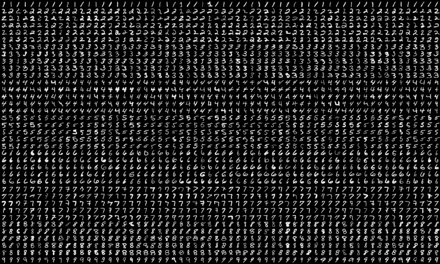

# 基于张量流的手写体数字分类

> 原文：<https://medium.com/mlearning-ai/mnist-handwritten-digit-classification-using-tensorflow-3232c303443b?source=collection_archive---------1----------------------->

# 介绍

# 什么是手写数字识别？

手写数字识别是计算机识别人类手写数字的能力。这对机器来说是一项艰巨的任务，因为手写数字并不完美，而且可能因人而异。手写数字识别是解决…