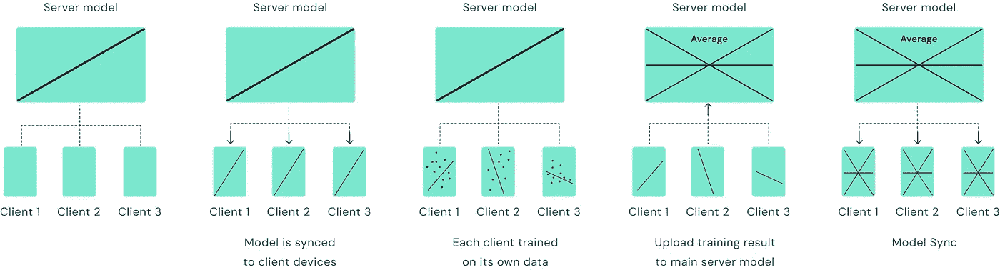
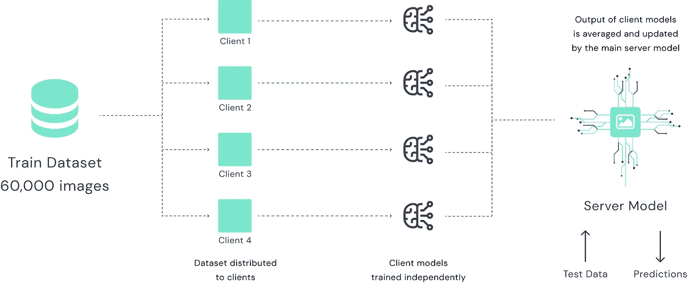
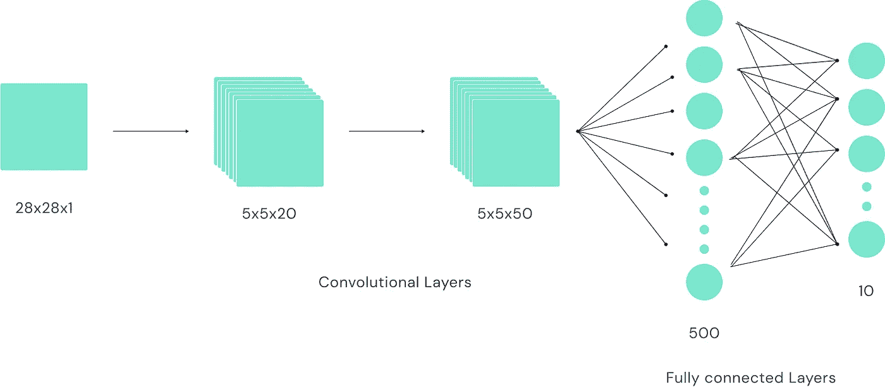
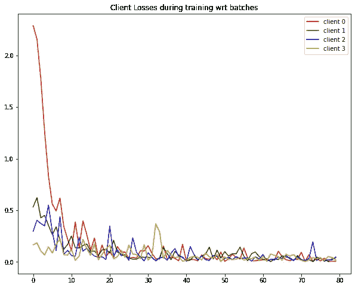
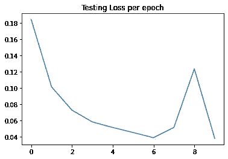
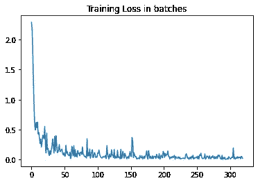
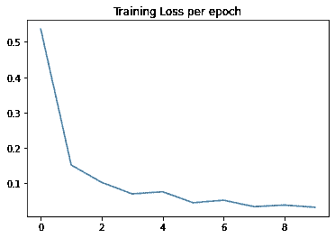

# 基于联邦学习的 MNIST 图像分类

> 原文：<https://medium.com/mlearning-ai/mnist-image-classification-via-federated-learning-c922f6ee2d80?source=collection_archive---------1----------------------->


什么是联合学习？
联合学习(Federated learning)是机器学习中的一种技术，通过这种技术，我们可以在不同设备或保存多个本地数据样本的单个服务器上传播的数据上训练模型。简而言之，联邦学习的目标是在分散的数据集上训练机器学习模型，而不制作它的任何副本。这样，联合学习也为我们提供了更好的隐私和资源管理。



Fig. How federated learning works

在这篇博客中，我们将使用联合学习技术训练一个 MNIST 图像分类模型。MNIST 数据集包括单通道 60，000 个范围从 0 到 9 的单个数字的手写图像，尺寸为 28×28。

该数据集还包含 10，000 张具有相同规格的测试图像。

> **工作**

数据分布在 4 个不同的客户端。这样，我们就有了一个分散的数据集。模型权重在客户端和主服务器模型之间传递。



Fig. federated learning among 4 different (local) clients

> **模型架构**

一个具有两个卷积层和两个完全连接层的神经网络被用来实现这个任务。型号规格如下所示



Fig. Model architecture

# **做代码**

首先，您需要为此获得所有必需的库和依赖项。我用 python 编写代码，并使用以下库

1.  Pytorch
2.  Pysyft
3.  Numpy
4.  简易词典
5.  火炬视觉
6.  Matplotlib

**安装所需的依赖关系**

另外，确保你按照我提到的顺序安装它们，因为有一些版本问题。

```
pip install syft -f [https://download.pytorch.org/whl/torch_stable.html](https://download.pytorch.org/whl/torch_stable.html)
pip  install torchvision
pip install syft==0.2.9
pip install easydict
pip install matplotlib
```

**链接 Pytorch 和 Pysyft**

```
# A Hook which Overrides Methods on PyTorch Tensors. Sending the tensors from one virtual machine / client to another# The purpose of this class is to: extend torch methods to allow for the moving of tensors from onehook = sy.TorchHook(torch)
```

**定义保存数据的客户端/虚拟机**

```
# Defining virtual clients
# sending the hook we previously created into these clients so the model knows which virtual machines to send data ( move tensors between )client0 = sy.VirtualWorker(hook, id="client0")
client1 = sy.VirtualWorker(hook, id="client1")
client2 = sy.VirtualWorker(hook, id="client2")
client3 = sy.VirtualWorker(hook, id="client3")
```

**在一个简单的字典中定义参数**

```
args = edict({
"batch_size" : 64,
"epochs" : 10,
"learning_rate" : 0.01,})
```

**制作联合数据集**

我们的 MNIST 数据集没有在我们之前创建的客户端之间划分，因此它是一个集中式数据集。让我们把它变成一个分散的/联合的数据集。

```
#For the training dataset, we need to divide it across the virtual clients we had created previously#so instead of using a normal dataloader, using a Federated dataloader that loads the MNIST data and also dividies it across the created clientsfederated_train_loader = sy.FederatedDataLoader(
datasets.MNIST('../data', train=True, download=True,
transform=transforms.Compose([
transforms.ToTensor(),
transforms.Normalize((0.1307,), (0.3081,))
])).federate((client0,client1,client2,client3)),
batch_size=args.batch_size, shuffle=True)#As for the testing dataset, it will be tested on the global model so no need to divide it across the clientstest_loader = torch.utils.data.DataLoader(
datasets.MNIST('../data', train=False, transform=transforms.Compose([
transforms.ToTensor(),
transforms.Normalize((0.1307,), (0.3081,))
])),
batch_size=args.batch_size, shuffle=True)
```

**让我们定义模型**

```
# model architecture# convolutional layer 1 -> maxpool(2,2) -> relu# convolutional layer 2 -> maxpool(2,2) -> relu# fullly connected layer 1 -> relu# output layer -> log_softmaxclass Net(nn.Module):def __init__(self):super(Net, self).__init__()
self.conv1 = nn.Conv2d(1, 20, 5, 1)
self.conv2 = nn.Conv2d(20, 50, 5, 1)
self.fc1 = nn.Linear(4*4*50, 500)
self.fc2 = nn.Linear(500, 10)def forward(self, x):x = F.relu(self.conv1(x))
x = F.max_pool2d(x, 2, 2)
x = F.relu(self.conv2(x))
x = F.max_pool2d(x, 2, 2)
x = x.view(-1, 4*4*50)
x = F.relu(self.fc1(x))
x = self.fc2(x)return F.log_softmax(x, dim=1)# Computing log_softmax() is slightly less likely to fail due to arithmetic overflow or underflow than computing softmax().# Using log_softmax() is slightly more efficient than using softmax() when computing negative log likelihood loss (also called cross entropy error).
```

**定义培训和测试功能**

```
def train(args, model, federated_train_loader, optimizer, epoch,train_loss_batch,train_loss_epoch,id0,id1,id2,id3):model.train()client = Nonet_loss = 0total = 0for batch_idx, (data, target) in enumerate(federated_train_loader):#The dataset we are loading is federated/distributed, means it is divided into different clients#We need to send each of the batch to the corresponding clientif client == None :
client = data.location.idprint('Processed at :',client)elif client != data.location.id :client = data.location.idprint('Processed at :',client)model.send(data.location) optimizer.zero_grad()output = model(data)loss = F.nll_loss(output, target)loss.backward()optimizer.step()model.get() # recieve the model back from the client
if batch_idx % 30 == 0:
loss = loss.get() # getting the loss back from the last client
t_loss += loss
total += 1train_loss_batch.append(loss.item())if client == 'client0':
id0.append(loss.item())
elif client == 'client1':
id1.append(loss.item())
elif client == 'client2':
id2.append(loss.item())
elif client == 'client3':
id3.append(loss.item())print('Train Epoch: {} [{}/{} ({:.0f}%)]\tLoss: {:.6f}'.format(
epoch, batch_idx * args.batch_size, len(federated_train_loader) * args.batch_size,
100\. * batch_idx / len(federated_train_loader), loss.item()))
t_loss /= totaltrain_loss_epoch.append(t_loss.item())def test(args, model, test_loader,testing_loss):model.eval()test_loss = 0correct = 0with torch.no_grad():for data, target in test_loader:output = model(data)test_loss += F.nll_loss(output, target, reduction='sum').item() #reduction means that we just sum up the loss of the whole batchpred = output.argmax(1, keepdim=True)correct += pred.eq(target.view_as(pred)).sum().item()
test_loss /= len(test_loader.dataset)
testing_loss.append(test_loss)
print('\nTest set: Average loss: {:.4f}, Accuracy: {}/{} ({:.0f}%)\n'.format(test_loss, correct, len(test_loader.dataset),
100\. * correct / len(test_loader.dataset)))
```

**主要功能**

```
model = Net()optimizer = optim.SGD(model.parameters(), lr=args.learning_rate)train_loss_batch = []
train_loss_epoch = []id0 = []
id1 = []
id2 = []
id3 = []testing_loss = []for epoch in range(0, args.epochs):
train(args, model, federated_train_loader, optimizer, epoch,train_loss_batch,train_loss_epoch,id0,id1,id2,id3)test(args, model, test_loader,testing_loss)
```

**标绘结果**

```
from matplotlib import pyplot as pltplt.plot(train_loss_batch)plt.title("Training Loss in batches")plt.show()plt.plot(train_loss_epoch)
plt.title("Training Loss per epoch")plt.show()f = plt.figure()f.set_figwidth(10)f.set_figheight(8)plt.plot(id0,'r',label = 'client 0')
plt.plot(id1,'g',label = 'client 1')
plt.plot(id2,'b',label = 'client 2')
plt.plot(id3,'y',label = 'client 3')plt.legend()plt.title("Client Losses during training wrt batches")plt.show()
```

**保存模型**

```
torch.save(model.state_dict(), "model.pt")
```

> **结果**

以下是模型训练后的结果



总之，联合学习是一种使我们能够在分散的数据集上训练模型的技术。如果处理得当，这有助于确保更好的数据隐私以及更好的资源管理。谷歌智能键盘(Gboard)也采用了这种技术。联合学习还有助于公司在不共享数据或建立集中式数据中心的情况下相互训练模型。

> **演职员表和参考资料**

[](https://www.tensorflow.org/federated/tutorials/federated_learning_for_image_classification) [## 用于图像分类的联合学习|张量流联合

### 此 colab 已经过验证，可与注:tensorflow_federated pip 包的最新发布版本一起使用…

www.tensorflow.org](https://www.tensorflow.org/federated/tutorials/federated_learning_for_image_classification) [](https://colab.research.google.com/github/tensorflow/federated/blob/v0.3.0/docs/tutorials/federated_learning_for_image_classification.ipynb) [## 谷歌联合实验室

### 编辑描述

colab.research.google.com](https://colab.research.google.com/github/tensorflow/federated/blob/v0.3.0/docs/tutorials/federated_learning_for_image_classification.ipynb) [](/mlearning-ai/mlearning-ai-submission-suggestions-b51e2b130bfb) [## Mlearning.ai 提交建议

### 如何成为 Mlearning.ai 上的作家

medium.com](/mlearning-ai/mlearning-ai-submission-suggestions-b51e2b130bfb)