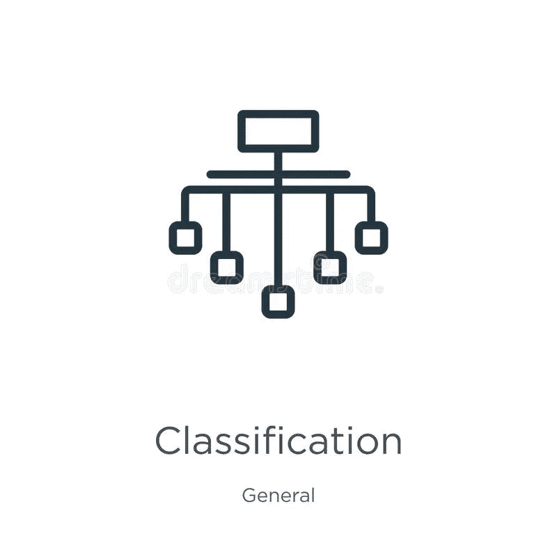
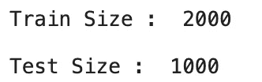
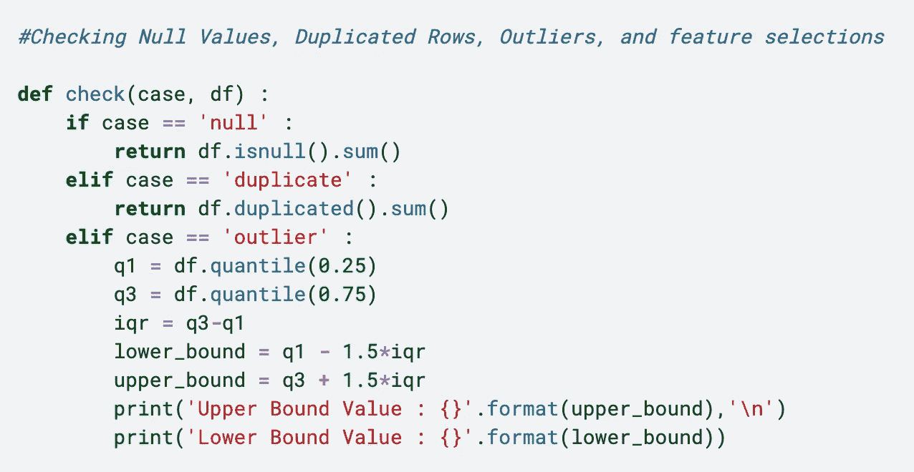
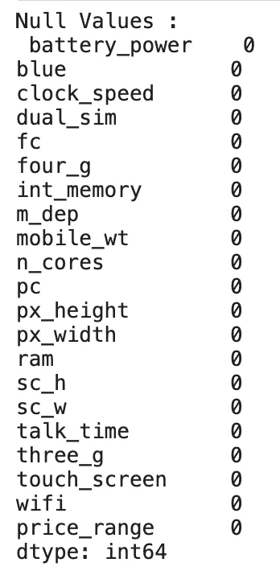
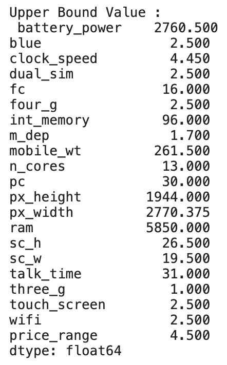
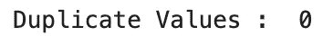
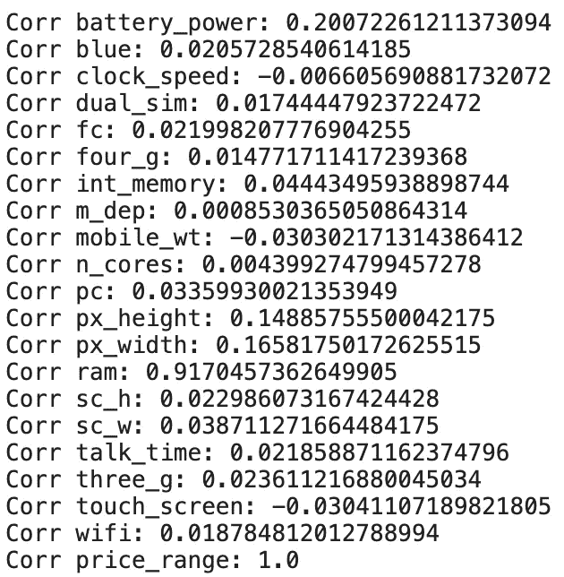
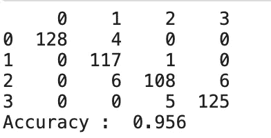

# 移动价格预测—分类模型

> 原文：<https://medium.com/mlearning-ai/mobile-price-prediction-classification-model-ce45ac4c871c?source=collection_archive---------1----------------------->



Image by Dreamstime.com

在我之前的文章中，我已经发布了几个关于分类模型的介绍(这里的和这里的)。这一次，我决定采取一种更加以商业为中心的方法来实现物流回归。

该模型中使用的数据集可以通过这个[链接](https://www.kaggle.com/iabhishekofficial/mobile-price-classification)下载。它包含手机的功能(内存，大小等)，这些功能的每种组合将导致不同的价格等级。

## 手机价格区间的分类模型

概述:开发一个分类模型，根据可用功能确定价格范围

目标:

1.  清理数据和特征选择
2.  训练和评估模型
3.  保存模型以备将来使用

文件描述:

1.  train.csv:训练集。不同价位手机的特点
2.  test.csv:测试集。为了使用模型进行预测，我们将使用上述训练数据集进行训练

数据字段:

1.  battery_power:电池一次可以储存的总能量，单位为毫安
2.  蓝色:有无蓝牙
3.  时钟速度:微处理器执行指令的速度
4.  dual_sim:是否支持双 sim 卡
5.  fc:前置摄像头百万像素
6.  四 _g:有没有 4G
7.  int_memory:以千兆字节为单位的内部内存
8.  m_dep:移动深度，单位为厘米
9.  mobile_wt:手机重量
10.  n_cores:处理器的核心数量
11.  电脑:主摄像头百万像素
12.  px_height:像素分辨率高度
13.  像素分辨率宽度
14.  ram:百万字节的随机存取存储器
15.  sc_h:手机屏幕高度，单位为厘米
16.  sc_w:手机屏幕宽度，单位为厘米
17.  talk_time:一次电池充电持续的最长时间
18.  三 _g:有没有 3G
19.  触摸屏:有无触摸屏
20.  wifi:有没有 wifi
21.  price_range:这是目标变量，值为 0(低成本)、1(中等成本)、2(高成本)和 3(非常高成本)

# 指导方针

在本文中，以下是我们模型开发的步骤:

1.  数据准备、清理和操作
2.  特征选择和模型训练
3.  模型评估和生成预测

## 1.数据准备、清理和操作

```
#read train and test file
import numpy as np
import pandas as pdfile = []
def read_file(path) :
    name = input()
    name = pd.read_csv(path)
    file.append(name)

read_file('../input/mobile-price-classification/train.csv')
read_file('../input/mobile-price-classification/test.csv')train = file[0]
test = file[1]print('Train Size : ', train.shape[0], '\n')
print('Test Size : ', test.shape[0])
```



训练和测试数据集分别包含 2000 和 1000。由于它不是一个大的数据集，这将在模型开发过程中为我们节省大量的内存。

接下来，我们将检查数据集中是否有任何空值和重复值。然后，我们将从数据集中移除一些异常值。



以上是我为所有数据检查设计的函数。请随意使用这个函数，也许在某些情况下，上面的函数是不够的。

```
check('null',train)
check('duplicate',train)
check('outlier', train)
```



因为没有空值和重复值，所以我们可以专注于基于上限值和下限值移除异常值。

但是由于有太多的特性，我们需要在删除任何异常值之前选择与我们的目标变量(price_range)高度相关的列。

```
#Check Correlation Between Features and Targetfor a in train.columns :
    try :
        print(f'Corr {a}: {train[a].corr(train["price_range"])}')
    except :
        pass
```



```
col_list = ['ram','px_height','px_width','battery_power']#Outlier Removal 
for a in col_list: 
    q1 = train[a].quantile(0.25)
    q3 = train[a].quantile(0.75)
    iqr = q3-q1
    upper = q3 + 1.5*iqr
    lower = q1 - 1.5*iqr
    train = train[(train[a] > 0) & (train[a] < upper)]
```

现在我们的数据已经准备好训练我们的机器学习模型了。

## 2.特征选择和模型训练

```
from sklearn.preprocessing import StandardScaler
from sklearn.compose import ColumnTransformer
from sklearn.pipeline import Pipeline
from sklearn.linear_model import LogisticRegression
from sklearn.model_selection import train_test_splitfeature = ['ram','px_height','px_width','battery_power']
label = ['price_range']X,y = train[feature].values, train[label].values
X_train, X_test, y_train, y_test = train_test_split(X,y, test_size = 0.25, random_state = 42)
#Define Preprocessing for Numeric Columns
num_features = [0,1,2,3]
num_transformer = Pipeline(steps = [
    ('scaler', StandardScaler())
])preprocessor = ColumnTransformer(transformers = [
    ('num', num_transformer, num_features)
])pipeline_lr = Pipeline(steps= [
    ('preprocessing', preprocessor),
    ('logregression', LogisticRegression(C=1/0.1, solver='lbfgs', multi_class = 'auto', max_iter = 10000))
])model_lr = pipeline_lr.fit(X_train,y_train)
print(model_lr)
```

上面的代码已经列出了我们的所有步骤，从选择用于训练的特征和作为我们的目标变量的标签，到将我们的数据集分成训练和测试。

然后，我们将执行一个缩放过程来标准化数据集中的数值。

最后，编译我们所有的数据转换器，并使用我们的分类模型训练模型(在本例中，我使用的是 LogisticRegression)。

**3。模型评估和生成预测**

```
#Check accuracy using confusion matrix
from sklearn.metrics import accuracy_score, classification_report, confusion_matrixprediction_lr = model_lr.predict(X_test)
cm_lr = confusion_matrix(y_test, prediction_lr)
print(pd.DataFrame(cm_lr))
print('Accuracy : ', accuracy_score(y_test, prediction_lr))
```



从我们的模型中，它产生 95%的准确性，假设在我们的新数据集中有高的变化，那么这个模型必须重新训练以避免在我们的预测结果中过度拟合。

通常，有多种方法来显示或表示模型的准确性。我个人认为，只使用一两个能够产生精确数值的指标就足够了。但是有些人更喜欢用绘图来形象化它的结果，这很好。

让我给你一个例子，告诉你如何可视化我们上面的混淆矩阵表。

```
#Plot Confusion Matrix
price_class = [0,1,2,3]plt.imshow(cm_lr, interpolation = 'nearest')
plt.colorbar()tick_marks = np.arange(len(price_class))
plt.xticks(tick_marks, price_class)
plt.yticks(tick_marks, price_class)plt.xlabel('Predicted')
plt.ylabel('Actual')plt.show()
```


然后，对于关于精度、召回和 F1 分数的完整总结，可以通过使用 classification_report 来显示。

```
print(classification_report(y_test, prediction_lr))
```


因此，在每个评估中，我们需要理解为什么我们想要看到某些度量标准，以及每个度量标准的定义是什么，这一点很重要。

在最后一部分，我们将生成预测结果，并将其保存到一个 csv 文件中。

```
#Predict our outcome
test = test[feature]result = pd.DataFrame(model_lr.predict(test))
final = test.merge(result, left_index = True, right_index = True)
final = final.rename(columns = {0:'price_range'})
final.to_csv('result.csv')
```

我们的分类模型开发到此结束。我希望我已经解决了这篇文章中所有必要的部分。

当然，我们还可以考虑更多的因素，从选择逻辑回归中的求解器、其他分类模型(例如 SVC)等等。

再次强调，在任何机器学习开发中，都可以随意使用参数和功能选择。因为 ML 不是一个适合所有情况的解决方案，为了开发一个健壮的模型，需要进行反复试验。

请不要犹豫给我任何意见和反馈，或者如果你们想阅读与数据科学和分析相关的某个主题，请告诉我！

*(免责声明:在写这篇文章之前，我在最终确定我的模型之前已经测试了几个求解器)。*

**参考文献:**

[](https://www.kaggle.com/iabhishekofficial/mobile-price-classification?select=train.csv) [## 移动价格分类

### 分类移动价格范围

www.kaggle.com](https://www.kaggle.com/iabhishekofficial/mobile-price-classification?select=train.csv) [](https://scikit-learn.org/stable/modules/generated/sklearn.linear_model.LogisticRegression.html) [## sklearn.linear_model。物流回收

### 逻辑回归(又名 logit，MaxEnt)分类器。在多类的情况下，训练算法使用一对其余…

scikit-learn.org](https://scikit-learn.org/stable/modules/generated/sklearn.linear_model.LogisticRegression.html) [](https://github.com/K-Tech-nology/classification_model/blob/main/mobile-price-range-classification-model.ipynb) [## 分类 _ 型号/手机-价格范围-分类-型号. ipynb at main …

### 这个库的目的是定义一些最常用的统计公式…

github.com](https://github.com/K-Tech-nology/classification_model/blob/main/mobile-price-range-classification-model.ipynb) [](/mlearning-ai/mlearning-ai-submission-suggestions-b51e2b130bfb) [## Mlearning.ai 提交建议

### 如何成为 Mlearning.ai 上的作家

medium.com](/mlearning-ai/mlearning-ai-submission-suggestions-b51e2b130bfb)