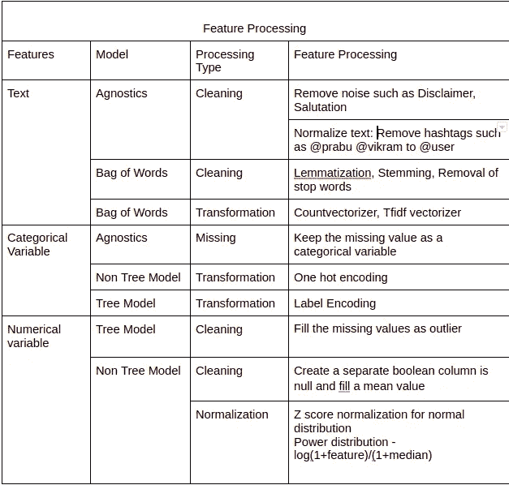
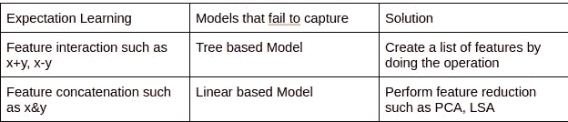
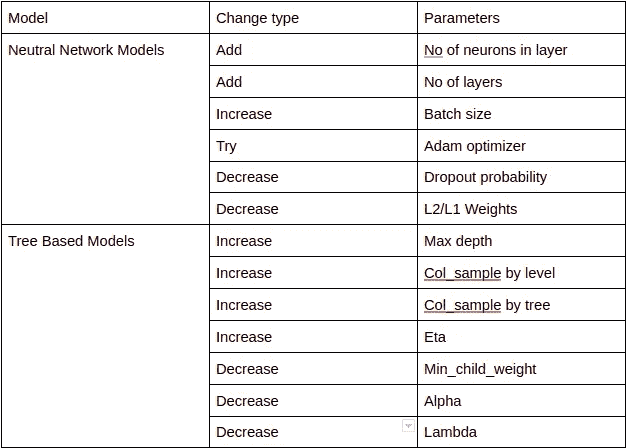

# 模型结构

> 原文：<https://medium.com/mlearning-ai/model-building-2c0b5b5c8c1c?source=collection_archive---------6----------------------->

在我们对数据需求、指标、交叉验证有信心之后。下一步是建立模型。模型建立过程得到了很好的研究。Kaggle 和一些比赛平台是学习和练习的好地方。

**构建基线**

*   在你开始一个很酷的深度学习模型之前。模型构建的第一步是创建基线模型。基线模型将帮助您设定基准。
*   为了简单起见，我们将逻辑回归作为所有四个模型的基线。

不同的模型需要不同的特征转换。例如，神经网络需要特征规范化以获得更好的性能，但是决策树可能不需要特征规范化。因此，特征转换是特定于模型的。

讨论的不同模型系列有

*   线性模型
    -创建线性边界模型，它不能学习复杂的边界。
    -例如逻辑回归、线性支持向量机。
*   基于树的模型
    -模型被构建为 if 和 else 规则集的树。
    -例子有决策树，Xgboost。
*   单词模型包
    -学习不考虑输入的顺序。“你能帮我吗”，“帮我，你能吗”(尤达风格)都一样。
    -例子有朴素贝叶斯、Svm。

不同的模型以不同的方式工作。一些模型将无法学习我们所期望的。

**模型 Fune 调谐:**

一旦我们有了度量标准、交叉验证和转换的特性，下一步就是尝试不同的模型并对它们进行微调。有两种方法可以做到。

## 手动搜索

我们将手动搜索定义为手动选取参数并尝试不同的参数以获得最佳模型。这项技术不容小觑。我个人见过很多 Kaggle 大师和 kaggle 特级大师做手工搜索。最好从手动搜索开始，以获得清晰的图片

我遵循这个命令:

1.  解决拟合不足问题
2.  解决过度拟合问题
3.  重复这个过程，直到你有平衡的模型

欠拟合情况下的参数调整

对于过度拟合的情况，我们只需做相反的事情。

如果对模型性能不满意，探索需要添加的任何功能或需要额外的培训。

自动微调:

*   自动精图灵有很多，如网格搜索、随机搜索、遗传算法等。参数调整可以用几行代码完成。请查看此[链接](https://towardsdatascience.com/hyperparameters-optimization-526348bb8e2d)了解更多信息

# 型号选择:

对不同的模型进行参数调整并生成报告。选择哪个型号。

考虑这两种情况，

*   Xgboost 给出 82%，决策树给出 80%。
*   乌尔菲特给出了 90%，伯特给出了 92%

答案是，度量标准不是决定最佳模型的唯一方法。这就是设计 ml 特性不同于 kaggle 竞赛的地方。说实话，客户可能看不出 2%的区别。

可以考虑的三个指标是

1.  模型尺寸
2.  重新训练模型的容易程度
3.  模型可解释性

我的选择决定是选择决定，而我的选择是

*   决策树，Ulmfit 可以很容易地用较少的资源重新训练。
*   与 Bert 或 Xgboost 相比，Ulmfit 具有更少的内存，更容易拟合
*   决策树、Ulmfit 更容易调整和理解问题。

本文以模型训练结束。在下一篇文章中，重点将是在 B2B 空间中构建 ml 特性。请点击[此处](/@prabu_/model-building-in-b2b-space-8be2f5289adc)阅读下一篇文章

请点击这里进入[第一篇](/@prabu_/building-b2b-ml-features-overview-dc586667e1c3)文章

 [## Mlearning.ai 提交建议

### 如何成为 Mlearning.ai 上的作家

medium.com](/mlearning-ai/mlearning-ai-submission-suggestions-b51e2b130bfb)