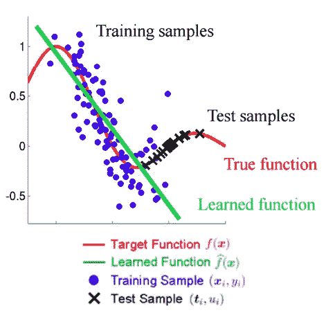

# 在 TFX 使用张量流数据验证的模式监测

> 原文：<https://medium.com/mlearning-ai/model-monitoring-using-tensor-flow-data-validation-in-tfx-69d6dbc9da49?source=collection_archive---------2----------------------->

众所周知，ML 模型在产品或产品功能的核心部分越来越多。因此，数据科学团队现在负责确保他们的模型在产品的大部分时间里都按照预期执行。

需要实时监控模型的性能，以检测任何会影响最终用户体验的性能问题。必须开发早期识别机制，以便在问题开始影响底线或用户开始抱怨之前识别问题。

在数据科学团队开发模型时，他们可能会使用准确性性能指标评估模型，实时跟踪相同的准确性指标是不可能的，因为:

1.**模型干预:**你所使用的模型可能会影响你所能做出的观察，因为在预测之后会采取行动。

例如:如果你预测客户流失，你会采取措施留住你认为可能流失的客户。几个月后，当你衡量“基本事实”标签时，如果客户的标签没有变化，你不知道这是因为预测错误还是因为你采取的行动。

2.**预测和地面真实标签可用之间的长等待时间:**

想象一下，在信用卡欺诈中，案件可以在交易完成后 90 天内报告。因此，在做出预测和获得事实真相之间有 3 个月的延迟。如果准确性是用于跟踪模型性能的唯一指标，那么直到问题开始出现 3 个月后才能被发现。

为了使我们开发的最大似然模型在相当长的一段时间内做出可靠的预测，需要监控数据和可能影响模型性能的变化。

**监测数据**

人工智能应用程序的性能下降有两个主要原因:

1.  **数据采集/处理管道中的问题:**

这意味着提供给模型的数据不符合预期。这可能是因为您用来收集数据的 API 的更新包含重大更改。

例如，假设正在收集图像的传感器出现故障，并且刚刚开始发送代替图片的暗图像。

1.  **数据性质/分布的变化:**

这意味着输入和输出数据之间的关系会随着时间的推移而改变，这意味着未知的底层映射函数也会随之改变。

例如，假设您创建了一个模型，它使用几个特征来预测用户是否是垃圾邮件发送者。在本季度末，您已经注意到，随着时间的推移，预测的结果发生了巨大的变化。在最好的情况下，这种变化可能是因为垃圾邮件发送者放弃了。或者，这是最坏的情况，这种变化是因为垃圾邮件发送者的概念已经演变。如果我们考虑最坏的情况，如果垃圾邮件发送者想出一个与训练时观察到的情况完全不同的不同情况会怎么样。换句话说，垃圾邮件发送者的概念已经漂移。

从上面的两个场景中，我们可以说，如果数据的分布在训练集和测试集之间发生了变化，那么在机器学习的世界中，它可以被称为 ***数据偏移/数据漂移*** ，即 Ptrain(y，x)≠Ptest(y，x)。它大致分为三种类型:

1.协变量移位

2.先验概率转移

3.观念转变

**协变量移位:**协变量移位是*协变量*的分布变化，具体来说就是自变量的分布变化。协变量移位只出现在 X→Y 问题中，定义为 **Ptrain(y|x) = Ptest(y|x)且 Ptrain(x) ≠ Ptest(x)** 的情况。下图将清楚地说明我们的学习函数试图拟合训练数据。但是这里我们可以看到训练和测试的分布是不一样的，所以用这个学习过的函数来预测肯定会给我们错误的预测。

协变量移位可能导致问题的例子:

人脸识别算法主要针对较年轻的人脸进行训练，但数据集中有更大比例的老年人脸。

将图像分类为猫或狗，并从训练集中省略在测试集中看到的某些物种。

在进行交叉验证时，协变量移位会导致许多问题。交叉验证在没有协变量转移的情况下几乎是无偏的，但在协变量转移的情况下会有很大的偏差！

**先验概率移位:**先验概率移位可以认为是协变量移位的完全相反，协变量移位是指类变量 ***Y*** *的分布发生变化，而**X 的分布保持不变 ***。*** 先验概率移位只出现在 Y→X 问题中，定义为 **Ptrain(x|y) = Ptest(x|y)且 Ptrain(y) ≠ Ptest(y)的情况。***

*一种直观的思考方式可能是考虑一个不平衡的数据集。*

*如果训练集对您收到的垃圾邮件的数量具有相同的先验概率(即，一封电子邮件是垃圾邮件的概率是 0.5)，那么我们预计 50%的训练集包含垃圾邮件，50%包含非垃圾邮件。*

*如果在现实中，只有 90%的电子邮件是垃圾邮件(也许不是不可能的)，那么我们的类别变量的先验概率已经改变。这种想法与数据稀疏性和有偏差的特征选择有关，它们是导致协方差偏移的因素，但它们不是影响我们的输入分布，而是影响我们的输出分布。*

*这个问题只出现在 Y → X 问题中，通常与朴素贝叶斯有关(因此出现了垃圾邮件示例，因为朴素贝叶斯通常用于过滤垃圾邮件)。*

***概念漂移:**概念漂移不同于协变量和先验概率漂移，它与数据分布或类别分布无关，而是与输入和输出变量之间的关系变化有关，定义为 **Ptrain(Y|X) ≠ Ptest(Y|X)。**我们在*一节中讨论的数据性质/分布变化的例子*就属于这一概念。*

## *使用张量流数据验证实现数据移位*

*以上代码和数据集可以在这里[下载。](https://github.com/ygkrishna/MLOps)*

> *以上文章是我通过探索 Coursera 中的多种资源，medium 中的其他文章，cloud.google & git 资源等，对 TFX 使用 TFDV 进行数据移位/数据漂移识别的理解和实现。*