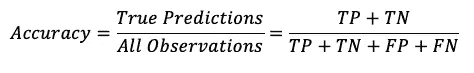
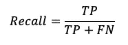
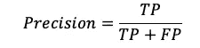
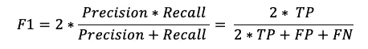
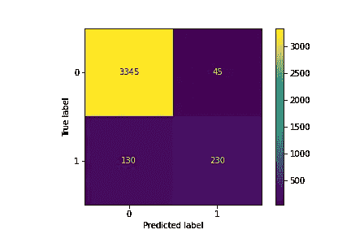
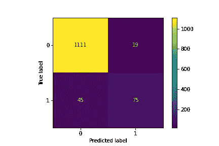
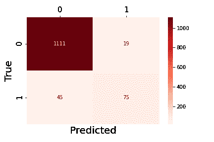
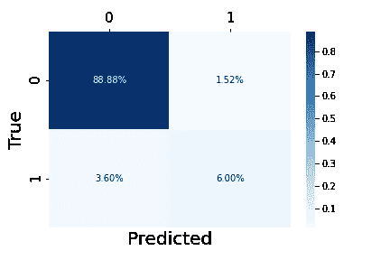

# 机器学习中的模型性能和混淆矩阵

> 原文：<https://medium.com/mlearning-ai/model-performance-and-confusion-matrix-in-machine-learning-688ca3a8743d?source=collection_archive---------4----------------------->

开发机器学习算法最重要的一步是检查你建立的模型的性能。这就是混淆矩阵派上用场的地方。混淆矩阵是表示分类算法性能的表格。


Photo by **Guillaume Bourdages** on[Unsplash](https://unsplash.com/photos/WDbuusPOnkM)

**混淆矩阵有什么迷惑性？**

顾名思义，混淆矩阵是一种观察由预测结果产生的混淆的方法。我对混淆矩阵的解释是，当机器不能 100%准确地对其预测进行分类时，它会感到混淆。

如果机器每次都能正确预测数值，混淆矩阵将只包含真阳性和真阴性。然而，它有时会混淆和分类错误，从而导致假阳性和假阴性的产生。稍后我将解释我所说的*真阳性、真阴性、假阳性*和*假阴性*是什么意思，现在让我们进入编码。

**探索数据**

我将使用来自**[**Kaggle**](https://www.kaggle.com/teertha/personal-loan-modeling)的银行个人贷款建模数据集来创建逻辑回归模型，以预测 Thera 银行的负债客户是否会接受下一次活动中提供的个人贷款。**

****

**Photo by **Mathieu Stern** on [Unsplash](https://unsplash.com/photos/1fzyz-bmKBw)**

**让我们从导入熊猫来加载数据集开始，然后读取并研究它。**

```
import pandas as pd
df = pd.read_csv('Bank_Personal_Loan_Modelling.csv')
```

**数据集中的个人贷款列回答了以下问题:“该客户是否接受了上次活动中提供的个人贷款？”。该列由二进制变量组成，0 表示拒绝报价的“否”客户，1 表示接受报价的“是”客户。在 5000 名客户中，只有 480 名客户(9.6%)接受了在早期活动中向他们提供的个人贷款。**

```
df['Personal Loan'].value_counts()
```

**输出是:**

```
0    4520
1     480
Name: Personal Loan, dtype: int64
```

**下一步是创建特征变量 X(预测值的数据框架)和目标变量 y，然后使用 sklearn 将数据集分为训练集(X_train，y_train)和测试集(X_test，y_test)。**

```
from sklearn.model_selection import train_test_split 
X = df.drop('Personal Loan', axis=1)
y = df['Personal Loan']
X_train, X_test, y_train, y_test = train_test_split(X, y, test_size=0.25, random_state=42, stratify=y)
```

**数据包含不同维度和比例的要素。我将对数据进行缩放，以防止不同的缩放比例对建模的影响。就错误分类误差和准确率而言，未经调整的数据可能会导致有偏差的预测结果。**

**python***sk learn**库为我们提供了 **StandardScaler()** 函数将数据标准化为标准格式。***

```
*from sklearn.preprocessing import StandardScaler
scaler = StandardScaler()
X_train_scaled = scaler.fit_transform(X_train)
X_test_scaled = scaler.transform(X_test)*
```

*****模型建筑*****

***下面的代码符合一个**逻辑回归模型**来预测客户根据之前的活动批准或拒绝个人贷款的概率。***

```
*from sklearn.linear_model import LogisticRegression
logreg = LogisticRegression()
logreg.fit(X_train_scaled, y_train)
y_pred_train = logreg.predict(X_train_scaled)
y_pred_test = logreg.predict(X_test_scaled)*
```

***我们将训练和测试数据的预测输出存储在 y_pred_train 和 y_pred_test 中，我们将在下面的几个指标中使用它们。***

******

***Photo by **Taylor Deas-Melesh** on [Unsplash](https://unsplash.com/photos/fkaQ-cqU4Uo)***

## *****真、假、正、负*****

*   *****真阳性(TP):** 模型预测客户会贷款，而客户实际上贷款了。***
*   *****真否定(TN):** 模型预测客户不会贷款，而客户实际上并没有贷款。***
*   *****误报(FP):** 模型预测客户会贷款，但客户实际上没有贷款。***
*   *****假阴性(FN):** 模型预测客户不会贷款，但客户实际上贷款了。***

# ***分类指标***

*****精度*****

***准确度分数计算分类器做出正确预测的频率。***

***Sklearn metrics 提供了 accuracy_score 函数来获得准确性，我们可以在训练和测试数据上应用该方法来观察它们的性能。***

******

```
*from sklearn.metrics import accuracy_score
train_acc = accuracy_score(y_train, y_pred_train)
test_acc = accuracy_score(y_test, y_pred_test)
print(f"Training Data Accuracy Score: {train_acc:.3f}\nTesting Data Accuracy Score: {test_acc:.3f}")*
```

***输出是:***

```
*Training Data Accuracy Score: 0.953
Testing Data Accuracy Score: 0.949*
```

***该模型的准确率为 95%，这是相当高的，但由于数据不平衡，它不是检查模型性能的正确指标。***

*****召回*****

***回忆，也称为*敏感度*或*真阳性率(TPR)* 衡量所有实际的 1 有多少是我们预测的 1。它是被正确分类为阳性的阳性实例的比率。***

******

```
*from sklearn.metrics import recall_score
train_recall = recall_score(y_train, y_pred_train)
test_recall = recall_score(y_test, y_pred_test)
print(f"Training Data Recall Score: {train_recall:.3f}\nTesting Data Recall Score: {test_recall:.3f}")*
```

***输出是:***

```
*Training Data Recall Score: 0.639
Testing Data Recall Score: 0.625*
```

***该模型的召回分数非常低，为 63%，这意味着该模型未能预测每 100 个客户中的 37 个潜在客户。银行认为这是机会的损失，应该尽可能地减少损失。根据我们的情况，召回率是我们想要最大化的最重要的指标，因为召回率越高，假阴性就越少。***

*****精度*****

***精度衡量正面预测的准确性。它计算出我们预测的所有 1 中有多少实际上是 1。换句话说，然后它预测积极的结果，它是正确的。***

******

```
*from sklearn.metrics import precision_score
train_precision = precision_score(y_train, y_pred_train)
test_precision = precision_score(y_test, y_pred_test)
print(f"Training Data Precision Score: {train_precision:.3f}\nTesting Data Precision Score: {test_precision:.3f}")*
```

***输出是:***

```
*Training Data Precision Score: 0.836
Testing Data Precision Score: 0.798*
```

***我们的训练数据比测试数据得分更高，因此我们的模型预测了测试数据中更多的假阳性。***

*****F1 得分*****

***F1 得分是精确度和召回率的组合，是精确度和召回率的调和平均值。只有在精确度和召回率都很高的情况下，分类器才能获得高的 F1 分数。***

******

***当你需要同时考虑精确度和召回率时，F1 分数是最有用的。根据数据的上下文，您最关心的是精确度或召回率。提高精度降低召回率，提高召回率降低精度；这被称为*精度/召回权衡。****

```
*from sklearn.metrics import f1_score
train_f1 = f1_score(y_train, y_pred_train)
test_f1 = f1_score(y_test, y_pred_test)
print(f"Training Data F1 Score: {train_f1:.3f}\nTesting Data F1 Score: {test_f1:.3f}")*
```

***输出是:***

```
*Training Data F1 Score: 0.724
Testing Data F1 Score: 0.701*
```

***我们的训练数据再次胜过测试数据，F1 分数高出 2%。在我们的例子中，F1 分数比准确度分数更有用，因为准确度没有考虑到班级的不平衡。尽管如此，考虑到我们的数据和业务问题，召回分数是最有意义的优化指标。***

# *****绘制混乱矩阵*****

***混淆矩阵的第一行代表*负类*。真阳性在左上方，假阳性在右上方。***

***第二排代表*正班*。左下方是假阴性，右下方是真阳性。***

```
*from sklearn.metrics import confusion_matrix
cm = confusion_matrix(y_test, y_pred_test)
cm*
```

***输出是:***

```
*array([[1111,   19],
       [  45,   75]])*
```

***让我们画出训练数据的混淆矩阵。***

```
*sklearn.metrics import plot_confusion_matrix
plot_confusion_matrix(logreg, X_train_scaled, y_train);*
```

******

***Photo by Author***

***测试数据的混淆矩阵:***

```
*plot_confusion_matrix(logreg, X_test_scaled, y_test);*
```

******

***Photo by Author***

***我们可以用来自 *Seaborn* 库的*热图*绘制更漂亮的混淆矩阵。***

```
*import seaborn as sns
import matplotlib.pyplot as plt
ax= plt.subplot()
sns.heatmap(cm, annot=True, ax = ax, fmt = '.0f', cmap='Reds') #annot=True to annotate cells
#labels and ticks
ax.set_xlabel('Predicted', fontsize=20)
ax.xaxis.set_label_position('bottom') 
ax.xaxis.set_ticklabels([0, 1], fontsize = 15)
ax.xaxis.tick_top()ax.set_ylabel('True', fontsize=20)
ax.yaxis.set_ticklabels([0, 1], fontsize = 15);*
```

******

***Photo by Author***

***你想看更好的*热图*吗？每个象限中标记有百分比的混淆矩阵提供了关于我们的预测和模型性能的更多信息。***

```
*import numpy as np
ax= plt.subplot()
sns.heatmap(cm/np.sum(cm), annot=True, ax = ax, fmt='.2%', cmap='Blues')
ax.set_xlabel('Predicted', fontsize=20)
ax.xaxis.set_label_position('bottom') 
ax.xaxis.set_ticklabels([0, 1], fontsize = 15)
ax.xaxis.tick_top()ax.set_ylabel('True', fontsize=20)
ax.yaxis.set_ticklabels([0, 1], fontsize = 15);*
```

******

***Photo by Author***

***该模型将 1.52%的数据归类为*误报*，这意味着拒绝个人贷款的客户被归类为接受贷款的客户。该模型将我们数据的 3.60%归类为*假阴性*，这意味着接受报价的客户被归类为拒绝。因此，在接受报价的 9.6%的客户中，超过三分之一的客户被错误分类。这种模式需要在召回性能上进行改进，以减少*假阴性*，这样银行就不会失去潜在客户。***

*****注:**本教程的目的是演示模型性能指标并可视化混淆矩阵。先前的数据清理或预处理还没有实践过。***

***本文的 GitHub 知识库可以在这里找到:***

***[](https://github.com/haticerdogan/Model-Performance) [## GitHub-haticerdogan/模型-性能:中等教程

### 此时您不能执行该操作。您已使用另一个标签页或窗口登录。您已在另一个选项卡中注销，或者…

github.com](https://github.com/haticerdogan/Model-Performance) [](/mlearning-ai/mlearning-ai-submission-suggestions-b51e2b130bfb) [## Mlearning.ai 提交建议

### 如何成为 Mlearning.ai 上的作家

medium.com](/mlearning-ai/mlearning-ai-submission-suggestions-b51e2b130bfb)***