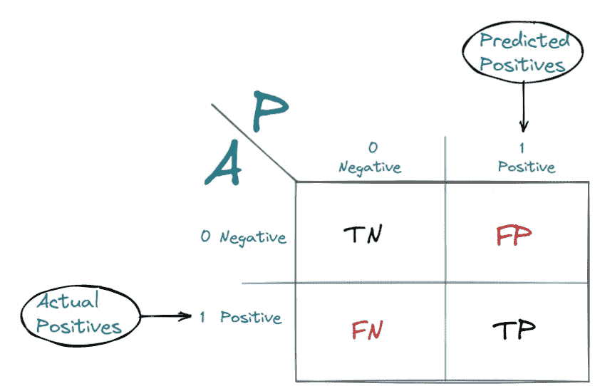
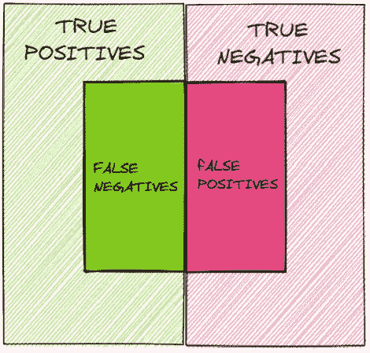
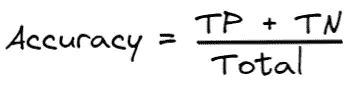
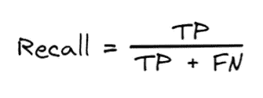
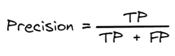
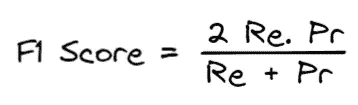
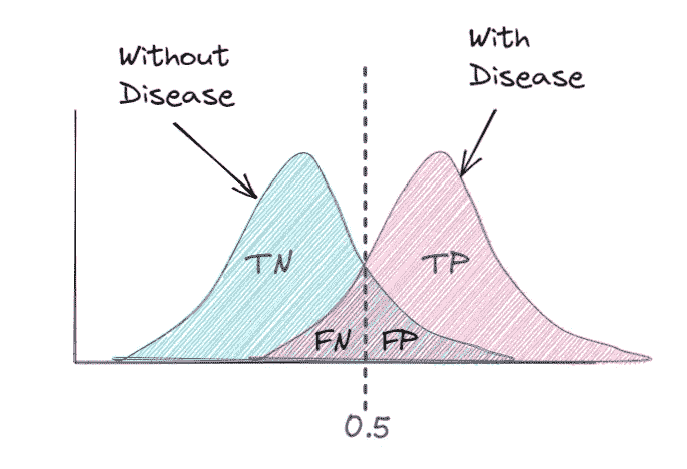

# 分类的模型性能测量

> 原文：<https://medium.com/mlearning-ai/model-performance-measures-for-classification-afc4f3d3056c?source=collection_archive---------2----------------------->

## 混淆矩阵、准确度、回忆、精确度和 F1 分数

Photo by [Austin Distel](https://unsplash.com/@austindistel?utm_source=unsplash&utm_medium=referral&utm_content=creditCopyText) on [Unsplash](https://unsplash.com/?utm_source=unsplash&utm_medium=referral&utm_content=creditCopyText)

理解模型并不意味着找到准确性。每个模型性能度量都很重要，并告诉我们数据和模型本身的许多重要方面。在这篇博客中，我将试着解释我们可以从测量中得出的每一个小推论。

**混淆矩阵**

image by author

混淆矩阵是一个汇总表，它告诉我们预测的正确和错误程度。例如，在二元分类的情况下，如果我们预测客户是否会流失？1 表示是，0 表示否。

*   TN-当我们从训练数据中预测客户不会流失时，我们看到他没有流失。
*   FP-实际上客户不会流失，但我们的模型预测他会流失。
*   当我们从训练数据中预测客户会流失时，我们看到他流失了。
*   FN——当实际上客户在搅动，但我们的模型预测他不会。

内部正方形越小，模型越好。

**准确度**

准确度是正确分类的点与总点数的比率。

准确性是了解模型执行情况的衡量标准之一，但是只看准确性是不够的。有时候准确性可能会误导人。假设我们有 1000 个数据点，其中 900 个是 0(非流失)，100 个是 1(流失)。我们的模型给了我们输出:TN=890，TP= 10，现在我们的精度将是 890+10/1000=900/1000=0.9 或 90%的精度。这个模型的准确性是完美的，但有一个问题，我们有很多 0 和很少的 1，我们对 1 的表现也不好。这意味着我们的数据高度不平衡，影响了我们的准确性。

**回忆**

回忆告诉我们，有多少实际的真数据点被识别为真数据点。这里 FN 实际上是正的，但预测是负的。

**精度**

精度告诉我们，在被模型识别为正的点中，有多少是真正正的。这里 FP 实际上是负的，但预测是正的。

**F1 得分**

如果我们只需要一个数字来解释召回率和精确度，那么我们使用 F1 分数，它是召回率和精确度的调和平均值。

现在，我们来了解一下什么时候应该关注 FP 和 FN。

例如，我们建立一个模型来预测这个人是否有疾病。我们将 0.5 作为阈值，高于该阈值的人被诊断患有疾病，低于该阈值的人没有患病。

现在，这里的 FN(假阴性)表示这个人正在遭受痛苦，但我们预测他没有遭受痛苦，而 FP(假阳性)表示这个人没有遭受痛苦，但我们预测他正在遭受痛苦。基于问题，我们可以决定我们能容忍哪一个。如果疾病是癌症，那么对于没有患癌症的人来说，我们预测他已经患了癌症，在这种情况下，进行化疗是非常危险的。

现在，考虑我们的模型是否预测一个人在机场是否是威胁。这里假设威胁可以是任何东西。因此，预测一些无辜的旅行者是一个威胁，不是一个问题，因为检查会再次进行，如果人们知道这是为了他们的安全，他们会合作；预测这个人不是一个威胁，但他是一个真正的威胁，这将是一个问题，因为许多人的生命受到威胁。这里我们应该着重于减少 FNs。

让我们再举一个贷款偿还预测模型的例子，其中 FN —预测某个有能力偿还的人被预测为违约者，FP —预测该人将偿还贷款，但实际上他不会。在这种情况下，如果 FN 高，我们将失去潜在客户，但如果 FP 高，我们将处于亏损状态。保持这些要点，就可以做出商业决策。

您可以尝试的其他应用程序:

*   非法车预测为非非法，这里的非法可以是盗车、犯罪车等。
*   预测罪犯无罪。
*   向不感兴趣的人推荐产品。

快速复习题(其他主题):

1.  决策树中的分裂标准- *基尼指数或熵*
2.  为什么在逻辑回归中不使用 MSE-*带权重的 MSE 图是非凸曲线-局部最小原因问题*
3.  装袋减少方差增加减少偏差(真/假)- *真*
4.  如何选择 K 均值中的最佳聚类数- *肘形法，该方法将所解释的变化绘制为聚类数的函数*

爱情！活下去！笑！干杯