# 模拟记忆保持

> 原文：<https://medium.com/mlearning-ai/modelling-memory-retention-3f68d1bbe131?source=collection_archive---------3----------------------->

## 贝叶斯指数衰减

在这篇博文中，我将引用 Lee & Wagemakers 所著的《[贝叶斯认知建模](https://bayesmodels.com/)》一书中的一个例子。这本书充满了认知心理学的例子，可以用贝叶斯方法来处理。由于这些例子大多是通过 **WinBUGS** 完成的，我想看看我是否能使用 *brms* 和 *stan* 来重现它。所以，这就是这篇博文的内容。(我知道这本书也提供了 stan 代码，但我想看看我能用 *brms* 走多远，它的功能比 base **STAN** 或 **WinBUGS** 要少)。

我关注的章节是记忆保持，这与记忆测试有关。基本上，给受试者提供刺激来记忆，我们观察他们记住了多少。关键在于提供刺激和保持之间的间隔。

让我们加载库，数据，并绘制我们所得到的。

```
rm(list=ls())
library(dplyr)
library(ggplot2)
library(brms)
library(bayesplot)
library(tidybayes)
```

```
t     <- c(1, 2, 4, 7, 12, 21, 35, 59, 99, 200)
nt    <- length(t)
slist <- 1:4
ns    <- length(slist)
k <- matrix(c(18, 18, 16, 13, 9, 6, 4, 4, 4, NA,
              17, 13,  9,  6, 4, 4, 4, 4, 4, NA,
              14, 10,  6,  4, 4, 4, 4, 4, 4, NA,
              NA, NA, NA, NA,NA,NA,NA,NA,NA, NA), nrow=ns, 
            ncol=nt, 
            byrow=T)
dimnames(k)<-list(slist,t)
k<-as.data.frame(k)
d <- k
subject <- rownames(d)
rownames(d) <- NULL
df <- cbind(subject,d)
df_long<-df%>%tidyr::pivot_longer(cols=`1`:`200`,
                            names_to = "interval",
                            values_to = "retention")
str(df_long)
df_long$interval<-as.numeric(df_long$interval)
df_long$N<-18
df_long$subject<-as.numeric(df_long$subject)
df_long_compl<-df_long%>%tidyr::drop_na()
```

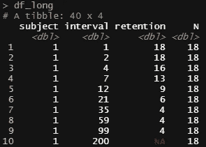

The data in long format.

对于每个受试者，我们都有一个间隔，一个保持数和刺激数。你可以清楚地看到，间隔的增加会导致更少的保留。我还假设会有一个主题特定的效果。因此，这将使模型在本质上具有层次性。

```
df_long%>%
  arrange(subject, interval)%>%
  ggplot(., 
       aes(x=interval, 
           y=retention, 
           group=factor(subject), 
           color=factor(subject)))+
  geom_point()+
  geom_line()+
  theme_bw()+
  facet_wrap(~factor(subject))+
  labs(col="Subject")
```

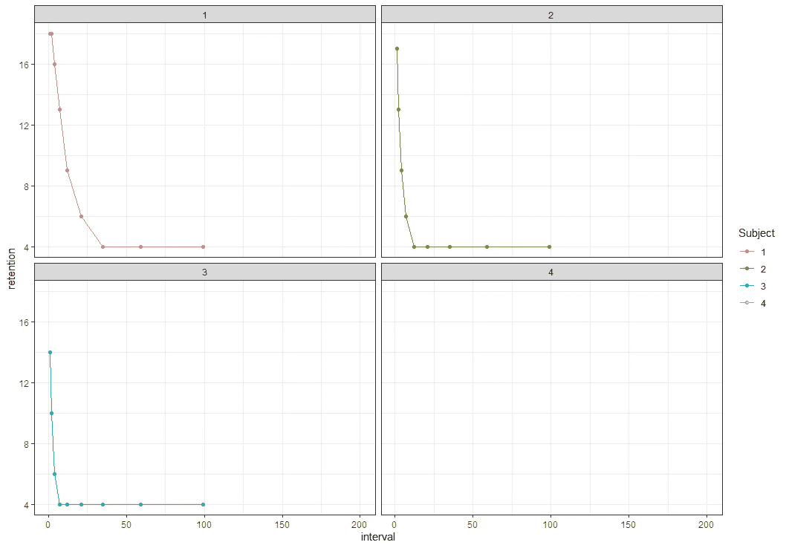

As you can see, the number of stimuli retained decreases very fast.

在书中，提供了一个非线性的平均值公式，我将把它复制到这里。通过 nls 函数，我可以从参数的系数开始，看看它们的拟合程度如何。

```
try<-nls(retention ~ exp(-a1 * interval) + b1, 
         data = df_long,
         algorithm="plinear",
         start = list(a1 = 0.52, 
                      b1 = 0.56), 
         na.action=na.exclude, 
         control=nls.control(maxiter = 500))
summary(try)
df_long$pred<-predict(try)
ggplot(df_long)+
  geom_point(aes(x=interval, 
                 y=retention))+
  geom_line(aes(x=interval, 
                y=pred, 
                group=subject), col="red")+
  theme_bw() 
```

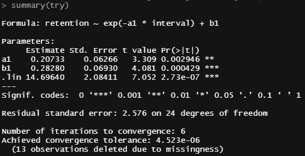

The coefficients of the hyperparameters coming from **nls**.


And the **nls** fit on all the data together. Looks good, meaning that this formula well probably do the job.

现在，我们可以去看看我们的第一个贝叶斯模型。让我们从一个简单的线性回归开始，它有非常广泛的先验知识。

```
fit1<-brms::brm(retention ~ interval + (1|subject), 
          data = df_long,
          prior = c(
            prior(normal(0, 100), class = Intercept),
            prior(normal(0, 100), class = b, coef=interval),
            prior(cauchy(0, 10),  class = sigma)), 
          chains=4, 
          cores=6)
summary(fit1)
plot(fit1)
pp_check(fit1, ndraws = 500)
pp_check(fit1, type = "error_hist", ndraws = 11)
pp_check(fit1, type = "scatter_avg", ndraws = 100)
pp_check(fit1, type = "stat_2d")
pp_check(fit1, type = "loo_pit")
```

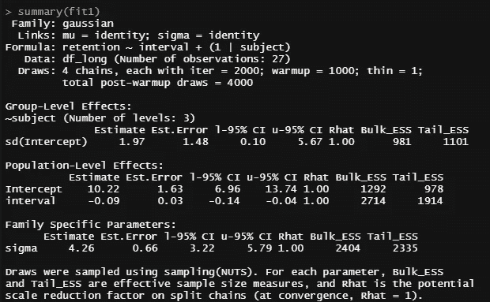

Model fits well from a sampling point of view.

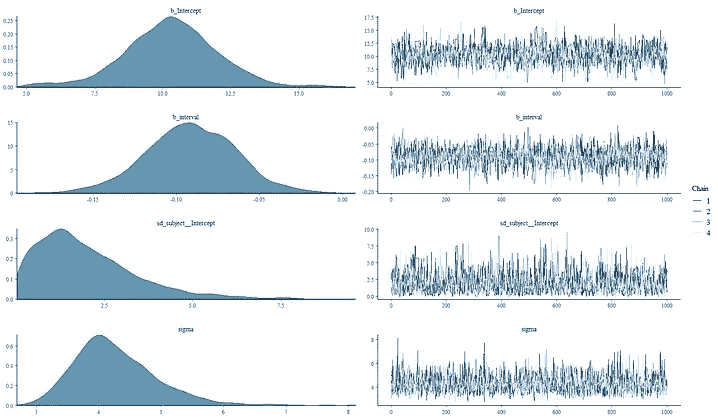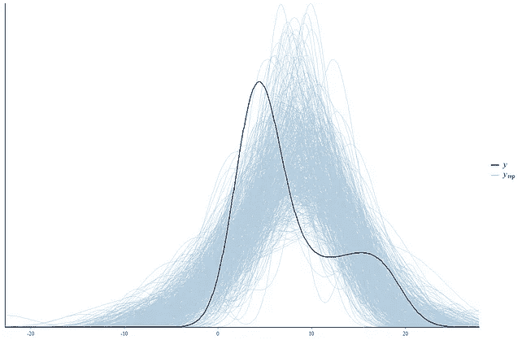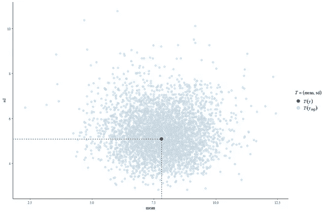

Samples look good, but the posterior is not on par with the likelihood.

让我们看看后面的画，看看模型是如何表现的。

```
df_long %>%
  add_epred_draws(fit1, 
                  ndraws=50, 
                  allow_new_levels = TRUE) %>%
  ggplot(aes(x = interval, 
             y = retention, 
             group=subject)) +
  geom_line(aes(y = .epred, group = paste(subject, .draw)), alpha = 0.25) +
  geom_point(data = df_long, color="black")+
  facet_wrap(~subject)+
  theme_bw()
```

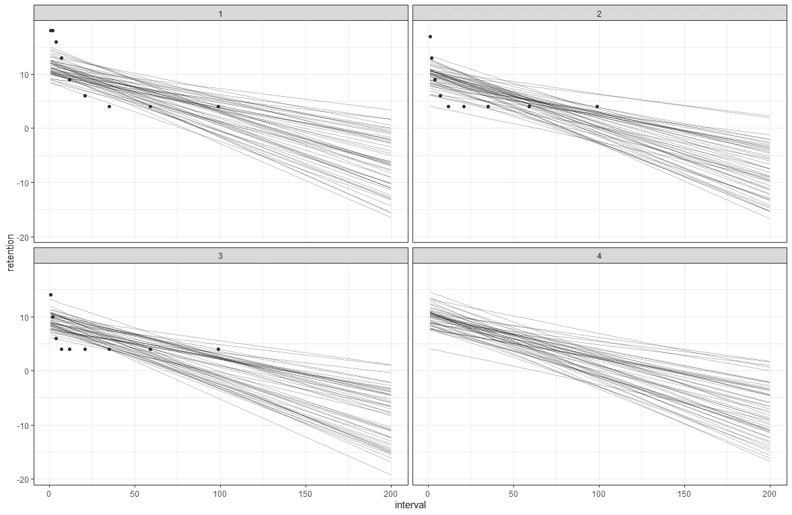

As expected, the posterior draws are linear, which does not make for a very good model. In fact, as the interval increases.

让我们回到最初的计划，并使用指定的公式对数据进行建模。这在 *brms* 中很容易完成。我还会在这里添加层次部分。

```
fit2<-brms::brm(bf(retention ~ 
                     exp(-a1 * interval) + b1,
                   a1 + b1~1 + (1|subject), nl=TRUE), 
                data = df_long,
                prior = c(
                  prior(beta(1, 1), nlpar = "a1"),
                  prior(beta(1, 1), nlpar = "b1")), 
                chains=4, 
                cores=6, 
                warmup = 3000,
                iter = 6000)
summary(fit2)
plot(fit2)
pp_check(fit2, ndraws = 500)
pp_check(fit2, type = "stat_2d")
pp_check(fit2, type = "loo_pit")

ce<-conditional_effects(fit2, surface = TRUE)
pl_ce<-plot(ce, rug=TRUE, theme=theme_bw())

df_long %>%
  add_epred_draws(fit2, 
                  ndraws=50, 
                  allow_new_levels = TRUE) %>%
  ggplot(aes(x = interval, 
             y = retention, 
             group=subject)) +
  geom_line(aes(y = .epred, group = paste(subject, .draw)), alpha = 0.25) +
  geom_point(data = df_long, color="black")+
  facet_wrap(~subject)+
  theme_bw()
```

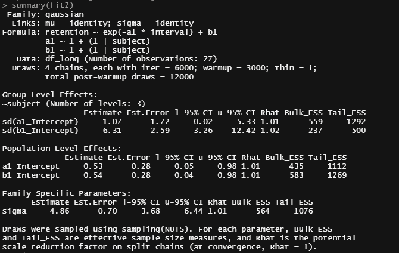

Model looks good, but great. Rhat values are too big. Lets look at the chains.

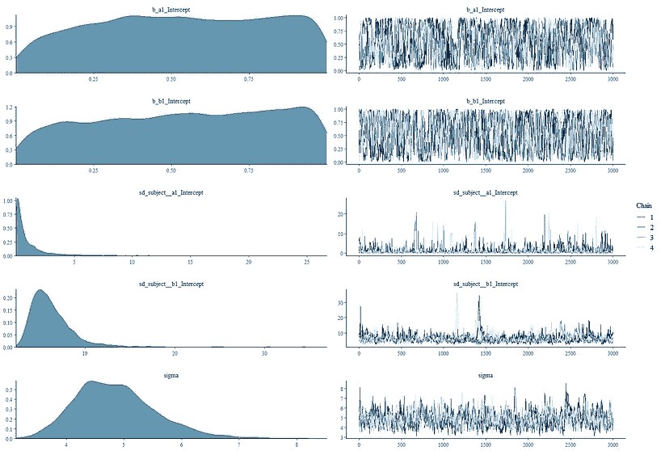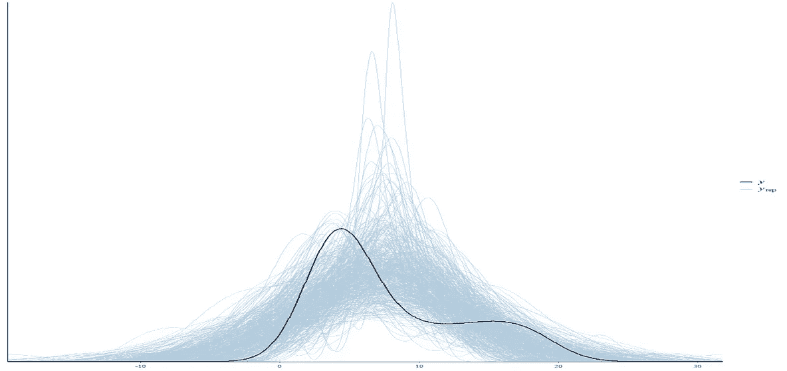

Chains are not that good and te posterior densities do not seem to mimic the data. They do NOT have to, necessarily, but a serious deviation requires some solid reasoning.

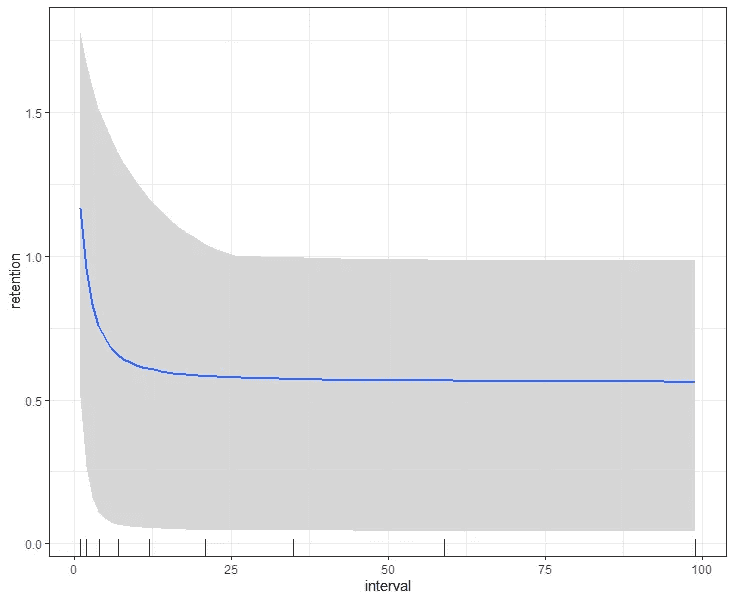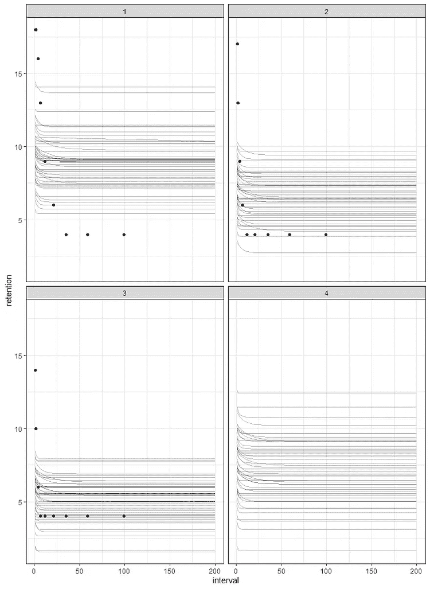

The build-in conditional plot (left) and the posterior draws (right). The right plot shows that this model is clearly not what we should have.

之前的模型将保留视为正态分布的最佳变量。在书中，二项式是适用的，所以我们将做同样的事情。其余的我将保持不变，包括非常弱的无信息β(1，1)先验，它们在这个状态下是一致的。

```
fit3<-brms::brm(bf(retention | trials(N) ~ 
                     exp(-a1 * interval) + b1,
                   a1 + b1~1 + (1|subject), nl=TRUE), 
                data = df_long,
                family=binomial(link = "logit"),
                prior = c(
                  prior(beta(1, 1), nlpar = "a1"),
                  prior(beta(1, 1), nlpar = "b1")), 
                chains=4, 
                cores=6, 
                warmup = 3000,
                iter = 6000)
summary(fit3)
df_long %>%
  add_epred_draws(fit3, 
                  ndraws=50, 
                  allow_new_levels = TRUE) %>%
  ggplot(aes(x = interval, 
             y = retention, 
             group=subject)) +
  geom_line(aes(y = .epred, group = paste(subject, .draw)), alpha = 0.25) +
  geom_point(data = df_long, color="black")+
  facet_wrap(~subject)+
  theme_bw()
```

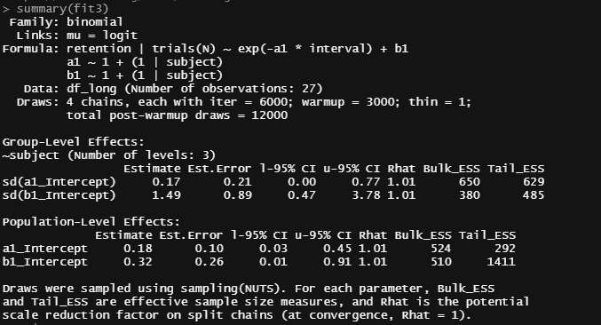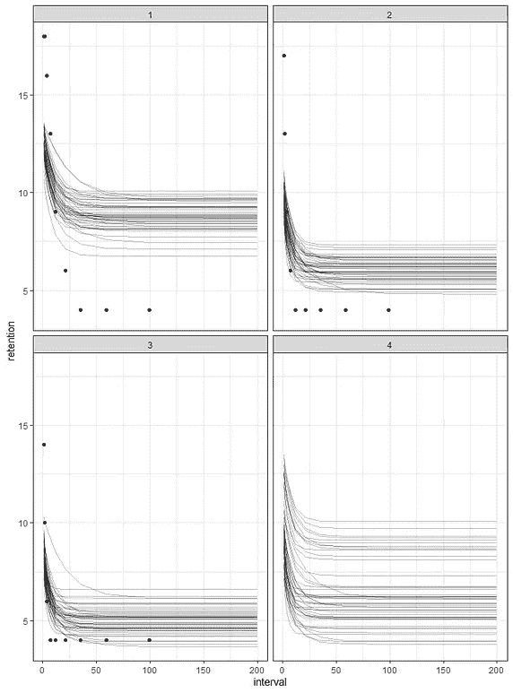

The Rhat values are still not that great, but the model looks better. Not perfect, but better than before.

让我们更深入地研究一下，调整一下先验知识，使之更具知识性。我真的没有任何具体的文章/论文可以使用，这将是建立信息先验的最佳方式，但我现在使用的统一先验真的不好。

因此，对于 *b* 参数，我将从正态分布中取样。 *sd* 参数可以保持一致。

```
get_prior(bf(retention | trials(N) ~ 
               exp(-a1 * interval) + b1,
             a1 + b1~1 + (1|subject), nl=TRUE), 
          data = df_long,
          family=binomial(link = "logit"))
fit4<-brms::brm(bf(retention | trials(N) ~ 
                     exp(-a1 * interval) + b1,
                   a1 + b1 ~ 1 + (1|subject), nl=TRUE), 
                data = df_long,
                family=binomial(link = "logit"),
                prior = c(
                  prior(normal(0, 1), class=b,  coef=Intercept, nlpar = "a1"),
                  prior(normal(0, 1), class=b,  coef=Intercept, nlpar = "b1"),
                  prior(beta(1, 1), class=sd, coef=Intercept, group=subject, nlpar = "a1"),
                  prior(beta(1, 1), class=sd, coef=Intercept, group=subject, nlpar = "b1")), 
                chains=4, 
                cores=6, 
                warmup = 3000,
                iter = 6000)
summary(fit4)

pp_check(fit4, ndraws=500)

df_long %>%
  add_epred_draws(fit4, 
                  ndraws=50, 
                  allow_new_levels = TRUE) %>%
  ggplot(aes(x = interval, 
             y = retention, 
             group=subject)) +
  geom_line(aes(y = .epred, group = paste(subject, .draw)), alpha = 0.25) +
  geom_point(data = df_long, color="black")+
  facet_wrap(~subject)+
  theme_bw()
```

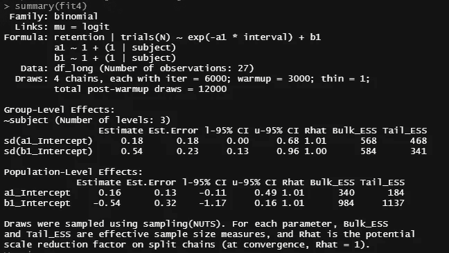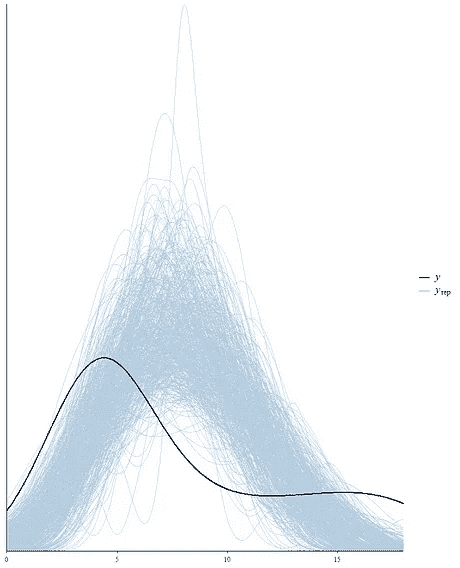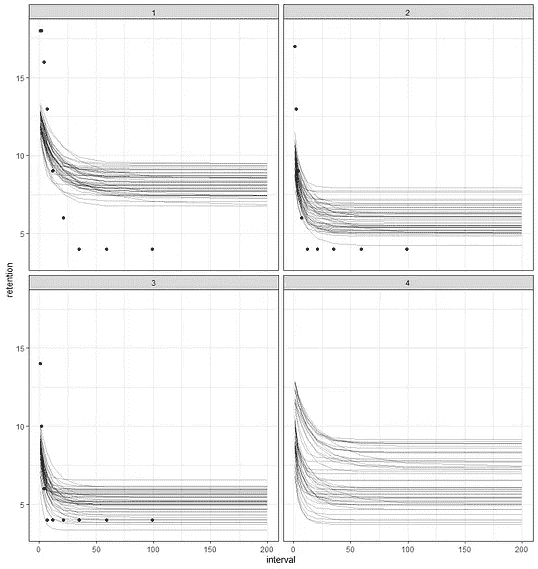

Rhat is a bit better, but posterior draws are not that great.

上面的图片显示，使用的先验知识没有帮助。此外，因为我们只有四个主题，先验有相当大的影响。我们做出的任何选择都会产生影响。

增加模型复杂性的另一种方法是在分级模型中增加一个额外的随机斜率组件。到目前为止，曲线只能通过*截距*由主体移动。

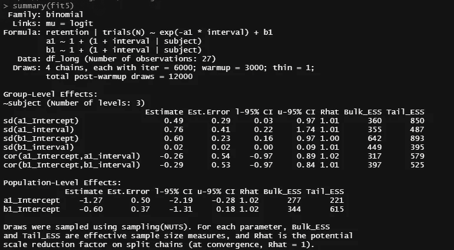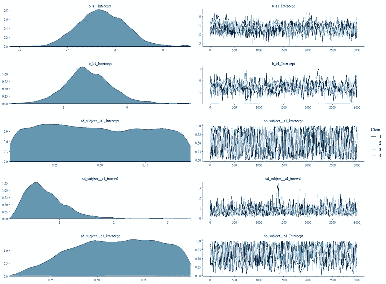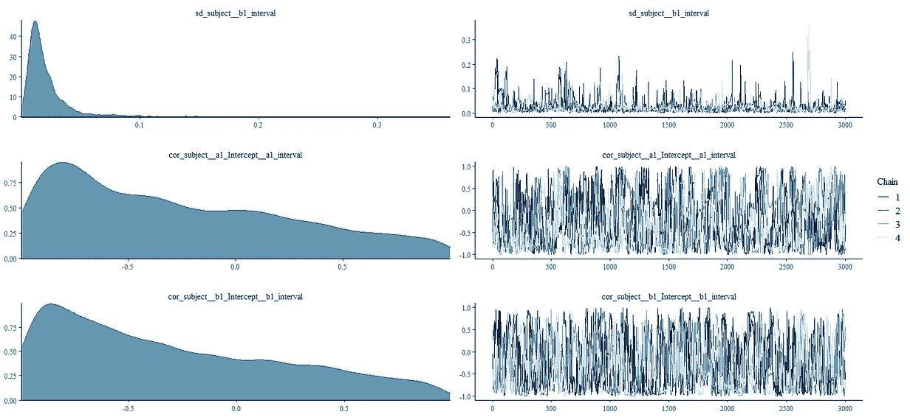

The posterior draws are not stable.

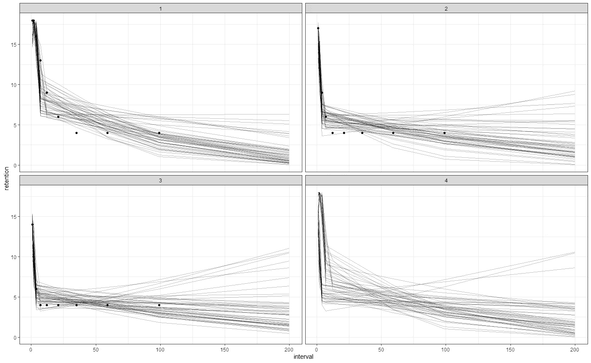

Looks good in shape, but for sure not stable.

a1 变量是决定衰变率的变量，而 b1 是常数。我认为之前的模型过于复杂，所以我将从 *b1* 中选取随机斜率。此外，我会将截距值设置回具有限制[0，1]的均匀先验，对 *a1* 的随机截距使用正态分布，对 *a1* 的随机斜率和 *b1* 的随机截距使用更宽的伽马分布。

```
fit6<-brms::brm(bf(retention | trials(N) ~ 
                     exp(-a1 * interval) + b1,
                   a1  ~ 1 + (1 + interval | subject), 
                   b1  ~ 1 + (1 | subject), nl=TRUE), 
                data = df_long,
                family=binomial(link = "logit"),
                prior = c(
                  prior(beta(1, 1), class=b,  nlpar = "a1", lb=0, ub=1),
                  prior(beta(1, 1), class=b,  nlpar = "b1", lb=0, ub=1),
                  prior(normal(0, 1),   class=sd, coef=Intercept, group=subject, nlpar = "a1"),
                  prior(gamma(1, 1),   class=sd, coef=Intercept, group=subject, nlpar = "b1"), 
                  prior(gamma(1, 1),  class=sd, coef=interval, group=subject, nlpar = "a1")), 
                chains=4, 
                cores=6, 
                warmup = 3000,
                iter = 6000)
```

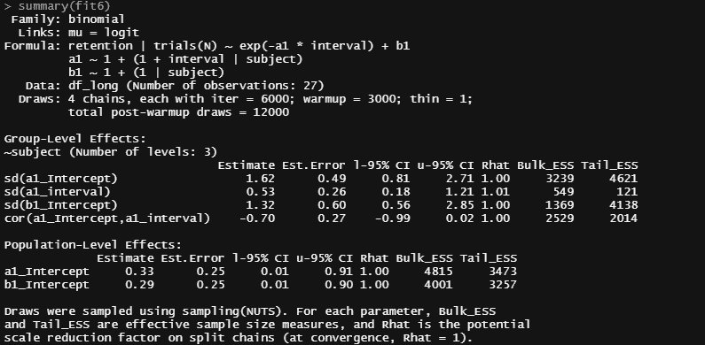

Looking much better.

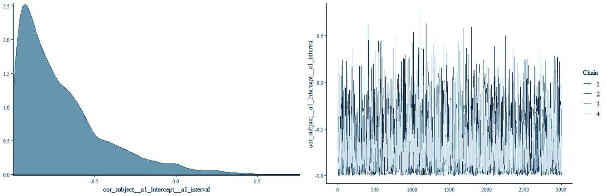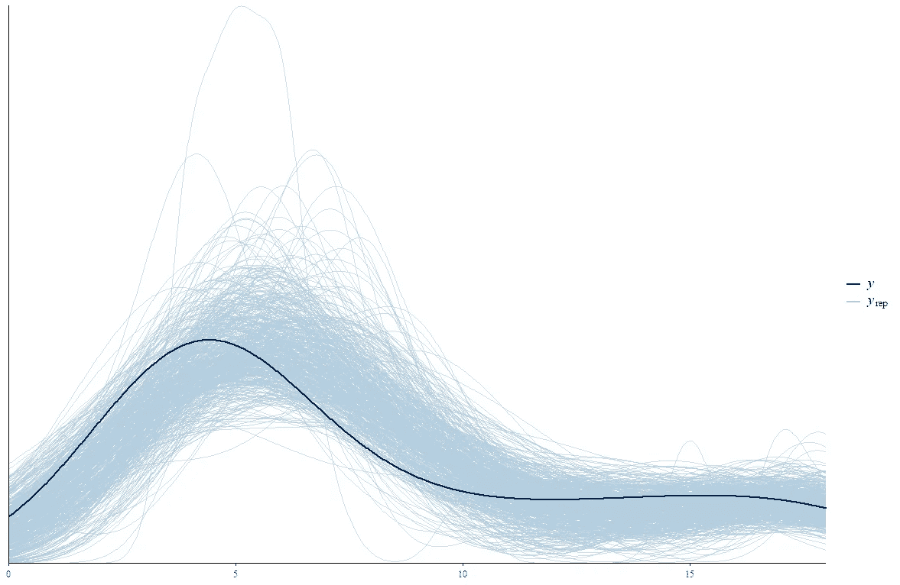

Lookin much better.

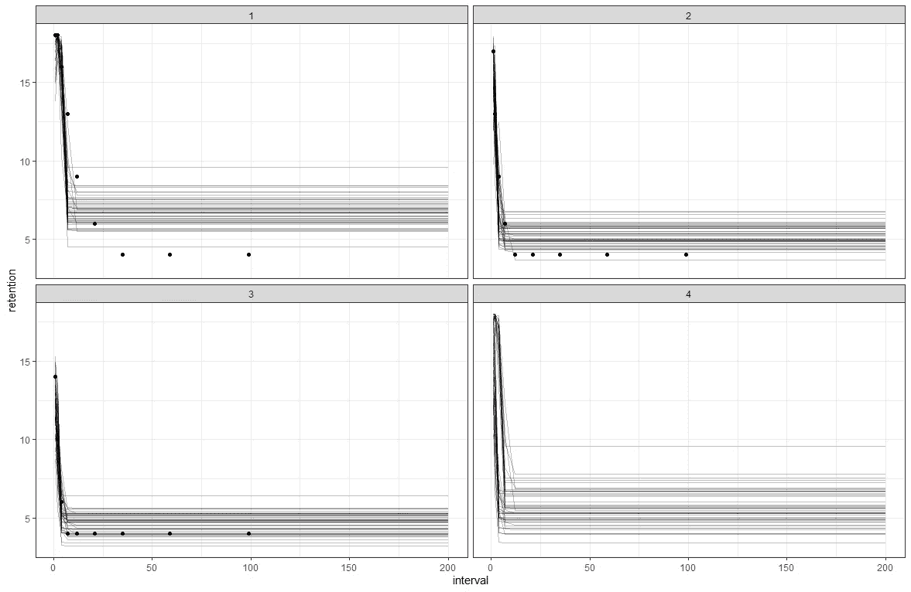

Much better as well, although in parts a bit unstable.

最终，brms 模型的功能比作者制作的 STAN 或 WinBUGS 模型要少，但它确实完成了工作。STAN 的问题是它不能处理 NA 值，不像 WinBUGS。

此外，我现在使用的先验信息很少，但不是基于科学证据。它们是根据我对模型的理解和经验选择的，但不应该是这样的。

然而，我希望这篇博文展示了如何通过非线性贝叶斯方法对认知数据建模。

[](/mlearning-ai/mlearning-ai-submission-suggestions-b51e2b130bfb) [## Mlearning.ai 提交建议

### 如何成为 Mlearning.ai 上的作家

medium.com](/mlearning-ai/mlearning-ai-submission-suggestions-b51e2b130bfb)