# 模拟心理物理功能

> 原文：<https://medium.com/mlearning-ai/modelling-psychophysical-functions-70ca69d18b87?source=collection_archive---------4----------------------->

## 贝叶斯认知建模

在这篇博文中，我将使用 Lee & Wagemakers 所著的《[贝叶斯认知建模](https://bayesmodels.com/)》一书中的另一个例子。这本书充满了认知心理学的例子，可以用贝叶斯方法来处理。由于这些例子大多是通过 **WinBUGS** 完成的，我想看看我是否能使用 *brms* 和 *stan* 来重现它。所以，这就是这篇博文的内容。(我知道这本书也提供了 stan 代码，但我想看看我能用 *brms* 走多远，它的功能比 base **STAN** 或 **WinBUGS** 要少)。

在这个例子中，我将模拟心理物理功能，就像前面的[例子](/mlearning-ai/modelling-memory-retention-3f68d1bbe131)一样，与多少刺激被正确识别有关(许多认知心理学测试是这样的:接受一个刺激，等一会儿，看看会发生什么)。

我将从作者那里获得数据争论的第一部分，以创建我自己的适合于 *brms* 的数据集(作者使用 *WinBUGS* ，它采用另一种方法来加载数据)。

```
# clears workspace:  
rm(list=ls()) 

# sets working directories:
library(dplyr)
library(ggplot2)
library(brms)
library(bayesplot)
library(tidybayes)
library(marginaleffects)

x       <- matrix(NA,8,28)
x[]     <- as.matrix(read.table("CaseStudies/PsychophysicalFunctions/data_x.txt",sep="\t"))
n       <- matrix(NA,8,28)
n[]     <- as.matrix(read.table("CaseStudies/PsychophysicalFunctions/data_n.txt",sep="\t"))
r       <- matrix(NA,8,28)
r[]     <- as.matrix(read.table("CaseStudies/PsychophysicalFunctions/data_r.txt",sep="\t"))
rprop   <- matrix(NA,8,28)
rprop[] <- as.matrix(read.table("CaseStudies/PsychophysicalFunctions/data_rprop.txt",sep="\t"))

xmean <- c(318.888,311.0417,284.4444,301.5909,296.2000,305.7692,294.6429,280.3571)
nstim <- c(27, 24, 27, 22, 25, 26, 28, 28)
nsubjs <- 8

x<-as.data.frame(x)
d <- x
subject <- rownames(d)
rownames(d) <- NULL
df <- cbind(subject,d)
df_long<-df%>%
  tidyr::pivot_longer(cols=V1:V28,
                      names_to = "Time",
                      values_to = "Interval")
df_long$Time<-NULL
```

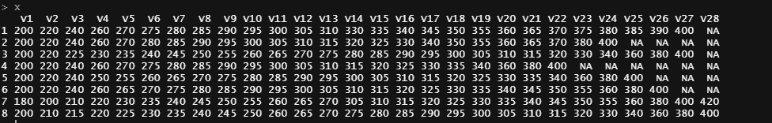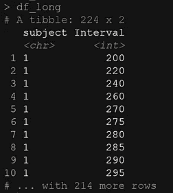

The interval data in wide and long format.

```
rprop<-as.data.frame(rprop)
d <- rprop
subject <- rownames(d)
rownames(d) <- NULL
df <- cbind(subject,d)
df_long2<-df%>%
  tidyr::pivot_longer(cols=V1:V28,
                      names_to = "Time",
                      values_to = "Proportion")
df_long2$Time<-NULL
df<-cbind(df_long, df_long2$Proportion)
colnames(df)[3]<-"Proportion"
```

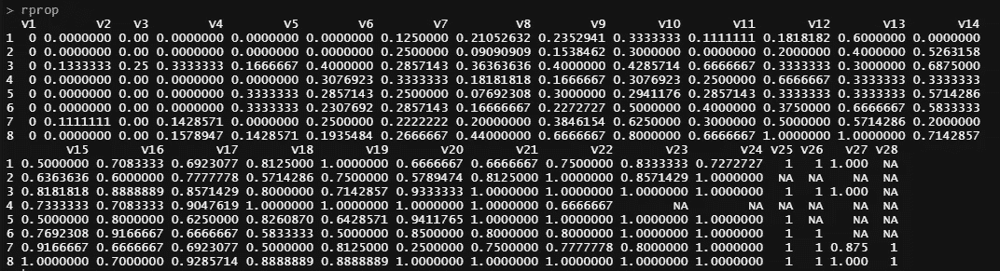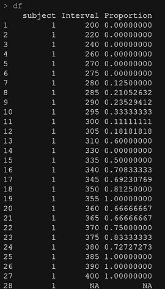

The proportion data in wide format (left), and combined with the interval data per subject in long format (right).

上面的数据集足以进行建模，但是如果我想使用二项式方法对数据进行建模，我将需要做一些额外的数据争论。

```
r<-as.data.frame(r)
d <- r
subject <- rownames(d)
rownames(d) <- NULL
df <- cbind(subject,d)
r_long<-df%>%
  tidyr::pivot_longer(cols=V1:V28,
                      names_to = "Time",
                      values_to = "Correct")
r_long$Time<-NULL
n<-as.data.frame(n)
d <- n
subject <- rownames(d)
rownames(d) <- NULL
df <- cbind(subject,d)
n_long<-df%>%
  tidyr::pivot_longer(cols=V1:V28,
                      names_to = "Time",
                      values_to = "Trials")
n_long$Time<-NULL
df<-cbind(df_long, n_long$Trials)
df<-cbind(df, r_long$Correct)
colnames(df)[3]<-"Trials"
colnames(df)[4]<-"Correct"
df$Proportion<-df$Correct/df$Trials
head(df)
```

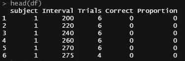

The dataset, containing intervals, trials, correct specified, and the proportion correct per subject in long format. THIS will be dataset from which to model.

让我们画出我们到底有什么

```
ggplot(df, aes(x=Interval, y=Proportion, group=subject, col=subject))+
  geom_point()+
  theme_bw()

ggplot(df, aes(x=Interval, y=Proportion, group=subject, col=subject))+
  geom_point()+
  theme_bw()+
  facet_wrap(~subject)
```

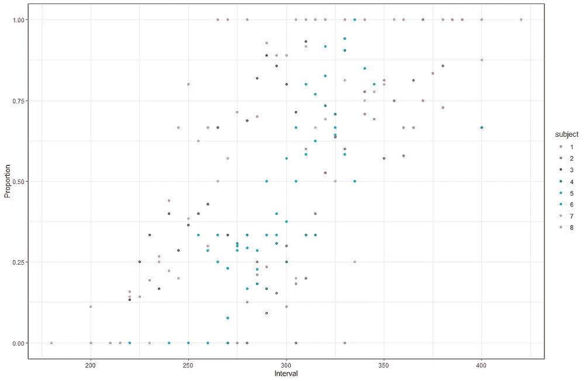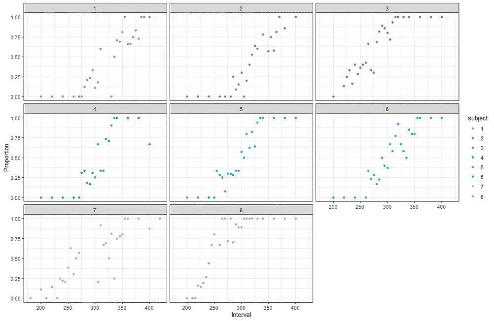

To the left we see all the data, to the right the data per subject. The sigmoidal curve is quite clear and so the data will unlikely pose any challenge to model.

让我们看看模型的规格，从一些非常简单的先验知识开始。

```
get_prior(Correct | trials(Trials) ~ 
                Interval + (1|subject), 
              data = df,
              family=binomial(link = "logit"))

fit<-brms::brm(Correct | trials(Trials) ~ 
                  Interval + (1|subject), 
                data = df,
                family=binomial(link = "logit"),
                prior = c(
                  prior(normal(0, 1), class=b, coef=Interval ),
                  prior(normal(0, 1), class=Intercept),
                  prior(gamma(1, 1), class=sd, coef=Intercept, group=subject)), 
                chains=4, 
                cores=6, 
                warmup = 3000,
                iter = 6000)
summary(fit)
plot(fit)
pp_check(fit, ndraws=500)
```

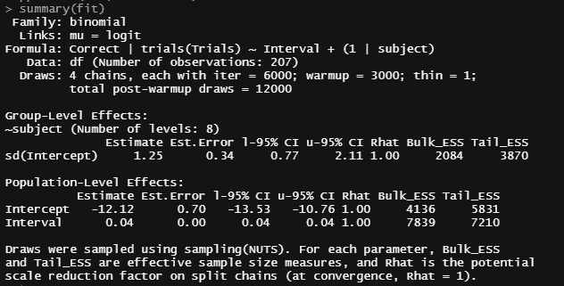

Good convergence.

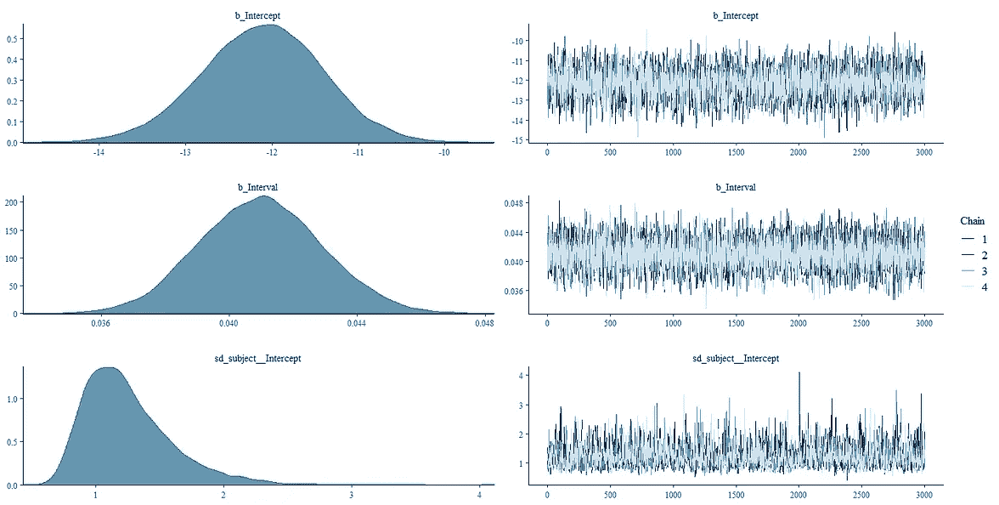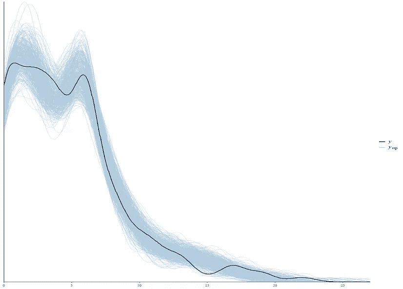

Sampling went well.

```
ce<-conditional_effects(fit, surface = TRUE)
pl_ce<-plot(ce, rug=TRUE, theme=theme_bw())
```

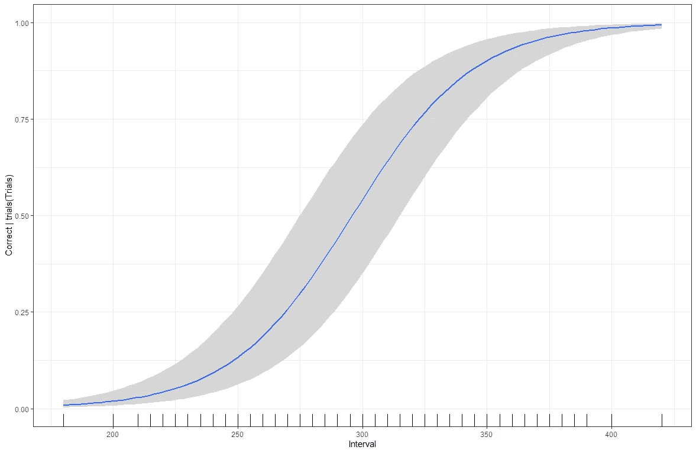

Conditional plot shows the expected sigmoidal curve.

让我们做一些额外的分析，看看每个受试者在一段时间内正确的刺激数量的后验概率。

```
df%>%
  tidyr::drop_na()%>%
  add_epred_draws(fit, 
                  ndraws=100) %>%
  ggplot(aes(x = Interval, 
             y = Correct, 
             group=subject)) +
  geom_line(aes(y = .epred, group = paste(subject, .draw)), alpha = 0.25) +
  geom_point(data = df, color="black")+
  facet_wrap(~subject)+
  theme_bw()
```

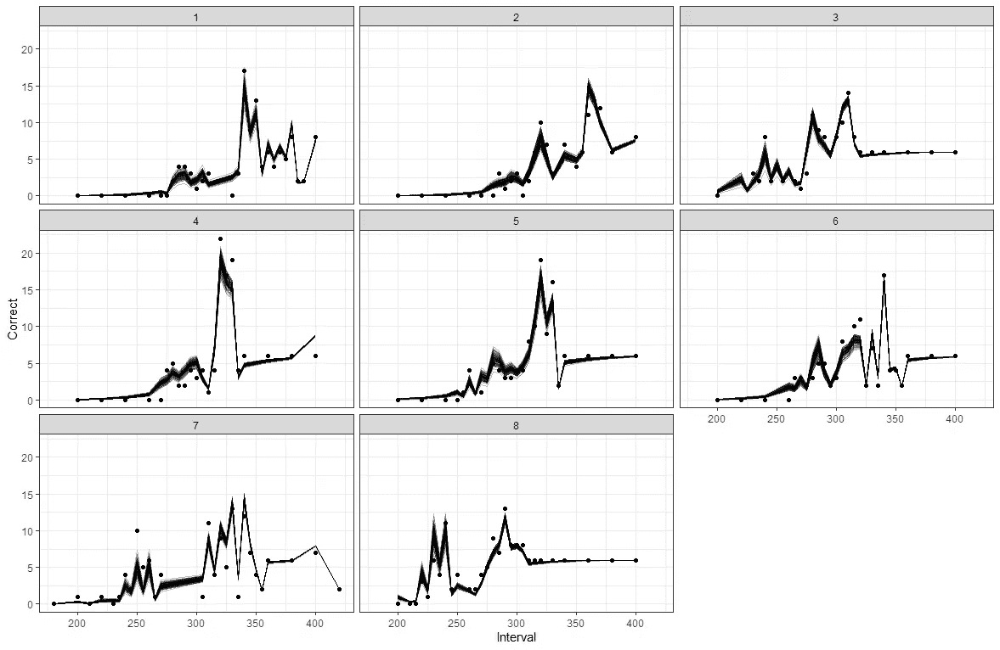

Looks good! As you can see, plotting the data without the denominator gives a somewhat skewed look.

我们也可以画出预测值。与先前值的不同之处在于，这些值来自后验拟合。考虑到使用的数据将是相同的，预测的抽奖将具有相同的形状，但更大的不确定性。

```
df%>%
  tidyr::drop_na()%>%
  add_predicted_draws(fit, 
                  ndraws=100) %>%
  ggplot(aes(x = Interval, 
             y = Correct, 
             group=subject)) +
  geom_line(aes(y = .prediction, group = paste(subject, .draw)), alpha = 0.25) +
  geom_point(data = df, color="black")+
  facet_wrap(~subject)+
  theme_bw()
```

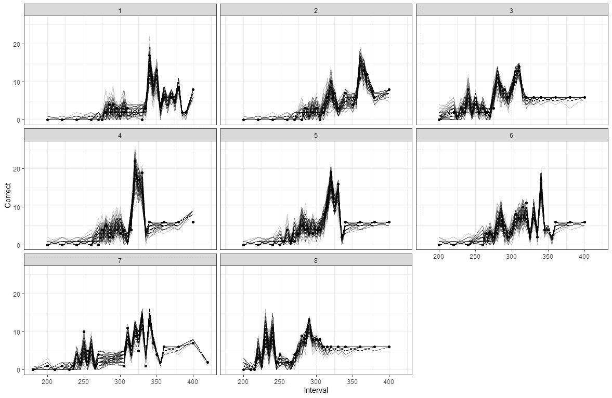

Looking good — indeed more uncertain.

还有另一种方法通过*预测*函数从模型拟合中获得预测。该方法自动提供可信区间。

```
pred <- predictions(fit)
ggplot(pred)+
  geom_line(aes(x=Interval, y=predicted, group=subject), lty=2, col="black")+
  geom_ribbon(aes(x=Interval, ymin=conf.low, ymax=conf.high, group=subject), 
              alpha=0.5, fill="gray")+
  geom_point(aes(x=Interval, y=Correct), col="red")+
  theme_bw()+
  facet_wrap(~subject)
```

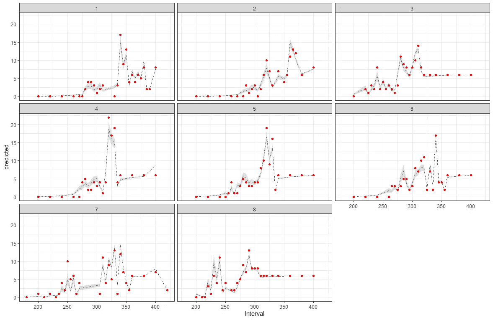

The predicted values on top of the observed values.

我们也可以通过将预测值除以试验次数，在概率尺度上绘制数据。

```
ggplot(pred)+
  geom_line(aes(x=Interval, y=predicted/Trials, group=subject), lty=2, col="black")+
  geom_ribbon(aes(x=Interval, ymin=conf.low/Trials, ymax=conf.high/Trials, group=subject), 
              alpha=0.5, fill="gray")+
  geom_point(data=df, aes(x=Interval, y=Proportion), col="red")+
  theme_bw()+
  facet_wrap(~subject)
```

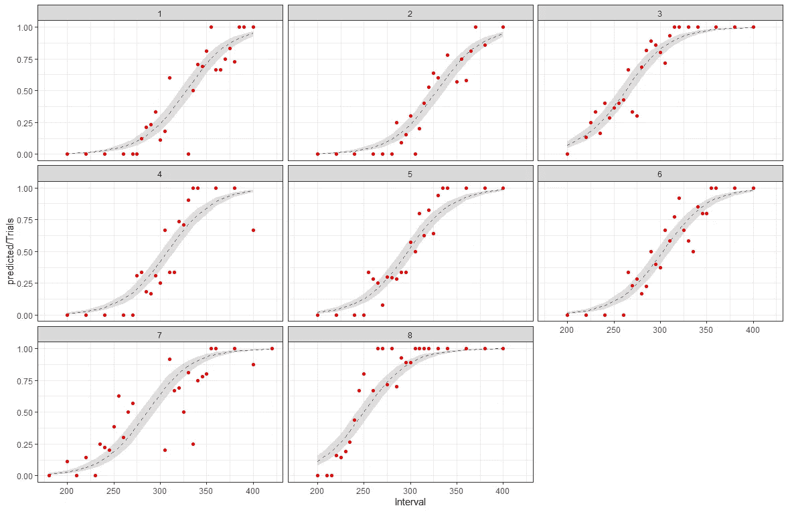

This will give us the sigmoidal curve we saw from the beginning.

从预测中，我们还可以得到后验概率。这将增加更多的不确定性。

```
pred <- posteriordraws(pred)
ggplot(pred)+
  geom_line(aes(x=Interval, 
                y=draw, 
                group = paste(subject, drawid)), 
            lty=2, col="black")+
  geom_point(aes(x=Interval, y=Correct), col="red")+
  theme_bw()+
  facet_wrap(~subject)
```


As you can see, the model still looks good, but also a bit more uncertain. This is inherent to sampling from predictions.

这是一篇关于如何使用贝叶斯层次模型和 *brms* 对心理物理功能建模的短文。

如果你有任何问题，请告诉我！

[](/mlearning-ai/mlearning-ai-submission-suggestions-b51e2b130bfb) [## Mlearning.ai 提交建议

### 如何成为 Mlearning.ai 上的作家

medium.com](/mlearning-ai/mlearning-ai-submission-suggestions-b51e2b130bfb)