# 建立简单的记忆模型

> 原文：<https://medium.com/mlearning-ai/modelling-the-simple-model-of-memory-49852b0cd9b1?source=collection_archive---------2----------------------->

## 贝叶斯认知建模

在这篇博文中，我将使用 Lee & Wagemakers 所著的《[贝叶斯认知建模](https://bayesmodels.com/)》一书中的另一个例子。这本书充满了认知心理学的例子，可以用贝叶斯方法来处理。由于这些例子大多是通过 **WinBUGS** 完成的，我想看看我是否能使用 *brms* 和 *stan* 来重现它。所以，这就是这篇博文的内容。(我知道这本书也提供了 stan 代码，但我想看看我能用 *brms* 走多远，它的功能比 base **STAN** 或 **WinBUGS** 要少)。

在这个例子中，我将对记忆的简单模型进行建模，该模型测量人们保留刺激的能力。你会发现，这个模型的挑战在于它的非线性曲线。

背景并不重要，重要的是解决问题的方法。让我通过绘制数据来展示给你看。

但是首先，加载库和数据。

```
# clears workspace:  
rm(list=ls()) 
library(dplyr)
library(ggplot2)
library(brms)
library(bayesplot)
library(tidybayes)
library(marginaleffects)
```

```
y          <- matrix(scan("CaseStudies/Simple/k_M.txt", sep=","), ncol=40, nrow=6, byrow=T) 
n          <- c(1440,1280,1520,1520,1200,1280)
listlength <- c(10,15,20,20,30,40)
pc         <- matrix(scan("CaseStudies/Simple/pc_M.txt", sep=","), ncol=40, nrow=6, byrow=T) 
labs       <- scan("CaseStudies/Simple/labs_M.txt", sep="", what="character")
dsets <- 6 
gsets <- 9

y
pc
labs
```

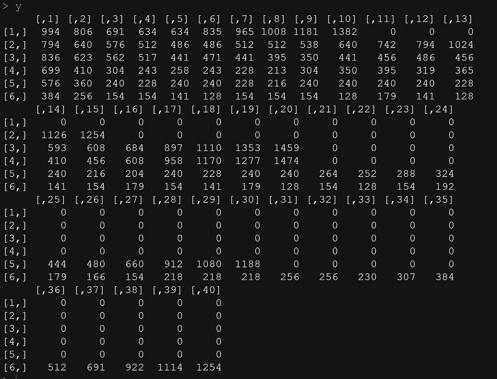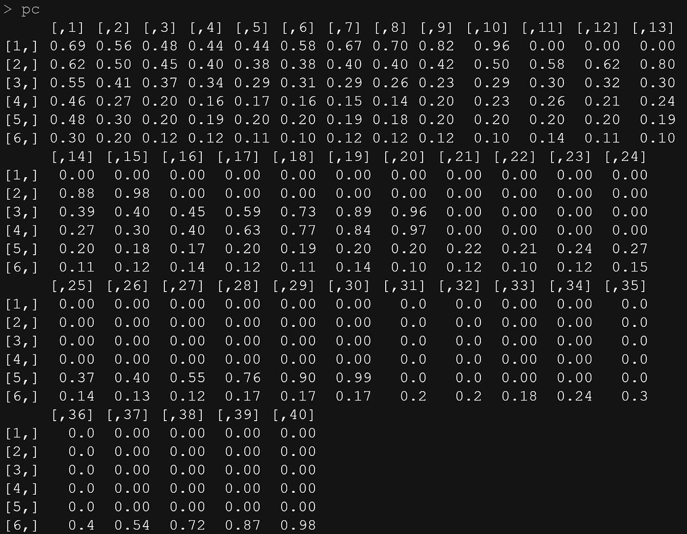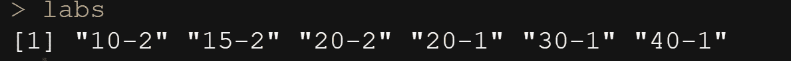

```
pc<-as.data.frame(t(pc))
colnames(pc)<-labs
d <- pc
Position <- rownames(d)
rownames(d) <- NULL
df <- cbind(Position,d)
str(df)
df_long<-df%>%
  tidyr::pivot_longer(cols=`10-2`:`40-1`,
                      names_to = "Condition",
                      values_to = "PC")
str(df_long)
df_long$Position<-as.numeric(df_long$Position)
df_long<-df_long%>%filter(PC>0)
ggplot(df_long)+
  geom_point(aes(x=Position, 
                 y=PC))+
  theme_bw()+
  facet_wrap(~Condition)

ggplot(df_long)+
  geom_point(aes(x=Position, 
                 y=PC))+
  geom_smooth(aes(x=Position, 
                  y=PC))+
  theme_bw()+
  facet_wrap(~Condition)
```

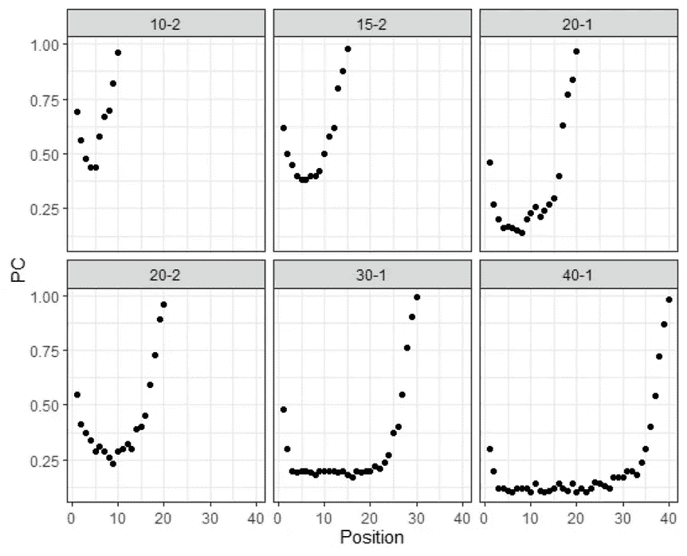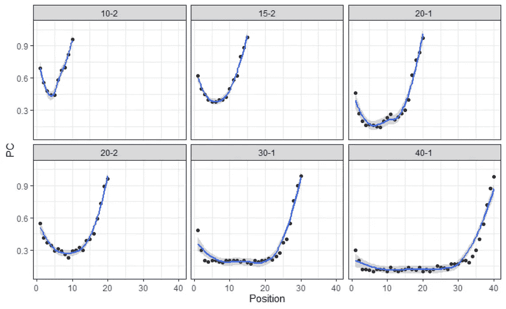

These plot show, for six conditions, the percentage correct in relationship to the position of the stimulus to be retained. It is this patterns that we need to model.

在这本书里，它清楚地展示了这个模型是多么复杂，也是从认知的角度。最有效的模型是机械模型，其中基础理论的各个部分被连接起来形成一个模型，并从中得出预测。该模型也是书中的 **WinBUGS** 所制作的，并且可以使用 **STAN** 来创建，但是我想使用基本的 *brms* 来建模它。现在，这并不意味着 *brms* 是基本的，但是我将会做一个和书上所做的稍微不同的模型。最后，我的工作是建立曲线模型。

我可以使用长格式显示上面的相同图形。为此，我需要做一些额外的转换。

```
y<-as.data.frame(t(y))
colnames(y)<-labs
d <- y
Position <- rownames(d)
rownames(d) <- NULL
df <- cbind(Position,d)
str(df)
df_long<-df%>%
  tidyr::pivot_longer(cols=`10-2`:`40-1`,
                      names_to = "Condition",
                      values_to = "Y")
df_long$Position<-as.numeric(df_long$Position)
df_long<-df_long%>%
  arrange(Condition, Position)
df_long$N<-rep(n,each=40)
df_long$PC<-df_long$Y/df_long$N
df_long<-df_long%>%filter(PC>0)
ggplot(df_long)+
  geom_point(aes(x=Position, 
                 y=PC))+
  geom_smooth(aes(x=Position, 
                  y=PC))+
  theme_bw()+
  facet_wrap(~Condition)
```

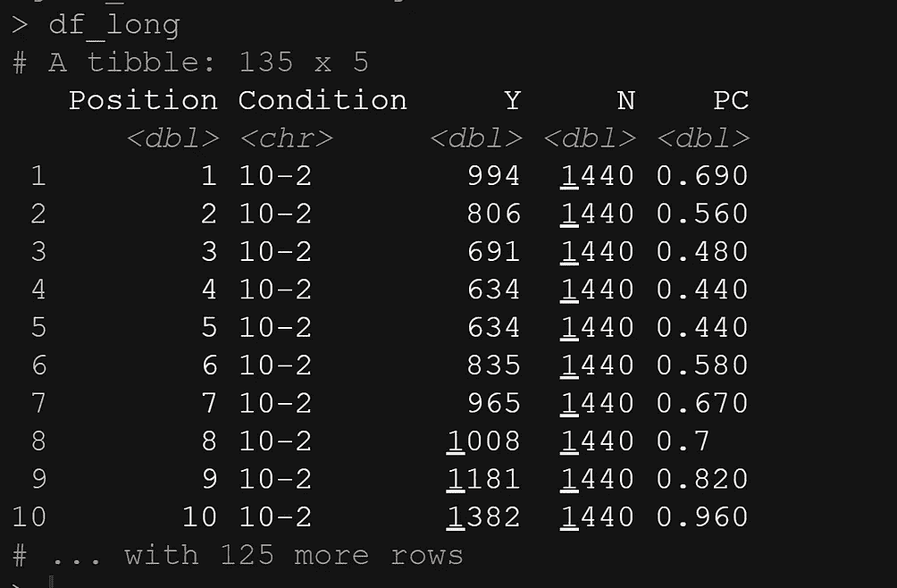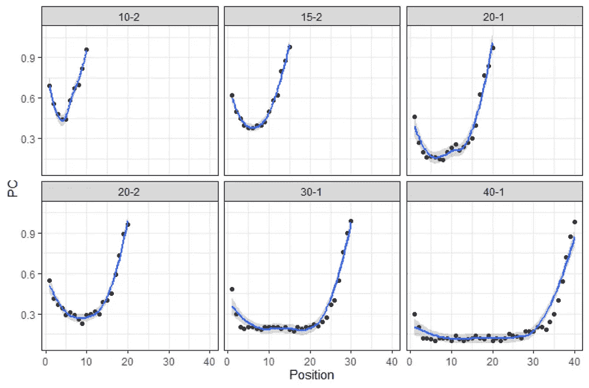

And here we have the same plot using a different data frame.

现在，数据完全是非线性的，而且有多种建模方法。我们可以使用样条，一种非线性函数，或者我们可以转换数据，然后通过更简单的解决方案对其建模。让我们先试试最后一个建议。

```
ggplot(df_long)+
  geom_point(aes(x=log10(Position), 
                 y=log10(Y)))+
  geom_smooth(aes(x=log(Position), 
                  y=log10(Y)))+
  theme_bw()+
  facet_wrap(~Condition)
```

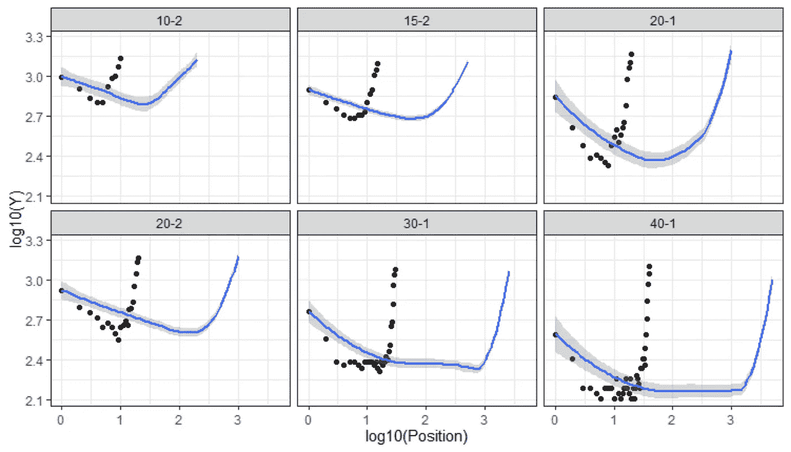

That did not help. At all.

建模部分。现在，在[之前的](/mlearning-ai/difference-in-ability-2e823ae447e)例子中，我已经展示了使用基础二项式分布比使用贝塔分布更好。让我们从二项式开始。

```
get_prior(Y | trials(N) ~ 
                Position + (1|Condition), 
              data = df_long,
              family=binomial(link = "logit"))
fit<-brms::brm(Y | trials(N) ~ 
                 Position + (1|Condition), 
               data = df_long,
               family=binomial(link = "logit"),
               prior = c(
                 prior(normal(0, 1), class=b, coef=Position ),
                 prior(normal(0, 1), class=Intercept),
                 prior(gamma(1, 1), class=sd, coef=Intercept, group=Condition)), 
               chains=4, 
               cores=6, 
               warmup = 3000,
               iter = 6000)
summary(fit)
plot(fit)
pp_check(fit, ndraws = 500)
pp_check(fit, type = "error_hist", ndraws = 11)
pp_check(fit, type = "scatter_avg", ndraws = 100)
pp_check(fit, type = "stat_2d")
pp_check(fit, type = "loo_pit")

df_long %>%
  add_epred_draws(fit, 
                  ndraws=100, 
                  allow_new_levels = TRUE) %>%
  ggplot(aes(x = Position, 
             y = Y, 
             group=Condition)) +
  geom_line(aes(y = .epred, group = paste(Condition, .draw)), alpha = 0.25) +
  geom_point(data = df_long, color="black")+
  facet_wrap(~Condition)+
  theme_bw()
```

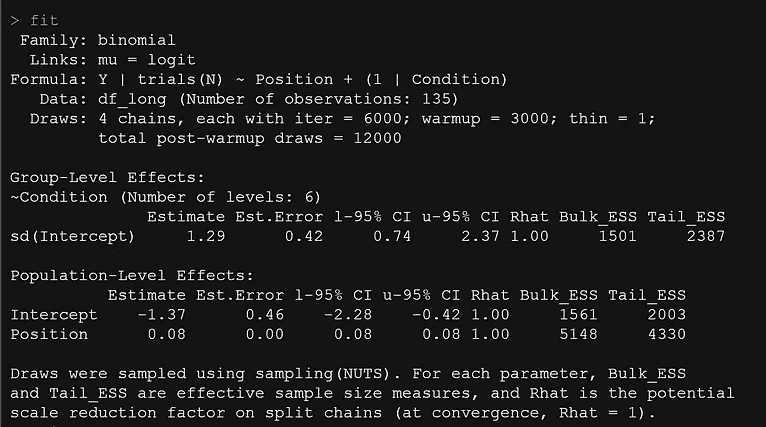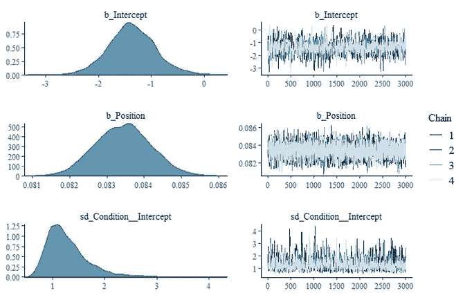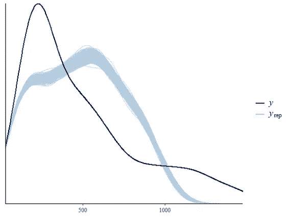

Sampling looks good, but the model is not connecting to the data at all. That does not have to be a problem if you are very much convinced that the priors used are suitable.

预测与观察不相关，当你观察偏差时，很难坚持选择的先验和模型是充分的。我不会在那上面打赌。

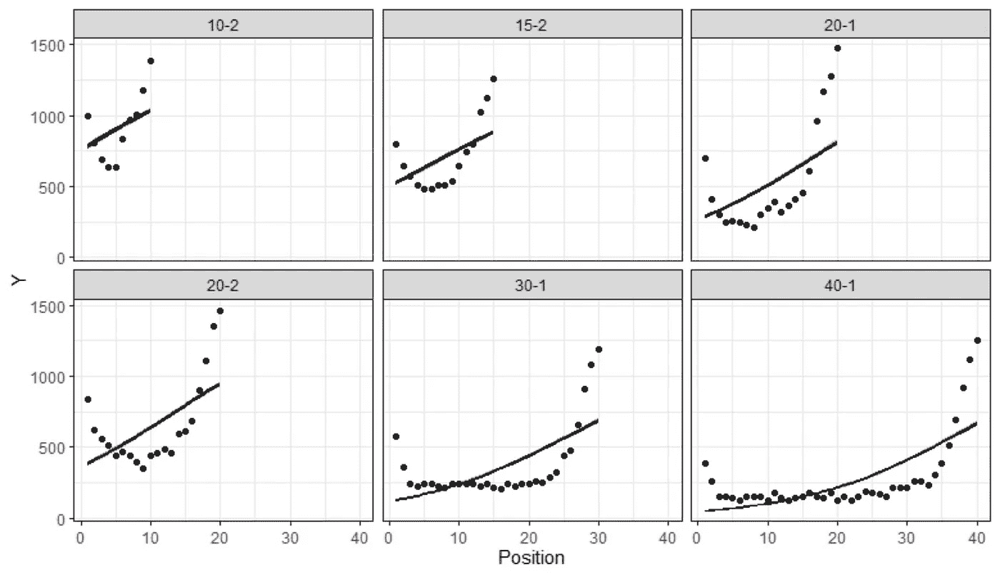

然后再做一次尝试，但这次使用样条。样条是建模非线性模式的非常好的方法，但在功能上仍然是线性的。然而，问题是样条常常会失去它的部分解释，尤其是与更难建模的非线性函数相比时。

让我们在 *brms* 模型中应用样条，看看我们在哪里结束。样条的 *gp* 部分构成高斯过程。许多不同类型的样条是可能的。

```
fit4<-brms::brm(Y | trials(N) ~ 
                  1 + s(Position, bs="gp") + (1+Position|Condition), 
                data = df_long,
                family=binomial(link = "logit"), 
                chains=4, 
                cores=6, 
                warmup = 3000,
                iter = 6000)

summary(fit4)
pp_check(fit4, ndraws=500)

df_long %>%
  add_epred_draws(fit4, 
                  ndraws=100, 
                  allow_new_levels = TRUE) %>%
  ggplot(aes(x = Position, 
             y = Y, 
             group=Condition)) +
  geom_line(aes(y = .epred, group = paste(Condition, .draw)), alpha = 0.25) +
  geom_point(data = df_long, color="black")+
  facet_wrap(~Condition)+
  theme_bw()
```

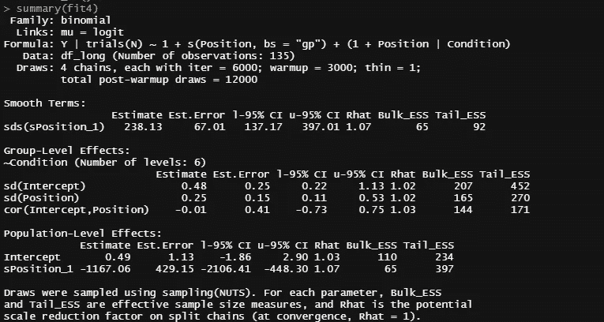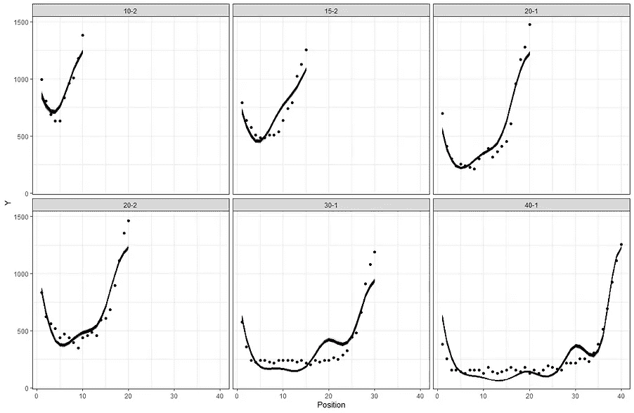

The model has no pre-defined prior (only priors coming from the data itself) which makes it a less stable model. Also, which can be clearly seen, is that the spline does not necessarily know how to deal with the data, which looks like a combination of a power function and an exponential.

因此，样条不是拟合数据的最佳方式。当然，还有其他方法，我现在将探索，其中实现非线性函数是最好的可能方式。

[非线性函数](/towards-artificial-intelligence/non-linear-models-53e6ea42e207)是出了名的难，所以我将从使用单个条件开始。

```
df_long_group2<-df_long%>%filter(Condition=="20-1")
plot(df_long_group2$Position, df_long_group2$Y)
```

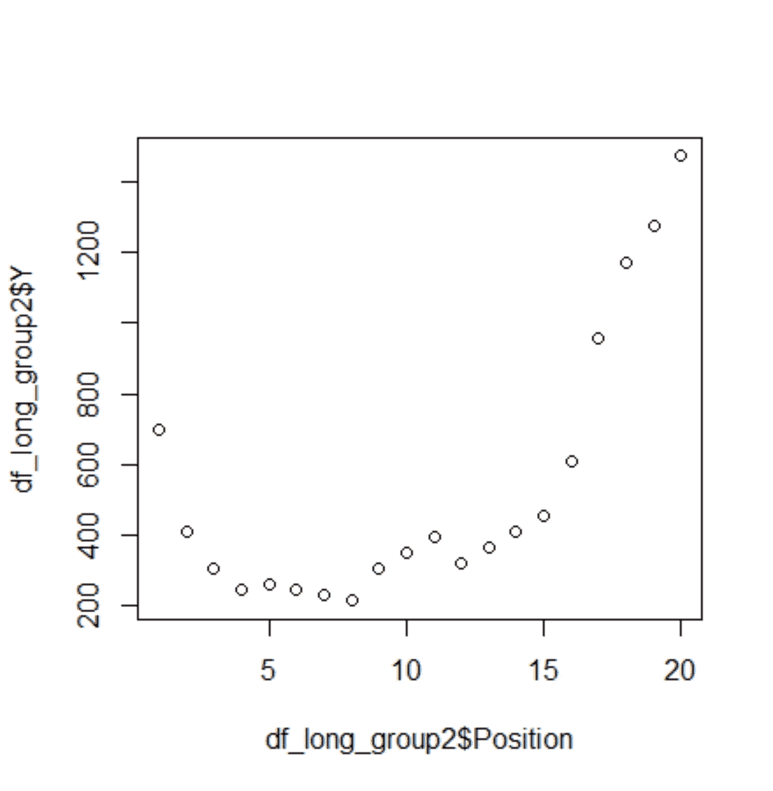

For a single condition I show the position and the number of correct. As you can see this is very much a non-linear function.

接下来，我想使用 *nls* 程序应用非线性函数。我现在使用的公式是我在寻找抛物线模型时找到的。正弦函数应该不会让你感到惊讶，因为它可以模拟一个周期的起伏，但我想知道它是否会找到正确的幅度。不管怎样，让我们开始吧。

```
try<-nls(Y ~ b0 + b1*sin(Position)+b2*log(Position), 
         data = df_long_group2,
         start = list(b0 = 100, 
                      b1 = 100,
                      b2 = 100), 
         na.action=na.exclude, 
         control=nls.control(maxiter = 1000, tol = 1e-05))
summary(try)
plot(try)
df_long_group2$pred<-predict(try)
ggplot(df_long_group2)+
  geom_point(aes(x=Position, 
                 y=Y))+
  geom_line(aes(x=Position, 
                y=pred, 
                group=Condition), col="red")+
  theme_bw()
```

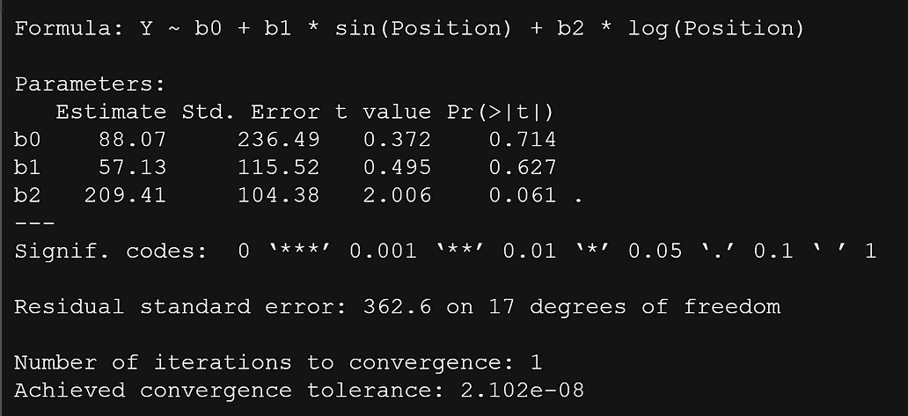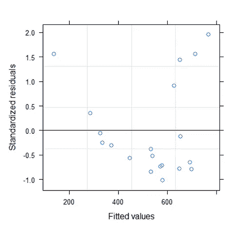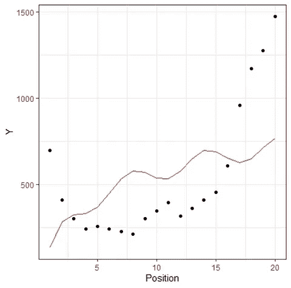

Models fits, but the predictions are off. We see cycles which we should not see.

即使模型不好，让我们看看贝叶斯模型如何使用 *brms* 执行。我将应用书中使用的相同函数和部分先验知识。这些都是非常不明确的前科。你很难称之为贝叶斯分析。

```
fit2<-brms::brm(bf(Y | trials(N) ~ 
                     b0 + b1*sin(Position)+b2*log(Position),
                   b0 + b1 + b2 ~ 1 + (1|Condition), nl=TRUE),
                data= df_long,
                family=binomial(link = "logit"),
                prior = c(
                  prior(uniform(0, 200), class=b, coef=Intercept, nlpar = "b0"),
                  prior(uniform(0, 200), class=b, coef=Intercept, nlpar = "b1"), 
                  prior(uniform(0, 250), class=b, coef=Intercept, nlpar = "b2"),
                  prior(gamma(1, 1), class=sd, group=Condition, nlpar = "b0"),
                  prior(gamma(1, 1), class=sd, group=Condition, nlpar = "b1"),
                  prior(gamma(1, 1), class=sd, group=Condition, nlpar = "b2")), 
                chains=4, 
                cores=6, 
                warmup = 3000,
                iter = 6000)
```

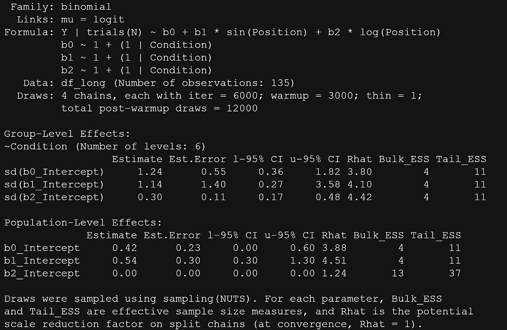

And here we have the output from the model. Just look at the Rhats produced. If you see values such as these, the prediction plots can be a real treat to see. Not because they are correct, but because they will be all over the place.

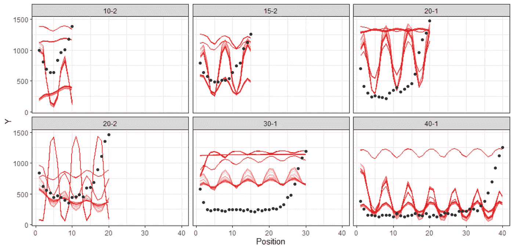

And yes, they are all over the place!

如果我改变了前科会怎么样？我现在将为位置部分构建统一先验，为比例部分构建伽玛先验。

```
fit3<-brms::brm(bf(Y | trials(N) ~ 
                     b0 + b1*sin(Position)+b2*log(Position),
                   b0 + b1 + b2 ~ 1 + (1|Condition), nl=TRUE),
                data= df_long,
                family=binomial(link = "logit"),
                prior = c(
                  prior(uniform(-10, 10), class=b, coef=Intercept, nlpar = "b0"),
                  prior(uniform(-10, 10), class=b, coef=Intercept, nlpar = "b1"), 
                  prior(uniform(-10, 10), class=b, coef=Intercept, nlpar = "b2"),
                  prior(gamma(1, 1), class=sd, group=Condition, nlpar = "b0"),
                  prior(gamma(1, 1), class=sd, group=Condition, nlpar = "b1"),
                  prior(gamma(1, 1), class=sd, group=Condition, nlpar = "b2")), 
                chains=4, 
                cores=6, 
                warmup = 3000,
                iter = 6000)
summary(fit3)
pp_check(fit3, ndraws=500)
```

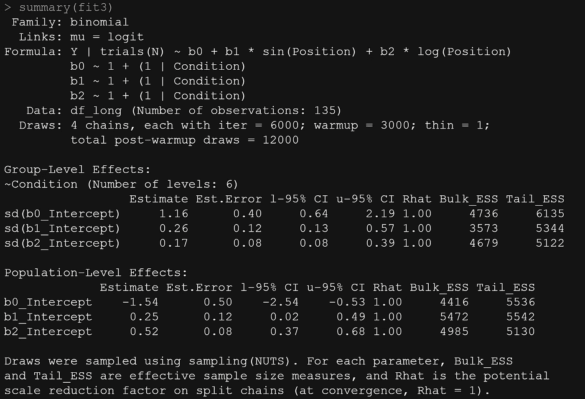

The model looks better as the Rhat values are normal. This means the sampling is stable, but does not mean the model makes sense. However, stable Rhats are a welcome sight.

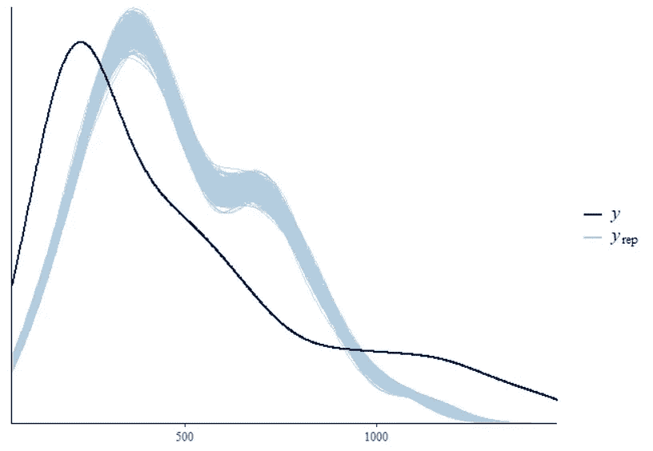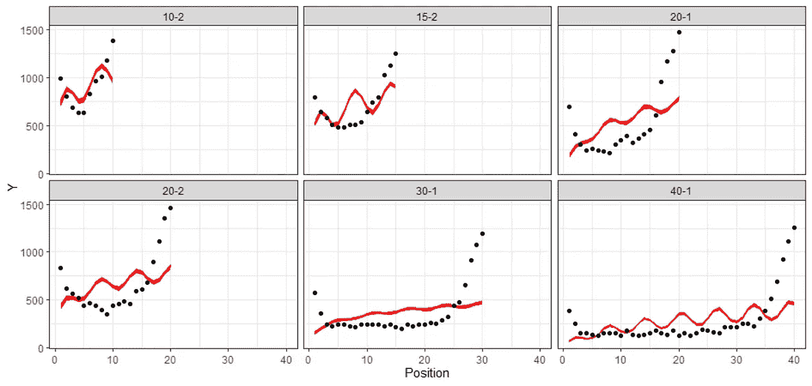

However, the predictions coming from the model leave much to be desired, behaving very much like a cycle. This should not surprise you, and so it should not surprise you that I will decide that this non-linear function is pretty much useless to model this particular set of observations. Lets move on.

书中使用的特定函数是嵌套的，非常复杂。当然，我可以使用作者应用的 STAN 代码，但是现在我甚至不想再这样做了。我想看看能不能用非线性的方式来模拟这个模式。但在此之前，我想再绕一圈，那就是应用多项式函数。非常符合样条，它有一些更容易解释的输出。以及它的敏捷。让我们快速评估一下。

首先，我将使用线性回归和 *lm* 函数进行测试。

```
df_long_group2<-df_long%>%filter(Condition=="20-1")
plot(df_long_group2$Position, df_long_group2$Y)
try<-lm(Y ~ Position + 
          I(Position^2) + 
          I(Position^3), data=df_long_group2)
summary(try)
df_long_group2$pred<-predict(try)
ggplot(df_long_group2)+
  geom_point(aes(x=Position, 
                 y=Y))+
  geom_line(aes(x=Position, 
                y=pred, 
                group=Condition), col="red")+
  theme_bw()
```

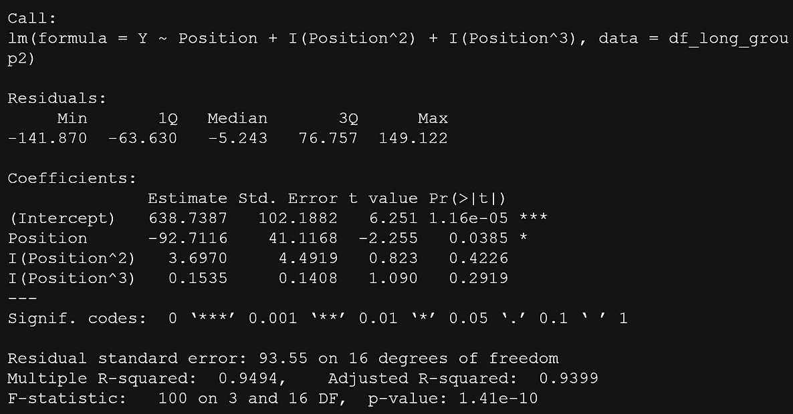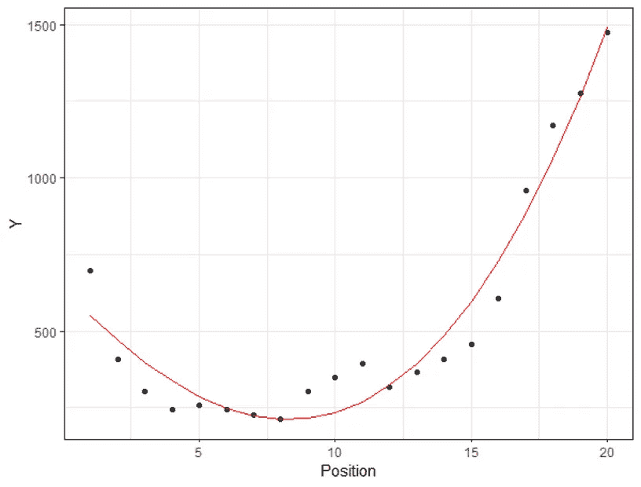

The model and its prediction. Not perfect, but not that bad either.

现在，我将使用 *glm* 函数尝试同样的事情。

```
try<-glm(cbind(Y|N) ~ Position + 
          I(Position^2) + 
          I(Position^3), 
         data=df_long_group2, 
         family=binomial)
summary(try)
df_long_group2$pred<-predict(try, df_long_group2, type="link")
ggplot(df_long_group2)+
  geom_point(aes(x=Position, 
                 y=Y))+
  geom_line(aes(x=Position, 
                y=pred, 
                group=Condition), col="red")+
  theme_bw()
```

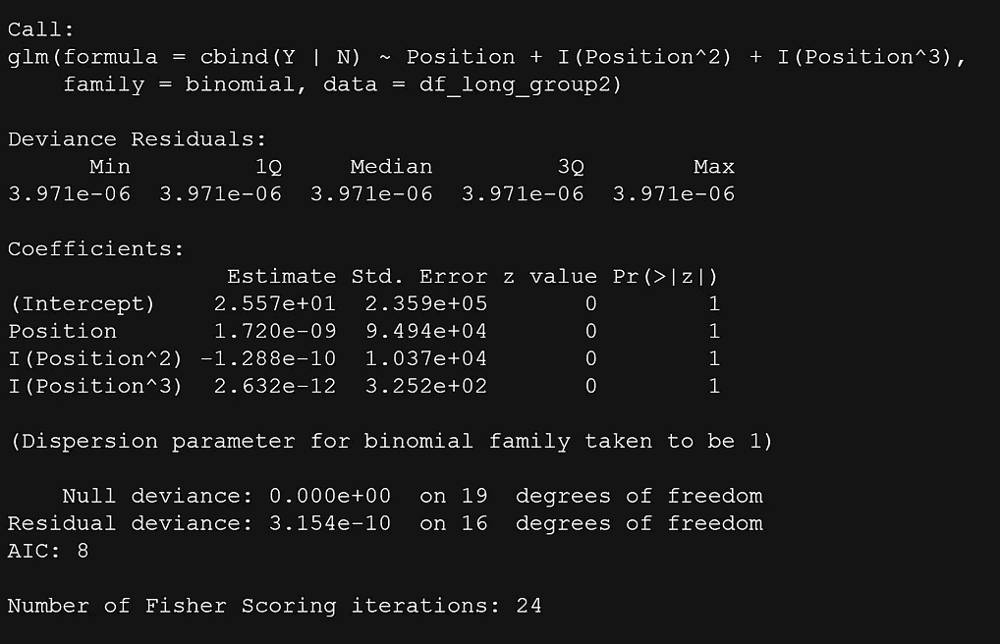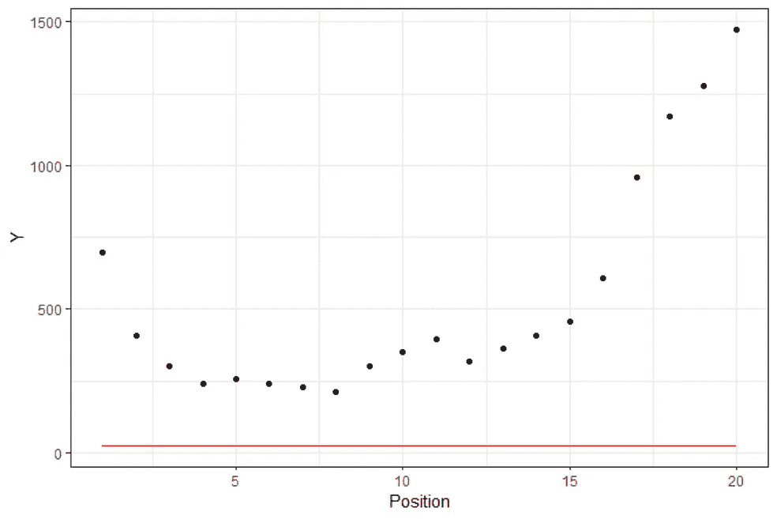

Not sure what happened, but something went wrong here. The standard errors are huge and so the fit of the model is not as it should be.

最后，我不希望使用正态分布来模拟数据，而是使用二项式。对于先验，我将为位置参数取法线，为比例/精度参数取 gamma。这些相当宽。

```
get_prior(bf(Y | trials(N) ~ 
               Position + 
               I(Position^2) + 
               I(Position^3) + 
               (1|Condition)),
          data= df_long,
          family=binomial(link = "logit"))
fit4<-brms::brm(bf(Y | trials(N) ~ 
                     Position + 
                     I(Position^2) + 
                     I(Position^3) +
                   (1|Condition)),
                data= df_long,
                family=binomial(link = "logit"),
                prior = c(
                  prior(normal(200, 50), class=Intercept),
                  prior(normal(0,10), class=b, coef=Position),
                  prior(normal(0,10),  class=b, coef=IPositionE2), 
                  prior(normal(0,10), class=b, coef=IPositionE3),
                  prior(gamma(4, 4), class=sd, group=Condition)), 
                chains=4, 
                cores=6, 
                warmup = 3000,
                iter = 6000)
summary(fit4)
pp_check(fit4, ndraws=500)
df_long %>%
  add_epred_draws(fit4, 
                  ndraws=200, 
                  allow_new_levels = TRUE) %>%
  ggplot(aes(x = Position, 
             y = Y, 
             group=Condition)) +
  geom_line(aes(y = .epred, group = paste(Condition, .draw)), alpha = 0.25, col="red") +
  geom_point(data = df_long, color="black")+
  facet_wrap(~Condition)+
  theme_bw() 
```

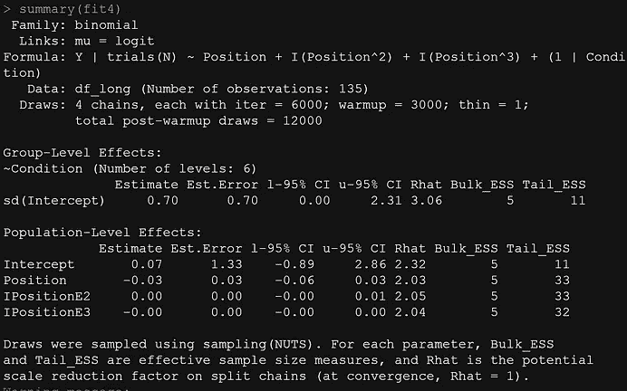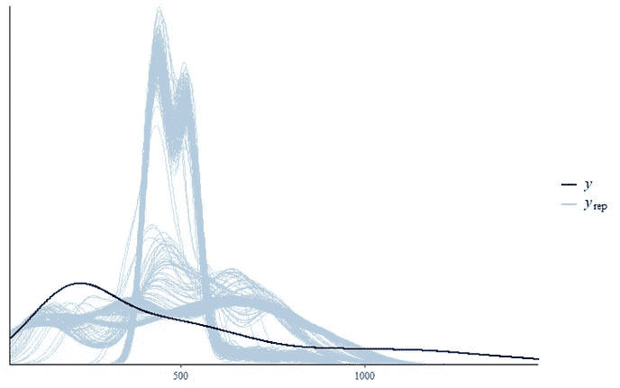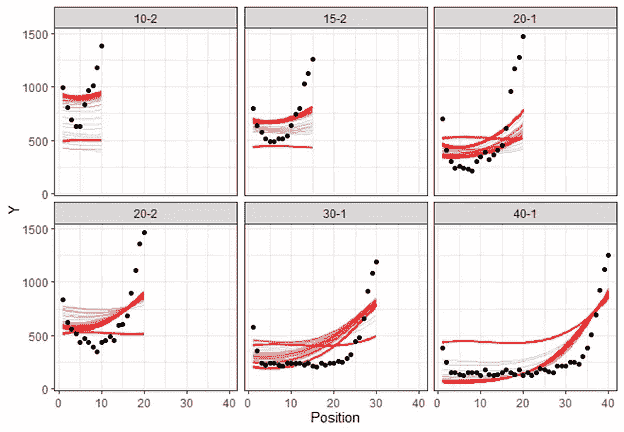

And what I get is another very strange model, nothing I can or should use.

代替多项式，我可以回复到样条，但这次我将要求模型为每个类别制作样条。这在 *brms* 中很容易完成。

```
get_prior(bf(Y | trials(N) ~ 
               s(Position, by=Condition)),
          data= df_long,
          family=binomial(link = "logit"))
```

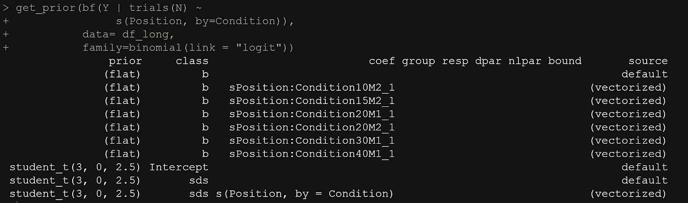

The priors I need to specify when building a spline for each condition seperately.

对于这个模型，我将坚持统一的先验。再次，这是弱贝叶斯建模，但我不成功使用多项式，所以我希望看到数据将带我去哪里。

```
fit5<-brms::brm(bf(Y | trials(N) ~ 
                     s(Position, by=Condition)),
                data= df_long,
                family=binomial(link = "logit"),
                prior = c(
                  prior(uniform(-10, 10), class=Intercept),
                  prior(uniform(-10, 10), class=b, coef=sPosition:Condition10M2_1),
                  prior(uniform(-10, 10), class=b, coef=sPosition:Condition15M2_1),
                  prior(uniform(-10, 10), class=b, coef=sPosition:Condition20M1_1),
                  prior(uniform(-10, 10), class=b, coef=sPosition:Condition20M2_1),
                  prior(uniform(-10, 10), class=b, coef=sPosition:Condition30M1_1),
                  prior(uniform(-10, 10), class=b, coef=sPosition:Condition40M1_1),
                  prior(gamma(1, 1), class=sds)), 
                chains=4, 
                cores=6, 
                warmup = 3000,
                iter = 6000)
summary(fit5)
pp_check(fit5, ndraws=500)
df_long %>%
  add_epred_draws(fit5, 
                  ndraws=200, 
                  allow_new_levels = TRUE) %>%
  ggplot(aes(x = Position, 
             y = Y, 
             group=Condition)) +
  geom_line(aes(y = .epred, group = paste(Condition, .draw)), alpha = 0.25, col="red") +
  geom_point(data = df_long, color="black")+
  facet_wrap(~Condition)+
  theme_bw()
```

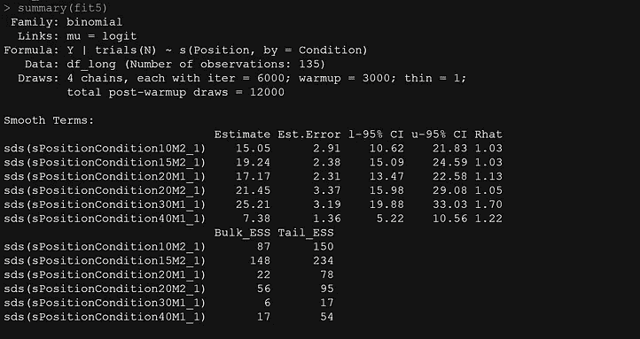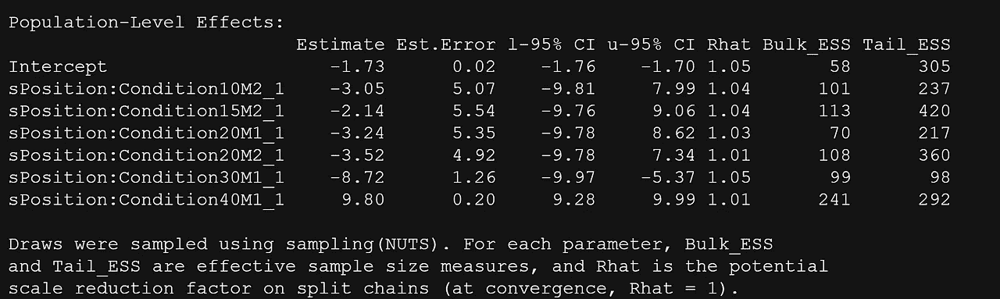

Rhats look better, but certainly not perfect.

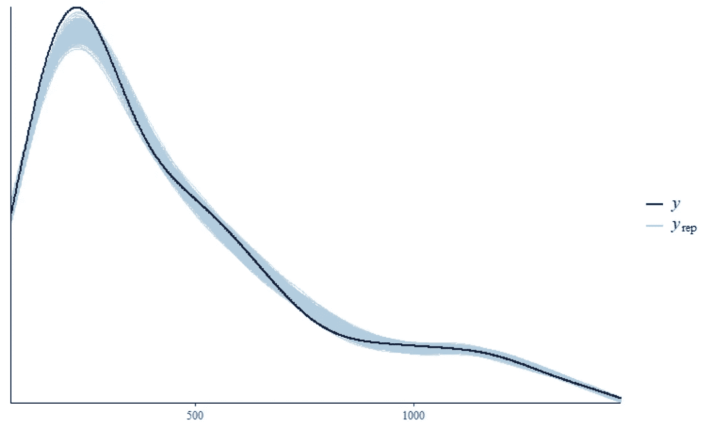

Considering the heavy Rhats I would have expected less dense sampling, but this does not look that bad to be honest.

还有预测，看起来也不错。请记住，这是完全的统计，而不是机械建模。但最终，这个模型似乎确实做到了，代价是丢失了一些参数确切含义的信息。

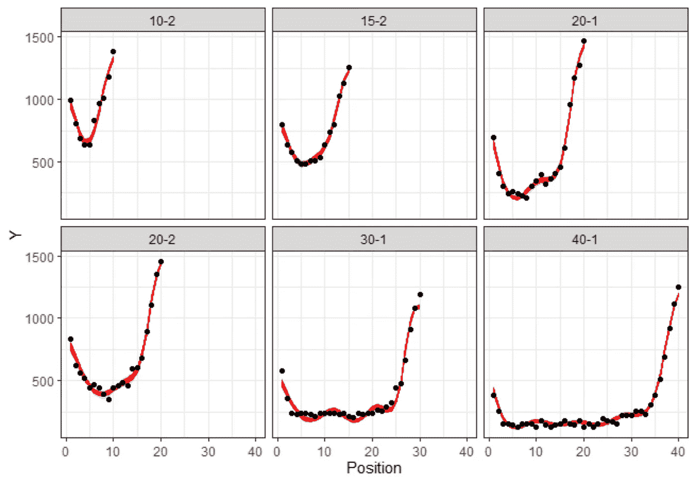

我仍然不满意，希望最后再看一眼非线性函数。让我们再来一次。

```
df_long_group2<-df_long%>%filter(Condition=="20-1")
plot(df_long_group2$Position, df_long_group2$Y)
try<-nls(Y ~ a1*exp(b1*Position)+c1, 
         data = df_long_group2,
         start = list(a1 = 1, 
                      b1 = 1,
                      c1 = 1), 
         na.action=na.exclude, 
         control=nls.control(maxiter = 1000, tol = 1e-05))
summary(try)
df_long_group2$pred<-predict(try)
ggplot(df_long_group2)+
  geom_point(aes(x=Position, 
                 y=Y))+
  geom_line(aes(x=Position, 
                y=pred, 
                group=Condition), col="red")+
  theme_bw()
```

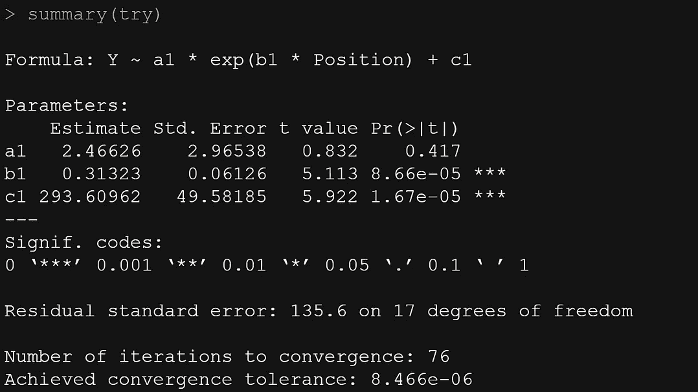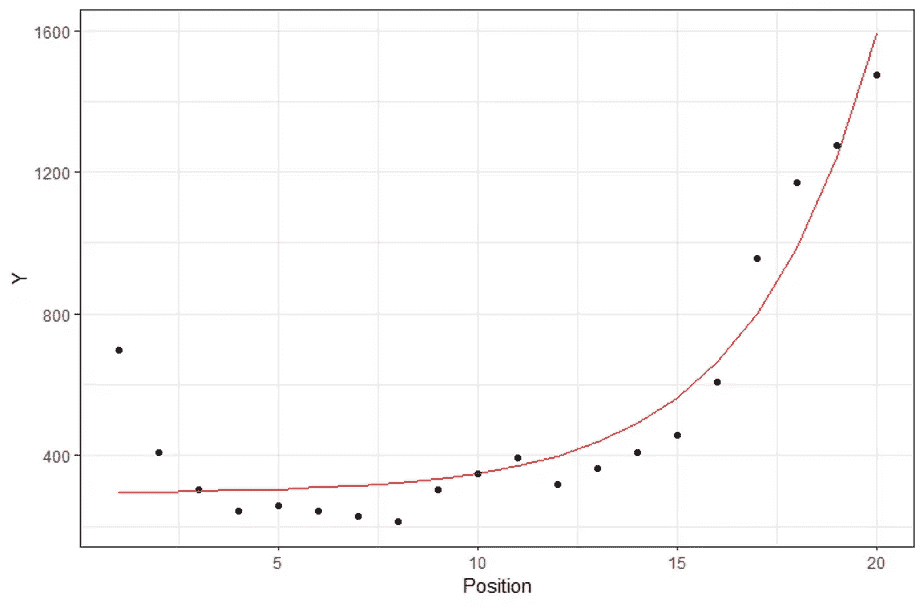

Looks very good. Not perfect, but the best one can expect. However, as you can already see, it cannot deal with the initial descent. This is because the data seem to be a combination of a power function and exponential function. I am sure that a model can be constructed, connecting them both, but that model will mostly likely be just as heavy in the parameters as the spline.

让我们在另一个条件下尝试同样的非线性函数。

```
df_long_group2<-df_long%>%filter(Condition=="40-1")
plot(df_long_group2$Position, df_long_group2$Y)
try<-nls(Y ~ a1*exp(b1*Position)+c1, 
         data = df_long_group2,
         start = list(a1 = 2, 
                      b1 = 0.5,
                      c1 = 300), 
         na.action=na.exclude, 
         control=nls.control(maxiter = 1000, tol = 1e-05))
summary(try)
df_long_group2$pred<-predict(try)
ggplot(df_long_group2)+
  geom_point(aes(x=Position, 
                 y=Y))+
  geom_line(aes(x=Position, 
                y=pred, 
                group=Condition), col="red")+
  theme_bw()
```

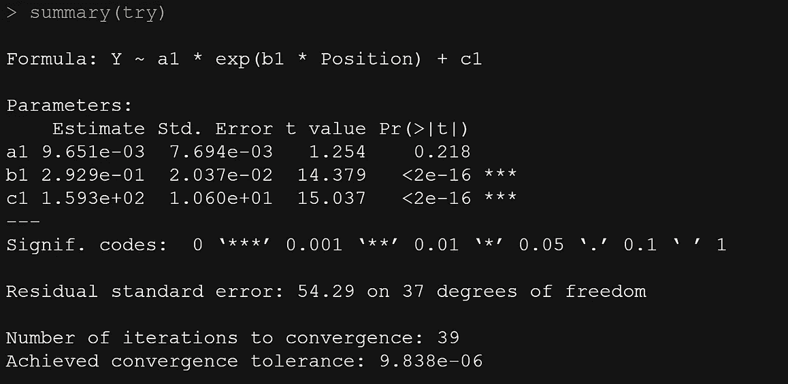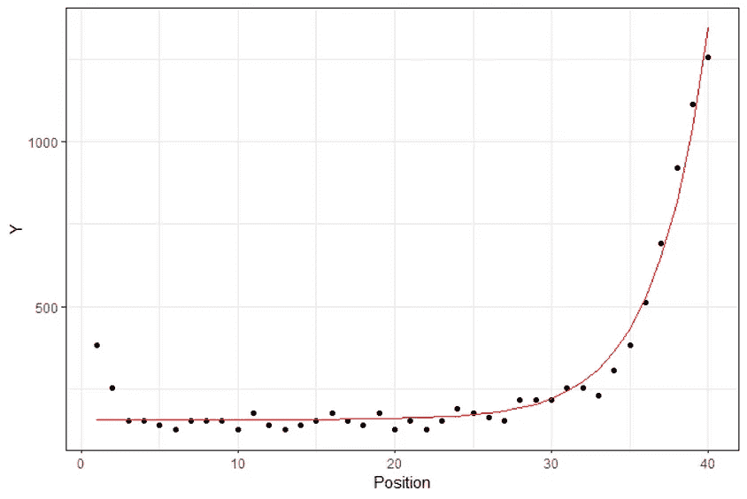

Also fits, but once again, it will not model the initial descent.

下一个挑战是将非线性函数放入贝叶斯框架。

```
get_prior(bf(Y | trials(N) ~ 
               a1*exp(b1*Position)+c1,
             a1 + b1 + c1 ~ 1, nl=TRUE),
          data= df_long,
          family=binomial(link = "logit"))
fit7<-brms::brm(bf(Y | trials(N) ~ 
                     a1*exp(b1*Position)+c1,
                   a1 + b1 + c1 ~ 1, nl=TRUE),
                data= df_long,
                family=binomial(link = "logit"),
                prior = c(
                  prior(uniform(-10, 10), class=b, coef=Intercept, nlpar = "a1"),
                  prior(uniform(-10, 10), class=b, coef=Intercept, nlpar = "b1"), 
                  prior(uniform(-400, 400), class=b, coef=Intercept, nlpar = "c1")), 
                chains=4, 
                cores=6, 
                warmup = 3000,
                iter = 6000)
summary(fit7)
df_long %>%
  add_epred_draws(fit7, 
                  ndraws=100, 
                  allow_new_levels = TRUE) %>%
  ggplot(aes(x = Position, 
             y = Y, 
             group=Condition)) +
  geom_line(aes(y = .epred, group = paste(Condition, .draw)), alpha = 0.25, col="red") +
  geom_point(data = df_long, color="black")+
  facet_wrap(~Condition)+
  theme_bw() 
```


Sampling is already taking a turn for the worst.

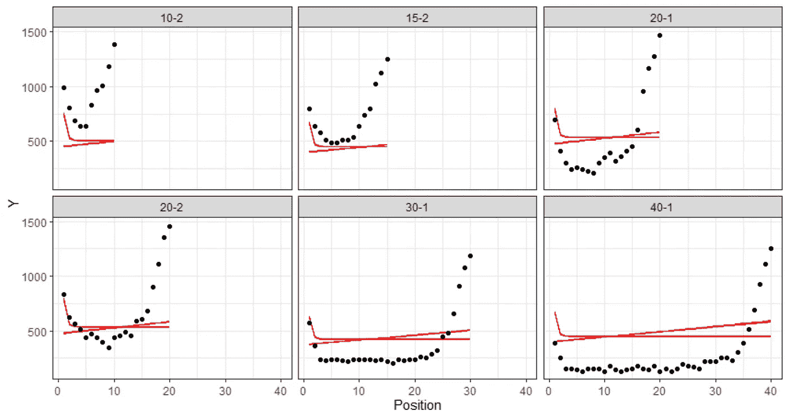

Funny enough, the Bayesian model will try and model the initial descent but then has no parameters left to model the exponential part.

下一个尝试不会增加太多，但我仍在做，就是建立一个完全非线性的混合模型，其中三个参数可以根据条件变化。对于位置参数，我使用统一的先验，对于比例，我使用伽玛。

```
fit7<-brms::brm(bf(Y | trials(N) ~ 
                     a1*exp(b1*Position)+c1,
                   a1 + b1 + c1 ~ 1 + (1|Condition), nl=TRUE),
                data= df_long,
                family=binomial(link = "logit"),
                prior = c(
                  prior(uniform(-10, 10), class=b, coef=Intercept, nlpar = "a1"),
                  prior(uniform(-10, 10), class=b, coef=Intercept, nlpar = "b1"), 
                  prior(uniform(-300, 300), class=b, coef=Intercept, nlpar = "c1"),
                  prior(gamma(1, 1), class=sd, group=Condition, nlpar = "a1"),
                  prior(gamma(1, 1), class=sd, group=Condition, nlpar = "b1"),
                  prior(gamma(1, 1), class=sd, group=Condition, nlpar = "c1")), 
                chains=4, 
                cores=6, 
                warmup = 3000,
                iter = 6000)
summary(fit7)
df_long %>%
  add_epred_draws(fit7, 
                  ndraws=100, 
                  allow_new_levels = TRUE) %>%
  ggplot(aes(x = Position, 
             y = Y, 
             group=Condition)) +
  geom_line(aes(y = .epred, group = paste(Condition, .draw)), alpha = 0.25) +
  geom_point(data = df_long, color="black")+
  facet_wrap(~Condition)+
  theme_bw()
```

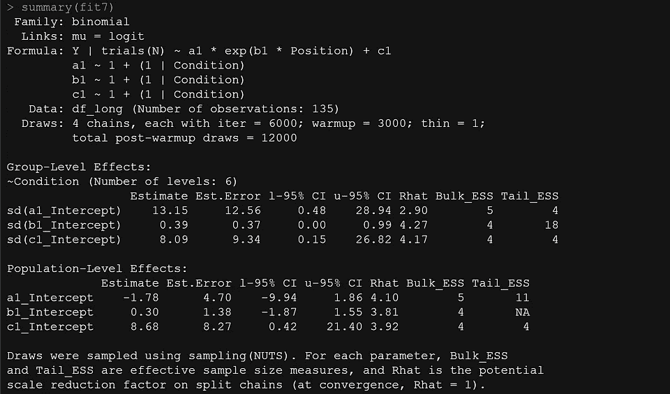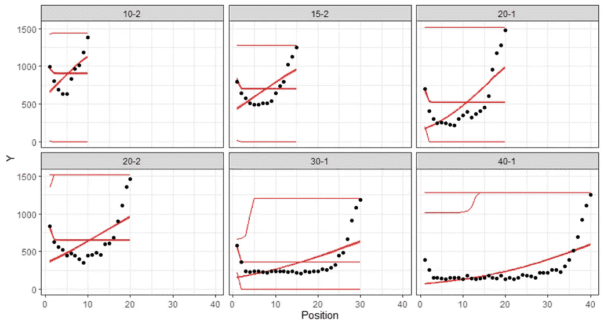

Rhats are even worse and if you look at the predictions it is best to close the graph viewer immediately. This is not helping at all.

也许有了更多的先验信息，或者在非线性函数中增加一个参数，我就可以改进这个模型，但是现在只能这样了。

最后，我将坚持使用条件样条模型，它为每个条件构建一个样条函数。这与书中的模型并不完全相同，但它仍然是一个模型。

在我的下一个系列中，我将更深入地研究 STAN 函数本身，它将提供更多的通用性。

如果有什么不对劲，或者你有什么意见，请告诉我！

[](/mlearning-ai/mlearning-ai-submission-suggestions-b51e2b130bfb) [## Mlearning.ai 提交建议

### 如何成为 Mlearning.ai 上的作家

medium.com](/mlearning-ai/mlearning-ai-submission-suggestions-b51e2b130bfb)