# 反刍动物维生素 E 模型

> 原文：<https://medium.com/mlearning-ai/modelling-vitamin-e-in-ruminants-6679cd49cad2?source=collection_archive---------10----------------------->

## 在 R 中寻找正确的(非线性)线性混合模型

这不是我第一次发表关于使用非线性混合模型的文章。如果你了解我，你会知道我经常使用[混合型号](/mlearning-ai/introduction-to-mixed-models-in-r-9c017fd83a63)。我尤其喜欢[非线性变量](/mlearning-ai/non-linear-mixed-model-in-r-a6fc054c3f82)，因为它们提供了一套独特的可能性和挑战。今天我要写一个我参与的老项目，使用商业数据，模拟反刍动物的维生素 E。不幸的是，我不能分享这些数据，但我能做的是尽可能突出我在那个项目中所做的。

让我们从加载我将使用的库开始。对于非线性混合模型， [**nlme**](https://cran.r-project.org/web/packages/nlme/nlme.pdf) 包是您的主力。虽然它已经存在很多年了，但它的功能从来没有让我惊讶过。

```
rm(list = ls())#### Libraries #####
library(lme4)
library(ggplot2)
library(nlme)
library(MASS)
library(nls2)
library(nlstools)
library(car)
library(lattice)
library(plotBy)
library(boot)
library(gplots)
library(sjPlot)
library(sjmisc)
library(sjstats)
library(plyr)
library(splines)
library(glmmLasso)
library(lmerTest)
library(merTools)
library(piecewiseSEM)
library(influence.ME)
library(AICcmodavg)
library(bbmle) 
library(minpack.lm)
```

然后，加载数据并进行必要的转换。

```
#### Import data ####
VitaminE <- read.csv("VitaminE.csv")
VitaminE$Treat<-paste(VitaminE$SOURCE, VitaminE$DOSE)
VitaminE$ID<-paste(VitaminE$ROUND, VitaminE$PEN)
length(unique(VitaminE$ID)) # 36 unique lines
VitaminE$Treat<-as.factor(VitaminE$Treat)
VitaminE$ROUND<-as.factor(VitaminE$ROUND)
VitaminE$TIME2<-VitaminE$TIME-1
VitaminE$y<-VitaminE$TBARS
VitaminE$s<-VitaminE$SYN
VitaminE$n<-VitaminE$NAT#### Summarizing DATA ####
ddply(VitaminE, c("TIME2"), summarise,
      N = sum(!is.na(TBARS)),
      Mis = sum(is.na(TBARS)),
      Mean = round(mean(TBARS, na.rm=T),3),
      Median = round(median(TBARS, na.rm=T),3),
      SD = round(sd(TBARS, na.rm=T),3),
      SE = round(sd(TBARS, na.rm=T) / sqrt(N),5),
      LCI = round(Mean - (2*SE),3), 
      HCI = round(Mean + (2*SE),3))
```

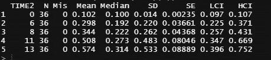

This is how the data looks, summarized

这是数据的图表。很明显，如果你想用一个非线性公式来建模，你需要以一种特殊的方式来看待它。

```
xyplot(TBARS~TIME|Treat, data=VitaminE)
xyplot(TBARS~DOSE, data=VitaminE)
xyplot(TBARS~DOSE|TIME, data=VitaminE)
xyplot(TBARS~TIME, data=VitaminE)
xyplot(TBARS~DOSE|SOURCE, data=VitaminE)
plot(VitaminE$DOSE,VitaminE$TBARS)
plot(VitaminE$TIME,VitaminE$TBARS)
```

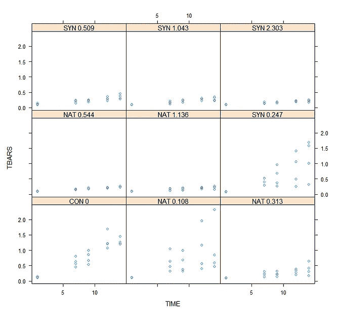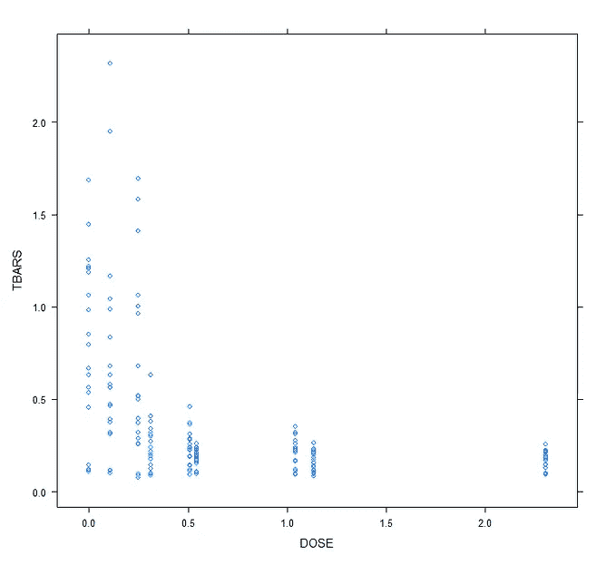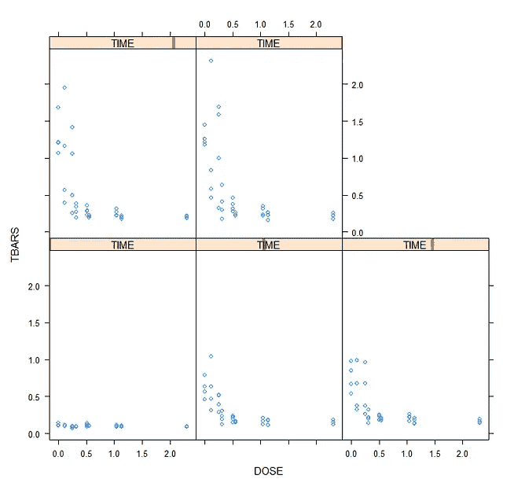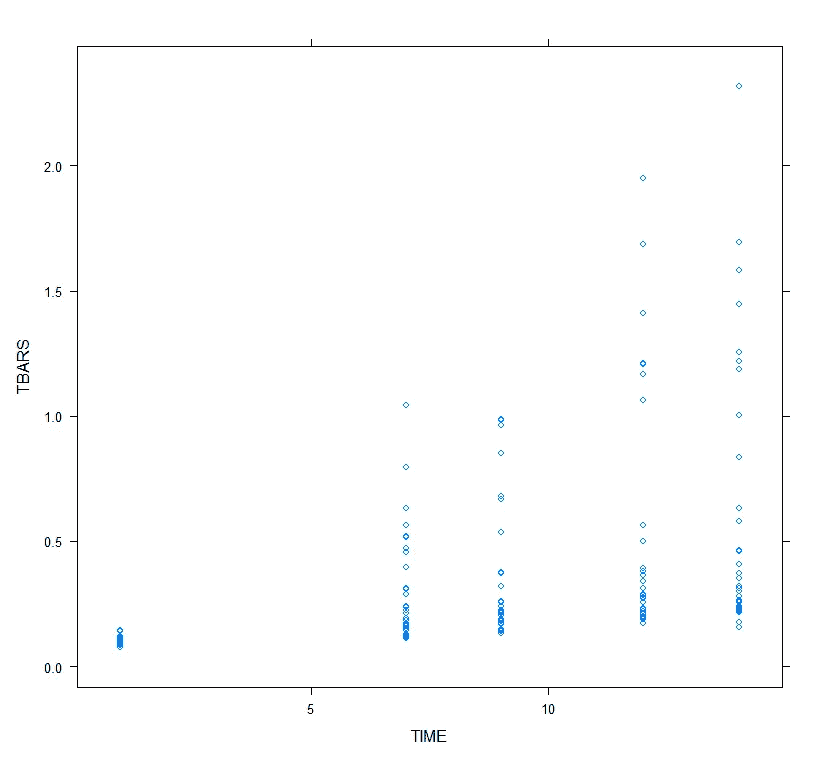

和更多的情节。

```
ggplot(VitaminE, aes(DOSE, TBARS, colour=SOURCE)) + 
  geom_point() +
  theme_bw()ggplot(VitaminE, aes(TIME, TBARS, colour=Treat, group=ID)) + 
  geom_point() +
  geom_line()+
  theme_bw()ggplot(VitaminE, aes(TIME, TBARS, colour=SOURCE, group=ID)) + 
  geom_point() +
  geom_line()+
  theme_bw()theme_set(theme_bw())
myx<-scale_x_continuous(breaks=c(1,7,9,12,14))
myy<-scale_y_continuous(breaks = seq(0,2.5, by = 0.2), limits = c(0,2.5))
ggplot(VitaminE, aes(x=TIME, y=TBARS, group=ID, colour=Treat))+
  myx+
  myy+
  geom_line(colour="grey80") +
  stat_summary(aes(group=Treat), fun.y=mean, geom="point", size=3.5)+
  stat_summary(aes(group=Treat), fun.y=mean, geom="line", lwd=1.5)theme_set(theme_bw())
myx<-scale_x_continuous(breaks=c(1,7,9,12,14))
myy<-scale_y_continuous(breaks = seq(0,2.5, by = 0.2), limits = c(0,2.5))
ggplot(VitaminE, aes(x=TIME, y=TBARS, group=ID, colour=SOURCE))+
  myx+
  myy+
  geom_line(colour="grey80") +
  stat_summary(aes(group=SOURCE), fun.y=mean, geom="point", size=3.5)+
  stat_summary(aes(group=SOURCE), fun.y=mean, geom="line", lwd=1.5)ggplot(VitaminE, aes(x=TIME, y=TBARS, group=ID))+
  myx+
  myy+
  geom_line(colour="grey80")theme_set(theme_bw())
myx<-scale_x_continuous(breaks=c(1,7,9,12,14))
myy<-scale_y_continuous(breaks = seq(0,2.5, by = 0.2), limits = c(0,2.5))
ggplot(VitaminE, aes(x=TIME, y=TBARS, group=ID, colour=DOSE))+
  myx+
  myy+
  geom_line()## Effect of Round
theme_set(theme_bw())
myx<-scale_x_continuous(breaks=c(1,7,9,12,14))
myy<-scale_y_continuous(breaks = seq(0,2.5, by = 0.2), limits = c(0,2.5))
ggplot(VitaminE, aes(x=TIME, y=TBARS, group=ID, colour=as.factor(ROUND)))+
  myx+
  myy+
  geom_line() +
  stat_summary(aes(group=ROUND), fun.y=mean, geom="point", size=3.5)+
  stat_summary(aes(group=ROUND), fun.y=mean, geom="line", lwd=1.5)## Effect of Sex
theme_set(theme_bw())
myx<-scale_x_continuous(breaks=c(1,7,9,12,14))
myy<-scale_y_continuous(breaks = seq(0,2.5, by = 0.2), limits = c(0,2.5))
ggplot(VitaminE, aes(x=TIME, y=TBARS, group=ID, colour=as.factor(SEX)))+
  myx+
  myy+
  geom_line() +
  stat_summary(aes(group=SEX), fun.y=mean, geom="point", size=3.5)+
  stat_summary(aes(group=SEX), fun.y=mean, geom="line", lwd=1.5)## Effect of Pen
theme_set(theme_bw())
myx<-scale_x_continuous(breaks=c(1,7,9,12,14))
myy<-scale_y_continuous(breaks = seq(0,2.5, by = 0.2), limits = c(0,2.5))
ggplot(VitaminE, aes(x=TIME, y=TBARS, group=ID, colour=as.factor(PEN)))+
  myx+
  myy+
  geom_line()sjp.poly(VitaminE$TBARS,VitaminE$TIME, 1) 
sjp.poly(VitaminE$TBARS,VitaminE$TIME, 2)
sjp.poly(VitaminE$TBARS,VitaminE$TIME, 3)
```

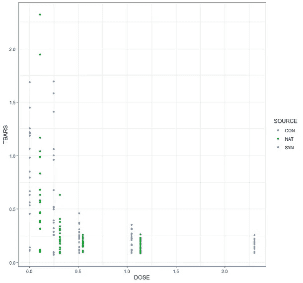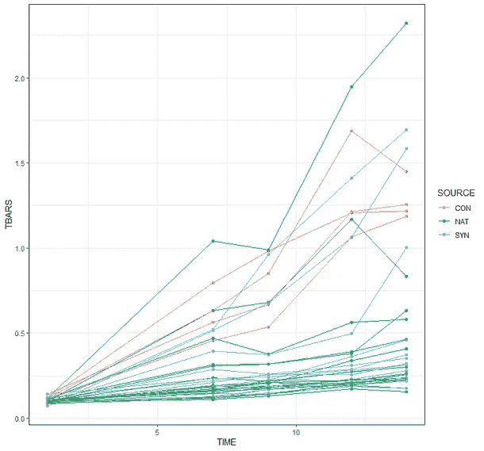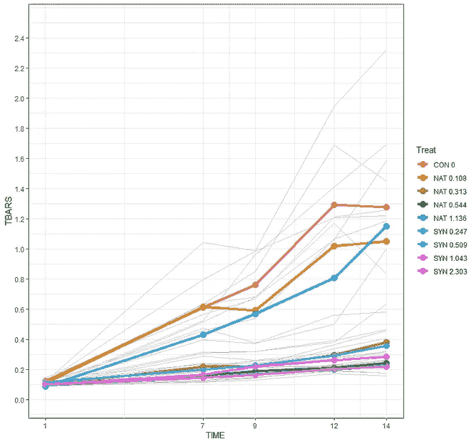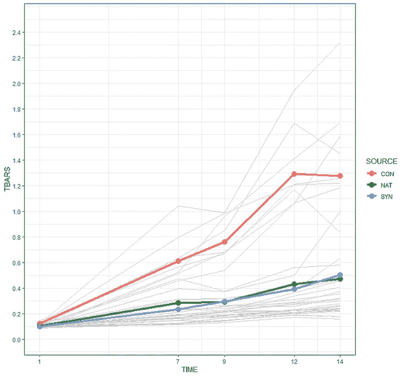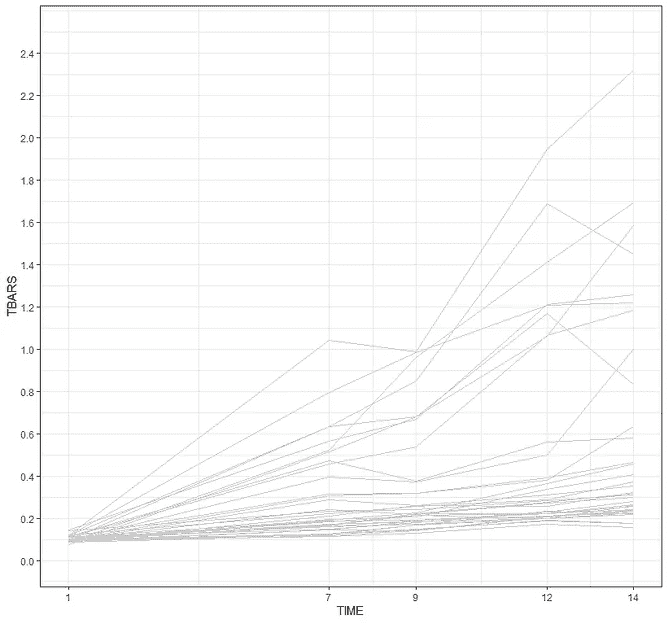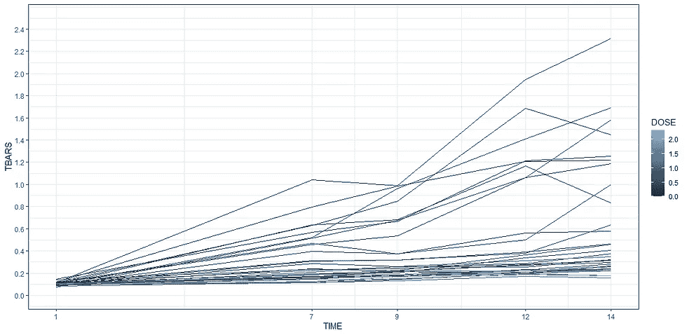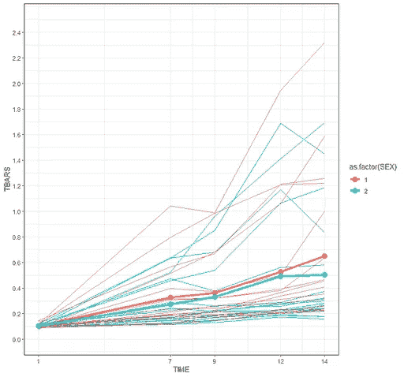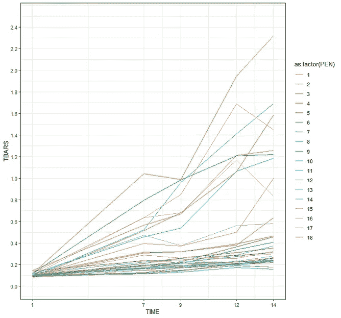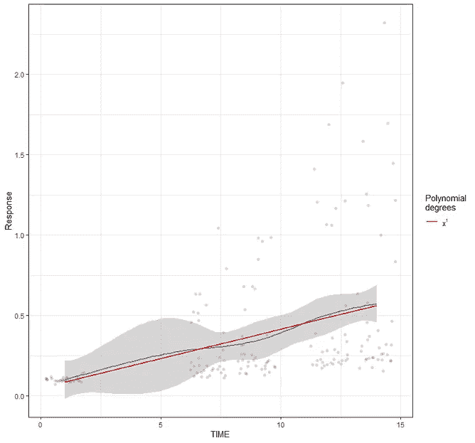

现在我将转移到 work horse，即 **nls** 和 **nlme** 包，后者是混合模式版本。我想运行的公式是这样的:

```
formuTBARS<-as.formula(y~a1+I(b1*TIME2/(exp(b2*SYN+b3*NAT))))
```

首先，我将使用 nls 包来运行一个简单的非线性模型，不包括随机组件。

```
try<-nls(formula=TBARS~a1+I(b1*TIME2/(exp(b2*SYN+b3*NAT))),
         start=list(a1=0.116,b1=0.100,b2=2.363,b3=4.2614),
         data=VitaminE)
summary(try)
plot_model(try)# Manual formula works --> seems to be quite a fit even 
0.101+I(0.092*8/(exp(0.023*0.25+0*0)))attach(VitaminE)
try2<-nlsLM(formula=TBARS~a1+I(b1*TIME2/(exp(b2*SYN+b3*NAT))),
      start=list(a1=0.116,b1=0.100,b2=2.363,b3=4.2614),
      data=VitaminE)
summary(try2)
plot(try2) 
pr<-profile(try2) 
confint(try2)
VitaminE$pred<-predict(try2)
plot(VitaminE$TBARS, VitaminE$pred, col=c(1,2))
qqnorm(try2) 
AIC(try2)
```

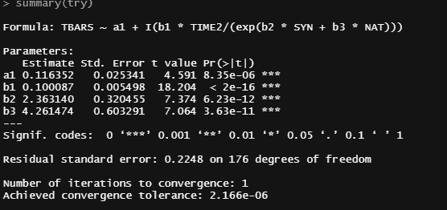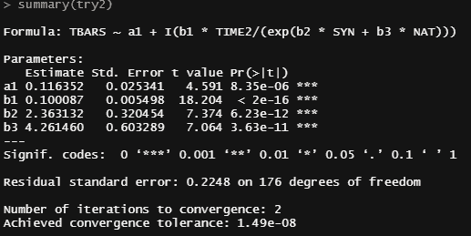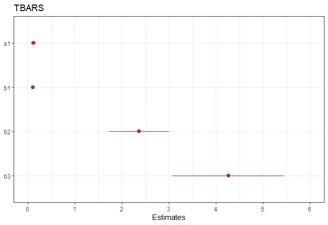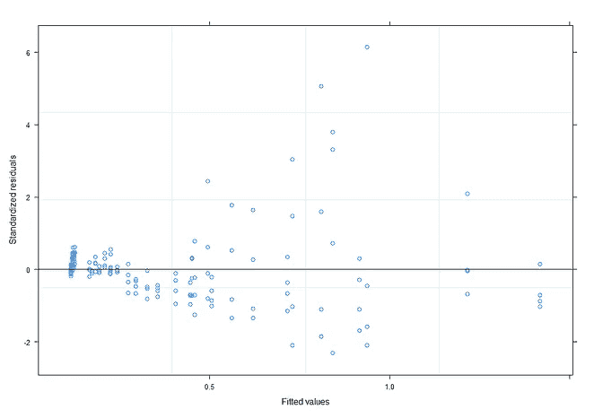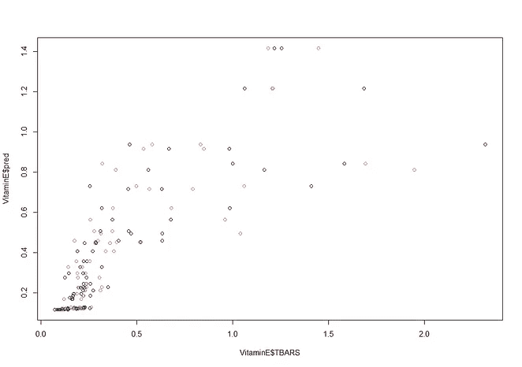

Residuals are not that great although the formula does seem to capture the gist of the model

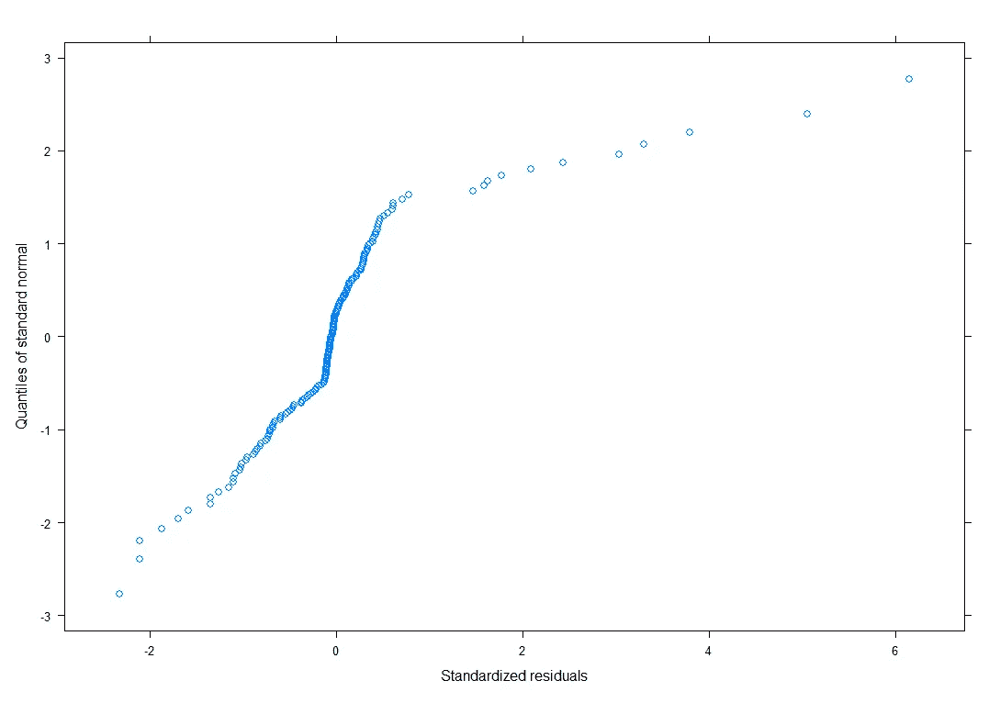

Not how I would like it to be

```
theme_set(theme_bw())
myx<-scale_x_continuous(breaks=c(0,6,8,11,13))
myy<-scale_y_continuous(breaks = seq(0,2.5, by = 0.5), limits = c(0,2.5))
ggplot(VitaminE, aes(x=TIME2, y=TBARS, group=ID, shape=Treat, colour=Treat))+
  myx+
  myy+
  scale_shape_manual(values=1:(nlevels(VitaminE$Treat)+1))+
  stat_summary(aes(group=Treat), fun.y=mean, geom="point", size=2.5)+
  geom_line(aes(y=fitted(try2)), lwd=1, alpha=0.8)+
  facet_grid(~Treat)
```

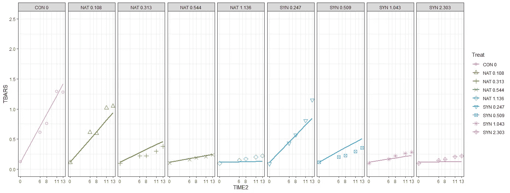

Its not bad. Its not great either, but its not bad. The linear line though does hint at the unnecessary move towards a non-linear model

让我们尝试不同的非线性模型并进行比较。

```
try3<-nlsLM(formula=TBARS~a1+b1*TIME2+I(b2*TIME2^2)/(exp(b3*SYN+b4*NAT)),
            start=list(a1=0.1,b1=0.04,b2=0.04,b3=2.363,b4=4.2614),
            data=VitaminE)try4<-nlsLM(formula=TBARS~a1+I((b1*TIME2)/(exp(b2*SYN+b3*NAT))),
            start=list(a1=0.116,b1=0.100,b2=2.363,b3=4.2614),
            data=VitaminE)anova(try,try2,try3,try4)plot(try2) 
```

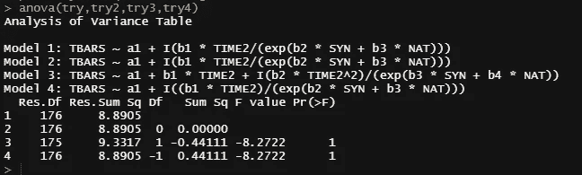

First model seems best still.

是否有一些有影响的观察结果会使非线性公式变得更加困难？我们可以使用刀切法，逐个删除观测值，然后重新调整模型。

```
try2.jack<-nlsJack(try2)
summary(try2.jack)
plot(try2.jack)
```

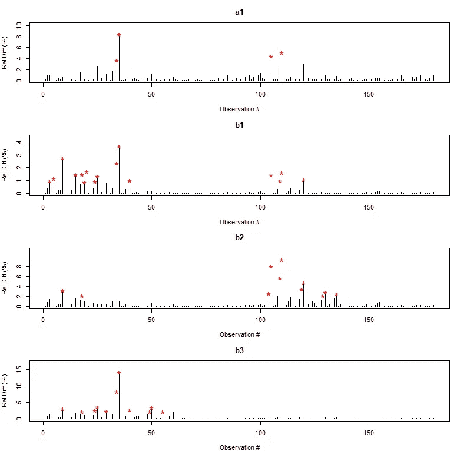

There are some observations that influence the parameters. Of course this can also in general be due to a small sample size.

让我们来看看这些预测器是如何相互关联的。大的相关性将暗示使用更简单的模型，因为增加的参数实际上没有增加任何东西。

```
try2.conf1 <- nlsConfRegions(try2,length = 2000) 
plot(try2.conf1)
try2.surf<-nlsContourRSS(try2)
plot(try2.surf, col=FALSE, nlev=10)
```

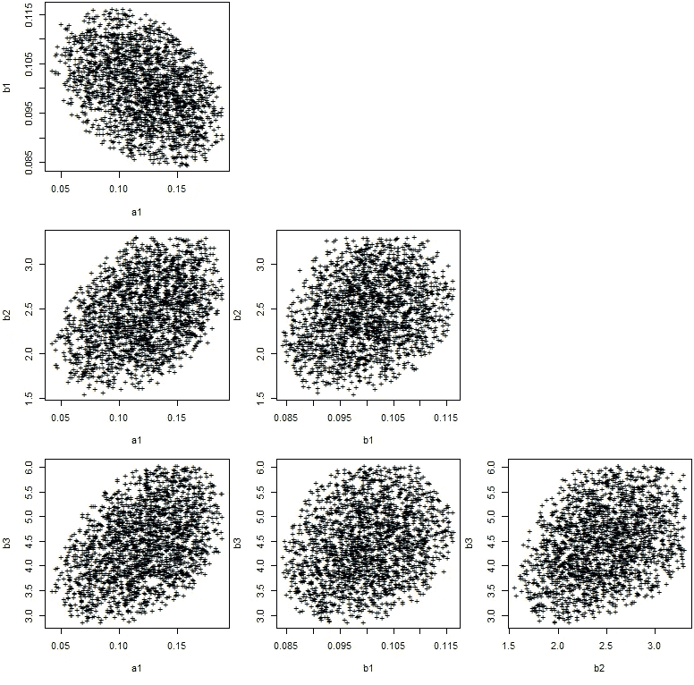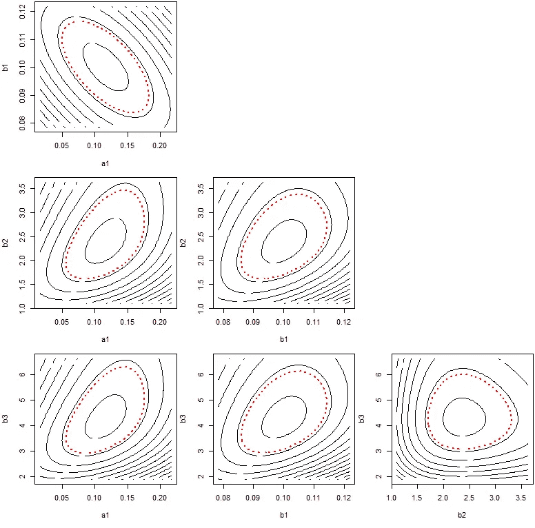

Seems O.K. to me.

当然还有预测和拟合图。

```
## Observed vs fitted
plot(VitaminE$TBARS, fitted(try2), col=c(1,2), pch=c(1,2)); abline(a=0,b=1)
plot(VitaminE$TBARS, fitted(fit12), col=c(1,2), pch=c(1,2)); abline(a=0,b=1) # as comparison, the polynomial model
```


Not bad, but also not very good. The problem is in the curve of the model, especially at larger values of TBARS. This is what happens frequently when value increase and the variance increases with it. Then it becomes more difficult to model.

如果你真的了解我，你会知道我就是喜欢自举。因此，让我们启动模型的参数。

```
## Confidence intervals
# Profiled
confint(try2)
# Bootstrapped
try2_boot<-nlsBoot(try2, niter=5000)
summary(try2_boot)
plot(try2_boot, type="boxplot")
```

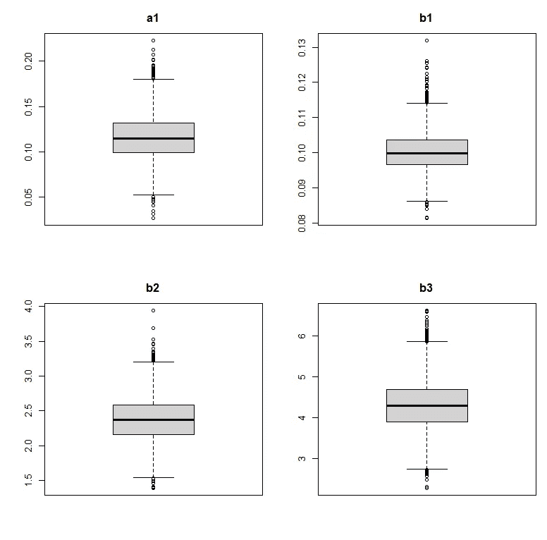

Bootstrapping does not reveal strange results, but the spread does for sure lead to different curves.

应用 bootsraps 的另一种方法是将其应用于模型本身，并观察平方和的平方根和均方误差在 bootsraps 之间如何变化。

```
b<-10000
RSS<-matrix(nrow=b, ncol=1)
RSME<-matrix(nrow=b, ncol=1)
n<-nrow(VitaminE)
frac <- 0.9
for(i in 1:b){
ix<-sample(n, frac*n) # indexes of in sample rows
VitaminE.out<-VitaminE[-ix, ] # out of sample data
pred<-predict(try2, new=VitaminE.out)
act<- VitaminE.out$TBARS
RSS[i]<-sum((pred-act)^2)
RSME[i]<-sqrt(RSS[i]/length(VitaminE.out))
}
hist(RSS, breaks=100, prob=T); lines(density(RSS), col="red", lwd=2)
hist(RSME,breaks=100, prob=T); lines(density(RSME), col="red", lwd=2)
```

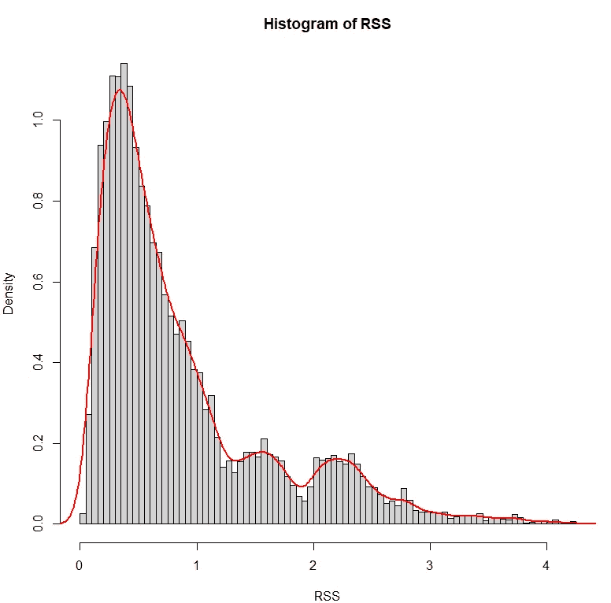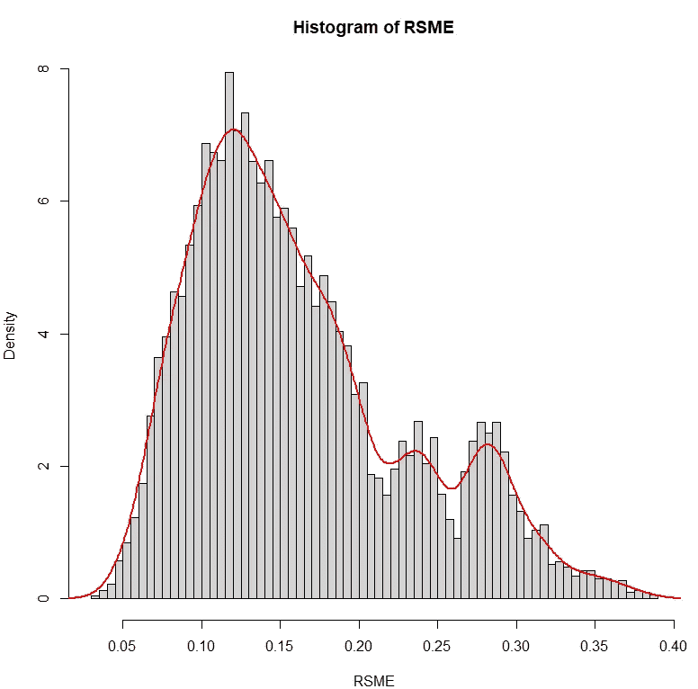

The findings are for not as clear cut and can differ quite a lot. These are not small changes!

虽然我喜欢非线性模型，但我怀疑它们是否适用于这个数据集。如果基础数据不能真正由非线性公式近似，模型将很少收敛或者收敛是易变的。此外，非线性公式在某种程度上被固定在它需要建模的曲线上。如果曲线不存在，则拟合不是最佳。

因此，让我们看看是否可以使用一个线性混合模型来处理数据，我将从运行其中几个开始。实际上最好的方法是指定完整的模型，然后使用类似 [**drop1**](https://ssc.wisc.edu/sscc/pubs/R_intro/book/4-4-variable-selection-functions.html) 这样的函数，但是在这里给我。

```
options(scipen = 3)
fit<-lme4::lmer(TBARS~TIME2+(1|ID), data=VitaminE,REML=FALSE)
fit2<-lme4::lmer(TBARS~TIME2+(TIME2|ID), data=VitaminE,REML=FALSE) # perfect correlation random intercept + random slope
fit3<-lme4::lmer(TBARS~TIME2+(1|ID)+(0+TIME2|ID), data=VitaminE,REML=FALSE)
fit4<-lme4::lmer(TBARS~TIME2*Treat+(1|ID)+(0+TIME2|ID), data=VitaminE,REML=FALSE) 
# fit5<-lme4::lmer(TBARS~TIME*Treat+SOURCE+ROUND+(1|ID)+(0+TIME|ID), data=VitaminE,REML=FALSE) # rank defficient 
# fit6<-lme4::lmer(TBARS~TIME*Treat+SOURCE+(0+TIME|ID), data=VitaminE,REML=FALSE) # rank defficient because treat already in source 
fit7<-lme4::lmer(TBARS~poly(TIME2,2)*Treat+(0+poly(TIME2,2)|ID), data=VitaminE,REML=FALSE) 
fit8<-lme4::lmer(TBARS~poly(TIME2,2)+Treat+(1+poly(TIME2,2)|ID), data=VitaminE,REML=FALSE) 
fit9<-lme4::lmer(TBARS~poly(TIME2,2)+DOSE+SOURCE+(1+poly(TIME2,2)|ID), data=VitaminE,REML=FALSE) 
fit10<-lme4::lmer(TBARS~poly(TIME2,2)+DOSE+SOURCE+(0+poly(TIME2,2)|ID), data=VitaminE,REML=FALSE) # random intercept needs to be in
fit11<-lme4::lmer(TBARS~poly(TIME2,2)+DOSE+SOURCE+(1|ID)+(0+poly(TIME2,2)|ID), data=VitaminE,REML=FALSE) # dropping correlation definitly 
fit12<-lme4::lmer(TBARS~poly(TIME2,2)*Treat+(1+poly(TIME2,2)|ID), data=VitaminE,REML=FALSE) 
fit13<-lme4::lmer(TBARS~poly(TIME2,2)*Treat+SEX+ROUND+(1+poly(TIME2,2)|ID), data=VitaminE,REML=FALSE)# Comparing models
anova(fit8, fit9, fit12, fit13)
mynames<-c("1","2","3","4","7","8","9", "10", "11", "12", "13")
myaicc<-as.data.frame(aictab(cand.set=list(fit,fit2,fit3,fit4,fit7,fit8,fit9, fit10, fit11, fit12, fit13), modnames=mynames))[, -c(5,7)]
myaicc$eratio<-max(myaicc$AICcWt)/myaicc$AICcWt
data.frame(Model=myaicc[,1],round(myaicc[, 2:7],4))
```

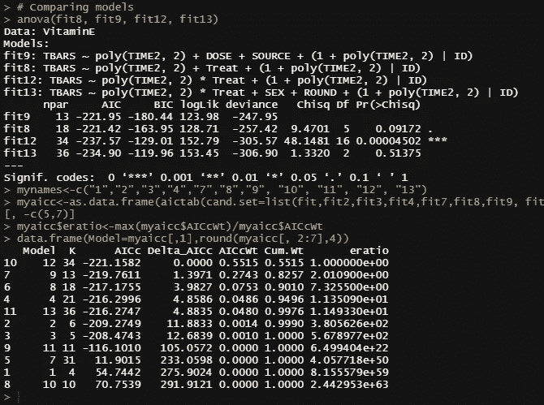

Model 12 seems to be thes best fit, so lets evaluate model 12.

```
## Diagnostics
xyplot(ranef(fit8))
bwplot(VitaminE$ID~resid(fit9))
bwplot(VitaminE$Treat~resid(fit9))summary(fit12)
plot(fit12) 
ranef(fit12)
plot(acf(resid(fit12))) # autocorrelation second lag# Plot fitted model
theme_set(theme_bw())
myx<-scale_x_continuous(breaks=c(0,6,8,11,13))
myy<-scale_y_continuous(breaks = seq(0,2.5, by = 0.5), limits = c(0,2.5))
ggplot(VitaminE, aes(x=TIME2, y=TBARS, group=ID, shape=Treat, colour=Treat))+
  myx+
  myy+
  scale_shape_manual(values=1:(nlevels(VitaminE$Treat)))+
  # geom_point(aes(group=Treat))+
  stat_summary(aes(group=Treat), fun.y=mean, geom="point", size=2.5)+
  stat_summary(aes(y=fitted(fit12), group=Treat),fun.y=mean, geom = "line")+
  facet_grid(~Treat)
```

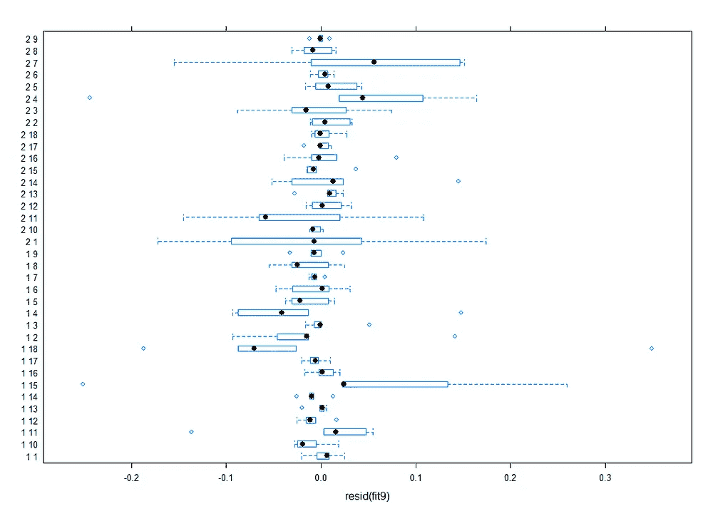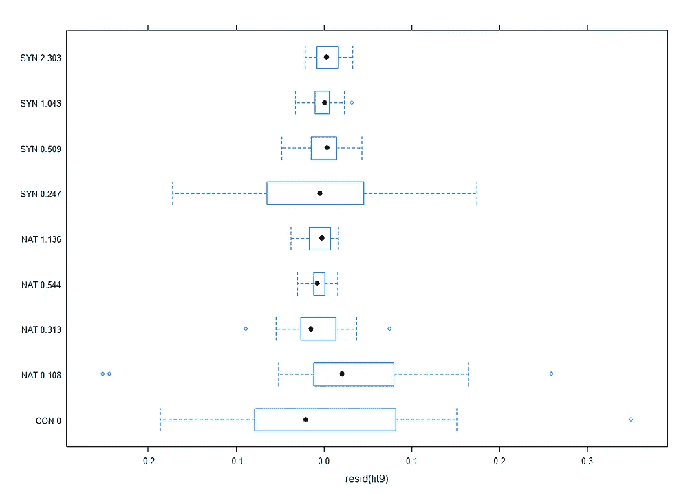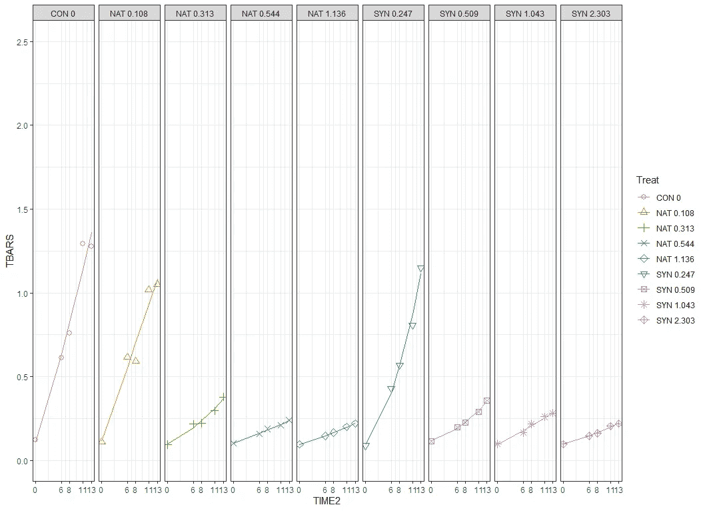

Looking good!

现在，lme4 软件包真正不擅长的事情之一是为模型的误差部分合并协方差结构。这是建立 dependt 数据模型所需要的，并且您希望将 LSMEANS 从该模型中取出。因此，我将转向 **lme** 包，它是 **nlme** 包的线性混合模型系列成员，用于建模自相关和异方差。

首先，一个简单的模型，看它是否合适。

```
Grouped<-groupedData(TBARS~TIME|ID,
                     data=VitaminE,
                     FUN=mean)
fit12nlme<-lme(TBARS~poly(TIME2,2)*Treat,
              random=~1+poly(TIME2,2),
              data=Grouped,
              method="ML", 
              control=lmeControl(opt="optim", maxIter=10000, msMaxIter = 1000))
bwplot(VitaminE$Treat~resid(fit12))
bwplot(VitaminE$Treat~resid(fit12nlme))
plot(augPred(fit12nlme, level=c(0,1)))
```

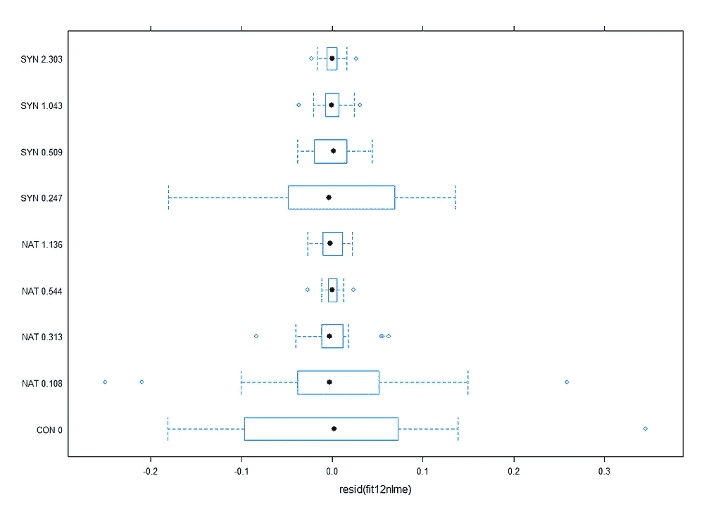

Not great at all.

因此，如果我想以线性方式对数据建模，让数据驱动决策，而不是非线性公式，也许最好是我先好好看看数据本身。使用图表。很多都是。

```
theme_set(theme_bw())
myx<-scale_x_continuous(breaks=c(1,7,9,12,14))
myy<-scale_y_continuous(breaks = seq(0,20, by = 1), limits = c(0,20))
ggplot(VitaminE, aes(x=TIME, y=a, group=ID, colour=Treat))+
  myx+
  myy+
  geom_line(colour="grey80") +
  stat_summary(aes(group=Treat), fun.y=mean, geom="point", size=3.5)+
  stat_summary(aes(group=Treat), fun.y=mean, geom="line", lwd=1.5)ggplot(VitaminE, aes(x=TIME, y=a, group=ID, colour=SOURCE))+
  myx+
  myy+
  geom_line(colour="grey80") +
  stat_summary(aes(group=SOURCE), fun.y=mean, geom="point", size=3.5)+
  stat_summary(aes(group=SOURCE), fun.y=mean, geom="line", lwd=1.5)ggplot(VitaminE[VitaminE$SOURCE=="NAT",], aes(x=TIME, y=a, group=ID, colour=Treat))+
  myx+
  myy+
  geom_line(colour="grey80") +
  stat_summary(aes(group=Treat), fun.y=mean, geom="point", size=3.5)+
  stat_summary(aes(group=Treat), fun.y=mean, geom="line", lwd=1.5)ggplot(VitaminE[VitaminE$SOURCE=="SYN",], aes(x=TIME, y=a, group=ID, colour=Treat))+
  myx+
  myy+
  geom_line(colour="grey80") +
  stat_summary(aes(group=Treat), fun.y=mean, geom="point", size=3.5)+
  stat_summary(aes(group=Treat), fun.y=mean, geom="line", lwd=1.5)### Linear vs non-linear
sjp.poly(VitaminE$a,VitaminE$TIME, 1) # best to approach it in a linear way 
sjp.poly(VitaminE$a,VitaminE$TIME, 2)
sjp.poly(VitaminE$a,VitaminE$TIME, 3)ggplot(VitaminE, aes(x=TIME, y=a, group=ID))+
  myx+
  myy+
  geom_line(colour="grey80") +
  stat_smooth(aes(group=1),col="red", method = lm, formula = y~ns(x,2), se=FALSE, lwd=1.5) +
  stat_smooth(aes(group=1),col="darkgreen", method = lm, formula = y~poly(x,2), se=FALSE, lwd=1.5) +
  stat_smooth(aes(group=1),col="blue", method = lm, formula = y~x, se=FALSE, lwd=1.5)
```

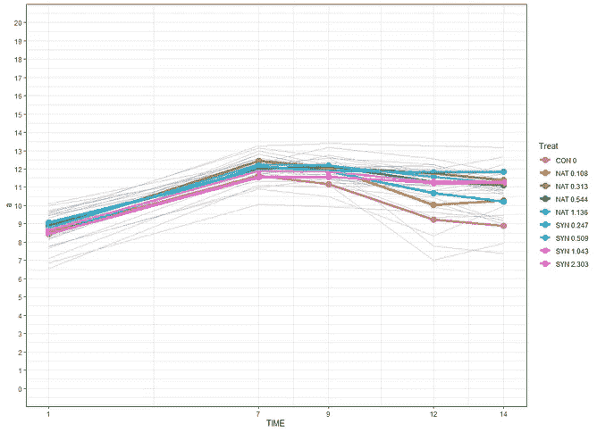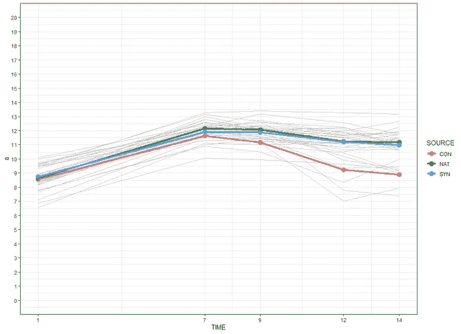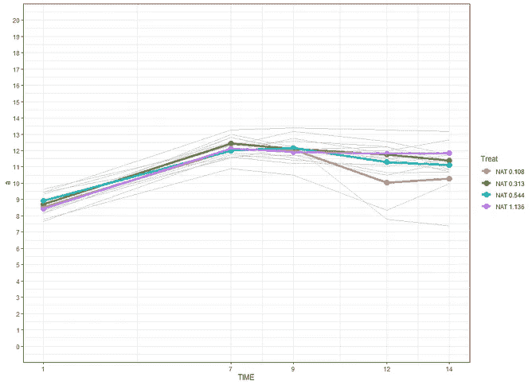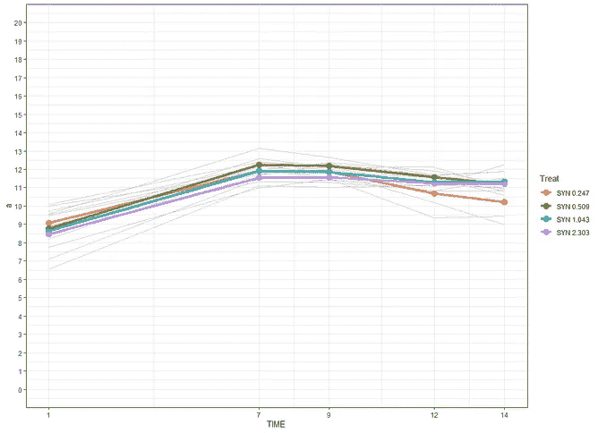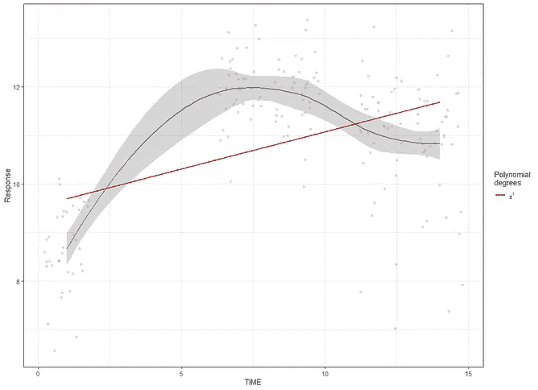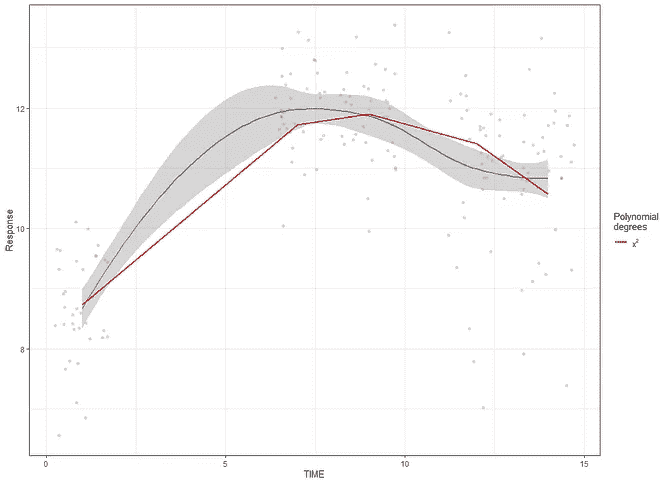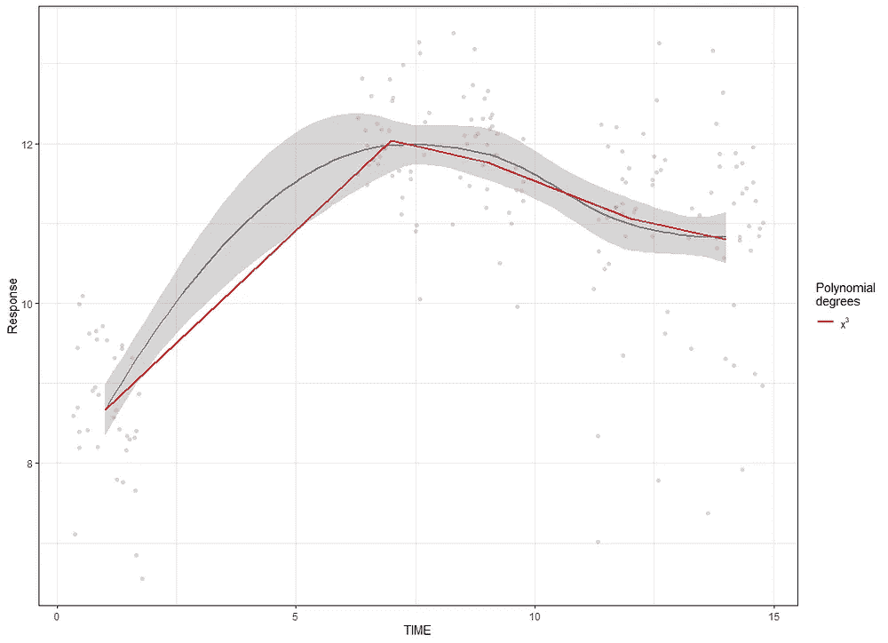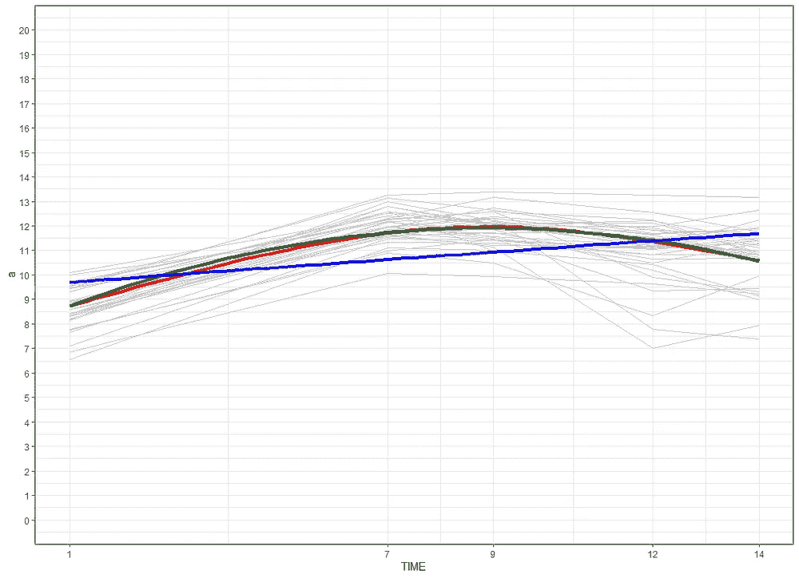

For sure a need to incorporate splines or polynomials. I prefer splines.

还有另一套模型可以试用。

```
VitaminE$TIME2<-VitaminE$TIME-1
fit<-lmer(a~TIME2*Treat+ROUND+SEX+(TIME2|ID), data=VitaminE)
fit2<-lmer(a~TIME2*SOURCE+ROUND+SEX+(TIME2|ID), data=VitaminE)
fit3<-lmer(a~ns(TIME2,2)*SOURCE+ROUND+SEX+(ns(TIME2,2)|ID), data=VitaminE)
fit4<-lmer(a~ns(TIME2,3)*SOURCE+ROUND+SEX+(ns(TIME2,3)|ID), data=VitaminE)
fit5<-lmer(a~ns(TIME2,3)*Treat+ROUND+SEX+(ns(TIME2,3)|ID), data=VitaminE)
fit6<-lmer(a~ns(TIME2,3)+Treat+ROUND+SEX+(ns(TIME2,3)|ID), data=VitaminE)
fit7<-lmer(a~ns(TIME2,3)*SOURCE*DOSE+ROUND+SEX+(ns(TIME2,3)|ID), data=VitaminE) # Rank defficient
fit8<-lmer(a~ns(TIME2,2)*DOSE+(ns(TIME2,2)|ID), data=VitaminE)
fit9<-lmer(a~ns(TIME2,2)*DOSE+(ns(TIME2,2)|ID), data=VitaminE, subset = VitaminE$SOURCE=="NAT") # aparte formule per doseanova(fit8, fit6)
anova(fit4,fit5,fit6)
summary(fit8)
plot(fit8)
plot(acf(resid(fit6)))
pr<-profile(fit6); xyplot(pr) # does not show a good picture, especially for the random effects 
VarCorr(fit6)
bwplot(VitaminE$ID ~ resid(fit6))
bwplot(VitaminE$Treat ~ resid(fit6))
fit6_inf<-influence(fit6,"ID"); plot(fit6_inf,xlab="DFBETAS",ylab="ID")
plot(dfbetas(fit6_inf))
```

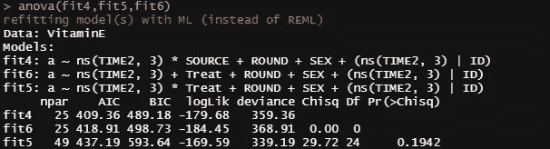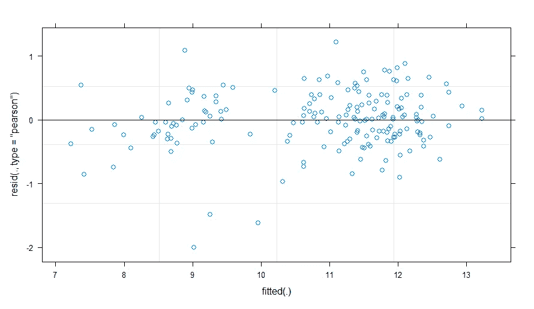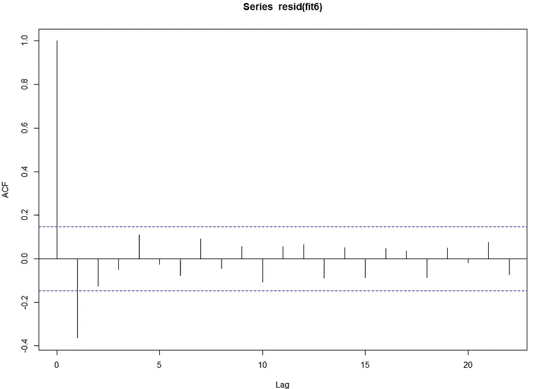

Residuals and autocorrelation plot are looking good. First lag is beyond the limit though.

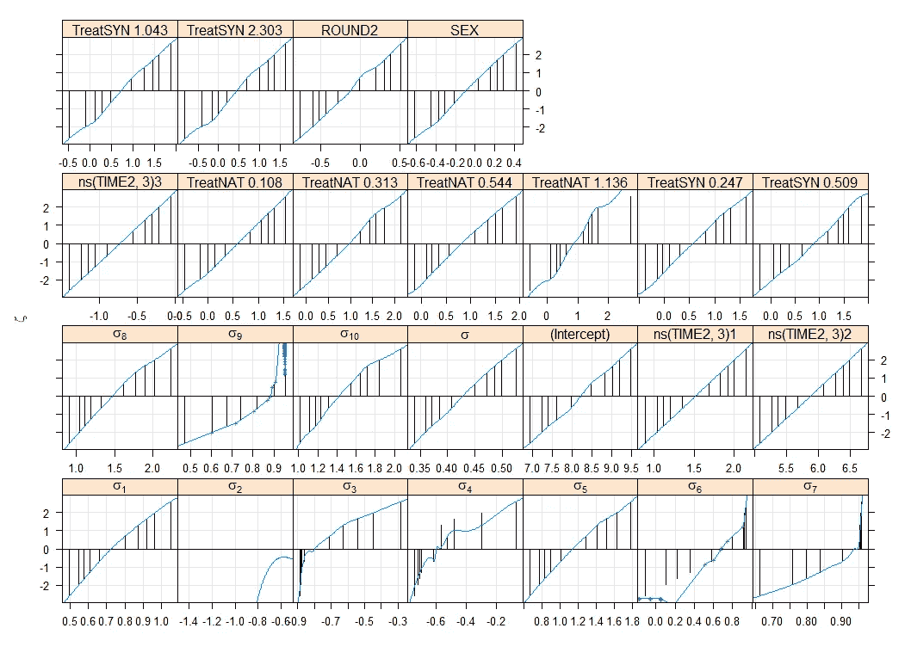

And the parameter estimates. Especially for the error part, things are not really going smooth and a more simple would probably be better. Which means deleting the random slopes.

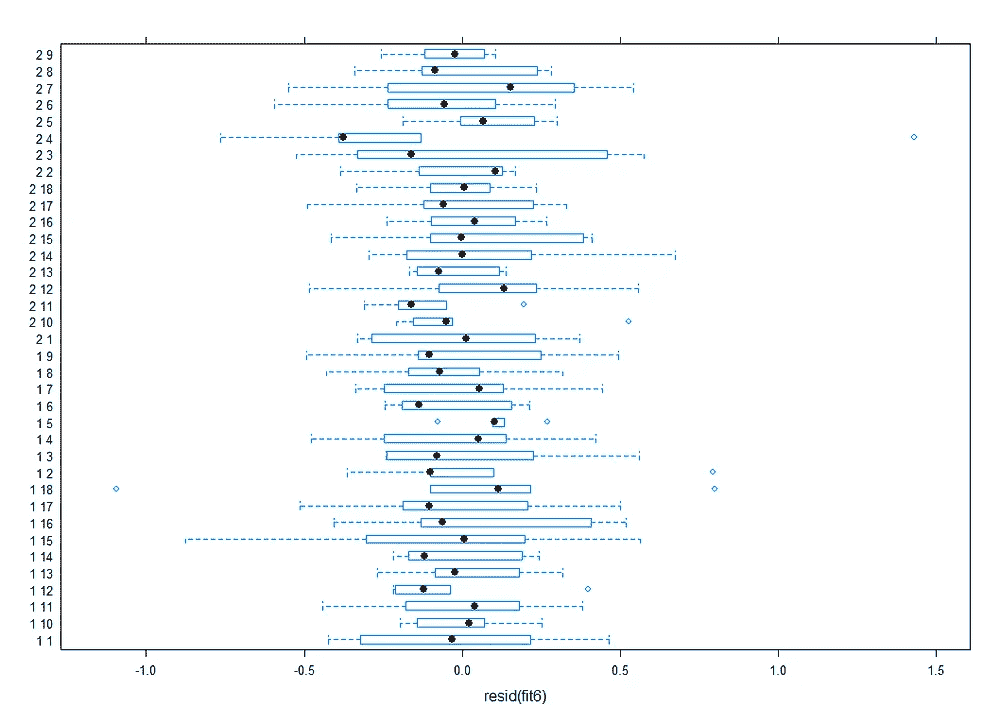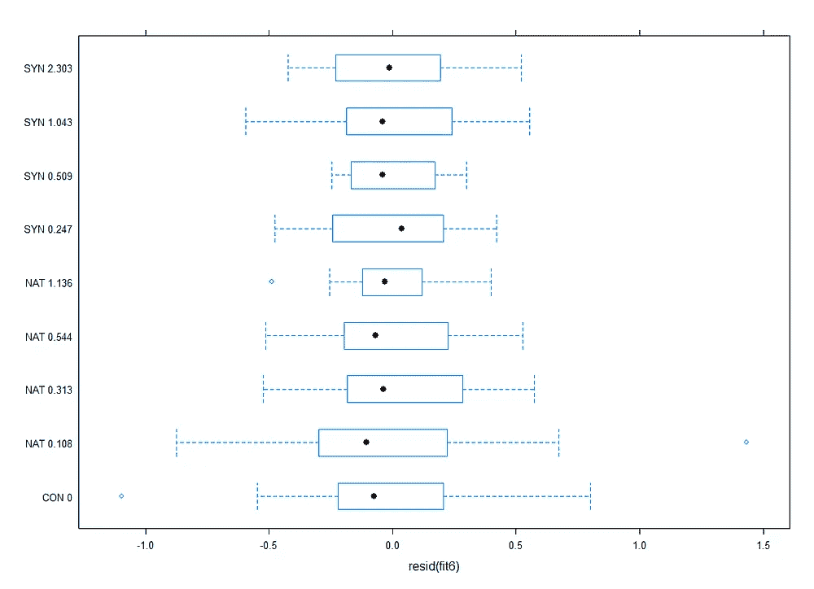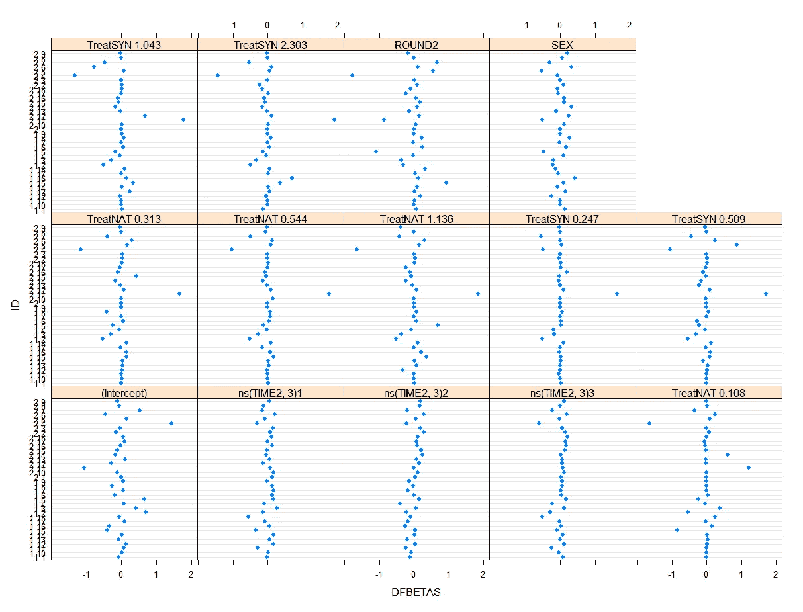

Another reason for deleting the random slopes — most of them are not that different.

```
### Variable selection ###
drop1(fit6,test="Chisq")
KRSumFun <- function(object, objectDrop, ...) {
    krnames <- c("ndf","ddf","Fstat","p.value","F.scaling")
    r <- if (missing(objectDrop)) {
      setNames(rep(NA,length(krnames)),krnames)
    } else {
      krtest <- KRmodcomp(object,objectDrop)
      unlist(krtest$stats[krnames])
    }
    attr(r,"method") <- c("Kenward-Roger via pbkrtest package")
    r
  }
drop1(fit6,test="user",sumFun=KRSumFun)
```

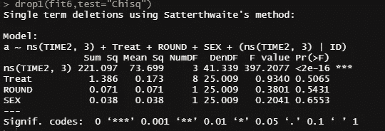

Funny, Treat is not even considered significant

让我们看一下拟合图和观察图，以了解模型的表现。

```
fit6<-lmer(a~ns(TIME2,3)+ROUND+SEX+(ns(TIME2,3)|ID), data=VitaminE)
theme_set(theme_bw())
myx<-scale_x_continuous(breaks=c(0,6,8,11,13))
myy<-scale_y_continuous(breaks = seq(0, 20, by = 11))
ggplot(VitaminE, aes(TIME2, a, shape=Treat, colour=Treat))+
  stat_summary(fun.data=mean_se, geom="pointrange", lwd=1)+
  stat_summary(aes(y=fitted(fit6), linetype=Treat), 
               fun.y=mean, geom = "line", lwd=1)+
  myx+
  myy
```


让我们在模型中包括治疗。

```
fit6<-lmer(a~ns(TIME2,3)+Treat+ROUND+SEX+(ns(TIME2,3)|ID), data=VitaminE)
ranef(fit6) # problem with this model is, is that the estimates now come from the IDs. 
theme_set(theme_bw())
myx<-scale_x_continuous(breaks=c(0,6,8,11,13))
myy<-scale_y_continuous(breaks = seq(0, 20, by = 11))
ggplot(VitaminE, aes(TIME2, a, shape=Treat, colour=Treat))+
  stat_summary(fun.data=mean_se, geom="pointrange", lwd=1)+
  stat_summary(aes(y=fitted(fit6), linetype=Treat), 
               fun.y=mean, geom = "line", lwd=1)+
  myx+
  myy
```

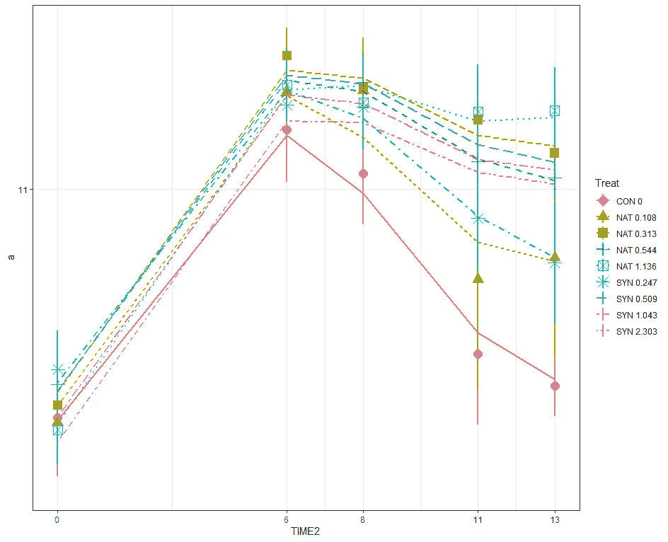

Same predictions as before. Adding treatment does not really seem to do much above and beyond modeling the individual IDs.

通过获得 bootstrapped 置信区间，我们可以使预测更加有趣。

```
fit6<-lmer(a~ns(TIME2,3)+ROUND+SEX+(ns(TIME2,3)|ID), data=VitaminE)
plot(fitted(fit6),VitaminE$a, col=c(1,2));abline(a=0,b=1)pred<-predictInterval(fit6, level=0.95, 
                      n.sims=1000, 
                      stat="mean", 
                      type="linear.prediction", 
                      include.resid.var=T)
VitaminE$fit<-pred$fit
VitaminE$upr<-pred$upr
VitaminE$lwr<-pred$lwr
ggplot(VitaminE, aes(x=TIME, group=ID))+
  geom_ribbon(aes(ymin = lwr, ymax = upr, fill="red"),alpha = 0.1)+
  geom_point(aes(y=a))+geom_line(aes(y=a))+
  geom_point(aes(y=fit), color="red")+geom_line(aes(y=fit), color="red")+
  facet_wrap(~Treat)+
  labs(title="Predicted vs Observed based on fit6", x="Time")+
  theme(legend.position = "none")+
  theme_bw()
```

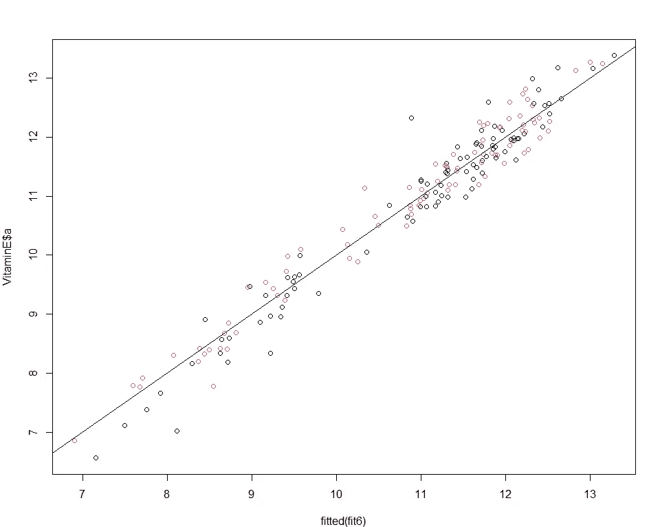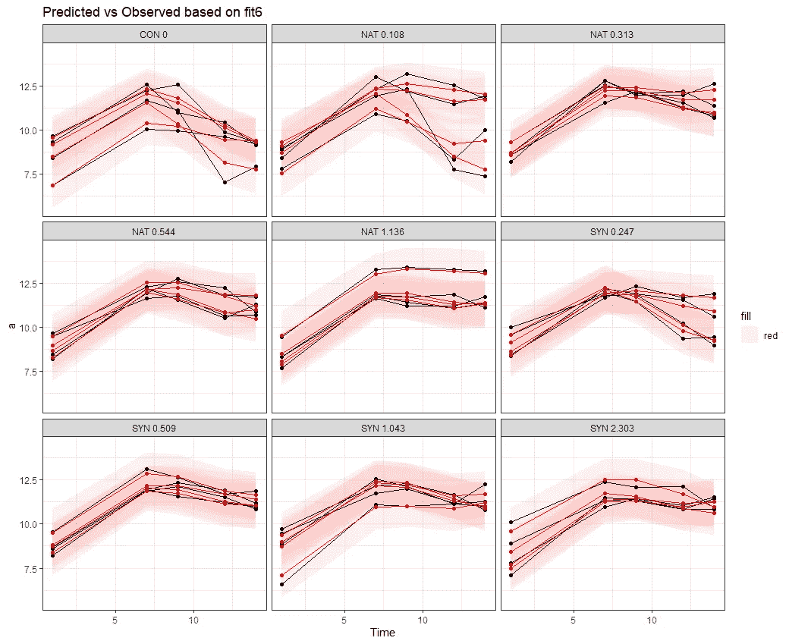

预测看起来不错！只要确保你不包括治疗；-)

[](/mlearning-ai/mlearning-ai-submission-suggestions-b51e2b130bfb) [## Mlearning.ai 提交建议

### 如何成为 Mlearning.ai 上的作家

medium.com](/mlearning-ai/mlearning-ai-submission-suggestions-b51e2b130bfb)