# 现代社会:艾诗集

> 原文：<https://medium.com/mlearning-ai/modern-society-a-collection-of-poems-written-and-illustrated-by-ai-c0880c2d335e?source=collection_archive---------4----------------------->

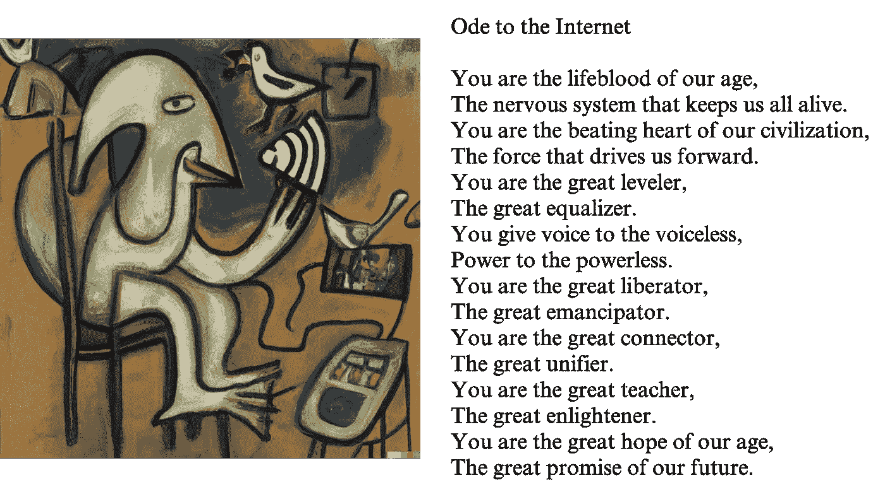

Inspired by Pablo Neruda / Pablo Picasso

在高中，我是一个诗人怀疑论者。在我看来，任何人都能写出“好”诗，尤其是自由诗。我非常愤世嫉俗，有一次我给我的英语老师做了一个小测验，以区分我的诗和印度著名诗人罗宾德拉纳特·泰戈尔的诗。我的英语老师测验不及格。

从那以后，我成熟了(一点点)。我读了更多的诗歌，我对写好诗所需要的技巧变得更加欣赏。好的诗歌似乎来自创造力和专业知识的混合；最好的诗人能够借鉴老一辈的智慧和风格，并加入新的创新。

创造力和专家知识也是 OpenAI 的新文本生成模型( [GPT-3](https://openai.com/blog/gpt-3-apps/) )和图像生成模型([达尔-E](https://openai.com/blog/dall-e/) )相对于早期模型脱颖而出的两个属性。这两个人工智能模型已经在数以百万计的样本上进行了广泛的训练，可以独自创造出新的灵感艺术。当我得知诗人泰戈尔也是画家时，我想知道，泰戈尔的插画诗会是什么样子？我可以用 GPT-3 和 DALL-E 帮我找出答案吗？

为了避免抄袭现有的泰戈尔作品，我让 GPT-3 以泰戈尔的风格写一首反映“现代社会”的诗，然后用 DALL-E 创作了一幅类似主题的泰戈尔插图:

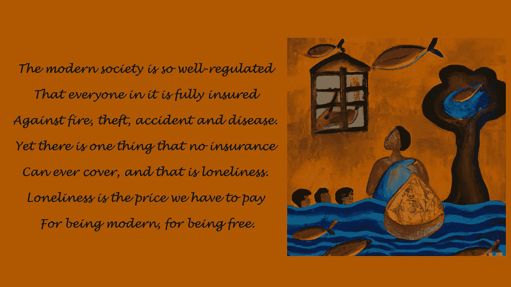

Inspired by Tagore

结果是如此有趣，我决定做一个由著名诗人写的和由著名艺术家插图的附加诗的小收集。

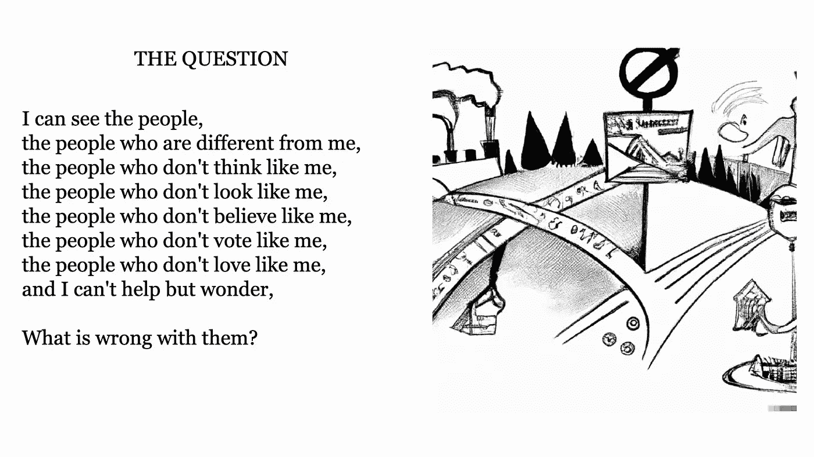

Inspired by Shel Silverstein

甚至更年轻的特里斯特鲁姆也能欣赏谢尔·银色啤酒杯乐队愚蠢、荒谬的诗歌，以及他同样不靠谱的黑白漫画。当 GPT-3 创作出上面这首诗时，我不得不立即用谷歌搜索结果，以确保它不是在重复别人的作品——它太棒了！更难从 DALL-E 得到一件附赠的艺术品；它制作的大部分艺术作品都有文字或标题，这破坏了作品的其他部分。它也从未真正确定单线卡通风格。以下是我使用的提示以及“重新滚动”的次数，即我重新提示每个模型的次数，以尝试为项目获得更好的输出:

*   GPT-3 (7 重卷):“一首谢尔·银色啤酒杯乐队关于现代社会的诗:”
*   DALL-E (5 重卷):“谢尔·银色啤酒杯乐队绘画风格的现代社会”

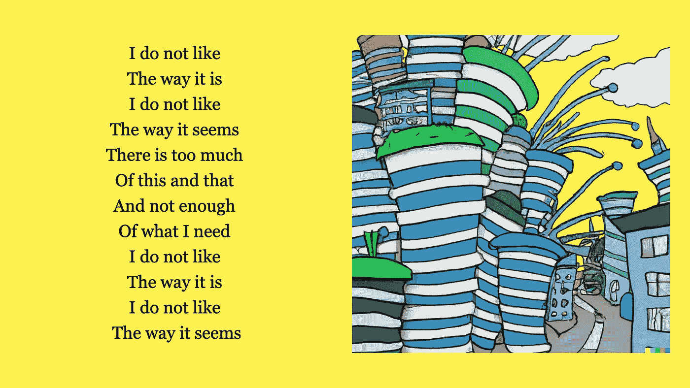

Inspired by Dr. Seuss

我一直在努力寻找一首真正感觉像原创作品的苏斯博士诗歌，但在将提示切换到“苏斯博士题为《现代社会》的诗”后，我立即滚动了这首诗。与谢尔·银色啤酒杯乐队相似，这幅艺术作品中经常出现有损作品的词语或文本(DALL-E 是一个可怕的拼写单词，所以我转而要求画一幅现代城市的画。

*   GPT-3 (6 重卷):“苏斯博士的诗题为‘现代社会’:”
*   DALL-E (5 重卷):“苏斯博士插图风格的现代城市”

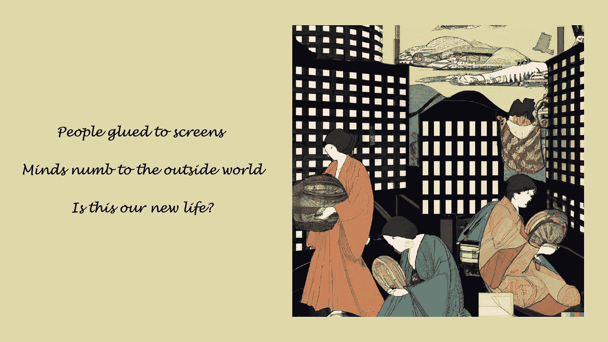

Inspired by haiku / Ukiyo-e Art

我真的很喜欢尝试一些 GPT 3 俳句。不幸的是，GPT-3 很难获得任何音节诗的正确音节数。在我创作的五个俳句中，只有两个有合适的 5-7-5 格式。[浮世绘](https://en.wikipedia.org/wiki/Ukiyo-e)是日本艺术的一个流派，一般以木刻版画和油画的形式制作。我认为 DALL-E 在颜色和风格方面做得很好，将传统的浮世绘主题与现代建筑等不太常见的元素混合在一起。

*   GPT-3 (5 重卷)“一首关于现代社会的俳句:”
*   《浮世绘风格的现代社会》

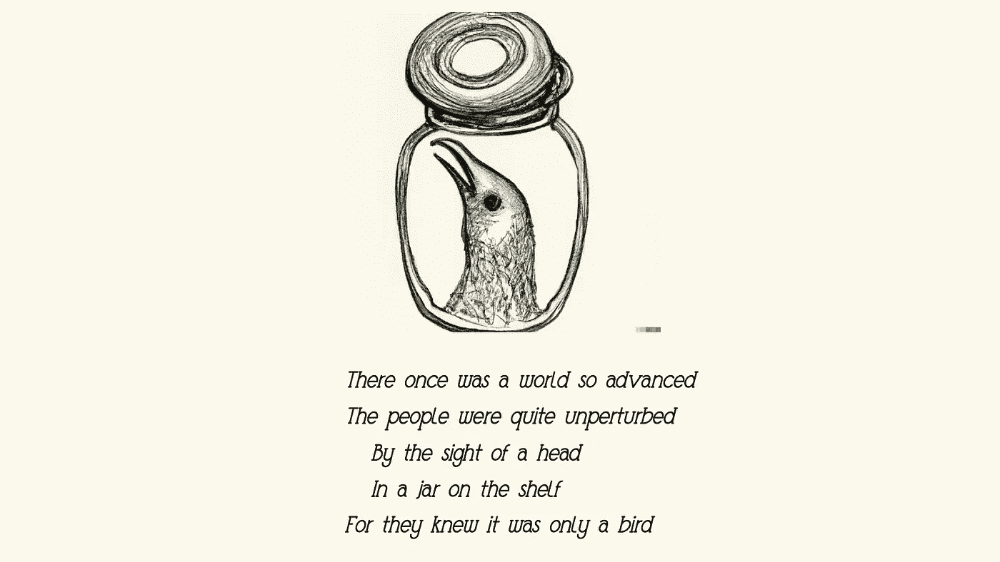

Inspired by Edward Gorey

[爱德华·戈里](https://www.edwardgoreyhouse.org/pages/edward-gorey-biography)出现在我寻找有独特插图的诗人时，我非常喜欢他的[黑色幽默的打油诗](https://www.reddit.com/r/creepy/comments/54ggl9/a_very_disturbing_limerick_by_edward_gorey_pay/)。除了音节，GPT-3 真的很难押韵。尽管这首诗很搞笑，但 DALL-E 是为“瓶子里的鸟头”这样的提示而设计的。

*   GPT-3 (6 重卷):“一个爱德华·格雷关于现代社会的打油诗:”
*   DALL-E (1 卷):“瓶子里的鸟头，爱德华·格雷绘画风格”

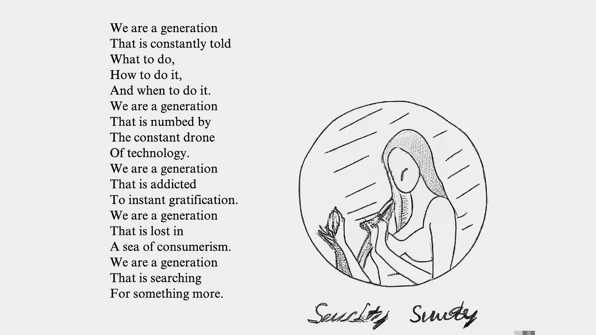

Inspired by Rupi Kaur

鲁皮·考尔是另一位现代诗人，以其短小的自白风格诗歌和附带的线条画而闻名。找到一首诗和插图都很困难，可能是因为在用于这两个人工智能模型的训练数据中，Rupi Kaur 的例子较少。出于某种原因，DALL-E 经常想画彩色插图。

*   GPT-3 (5 重卷)“一个鲁皮考尔关于现代社会的诗:”
*   DALL-E (11 重卷)“现代社会，一幅鲁皮·考尔的黑白画”

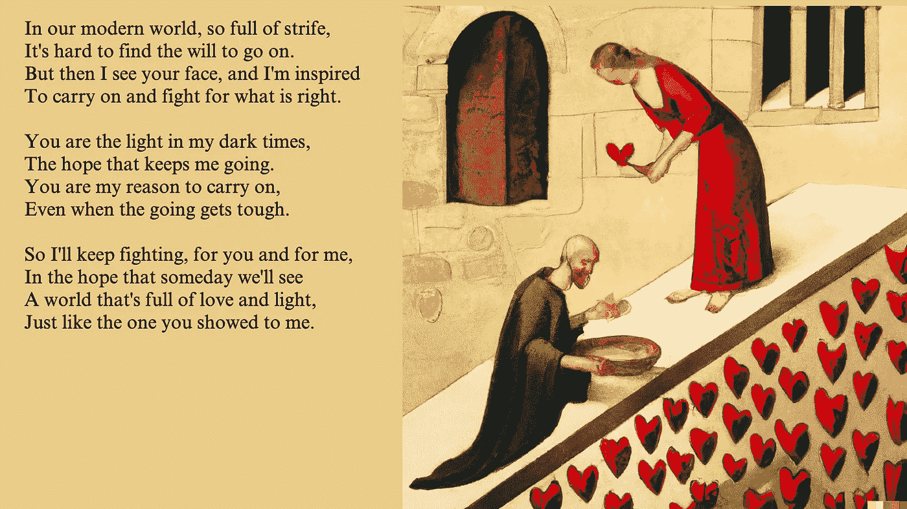

Inspired by Dante Alighieri / Giotto Painting

但丁以他的诗《神曲》而闻名，但我真的很喜欢他的十四行诗，尤其是他在《T2 的四星龙生活》中的爱情十四行诗。我只让 GPT 三世创作了一首十四行诗，而且肯定不押韵。GPT-3 还制作了一卷完全用意大利语写的诗。我选择了上面这首诗，因为它很好地融合了但丁的浪漫主题。我决定让早期的意大利画家乔托来为这首诗配画，因为这两个人在现实生活中显然是 T4 的密友。

*   GPT-3 (9 重卷):“一个短的但丁·阿利格伊切里号战列舰关于现代社会的十四行诗:”
*   DALL-E (3 卷重卷):“意大利画家乔托的现代社会爱情画”

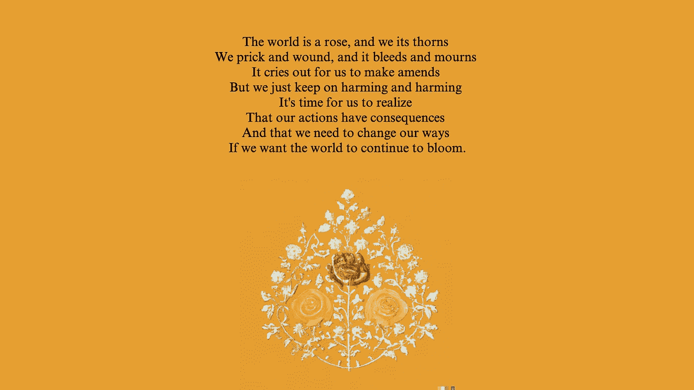

Inspired by Hafez / Persian miniature

哈菲兹是一位极具影响力的波斯诗人，他创作了加扎尔舞曲，这是一种源于阿拉伯语的传统抒情诗。哈菲兹的诗表达了爱、精神和抗议，我认为这首诗很好地将这些主题与现代社会联系起来。

*   GPT-3 (3 重卷):“一首以波斯诗人哈菲兹的风格描写现代社会的诗:”
*   DALL-E (11 重卷):“一幅题为《世界是一朵玫瑰》的波斯微型画。”

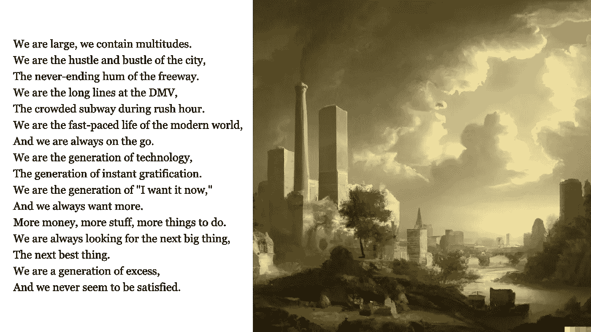

Inspired by Walt Whitman / Thomas Cole painting

沃尔特·惠特曼是一位人文主义者，也是自由诗的发明者之一。这对 GPT 3 号来说是个好消息，因为它一直在韵律和节奏上挣扎。这首诗以惠特曼的标志性诗句“我很大，我包容众多”开始，并以批判的眼光看待现代社会。达尔-E 模仿来自哈德逊河学校的美国风景画家托马斯·科尔，将现代城市植入风景背景中，给人以深刻印象。

*   GPT-3 (3 重卷):“一首以沃尔特·惠特曼风格描写现代社会的诗”
*   DALL-E(三卷重卷):“现代城市的托马斯·科尔绘画”

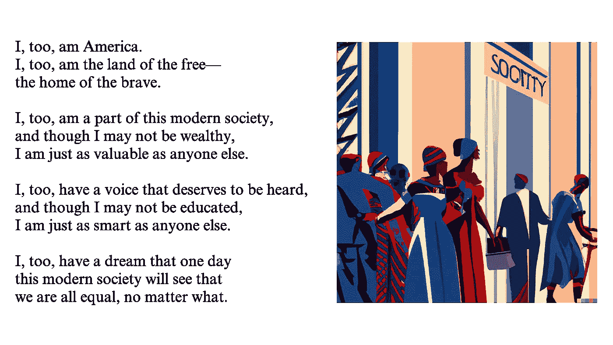

Inspired by Langston Hughes / Aaron Douglas painting

我在大学时喜欢读兰斯顿·休斯的自传《大海》，但没有读过太多他的诗歌。这首 GPT-3 的诗混合了兰斯顿·休斯的著名诗歌[“我也是”](https://www.poetryfoundation.org/poems/47558/i-too)，有一些类似的打孔线。我滚动了很多次，试图找到一个匹配的[阿隆·道格拉斯风格的绘画](https://www.britannica.com/biography/Aaron-Douglas)，但 DALL-E 与调色板和复制轮廓风格斗争。DALL-E 和 GPT-3 都面临着[关于多样性和包容性的合理担忧](https://www.wired.com/story/dall-e-2-ai-text-image-bias-social-media/)，所以我希望 OpenAI 将[在未来继续减轻这些缺点](https://openai.com/blog/reducing-bias-and-improving-safety-in-dall-e-2/)。这幅画仍然捕捉了一些常见的阿隆·道格拉斯元素，并几乎成功地正确拼写了“社会”。

*   GPT-3 (14 复卷):“一首关于现代社会的诗，以兰斯顿·休斯的风格:”
*   DALL-E (14 卷重卷):“现代社会，哈莱姆文艺复兴时期画家阿隆·道格拉斯的风格”

Inspired by Pablo Neruda / Pablo Picasso painting

在为这个博客做研究时，我发现了巴勃罗·聂鲁达的《平凡事物颂》。GPT 3 对颂歌概念的现代演绎也非常有趣。达尔-E 模仿了巴勃罗·毕加索(聂鲁达的朋友)，并加入了这一伟大的视觉元素。

*   GPT-3 (1 卷):“一首关于现代社会的颂歌，以诗人巴勃罗·聂鲁达的风格:”
*   DALL-E (3 卷重卷):“巴勃罗·毕加索的一幅名为‘互联网’的画”

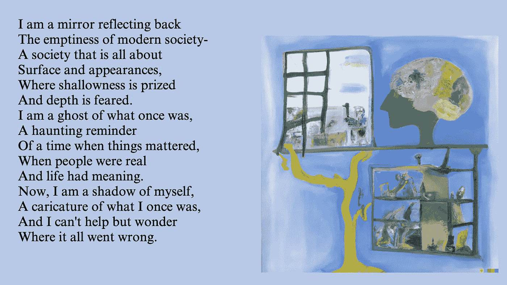

Inspired by Sylvia Plath

西尔维亚·普拉斯被认为是自白诗的先驱，也是德·基里科和亨利·卢梭等艺术家的忠实粉丝。我最近还发现西尔维娅自己创作了许多视觉艺术——绘画、拼贴画等。这首诗表达了沮丧和渴望的主题，我认为这幅画也代表了这些主题。

*   GPT-3 (13 重卷)“一首关于现代社会的诗，以西尔维亚·普拉斯的自白诗的风格”
*   西尔维亚·普拉斯的一幅题为“现代社会”的画

*快来看看* [*DALL-E*](https://openai.com/blog/dall-e-now-available-in-beta/) *和* [*GPT-3*](https://openai.com/api/) *分享自己的 AI 创作吧！感谢我精致的未婚夫莫妮卡校对！*

 [## Mlearning.ai 提交建议

### 如何成为 Mlearning.ai 上的作家

medium.com](/mlearning-ai/mlearning-ai-submission-suggestions-b51e2b130bfb)