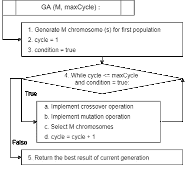

# 求解 0-1 背包问题的改进遗传算法

> 原文：<https://medium.com/mlearning-ai/modified-genetic-algorithm-to-solve-the-zero-one-knapsack-problem-cc2f76d0050f?source=collection_archive---------4----------------------->

T 他的文章是我上一篇文章的第三部分:[遗传算法解决零一背包问题](https://shashank3199.medium.com/genetic-algorithms-to-solve-the-zero-one-knapsack-problem-d38856beaa35)。请在继续阅读本文之前阅读那篇文章，以便更好地理解这个概念。本系列的第二篇文章讨论了 0-1 背包问题的传统遗传算法的实现，点击这里查看文章。

在这篇文章中，我们将讨论一种改进的遗传算法，这种改进的遗传算法受到遗传算法的两种变体的启发，每种变体都采用了与传统算法不同的方法。这种改进的遗传算法已经由 [Mojtaba Montazeri](https://ieeexplore.ieee.org/author/37086354115) 、 [Rasoul Kiani](https://ieeexplore.ieee.org/author/37086354555) 和 [Seyed Saleh Rastkhadiv](https://ieeexplore.ieee.org/author/37086355185) 在这里发表。
现在，不要再拖延了，让我们开始吧……

# 基于重启遗传算法

简而言之，这种实现与传统方法相同，唯一的区别在于，在收敛点(即，当算法未能提高获胜者基因组的质量时的点)期间，当阈值未被达到时，这种版本的遗传算法引入新的随机群体，而来自上一代的获胜者继续在新的循环中。

# 岛屿遗传算法-

该算法是传统遗传算法的并行版本，具有执行*“k”*单独遗传算法的*“k”*单独世代。然而，这种方法的主要亮点是他们可以一起分享最佳答案。除了速度之外，这个版本的主要优点是在交叉和变异操作中的随机性。

另一种思考方式是，在传统的遗传算法中，我们运行“k”个并行交叉和变异操作。这在算法的进化阶段给了我们更多的多样性。

现在让我们转到这篇文章的主要亮点，即…..

# 改进的遗传算法-

[论文](https://ieeexplore.ieee.org/document/8324863)提出了改进的遗传算法，作为前面提到的两个版本的混合。所提出的解决方案旨在运行“M”个并行遗传算法，每个并行遗传算法针对“子循环”次数的迭代具有“子”种群大小，以获得“子”集合的局部最优解。
这些子程序中的每一个都返回一个染色体“C ”,对应于这些不同分区的局部最优值。然后这些染色体最终被用作外部遗传算法的优势种群，以生成优势染色体，这被认为是最终结果。因为“subM”值很小，所以可以很快达到局部最优。

为了更好地理解这种方法，让我们试着用下面的图片来理解它

上图有多个局部最小值，这对传统方法构成了威胁。为了解决这个问题，我们首先将图的 x 轴(即搜索空间)分成“M”个子集，每个子集具有“subM”个群体大小。接下来，我们对每个子集运行“M”个并行遗传算法。这给了我们每个“M”子集的局部最小值。然后，我们使用这些“M”个获胜者作为我们的种群，并在这个“优势种群”上运行外部遗传算法，以找到全局最小值。

本文的主要目的是克服遗传算法的两个主要限制，即

*   高时间复杂度
*   无法摆脱局部最优

所提出的算法通过实现以下内容来解决这些问题

*   运行并行线程以降低时间复杂度。
*   每个线程在搜索空间的一个子集上工作，这有助于避免收敛于局部最优。

现在让我们通过比较它们各自的伪代码来比较修改版本和传统算法

Traditional Genetic Algorithm

Proposed Genetic Algorithm

***结论:*** 在对一组测试用例评估了所提出的算法之后，凭着一些直觉，我们能够得出结论，所提出的算法在准确性和时间复杂度方面确实优于传统方法。

*你可以在* [*重启-基础遗传算法*](https://github.com/shashank3199/GeneticAlgorithm-ZeroOneKnapsack/blob/main/restart_base_genetic_algorithm.py) *、* [*孤岛遗传算法*](https://github.com/shashank3199/GeneticAlgorithm-ZeroOneKnapsack/blob/main/island_genetic_algorithm.py) *、* [*改良遗传算法*](https://github.com/shashank3199/GeneticAlgorithm-ZeroOneKnapsack/blob/main/modified_genetic_algorithm.py) *找到上述各种遗传算法的 Python 实现。如果你觉得这篇文章很有帮助，请跟我上* [*中*](https://shashank-goyal-blogs.medium.com/) *和*[*GitHub*](https://github.com/shashank3199/)*和 star*[*项目库*](https://github.com/shashank3199/GeneticAlgorithm-ZeroOneKnapsack) *。*

请查看本系列文章的其他部分

*   ***第一部分:*** [遗传算法求解零一背包问题](https://shashank3199.medium.com/genetic-algorithms-to-solve-the-zero-one-knapsack-problem-d38856beaa35)。
*   ***第二部分:*** [遗传算法求解零一背包问题:实现](https://shashank3199.medium.com/genetic-algorithms-to-solve-the-zero-one-knapsack-problem-implementation-26c1982f44b3)。
*   ***第四部分:*** [改进的遗传算法求解零一背包问题:实现](https://shashank3199.medium.com/modified-genetic-algorithm-to-solve-the-zero-one-knapsack-problem-implementation-72d85c1c72)。