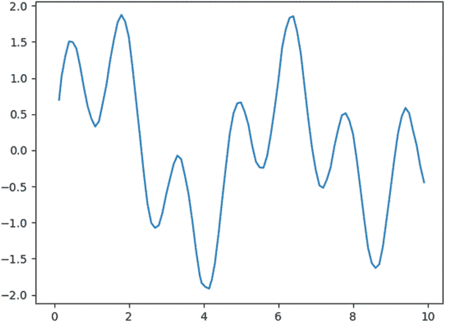
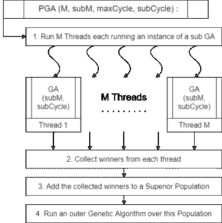

# 求解 0-1 背包问题的改进遗传算法:实现

> 原文：<https://medium.com/mlearning-ai/modified-genetic-algorithm-to-solve-the-zero-one-knapsack-problem-implementation-72d85c1c72?source=collection_archive---------3----------------------->


这篇文章是我关于用遗传算法解决 0-1 背包问题的系列文章的第四部分，也是最后一部分。

[的第一篇文章](https://shashank3199.medium.com/genetic-algorithms-to-solve-the-zero-one-knapsack-problem-d38856beaa35)向我们介绍了一般的遗传算法，以及它们如何适用于 0-1 背包问题。
[第二篇文章](https://shashank3199.medium.com/genetic-algorithms-to-solve-the-zero-one-knapsack-problem-implementation-26c1982f44b3)然后带我们通过传统的遗传算法来解决这个问题。
[第三篇文章](https://shashank3199.medium.com/modified-genetic-algorithm-to-solve-the-zero-one-knapsack-problem-cc2f76d0050f)讲述了解决该问题的新方法，该方法使用了一种受其他两种变体启发的遗传算法的修改版本，即基于重启的遗传算法和孤岛遗传算法。
请在继续之前阅读这些文章，以便更好地理解这个概念。



改进的遗传算法工作原理概述:上图有多个局部极小值，这对传统方法构成了威胁。为了解决这个问题，我们首先将图的 x 轴(即搜索空间)分成“M”个子集，每个子集具有“subM”个群体大小。接下来，我们对每个子集运行“M”个并行遗传算法。这给了我们每个“M”子集的局部最小值。然后，我们使用这些“M”个获胜者作为我们的种群，并在这个“优势种群”上运行外部遗传算法，以找到全局最小值。

在这篇文章中，我们将把重点放在实现基于重启、孤岛和修改版本的遗传算法上。在继续之前，如果你不习惯 Python 和 Numpy，我推荐下面的 Youtube 播放列表和视频-

*   [Python 编程教程播放列表](https://www.youtube.com/playlist?list=PLi01XoE8jYohWFPpC17Z-wWhPOSuh8Er-) by [苏格拉底](https://www.youtube.com/c/Socratica)。
*   [Python Numpy 教程](https://youtu.be/QUT1VHiLmmI)作者[freecodecamp.org](https://www.youtube.com/channel/UC8butISFwT-Wl7EV0hUK0BQ)

您可以在本系列文章的第二部分找到对效用函数的解释，即“获取基因组序列”、“获取基因组值”和“适应度函数”。你可以在这里找到文章。

所以事不宜迟，让我们从代码开始…

# 重启-基本遗传算法类-

该类由以下成员变量组成，这些变量使用“ **super()进行初始化。__ 词典 _ _。**(kwargs)更新“声明——

*   *循环:*迭代的最大代数。
*   *基因组大小:*基因型的大小即背包中物品的数量。
*   *种群规模:*每一代的个体数量。
*   *交叉方案:*要执行的交叉操作的类型。
*   *变异方案:*要执行的变异操作的类型。
*   *适应度函数:*用于评估个人素质的函数。
*   *种子范围:*基因组值范围即个体的最小十进制值和个体的最大十进制值。
*   *编码功能:*用于将基因组序列编码为基因组值的功能。
*   *解码功能:*用于将基因组值解码为基因组序列的功能。

# 驱动方法-

“**驱动**方法就像是我们类的主要函数。这就是遗传算法各阶段的方法被调用的地方。对于每个周期，初始化一个新的种群，然后我们运行一个"**"****而循环*** ，执行"**选择**"、"**交叉**"和"**突变**"直到只剩下一个幸存者。*

*在 ***【生存】*** 循环内，我们有重启-基础条件，即-*

*   *我们生成一个介于 0 和 1 之间的随机浮点值，对照设置的阈值重启率(默认为 0.995)进行检查；或者*
*   *我们检查这个群体的获胜者基因组是否满足一个阈值。*

***注意:**阈值条件可以基于权重向量或值向量来计算。当我们看函数调用时，我们会更好地理解这一点。*

*如果上述任何标准评估为真，我们用随机生成的群体增加群体，并继续生存循环。当这个*生存循环*结束时，我们将胜利者的基因组保存在一个单独的列表中。
这种生存循环重复了几代，每个获胜者的基因组都被添加到列表中。然后，我们返回具有最高适应值的基因组，遗传算法循环结束。*

# *主运行-*

*这里，我们将 JSON 文件中的值加载到背包对象中，并初始化基于重启的遗传算法对象。然后我们调用驱动方法，打印出胜利者的基因组。*

***注:**在第 24 行，我们使用背包对象的权重作为阈值向量，背包容量的 75%作为阈值。这意味着，如果我们的赢家基因组在任何循环迭代中没有填满背包的至少 75%,那么我们在向种群中添加更多成员后继续生存循环。*

# ***输出-***

```
*Capacity: 4098Number of Items: 15Weights: [29, 75, 118, 215, 311, 330, 334, 368, 431, 536, 697, 935, 1059, 1170, 1366]Values: [71, 155, 217, 324, 431, 493, 499, 543, 609, 752, 936, 1189, 1349, 1479, 1693]100%|███████████████████████████████| 5/5 [00:01<00:00, 4.21it/s]Sequence: [1 1 1 1 0 1 1 1 1 1 1 1 0 0 0]Genome Value: 31736Profit: 5788Capacity Used: 4068*
```

# *岛屿遗传算法类-*

*该类由与基于重启的遗传算法相同的成员变量组成，该算法使用“ **super()初始化。__ 词典 _ _。**【更新(kwargs)】语句。*

***注意:**我们使用的是 **ThreadPoolExecutor** 和**而不是****ProcessPoolExecutor**，因为前者在主进程内的*单独线程中运行你的每个工作线程，而后者在它们自己单独的*子进程*中运行你的每个工作线程。
这在某种意义上影响了我们的程序，如果我们为程序使用不同的子进程，我们不能在子进程之间共享对象变量，这会导致 pickling 错误异常。**

# *交叉变异成员-*

*该函数充当交叉和变异步骤的组合函数。这样做是为了简化穿线过程。组合器函数充当每个线程需要执行的函数的串行管道。*

# *驱动方法-*

*“**驱动**”方法是我们类的主要函数。这就是遗传算法各阶段的方法被调用的地方。对于每个周期，初始化一个新的种群，然后我们运行一个“*****while 循环*** ，它执行“**选择**”、“**交叉** _ **突变**”和**种群联合**，直到只剩下一个幸存者。让我们来探讨一下“**交叉** _ **变异**逐步”的线程***

*   *****第一步:*** 我们创建一个 ThreadPoolExecutor 对象。**
*   *****步骤 2:*** 接下来我们创建一个线程列表，其中每个线程都被提供了一个管道方法及其输入参数。**
*   *****第三步:*** 然后，我们在线程列表上运行" **as_completed** "方法，这是一个阻塞操作，当线程完成时产生线程。**
*   *****第四步:*** 每个线程完成后使用“ **result** ”方法返回其结果，然后将其添加到一个列表中。**

****种群并集**操作基本上是对“**交叉 _ 变异**的并行线程产生的种群的并集操作。**

# **主运行-**

**这里，我们将 JSON 文件中的值加载到背包对象中，并初始化孤岛遗传算法对象。然后我们调用驱动方法，打印出胜利者的基因组。**

****注意:**在第 24 行，第一个参数对应于“ **selection_rate** ”，即从一个生存循环迭代向前移动的人口百分比。第二个参数对应于要创建的线程数量，即要并行执行的“ **crossover_mutation** ”操作的数量。数字越大，进化的多样性就越大。但是这伴随着由于人口增长而引起的较小的开销。**

# **输出-**

```
**Capacity: 4098Number of Items: 15Weights: [29, 75, 118, 215, 311, 330, 334, 368, 431, 536, 697, 935, 1059, 1170, 1366]Values: [71, 155, 217, 324, 431, 493, 499, 543, 609, 752, 936, 1189, 1349, 1479, 1693]100%|███████████████████████████████| 20/20 [00:00<00:00, 27.56it/s]Sequence: [1 1 1 1 0 1 1 1 1 1 1 1 0 0 0]Genome Value: 31736Profit: 5788Capacity Used: 4068**
```

# **改进的遗传算法类**

**在继续看代码之前，让我们看一下这个算法的伪代码。**

****

**现在让我们继续编码-**

**该类由以下成员变量组成，这些变量使用“ **self”进行初始化。__ 词典 _ _。更新(kwargs)** "声明-**

*   ***循环:*迭代的最大代数。**
*   **m 并行:要执行的并行线程的数量，即搜索空间的划分数量。**
*   ***基因组大小:*基因型的大小，即背包中物品的数量。**
*   **内部遗传算法数据:用于初始化子遗传算法的数据成员值，与用于重启基本、孤立和传统遗传算法的数据成员值相同。**

**我们运行一个循环来初始化遗传算法对象，同时指定它们各自搜索空间的范围。**

# **生成超级人口方法-**

**这个方法是一个迭代器。它通过运行每个子种群线程返回优势种群，每个子种群线程在它们各自的搜索空间分区上运行独立的遗传算法。这以类似于岛遗传算法驱动程序方法的方式实现。**

## **驱动方法-**

**“**驱动**方法是我们类的主要函数。这就是遗传算法各阶段的方法被调用的地方。对于每一个循环，一个新的种群被初始化，然后我们运行一个“*****而循环*** 执行“**选择**”、“**交叉**”和“**变异**”，直到只剩下一个幸存者。这是一个基于重启的遗传算法的精确实现，唯一的区别是，不是运行“ **init_population** 方法，而是使用一个新的优势种群，如前所述，通过使用“**generate _ superior _ population**方法生成。****

****主运行-****

**这里，我们将 JSON 文件中的值加载到背包对象中，并用外部遗传算法数据和内部遗传算法数据初始化修改后的遗传算法对象。然后我们调用驱动方法，打印出胜利者的基因组。**

# **输出-**

```
**Capacity: 4098Number of Items: 15Weights: [29, 75, 118, 215, 311, 330, 334, 368, 431, 536, 697, 935, 1059, 1170, 1366]Values: [71, 155, 217, 324, 431, 493, 499, 543, 609, 752, 936, 1189, 1349, 1479, 1693]100%|███████████████████████████████| 5/5 [00:01<00:00, 5.17it/s]Sequence: [1 1 1 1 0 1 1 1 1 1 1 1 0 0 0]Genome Value: 31736Profit: 5788Capacity Used: 4068**
```

***这里* *可以找到完整的 python 实现* [*。如果你觉得这篇文章很有帮助，请跟我上*](https://github.com/shashank3199/GeneticAlgorithm-ZeroOneKnapsack) [*中*](https://shashank-goyal-blogs.medium.com/) *和*[*GitHub*](https://github.com/shashank3199/)*和 star*[*项目库*](https://github.com/shashank3199/GeneticAlgorithm-ZeroOneKnapsack) *。***

**请查看本系列文章的其他部分**

*   *****第一部分:*** [遗传算法求解零一背包问题](https://shashank3199.medium.com/genetic-algorithms-to-solve-the-zero-one-knapsack-problem-d38856beaa35)。**
*   *****第二部分:*** [遗传算法求解零一背包问题:实现](https://shashank3199.medium.com/genetic-algorithms-to-solve-the-zero-one-knapsack-problem-implementation-26c1982f44b3)。**
*   *****第三部分:*** [改进的遗传算法求解零一背包问题](https://shashank3199.medium.com/modified-genetic-algorithm-to-solve-the-zero-one-knapsack-problem-cc2f76d0050f)。**