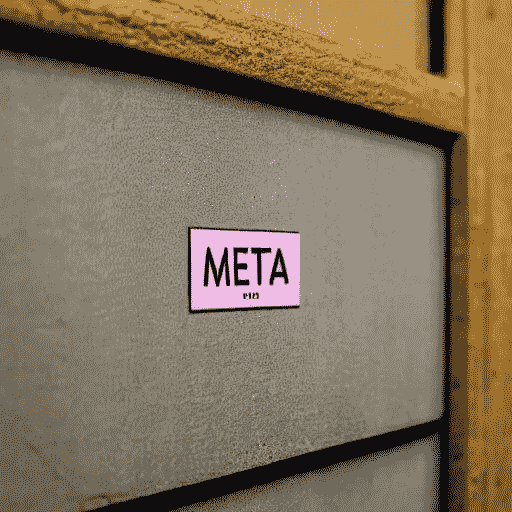

# 【动量交易】使用机器学习来提高你的日内交易技巧:元标记

> 原文：<https://medium.com/mlearning-ai/momentum-trading-use-machine-learning-to-boost-your-day-trading-skill-meta-labeling-509f11d10184?source=collection_archive---------0----------------------->

From [stable-diffusion](https://huggingface.co/spaces/stabilityai/stable-diffusion)

由*马科斯·洛佩兹·德·普拉多*所著的《金融机器学习的进展 一书中一起介绍了三重壁垒方法和元标记技术。这两种工具的结合似乎是稳定或进一步增加投资组合增长的绝佳组合。在这篇文章中，我将引用我以前的研究结果…