# 钱球板球:获取参数的贝叶斯方法

> 原文：<https://medium.com/mlearning-ai/money-balling-cricket-bayesian-methods-to-get-parameters-3a40d90bde8f?source=collection_archive---------3----------------------->

Sabermetrics 在预测棒球比赛结果方面非常有用，并已被职业球队用来取得更好的成绩。这个故事在电影《金钱球》中已经有了很好的记录。这个想法是使用统计数据来发现球员的隐藏价值，并在团队建设中做出更好的决策。

现在，一个显而易见的问题出现了，那就是有没有一种方法可以利用统计学来发现其他运动中的“隐藏价值”，比如板球。这篇文章的目的是探讨这个问题，看看如何去做。本文灵感来源于这篇研究论文:[一日板球](https://www.sfu.ca/~tswartz/papers/cricketsim.pdf)的建模与仿真。对于任何对板球和统计学感兴趣的人来说，这份报纸都是一份有趣的读物。

大多数方法都是直接从论文中改编而来的，但是我决定在我的方法中做一些细微的改变:

*   这篇论文是在考虑一天板球的情况下写的，我的方法已经被 T-20 采用
*   论文对第二局进行了调整——为了降低复杂性，我的方法是不可知局的。因为，我的最终目标是分析个人球员，而不是完整的比赛。

在第一部分中，我将向你展示如何为玩家生成评估，然后用于预测结果和模拟有趣的场景。

# 数据

为了应用这种方法，你需要一个球一个球的数据；你需要击球的击球手、投球的投球手、每局的球数以及每一球的结果。幸运的是，在 https://cricsheet.org/的 T2 有一个数据集。它们以 yaml 文件的形式存储数据，考虑到可以将 yaml 文件提取到数据帧中，您可以选择任何数据集。如果你不知道怎么做，你可以从这里下载我用过的数据集:【https://github.com/ArslanS1997/Cricket 

一旦准备好了，数据应该是这样的，你至少有球的结果，击球手和投球手。

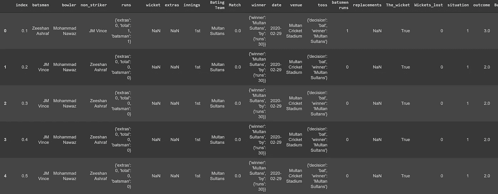

My dataset after extraction

您的数据集可能看起来略有不同，但只要它有四个元素，您就应该能够继续。

为了将数据集传递到 stan(我们将使用的统计库)中，您需要为每个击球手和投球手分配一个索引号，并且对于每个球，您需要为击球手和投球手分配编号。

# **型号**

该模型从创建结果的离散概率分布开始。它考虑每个球的 7 个结果。如下图所示

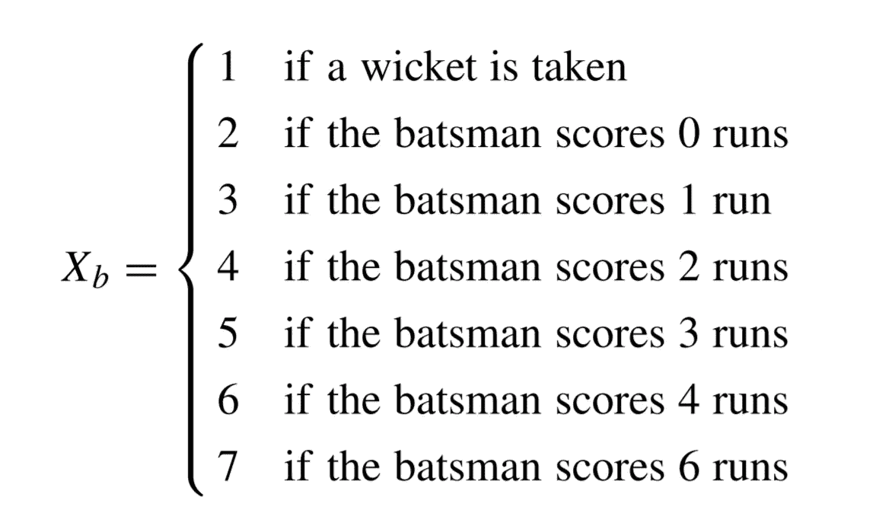

Outcome of each ball

它认为 1 是三柱门的结果，2 是球导致零分的结果，3–7 对应于得分 1–6 分，5 分被排除在外，因为这是非常罕见的事件，可能会使结果产生偏差。这是一个多项式分布。所以本质上我们需要找到任何球 b 导致第 k 个结果的概率。概率取决于击球手、投球手、三柱门和 b-1 球的结果，直到球 b。在数学符号中是

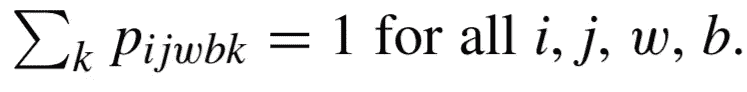

其中 I 是击球手，j 是投球手，w 是三柱门，b 是球，k 是结果。这些概率估计本质上是我们试图寻找的。

现在，为了在数据帧中分配结果，您可以创建如下所示的函数。

```
def outcome(row):if(row['The_wicket']==False): return 1elif(row['batsmen runs']==0): return 2elif(row['batsmen runs']==1): return 3elif(row['batsmen runs']==2): return 4elif(row['batsmen runs']==3): return 5elif(row['batsmen runs']==4): return 6elif(row['batsmen runs']==6): return 7else: return np.nan#You can use pandas apply function to assign this to each row
df['outcome'] = df.apply(outcome, axis=1)
```

这篇论文说，为了估计这些概率，你可以使用基于有序逻辑回归的贝叶斯潜在变量模型。有序逻辑回归不同于普通逻辑回归，它输出有序结果或概率(X≤k ),而不是简单的分类或概率(X=k)。潜在变量本质上是指在数据中没有观察到的变量，但该变量的分布可以通过观察变量找到。该论文将变量 U 描述为“击球结果的质量”,并说给定 U 取某个阈值之间的值，每个球都会产生一个结果 k。

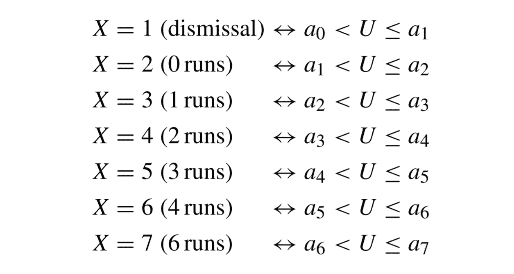

Batting outcomes

# 你是什么？

本文根据前面提到的四个因素定义了这个潜在变量:击球手、投球手、三柱门(情况)和当前面对的球。为了使事情简单，本文首先做这个简单的推导，这里我们只考虑击球手和投球手。

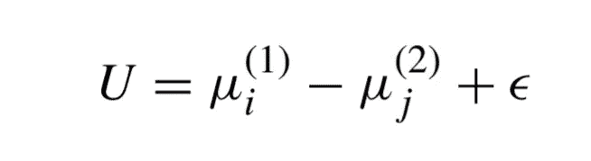

在这个 you mu_i 描述击球手的能力，mu_j 描述投球手的能力，加上一个误差项。mu_i 值越高，mu_j 越优秀的选手。为了求出 X≤k 的概率，我们遵循这个数学过程。其中 a_k 是第 k 个结果的阈值，函数 F()是逻辑/sigmoid 函数。sigmoid 函数输出 0，1 之间的数字，因此可用于创建所有值的概率分布。

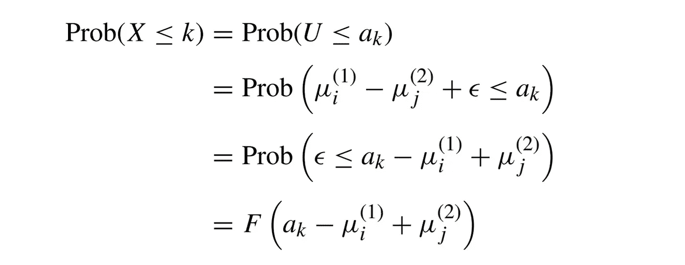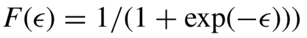

The Logistic function aka Sigmoid function

这似乎非常令人困惑，尤其是如果这是你第一次处理高级贝叶斯建模，但你需要从上面的推导中得到的关键是，当我们有三个东西 mu_i，mu_j 和阈值时，我们可以通过简单地将它们代入逻辑函数来获得 X≤k 的概率。为了计算概率 X=k，我们需要用 Prob(X≤k-1)减去 Prob(X≤k)。

然后，本文将这一概念扩展到包括各种情况(三柱门和超时)，并为每种情况引入一组阈值。它将每场比赛分为九种情况。


Situations for One day cricket

解读这一点的方法是，如果每局有 1-15 次投球，0-3 个检票口丢失，比赛的情况是 1，类似地，如果 36-50 次投球，7-9 个检票口丢失，那么我们是 9。你可以得到这个想法。

因为我们的数据集是针对 T-20 比赛的，我们需要调整这些分配，我们每局只有 20 回合，所以我调整了如下所示的情况:

```
# Index variable denotes the overs played
def assign_situation(row):
  if(row['Wickets_lost']>=0 and row['Wickets_lost'] <=3):
    if(row['index']>0 and row['index']<=5):
      return 1
    elif(row['index']>5 and row['index']<=15):
      return 2
    elif(row['index']>15):
      return 3
  elif(row['Wickets_lost']>3 and row['Wickets_lost'] <=6):
    if(row['index']>0 and row['index']<=5):
      return 4
    elif(row['index']>5 and row['index']<=15):
      return 5
    elif(row['index']>15):
      return 6
  elif(row['Wickets_lost']>6 and row['Wickets_lost'] <=10):
    if(row['index']>0 and row['index']<=5):
      return 7
    elif(row['index']>5 and row['index']<=15):
      return 8
    elif(row['index']>15):
      return 9 
```

现在，在调整后的模型中，情况是这样的

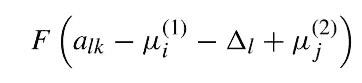

其中下标 l 表示情况，a_lk 是第 1 个情况和第 k 个结果的阈值，delta_l 是当比赛情况变得更加困难时包含“压力”的变量。

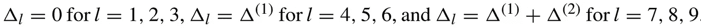

这些 delta_1，delta_2 是我们需要估计的两个新参数，这将给出每种情况下 delta _ 1 的值。强烈建议你此刻停下来思考一下提到的每一点，并阅读这篇文章和我的编码文章，以便获得更好的理解。正如以前在这个新模型中，如果我们要计算 Prob(X=k ),我们需要如下，我们需要减去 Prob(X≤k)和 Prob(X≤k-1)或以逻辑函数的形式

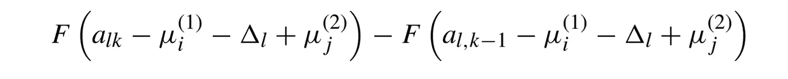

# 估计参数

现在我们知道，如果我们有所有管理部门、a_lk 和增量，我们需要做什么，但是我们如何估计它们。因为这是一个贝叶斯设置，我们需要给这些参数一些初始分布。本文对我们所有的参数使用这些先验分布。

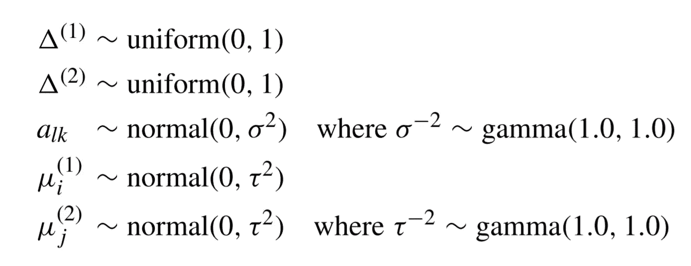

priors for all parameters

为了从这些先验中计算出后验估计，你需要一个统计软件包。你可以使用任何能够做到这一点的软件，但我更喜欢使用 stan，而报纸使用 WINBUGS。Stan 使用马尔可夫链蒙特卡罗(MCMC)方法计算这些后验分布，这是一种非常标准的计算贝叶斯参数的方法。

您可以在 Python 和 r 中使用 stan 作为库。您需要的只是 Pystan 和 Rstan 包，还需要在 stan 自己的统计编程语言中指定先验知识以及模型与 stan 的关系，这与 C++非常相似。

如果您不熟悉 stan，您可以使用我用来指定模型的 stan 代码。或者如果你想了解这是如何工作的，请查看 stan 文档:[https://mc-stan.org/users/documentation/](https://mc-stan.org/users/documentation/)

```
import pystan 
modelcode = """ data {
    int<lower=1> N; 
    int<lower =1> BatNum;
    int<lower =1> BowlNum;
    int BatIndex[N];
    int BowlIndex[N];
    int<lower=1,upper=9> l[N];
    int<lower=1,upper=7> F[N];
    int<lower=1> index[N];
    int matchballs;
}parameters {ordered[6] alk_tilda[9];
    real<lower=0> sigma;
    real<lower=0> tau;
    real mu_1_tilda[BatNum];
    real mu_2_tilda[BowlNum];

   real<lower=0,upper=1> delta_1;
   real<lower=0,upper=1> delta_2;}
transformed parameters{real delta[9];
real mu_1[BatNum];
real mu_2[BowlNum];
ordered[6] alk[9];

for(n in 1:9){
   delta[n] = D(l[n],delta_1,delta_2);
   alk[n] = sqrt(1/sigma)*alk_tilda[n];
   }
for (n in 1:BatNum){mu_1[n] = sqrt(1/tau)*mu_1_tilda[n];
}
for (n in 1:BowlNum){mu_2[n] = sqrt(1/tau)*mu_2_tilda[n];
}}model {
  // 
   vector[N] s; delta_1 ~uniform(0,1);
    delta_2 ~uniform(0,1);

    sigma ~ gamma(1,1);
     tau ~ gamma(1,1);
    mu_1_tilda ~ normal(0,1);
    mu_2_tilda ~ normal(0,1); for(t in 1:9){
      alk_tilda[t] ~ normal(0,1);
    }
 for(i in 1:N){
  s[i] =  mu_1[BatIndex[i]] + delta[l[i]] - mu_2[BowlIndex[i]];

 }
 for(i in 1:N){
F[i]~ ordered_logistic(s[i]',alk[l[i]]);
 }}"""sm = pystan.StanModel(model_code=modelcode)
```

上面的代码允许您编译 stan 模型，接下来您需要提供数据并运行 stan 的采样。这是训练或运行采样器的代码。

```
# First creating a list of all the batsman and bowlersbatsman =complete_data_train['batsman'].unique()bowler = complete_data_train['bowler'].unique()#Assigning an index to each bowler and batsman respectivelybowler = [[bowler[i-1],i] for i in range(1,len(bowler)+1)]batsman = [[batsman[i-1],i] for i in range(1,len(batsman)+1)]#Situation of each balll = [int(x) for x in complete_data_train['situation']]#the actual outcomeF = [int(x) for x in complete_data_train['outcome']]#Functions that assign each batsman and bowler with their respective index in our dataframecomplete_data_train['BatIndex'] = complete_data_train.apply(assign_num, theList= batsman, string = 'batsman',axis=1)complete_data_train['BowlIndex'] = complete_data_train.apply(assign_num, args=(bowler,'bowler',),axis=1)#converting that into a listBatIndex = [int(x) for x in complete_data_train['BatIndex2']]BowlIndex = [int(x) for x in complete_data_train['BowlIndex2']]BatNum = int(len(batsman))BowlNum = len(bowler)N = int(len(complete_data_train))matchballs = 240index = [int(x) for x in complete_data_train['balls']]data = {'N':N,'l':l,'F':F,'BatIndex':BatIndex,'BowlIndex':BowlIndex,'BatNum':BatNum,'BowlNum':BowlNum,'matchballs':matchballs,'index':index}#Stan fit object will have all the trained parameters.fit = sm.sampling(data, iter=2000, chains=4,n_jobs=1,verbose=True,refresh=100,control={'max_treedepth': 10})
```

在数据集中，我有大约 25000 个球，86 个独特的击球手和 76 个独特的投球手。这使得要估计的总参数等于 1+1 (deltas) + 9(6) (a_lk) + 86(击球手)和 76(投球手)，这等于要估计的 218 个参数。在当前的迭代设置下，训练数据集需要 3-4 个小时。

训练结束后，我们取斯坦斯输出的平均值如下

```
# Extract output 
alk=fit.extract()['alk']mu1 = fit.extract()['mu_1']mu2 = fit.extract()['mu_2']del1 = fit.extract()['delta_1']del2 = fit.extract()['delta_2']# Assign mean 
#using previously made lists with name and index of bowler & batsman # you can assign the mu_i and mu_j
batsman = pd.DataFrame(batsman, columns=['name','number'])bowler = pd.DataFrame(bowler, columns=['name','number'])batsman['mean'] = [x for x in mu1.mean(axis=0)]bowler['mean'] = [x for x in mu2.mean(axis=0)]
# estimates for deltasd1 = del1.mean(axis=0)
d2 = del2.mean(axis=0)# estimates for thresholds 
alk=pd.DataFrame(alk.mean(axis=0),columns=['mean_'+str(x) for x in range(1,7) ])
```

每个数据帧的输出应该如下所示:

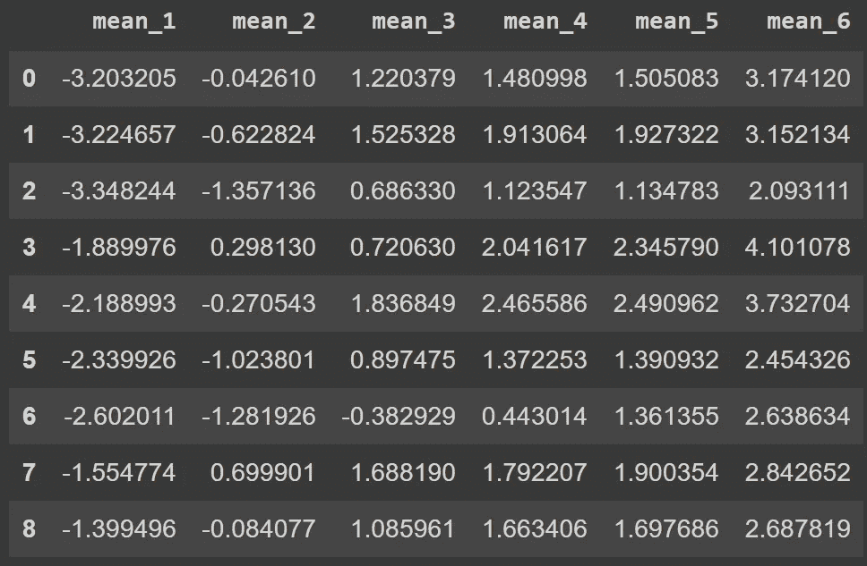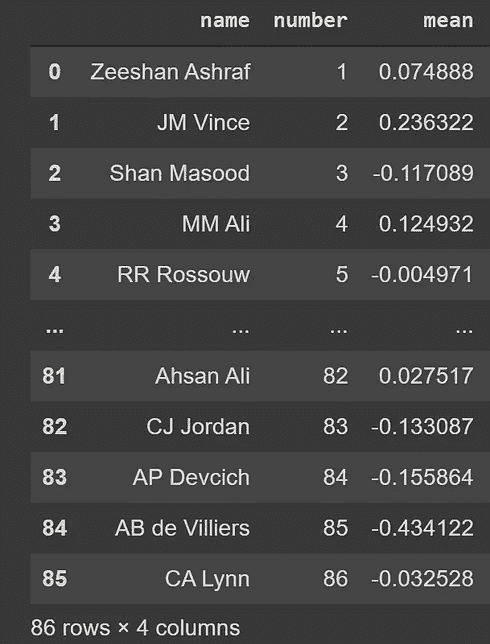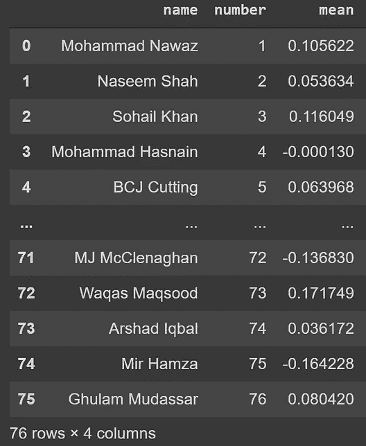

Fig 1\. Thresholds for all 9 situations and 7 outcomes (only need 6 values for 7 outcomes), Estimates for batsman and Estimates for bowlers

# 敬请关注

这当然是一个具有挑战性的演示，但我们刚刚进入最有趣的部分，即使用这些估计来预测一个球接一个球的结果，并进行模拟，看看在有趣的场景中会发生什么。跟着我，这样你就可以在下一部出来的时候得到通知。同时，保持好奇！