# 金钱球板球——统计评估比赛

> 原文：<https://medium.com/mlearning-ai/money-balling-cricket-statistically-evaluating-a-match-9cda986d015e?source=collection_archive---------4----------------------->

## 使用描述性统计评估运动员的表现

Image edited by author

2022 年巴基斯坦超级联赛正在进行，各方面都有惊人的表现。板球分析是一个不断发展的领域，但老实说，它目前落后于棒球和足球等其他运动中使用的统计分析(我相信是这样)。作为一个有统计学学术背景的人，思考如何用统计学方法评估球员的表现对我来说很有趣。比赛亮点确实包括有趣的统计数据，但我认为在一场板球比赛中可以发现更多深刻的见解。这篇文章是我超越初步统计分析的尝试。我希望你觉得有趣和鼓舞人心，请随时复制我所做的或使你的方法论。

# 数据

数据是任何分析中最重要的方面，错误的数据会使你建立的所有模型无效。在你分析的每一个关键点都进行健全性检查是很重要的。以下是关于所用数据及其验证方式的详细信息

1.  **资料来源:**在本次分析中，我使用了 [cricksheet](https://cricsheet.org/) 提供的数据。他们为所有的国际和板球联赛提供球的数据。
2.  **健全性检查:**使用汇总数据来验证数据，检查比赛中的跑垒次数、击球次数和击球次数是验证数据的好方法。总量与 espncricinfo 等大型媒体板球网站上的可用总量进行了交叉核对。
3.  **细分:**为了进行分析，我将数据分为三部分，所有 T20 国际比赛(不包括像 PSL 这样的联赛)，所有 PSL 比赛直到去年，最后是我将深入分析的比赛。
4.  **感兴趣的比赛:**我将深入分析一场比赛，选择的比赛是 2022 年 1 月 27 日举行的**卡拉奇国王队 vs 木尔坦苏丹队**。

# **击球**

所以让我们从整场比赛的击球总结开始。

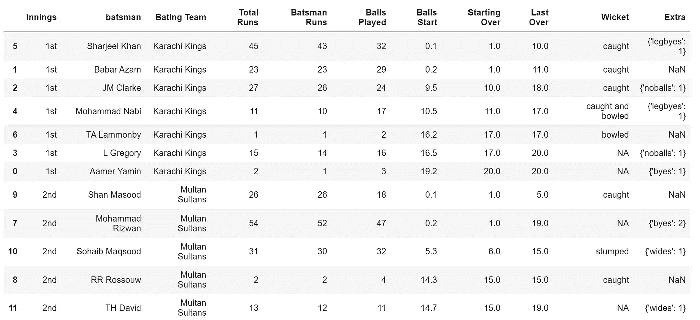

Batting Summary of match Karachi Kings vs Multan Sultans (Image by author)

现在，作为分析的有趣部分，我将根据得分来查看卡拉奇国王队的顶级击球手，并将他们各自的表现与他们参加的所有 T20 国际比赛和 PSL 比赛进行比较。

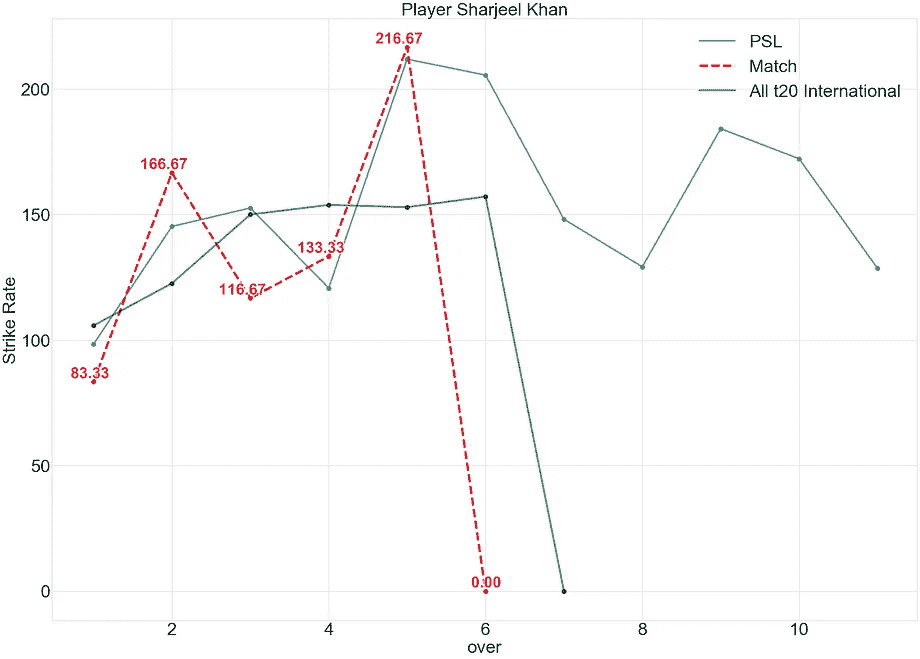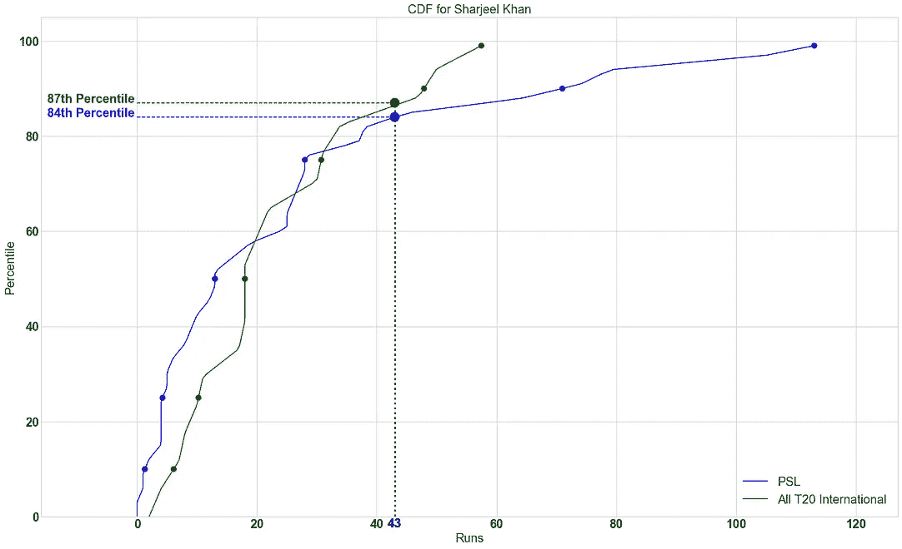

Sharjeel Khan performance comparison with PSL matches. 1st graph strike rate comparison and 2nd comparison is between runs distributions. (Image by Author)

**重要提示:** *第一张图描绘的是击球手的击球次数，而不是整个比赛的击球次数，这意味着它们是根据击球手在比赛中每打 6 个球进行汇总的。此外，最后一场比赛通常少于 6 个球，因此该场比赛的 SR 平均少于 6 个球。*

沙吉尔在 32 个球中得了 43 分，这给出了 134 的命中率。看第一张图表，Sharjeel 在比赛开始时的表现非常接近他在 PSL 和 T20 国际比赛中的第一次表现。他的命中率在第二( **166** )和第五( **216** )时变化非常明显，有趣的是这与他在 PSL 比赛中的表现一致，但远高于他在 T20 国际比赛中的总体表现。

第二张图显示了他的分数的百分比排名，或者更简单地说，他得分低于某个分数的可能性。在这场比赛中，他的 43 分对应于**第 84 百分位数**(意味着他在 84% 的时间内得分低于 43 分**。当把他的百分位排名与 T20 国际比赛进行比较时，他的得分低于 43 分的次数为 87%。从统计数据来看，与他的过去相比，这是一个不错的表现。**

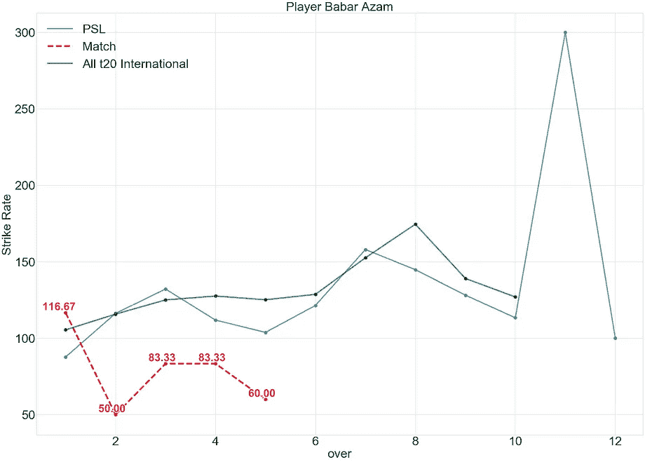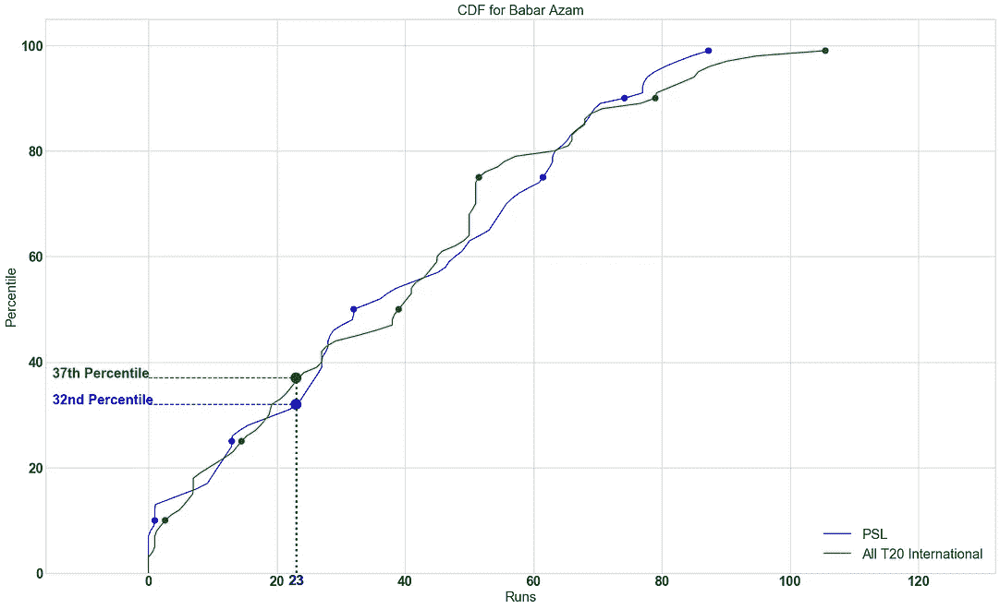

Babar Azam performance comparison with PSL matches. 1st graph strike rate comparison and 2nd comparison is between runs distributions. (Image by author)

巴巴尔·阿扎姆是世界级的击球手，但在这场比赛中，他的表现至少可以说是糟糕透顶。他以 116 的好球率开始表现强劲，但是他的表现严重低于平均水平。在 PSL 和 T20Is 上没有达到他的平均水平。总共 29 个球跑了 23 次，这意味着击球率为 79 次。值得注意的一件有趣的事情是，在他过去在 PSL 的表演中，他在第 10 次超越令人瞠目结舌的打击率 **300** 或每场 18 分后变得暴跳如雷(这种情况的样本量非常小，因为他不太可能达到那么远)。

至于他如何基于概率公平，他得分至少 23 分的概率有 **32% (PSL)** 和 **37% (T20I)** 。如果反过来，那么得分高于 23 分的概率为 **68% (PSL)** 和 **63% (T20I)** 。从统计学上来说，这是严重的表现不佳，他有相当高的概率得分更多。虽然这一分析排除了许多因素，如谁在打保龄球和场地条件，但可以公平地假设这种表现不佳是卡拉奇国王队输掉这场比赛的主要原因。

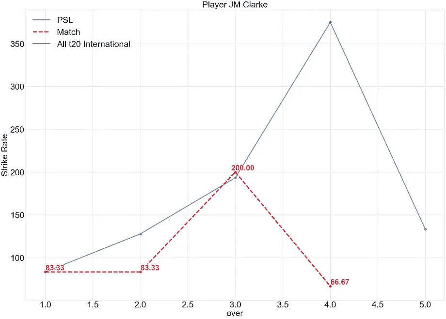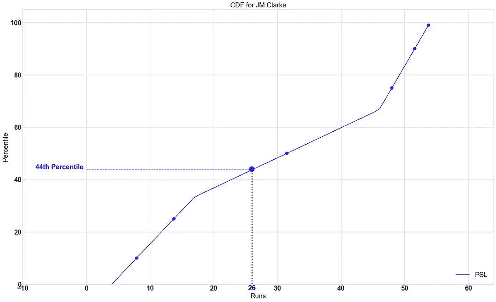

JM Clarke performance comparison with PSL matches. 1st graph strike rate comparison and 2nd comparison is between runs distributions. (image by author)

JM·克拉克是一名相对不知名的球员，以前主要参加县板球比赛，没有参加过 T20 国际比赛。他 24 分中的 26 分意味着 108 分的好球率。因为他的比赛尺寸很小，所以现在评价他的表现并不完全公平。总的来说，他的表现似乎略低于平时。**第 44 位**百分位意味着他有 **56%** 的几率得分更高。

## 第二局

现在让我们来分析获胜队木尔坦苏丹队的击球。从最高得分手穆罕默德·里兹万开始。

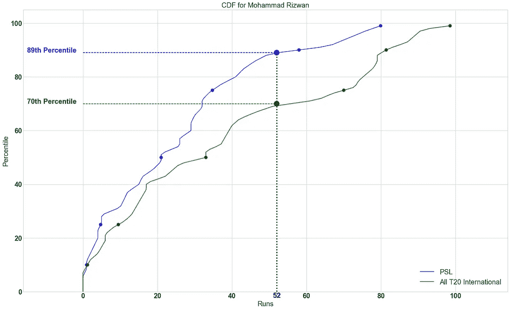

Muhammad Rizwan performance comparison with PSL matches. 1st graph strike rate comparison and 2nd comparison is between runs distributions. (Image by author)

Rizwan 打了 47 个球，得了 52 分，相当于 110 分。总的来说，统计数据说明了一切。虽然他在第一回合没有得分，但他在第二回合和第三回合开始非常积极地击球。根据他的平均成绩，Rizwan 通常以超过 100 的打击率开始他的击球。他的命中率在第六和第七回合下降，因为他对穆罕默德·纳比打了 3 只鸭子。

从百分位数来看，他的 52 次跑垒相当于 T2 在 T20 国际比赛中的第 70 个百分位数和 T4 在 PSL 的第 89 个百分位数。意味着与 PSL 比赛相比，他在 T20 国际比赛中得分超过 52 分的机会更高，但这种差异可能是由于 T20 国际比赛的样本更大。

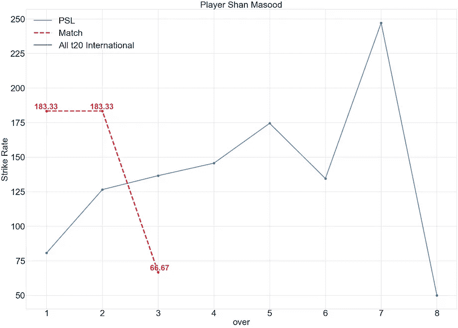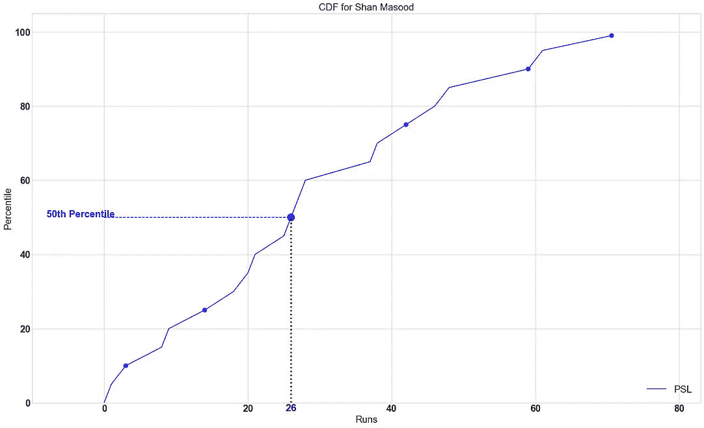

Shan Masood performance comparison with PSL matches. 1st graph strike rate comparison and 2nd comparison is between runs distributions. (Image by author)

下一个是尚·马苏德，他和 JM·克拉克一样没有参加过 T20 国际比赛。他的 18 次 26 分对应着 **144 的出色命中率。在之前的 PSL 比赛中，他的表现远远超出了他的平均命中率，这可能是因为他的搭档 Muhammad Rizwan 打得非常有侵略性。他在 PSL 的得分正好是他的平均得分。**

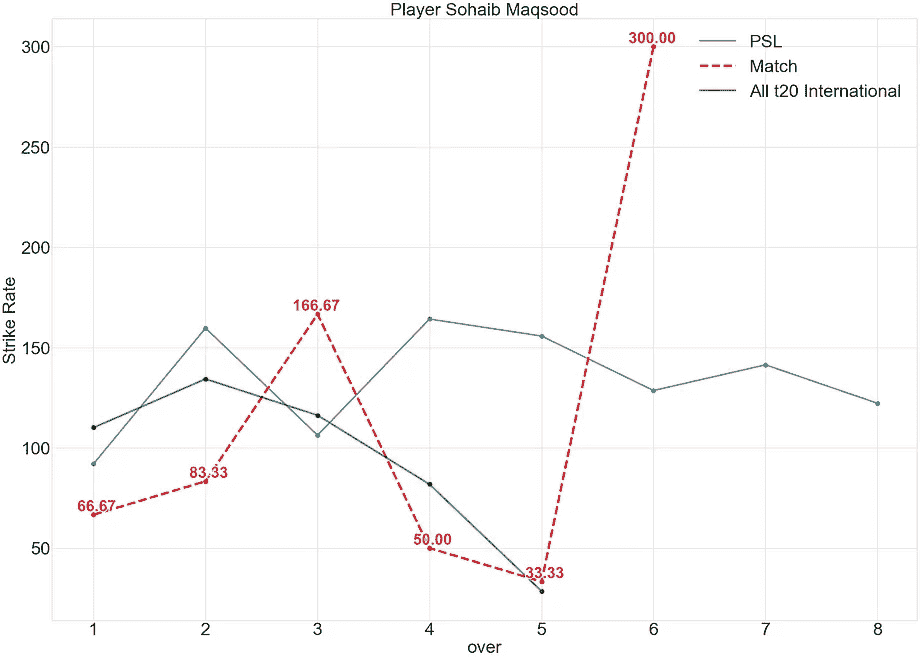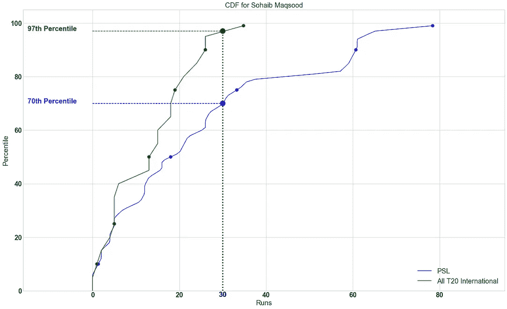

Sohaib Maqsood performance comparison with PSL matches. 1st graph strike rate comparison and 2nd comparison is with runs distribution. (Image by author)

Sohaib Maqsood 以 32 球 30 分结束了他的比赛——好球率为 93.7。在整场比赛中，他的击球表现不一，在中段和前段得分很少。可能是穆罕默德·里兹万的一个负责任的搭档，轮换着进攻，给里兹万一个得分的机会。在倒数第二个球中，他打出了 6 杆，最后两个球的命中率为 300。他在 T20 国际比赛中的所有表现(直到本文撰写之时)的 30 分得分都在第 97 百分位。30 分只比他在 T20 国际比赛中的最高分少了 7 分。他在 PSL 有更好的机会，在锦标赛中，他在 2018 年获得了 85 分的高分。他在这场比赛中的表现在他的得分分布的第 70 百分位数。

# 保龄球

这是这场比赛中保龄球的概要

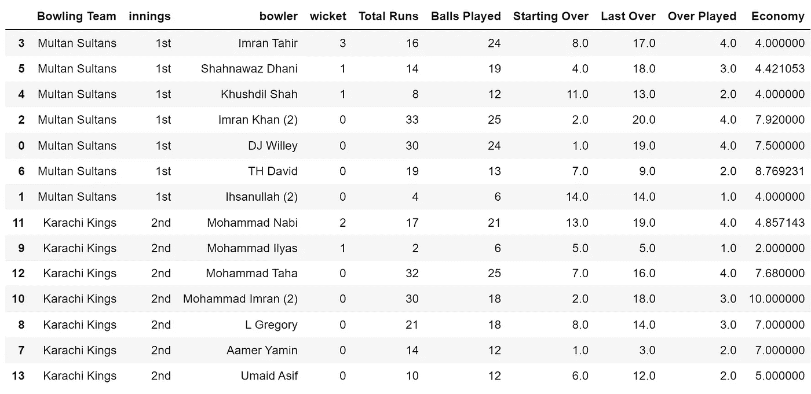

Bowling Summary Karachi Kings vs Multan Sultans played on 27th Jan 2022 (Image by author)

由于大多数保龄球手没有得到任何检票口和球员一样 Khushdil 沙阿，穆罕默德易勒雅斯有很少的比赛，他们的名字，我将只分析 3 名球员。

木尔坦苏丹的 Imran Tahir 和 Shahnawaz Dhani 以及卡拉奇国王的 Mohammad Nabi。

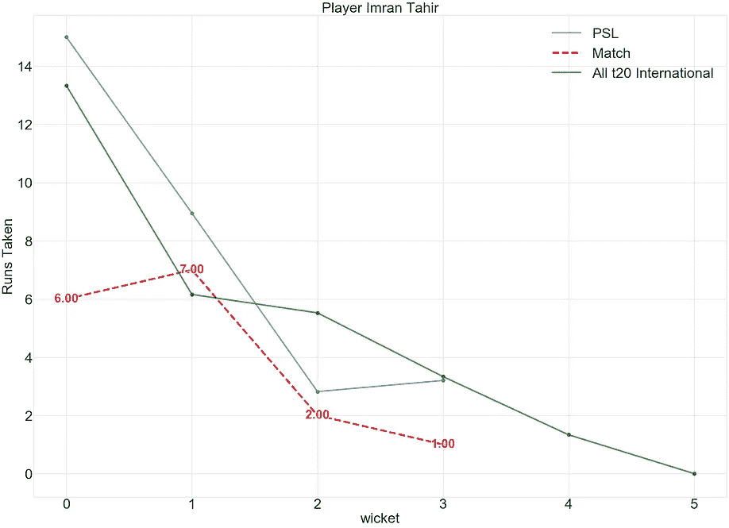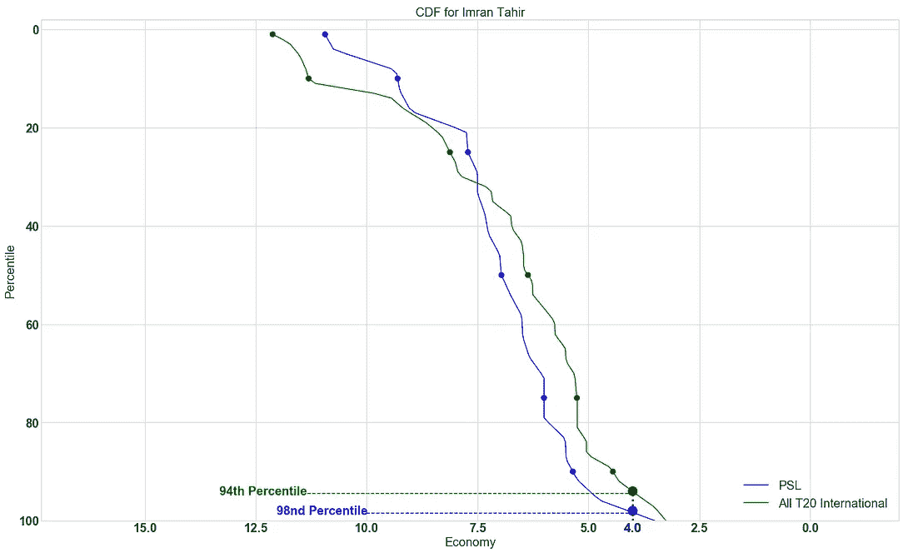

Imran Tahir’s performance, 1st Graph shows runs conceded per wicket, 2nd shows economy (runs conceded per over) percentile ranks. (Image by author)

**重要提示:**

*1。第一张图只显示了击球手的跑垒次数，而第二张图根据总跑垒次数(包括额外跑垒次数)计算经济性*。

*2。*

***3。对于第一个图，PSL & T20I 的平均值仅包括玩家在比赛* *中至少进入 1 个检票口的比赛。否则在第一个检票口前会有更多的失分！***

***4。因为最后一个三柱门的结果高度依赖于投球手在结束他的法术之前有多少次投球，所以不是精确的一对一比较，但仍然合适。***

**只看上面的图表，很容易得出结论，伊姆兰·塔希尔的表现达到了巅峰。平均来说，他承认在 PSL 跑了大约 15 次，在 T21 跑了 13.33 次，然后才开始第一次尝试。而在这场比赛中，他在第一个三柱门之前只让出了 6 次。总的来说，在比赛中，他在进入第二个检票口之前有点昂贵，但对于所有其他检票口，他在每个检票口的失分仍然低于他在 PSL 和 T20 国际比赛中的平均水平。**

**他在 24 个球中的 3 个三柱门只失了 16 分。这是一个 4.0 的经济体——按百分位数计算，他的经济在 PSL 的比赛中为 98%，在 T20 国际比赛中为 94%。至少可以说是壮观！**

**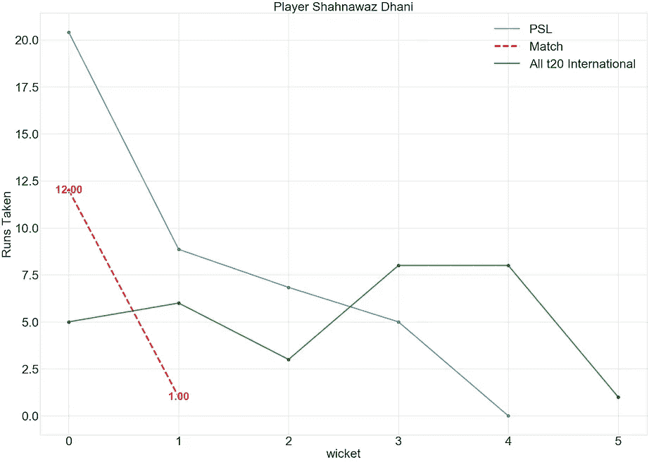****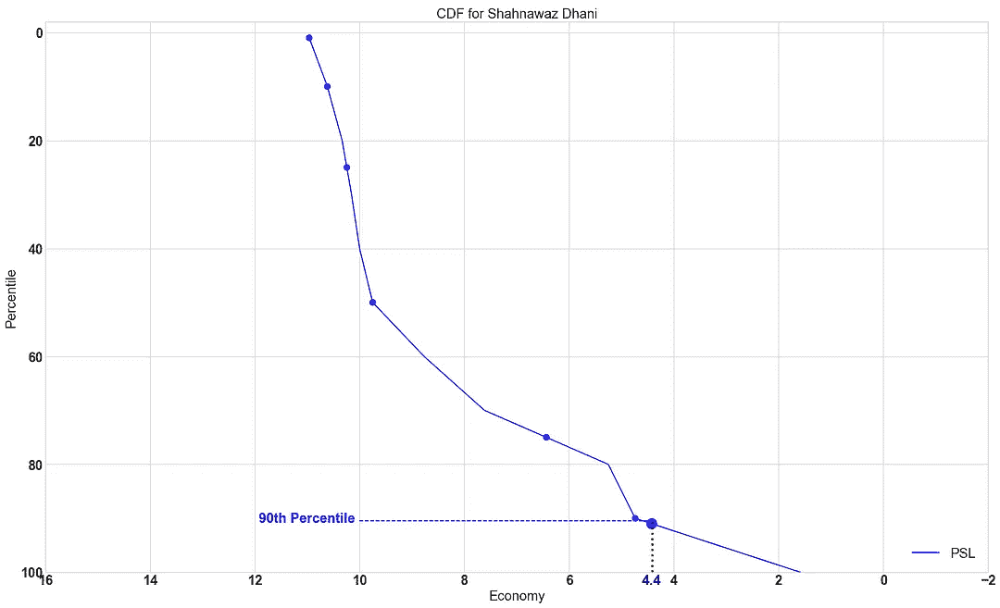**

**Shahnawaz Dhani performance, 1st Graph shows runs conceded per wicket, 2nd shows economy (runs conceded per over) percentile ranks (Image by author)**

****重要提示:** *在第二张图中，Shahnawaz Dhani 的 T20 国际纪录被排除在外，因为他只打了 2 场比赛。***

**Shahnawaz Dhani 在 19 个球中失了 14 分(额外 1 分)，并拿下了 1 个三柱门。看看他的平均水平，与他的 T20 国际纪录相比，他是相对昂贵的(然而，样本量只有 2)。然而，在 PSL，他通常会在一次击球前认输 20 次以上。总的来说，他的经济总量是 4.4 倍。与他的总体分布相比，这相当于第 90 个百分位数。然而，他是一个相对较新的球员，只有 11 次出场，所以这种比较必须半信半疑。**

## **第二局**

**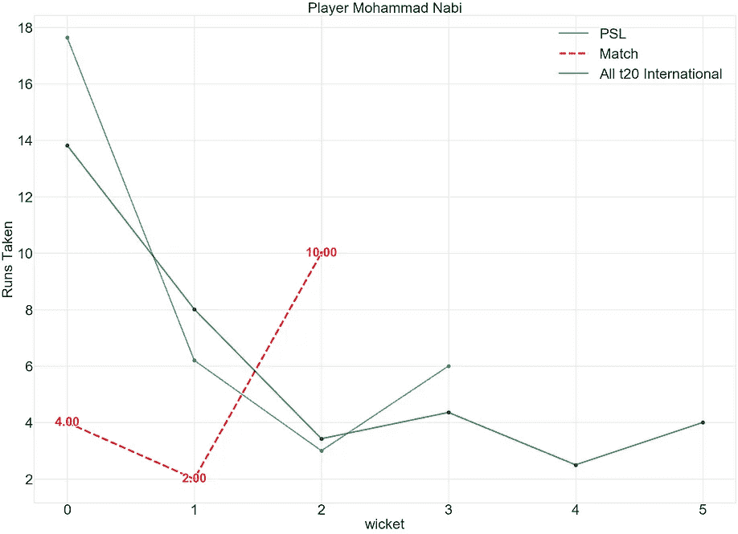****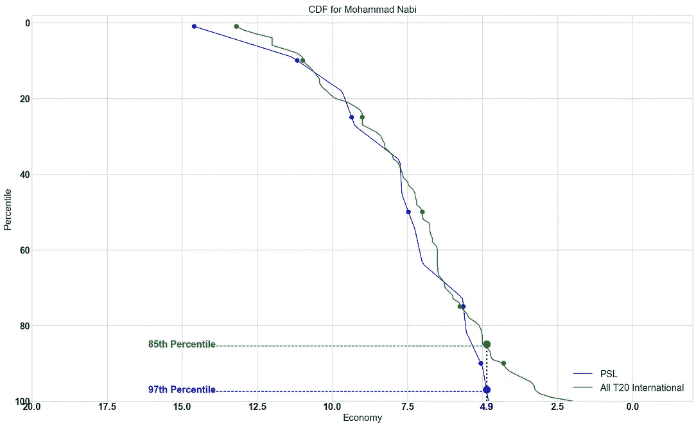**

**Mohammad Nabi performance, 1st Graph shows runs conceded per wicket, 2nd shows economy (runs conceded per over) percentile ranks. (Image by author)**

**Mohammad Nabi 通常会在获得第一个三柱门之前承认 **17.6 次运行** (PSL)和 **13.8 次运行** (T20I)。然而，在这种情况下，他非常便宜，在他的第一个三柱门之前让出了 4 分，在他的第二个三柱门之前只让出了 2 分。即使在失分 10 分后，他也无法进入第三个三柱门。**

**与 T20 国际和 PSL 相比，他的经济率高于标准。他的经济状况相当不错，每辆车跑了 4.9 次，在 T2 是第 85 个百分点(国际比赛是第 20 个百分点)，在 PSL 是第 97 个百分点(第 5 个百分点)。这意味着平均而言，他在 PSL 的价格比 T20I 更高。总的来说，这是一场非常值得尊敬和稳定的表演，但不幸的是，这并没有转化为卡拉奇国王队的胜利。**

**感谢您的阅读！希望你对我的分析感兴趣，请关注并为这篇文章鼓掌。我应该在我的方法中添加什么，欢迎任何建议。**