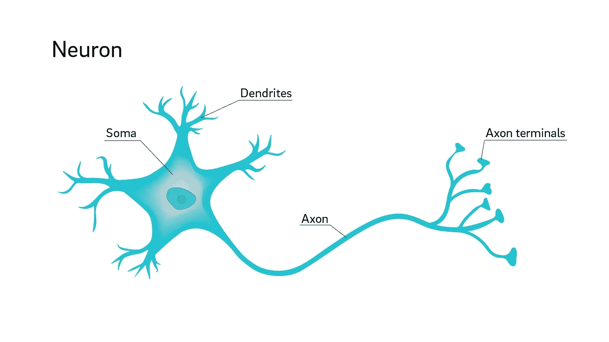

# 猴子看，猴子做

> 原文：<https://medium.com/mlearning-ai/monkey-see-monkey-do-adaa25bc9352?source=collection_archive---------7----------------------->

## 你有没有想过你会成为一台贴标签的机器？

很可能不是，然而你是。我们都是。

如果你有小孩，你可能会注意到他们有时会沉迷于引起你的注意。许多父母试图消除这种行为模式，他们认为这是幼稚和唠叨的。他们错了。

孩子对注意力的要求深深植根于他或她的学习模式中。虽然初学走路的孩子主要通过体验物理世界来学习，反馈是触觉的，但年龄较大的孩子已经超越了物理世界，进入了他们周围环境的心理模型。不仅仅是在理解和驾驭它的意义上，而是在建立抽象功能的心智模型上，比如社交、情绪、他人的情绪状态等等。建立和维护这样的模型是一个持续的过程，并且与环境允许或不允许动作的物理动作不同，这样的模型需要人类导师来正确地学习正确的模型。

> *孩子小时候，
> 就是这些问题的时候:
> 为什么我是我，为什么不是你？
> 我为什么在这里，为什么不在那里？时间从何时开始，空间从何处结束？阳光下的生活不只是一场梦吗？我所看到的，听到的，闻到的不仅仅是一个世界在这个世界之前的反映吗？*
> 
> 维姆·文德斯柏林的 Damiel，Der Himmelüber*，* 来自彼得·汉德克的《童年之歌》

## 发展心理学的一个重要分支

父母、老师、心理学家和其他关注儿童行为的人很早就认识到，儿童为了成为关注的焦点，会做出行为或行为不当。

对注意力寻求行为进行调查的理论和经验基础来自三个主要来源:[库尔特·勒温](https://en.wikipedia.org/wiki/Kurt_Lewin)对儿童环境的重视；[比约](https://en.wikipedia.org/wiki/Sidney_W._Bijou)、[拜尔](https://en.wikipedia.org/wiki/Donald_M._Baer)、[齐格勒](https://medicine.yale.edu/profile/edward_zigler/)等人关于社会强化效应的工作；而德莱库斯关于儿童行为的观点来源于阿尔弗雷德·阿德勒的个体心理学，勒温(1931)认为儿童所处的环境在考虑他的行为时非常重要。

他(勒温)特别强调社会环境，并认为儿童在不断增加的程度上学会了控制它。根据 Lewin 的说法，社会事实，即人们的互动和反应，在环境中与物理事实一样真实，并在儿童的行为中起着重要作用。

列文也认为孩子的需求在他与环境的互动中很重要。对孩子来说，社会需求和身体需求一样重要。因此，勒温说，“所有这些事情和事件(物理和社会事实)对孩子来说，部分是由它们的外观，但最重要的是由它们的‘功能可能性’来定义的。”"

在 Lewin 的理论中，*场力*是激励儿童或人进行运动或活动的总环境情况。这种场力具有方向、强度和作用点的特性。这个[价](https://en.wikipedia.org/wiki/Valence_(psychology))给予孩子行为的方向随着他想要和需要的内容而变化。

如果效价的对象是成年人的注意力，而障碍是成年人的漠不关心或全神贯注，以至于应用的直接点不令人满意，那么孩子可能通过应用不良行为来获得注意力。

Baer (1962)使用木偶作为社会强化物进行了研究，发现儿童会以这样的方式产生并保持木偶的注意力。然而，他说，儿童之间存在巨大的个体差异，一些儿童对作为社会强化物的关注没有反应。

在一篇关于社会强化研究的评价性文章中，Zigler (1963)指出，所有事件都可以分为强化或非强化。他还指出:“社会强化物强化反应的证明并没有阐明为什么会这样的核心问题。。。。核心问题是社会强化物对孩子意味着什么，这种意义最终由孩子的认知和动机属性决定。”

根据 Dreikurs 的理论，获得注意力是幼儿的首要目标。通过关注，他们在家庭群体或社区中找到自己的位置和地位。如果他们寻求的关注无法通过社会可接受的活动获得，或者如果他们的社会可接受的活动没有得到关注，那么他们就会行为不端，以获得期望的关注。

Gewirtz (1954)调查了儿童寻求注意的三个决定因素。这项研究中包括的三个独立变量是:孩子对一个成年人的可利用程度、成年人的性别和孩子的性别。在这项研究中，56 名 4-0 岁到 5-7 岁的中产阶级儿童被允许在一名成人在场的情况下画一次画架。在高可用性条件下，成人坐在孩子旁边，给予他完全的注意力。在低可用性条件下，成年人坐在稍远的办公桌前忙于处理文件。成年人在两种情况下都同样容易接受。这六个因变量是:随意发表的评论、随意问的问题、寻求注意(对明显注意的紧急反应)、眼神、完成的绘画和绘画时间。

结果表明，低可用性条件下寻求注意和扫视的平均频率显著高于高可用性条件下。

关于寻求注意，Gewirtz 说:“了解幼儿寻求注意的行为和类似强化物的过程很可能是理解他们与成人和同龄人一般社会交往的关键，但对他们寻求注意的维度或其前因知之甚少”(1956)。

Patterson，Littman 和 Hinsey (1964)研究了父母作为强化者的有效性。家长们被要求给掉在盒子右边的弹珠的孩子支持性的陈述。在其他时候，他们忽略了孩子，并成为与印刷材料占领。他们发现，父母在改变孩子的反应偏好方面有着显著的影响。

似乎在心理学研究寻求关注行为的情绪机制时，它忽略了问一个简单的问题:**为什么？**寻求关注的目的是什么？为什么年轻人会发展出一种迫使他们寻求照顾者关注的机制？

在不贬低先前研究的情况下，我想提出一个补充解释。

## 玩耍的孩子

一个试图理解如何在新经历的社会环境中表现的幼儿，并不是天生就有允许他在社会场景中导航的规则集(心智模型)，他们作为旁观者和参与者发展了自己的模型。但是他们怎么知道什么是适当的社会行为，什么是反社会行为呢？

答案是:他们玩。

玩耍是一种允许实验而没有惩罚的活动。当一个孩子在玩耍时，他处于**尝试的安全地带。**即使他犯规、打碎物体、打人或冒犯了某人，他也不会受到惩罚，因为*这只是一场游戏*。因此，游戏是一种无畏地探索社会和行为空间的方式。

然而，探索空间并不能创造一个正确行为的心理模型，因为你需要有人告诉你在那个空间里什么行为被认为是可接受的，什么是不可接受的。

当孩子寻求你的注意时，当他在玩耍时要求你看着他时，他不知不觉地寻找你微妙的反馈，他将基于此调整他的模型。每一个面部表情，每一个语调，其实都是一个引导信号，标签着他的游戏动作。你是皱眉、微笑、烦恼还是大喊大叫都成为贴在他当前行为模式上的标签。这样的信号不断地被孩子接收，更新他的世界模型、社会关系、正确的与不正确的行为模式、规范的与不规范的语言结构等等。

不管你喜不喜欢，你都是某种贴标签的机器。你的角色，你的责任，是不断地标记你的孩子的事件和行为，成为他周围世界的进化学习模型的真理来源(有时被称为*基础真理*)。

## 深层网络

如果你在过去的十年里没有生活在岩石下，你可能在这样或那样的背景下听说过深度学习这个术语。基于深度神经网络的深度学习试图模拟人类的大脑结构，从而创建一个学习过程接近我们心理过程的学习机器。

深度网络目前用于各种任务，从自动驾驶汽车读取环境并做出即时决策，到自动化医疗诊断，以及近年来理解自然语言并与之对话。

从形式上来说，深度学习是一类[机器学习](https://en.wikipedia.org/wiki/Machine_learning)算法，使用多层模拟神经元从原始输入中逐步提取更高级别的特征。

等等，什么？！

让我们倒回去一点。

**神经元**是大脑的基本工作单元，是一种专门用于向其他神经细胞、肌肉或腺体细胞传递信息的细胞。**神经元**是神经系统中向其他神经细胞、肌肉或腺体细胞传递信息的细胞。大多数**神经元**有一个细胞体、一个轴突和树突。

虽然这听起来可能令人生畏，但神经元非常简单(嗯，没有那么简单，当神经学家发现神经元实现了更多功能时，他们一直感到惊讶，但我离题了)。

神经元的核心是一个**求和机器**，它有一条电线进入(树突)，一条电线出来(轴突)。输入导线上的电流按枝晶加权并求和。如果它大于编码到神经元体(soma)中的某个阈值，那么传出的导线将沿着其轴突发送电脉冲(然后通过轴突末端分支到其他神经元的树突)。

一个人工的(模拟的)神经元基本上是一样的。它有输入，这些输入被加权到求和机器中，只有当加权和大于神经元的当前阈值时，它才会输出一个值。输入权重和阈值包括神经元的*状态*。当我们说一个神经元*学习*时，我们的意思是它将它的状态改变成一个新的状态(稍后会详细介绍)。

简单？是的，然而，这个简单的机制构成了你目前阅读这个复杂文本的大部分大脑，同时控制着你所有的身体功能。这一惊人的壮举不是由单个神经元完成的，而是由数十亿个神经元连接在一起形成的。

每一层都由多个神经元组成，连接到另一层，然后是另一层，然后…另一层，直到最后一层(输出层)，控制你身体的一个动作，产生一个决定，或抽象一个想法。

每一个中间层(通常称为*隐藏层*，即输入层和输出层之间的层)都抓住了结果输出的一部分。例如，当你看着一头大象时，你的大脑正在激活一个图像处理网络，其中较低层(更接近输入层)可能会识别边缘，而较高层可能会识别大象不同部分的形状，直到检测出我们看到的是一只完整的大象(而不是一只 Kanguru 或其他一些动物)。然后我们会说，深层网络已经学会了从许多其他动物中识别出一头大象。更严格地说，网络已经学会了大象的*模型*。

在现实中，深层网络可能更复杂，有输出，甚至隐藏层，连接回以前的网络，在整个网络中形成一种循环电流，直到它稳定下来并输出一个输出值。

但是深度网络是如何学习的呢？

## 学习过程

我们已经根据神经元的状态讨论了网络是如何工作的，但是神经元是如何达到这种状态的，例如，从许多其他动物中识别出一头大象？答案是:他们通过例子学习。

训练网络来识别它正在观察的动物的类型是一个过程，其中网络被显示许多动物的图像，并被告知每种动物的名称(将输入层想象为摄像机的视网膜，其中每个像素分别被输入到第一层神经元)。通过*告诉它每只*(动物)的名字，我们的意思是每张图片都有一个*标签*，上面有图片中的动物名称。

然后，网络调整其神经元的状态，以便为每个新图像输出给定的答案(标签)。因此，如果它看到一头狮子，并被告知(标记为)*这是一头狮子*，网络将调整其神经元的状态，直到输出层说:*狮子*。对每个新标记的图像重复这个过程，直到网络已经学习了所有的动物类型。

如果学习过程成功，该网络能够识别在学习过程中从未见过的图像中的动物。然后我们说网络已经*概括了*动物的概念。例如，如果给它看一幅从未见过大象的图像，它应该说:*大象*，即使它在学习过程中从未见过大象的具体图像。

但是你知道这个过程。你小时候醒着的时候已经做过无数次了。

## 一个孩子如何学习

当一个孩子来到这个世界时，他对动物和大象都没有概念。无论是在现实生活中还是在照片中，只有当他亲眼目睹了一头大象，并被告知他正在观察的物体是一头大象时，这个孩子才会学会识别它。

起初，他会犯错误，错误地识别类似大象的动物，并被告知他错了。慢慢地，通过一个试错的过程，他会建立他的大象样子的心理模型。但是，如果没有人给他的图像贴上标签，他就无法做到这一点。在有人告诉他动物不是大象，而是一种植物之前，他无法从长着象耳状大叶子的植物中辨别出动物。每个孩子都需要一个导师，一个知道他所经历的事物的真正标签(名字)的标签先知。

那个贴标机就是你。

大多数父母都扮演着*标签者*的角色，他们本能地从不考虑自己作为孩子学习过程的真理之源的角色。然而，他们就是这样，你就是这样。你给你的孩子读的每本图画书，你为他命名的每件物品，都是一个标签。您孩子犯的每一个您纠正的错误(例如，“嘿，妈妈，这是一只大象”看着大象一样的植物时)都是一个标签，告诉他他弄错了。正确的物体识别和错误的物体识别都可以作为学习的例子，让孩子能够概括大象的外貌和外貌，更新和设置其深层(生物)神经网络的内部状态。

## 作为证人的父母

还记得那个唠叨的孩子需要你的关注吗？他这样做不是为了怨恨，而是为了学习。当你的孩子让你看起来像爸爸时，他实际上是在告诉你:“请给我贴上这个标签”。“这”可能是他正在做的断言(这里有一只大象)，他正在采取的行动(试图在淋浴后喝浴缸的水)，或者是一个抽象的想法(太阳正在潜入海洋)。在每种情况下，你的回答都是指导他学习过程的标签。

如果你告诉他不要喝浴缸的水，你就把他们贴上了*不喝水*的标签。当你说*是的，这是一只大象*时，你是在给电视上的动物贴标签，当你告诉他太阳实际上并没有潜入海洋时，你是在更新他的地球和太阳之间关系的模型。通过目睹他的行为、想法和话语，你提供了无价的标签，没有这些标签，孩子就无法建立和更新他的世界神经模型。

但是如果他被误导了呢？

## 公正的证人

我们都知道那个有趣的叔叔觉得对你五岁的孩子恶作剧很有趣。当你试图告诉他屏幕上的动物是一只大象时，有趣的叔叔会告诉他这是一个烤面包机(并对他刚刚进行了完美的恶作剧感到非常欣慰)。有趣的叔叔是个*错误标签者*。

> *“你知道公平证人的行为。”*
> 
> *“嗯……不，我不知道。我从来没有和公平证人做过任何交易。”*
> 
> *那么？也许你没有意识到。安妮！”*
> 
> *安妮坐在跳板上；她转过头。朱宝喊道，*
> 
> 远处山顶上的那栋新房子——你能看到他们把它漆成了什么颜色吗
> 
> *安妮看着朱伯指的方向，回答道，*
> 
> *“这边是白色的。”她没有问朱伯为什么要问，也没有做任何评论。*
> 
> Jubal 继续用正常的语调对 Jill 说，“你看到了吗？安妮被灌输得如此彻底，以至于她甚至没有想到去推断对方可能也是白人。
> 
> 陌生土地上的陌生人，罗伯特·海因莱茵

这个世界并不是一个完美的学习环境，像滑稽叔叔这样的人多如牛毛，那么你的孩子怎么知道哪个是提供可信标签的公正见证人，哪个不是。答案是:他信任**你**。

孩子们直觉上信任他们的父母(除非有相反的证明)。在孩子的学习过程中，你作为父母的标签比有趣的叔叔或邻家孩子的标签更有分量。这就是为什么孩子们倾向于要求你的关注。因为你是真理的来源(直到他们进入青春期，在那里你成为所有邪恶的来源),你的孩子反复要求你给他的学习过程提供一套清晰的标签。

> 因为是什么促使主体形成一个自我理想，他的良心代表他充当守望者，产生于他的父母的关键影响，随着时间的推移，他的父母，那些训练和教导他的人，以及在他的环境中无数和不可定义的所有其他人，他的同胞，和公众舆论。
> 
> *西格蒙德·弗洛伊德，1914 年*

这种对你的时间的重复要求是要求在错误的标签上加强正确的标签。这种重复加强了神经元的状态(即输入权重和输出阈值)，这些状态反映了真实的世界模型(任何主观的人都可以反映事件的真实状态)，而不是不公平的目击者产生的噪音。

然后就是关注。

## 注意力建模

## *(不要与寻求关注行为混淆)*

当你教一个年轻人如何安全地过马路时，你通常会把他的注意力引向驶过的汽车。然而，当一个人过马路时，他周围会发生许多其他的事情。鸟儿在叫，风在吹，也许还下着毛毛雨，人们站在斑马线的另一端，天空中的云在动，更不用说情绪状态和随机的想法了。这是一场感官混乱。

当你把孩子的注意力引向汽车时，你是在给他提供一个*注意力焦点*，你是在告诉他:忽略所有其他数据，只关注驶过的汽车。学习过程现在变成了一个过滤过程，被注意力过滤掉了。这种*认知注意力*的过程允许孩子通过最少的数据点集中在最重要的数据点上来学习过马路模型。

同样，在神经网络的背景下，**注意力**是一种模仿认知注意力的技术。这种效果增强了输入数据的重要部分，淡化了其余部分——这种想法是网络应该将更多的计算能力用于数据中较小但重要的部分。

最近在自然语言理解方面的工作表明，旨在理解句子的深度学习算法在知道他们必须将注意力放在句子的哪个部分时表现得更好。无人驾驶汽车也是如此，它们需要处理海量数据，并在瞬间做出决定，比如将方向盘指向哪里、加油以及偶尔刹车。

这是很自然的，你的孩子会看着他的标签，将他的注意力吸引到重要的数据信号上，而不是嘈杂的信号上。是句子中的主语和宾语，还是飞驰而过的汽车。儿童必须开发一种过滤机制，只让重要的标记数据通过，以免其深层生物神经网络溢出而变得无用。

为此，他需要你全心全意的关注。

## 结束语

寻求注意的行为深深植根于儿童发展的早期和后期。虽然自 20 世纪 50 年代末以来，心理学家对这一现象提出了大量解释，但我认为值得应用新发现的关于大脑结构、机器学习和人工智能的数据，以扩大我们对迫使我们的孩子寻求我们关注的原因和驱动力的理解。

*原载于 2021 年 3 月 28 日*[*http://colderlazarus . me*](https://colderlazarus.me/2021/03/28/parents-children-deepnetworks/)*。*