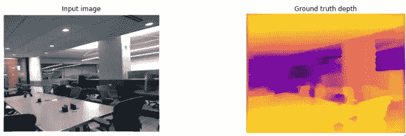
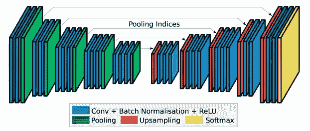
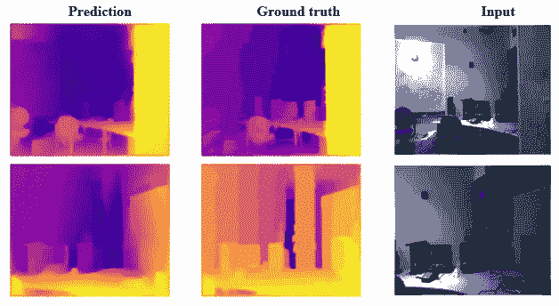

# 使用 U-网的单目深度估计

> 原文：<https://medium.com/mlearning-ai/monocular-depth-estimation-using-u-net-6f149fc34077?source=collection_archive---------0----------------------->

## 深度估计与实现的完整演练。

[Image Source](https://www.dreamstime.com/photos-images/top-hill.html)

长期以来，我们一直依赖于空间图像，虽然这已经带来了数百万的好处，但它有一个小小的限制，即它无法在我们的现实世界中解释自己，而这在最近的复杂应用中是必不可少的，如 Elonmusk 汽车，jeff 的机器人，甚至波士顿斑点狗。所以，现在是时候向前迈进，去寻找一些更先进、更适合的东西了。当我坐下来思考这个问题时，我内心的声音说“增加维度”,回响了两三次。我对此没有抱怨，因为这是我们正确进行机器学习的方式。

其实真的有人想过，用非典型的方式增加了空间图像的维度。我认为“维度”不是一个合适的词，他们将每个物体距离相机多远的信息编码为像素值，以米或英寸为单位，或者我们可以命名。图像是二维的，具有“x，y”轴，像素值代表第三维，比如“z”轴。

有专门为此设计的立体相机，像人眼一样有两个并排的镜头。但是，我们世界中的大多数相机都是由单个镜头组成的，所以我们将在软件方面解决这个问题，更准确地说，我们将模仿立体相机的功能。AI 在这方面做得非常好。

我们的主要任务是从 RGB 图像中创建一个深度图，类似于立体摄像机中产生的深度图。这是一个活跃的研究领域，每年有超过 100 篇论文发表，在本文中，我们将重点关注题为“通过迁移学习进行高质量单目深度估计”的论文。本文采用简单而强大的深度架构“U-Net”来完成这项任务，顾名思义，该架构的一部分是由在 ImageNet 数据库上训练的“DenseNet-169”组成的。我们将重现这些方法，并按照论文中的建议建立一个实验，观察它产生的结果。

本文的范围是详细讨论该系统的数据管道、模型架构和训练管道三个主要部分。同样为了最佳体验和更多乐趣，我建议运行驻留在这些 [Kaggle](https://www.kaggle.com/bmanikan/depth-estimation) 或 [Colab](https://colab.research.google.com/drive/1IaZdhdbLN0XfyWAtyMZO0Ian_He6Kkj-?usp=sharing) 笔记本中的电池。

## 数据管道:

我们将使用他们的官方论文中使用的 NYU 深度 V2 数据集，该数据集由室内场景组成，在深度估计问题的背景下最佳地描述了对象。我们不是看图像中的某个物体，而是更关注物体在图像中的位置，就像在整个场景中一样。因此，这个数据集由来自不同房间的视频帧组成，比如卧室、厨房、自习室、办公室等等。样本图像对如下所示:

Sample data | with plasma red color map

这个数据集只包含室内图像，你注意到我之前提到的“看穿结果”了吗？将在室外视频上训练该架构并评估其泛化能力，因为为什么 NI 想到在该室内数据集中训练该架构并通过传递室外图像或视频来评估其泛化能力，因为为什么不呢？！

一些数据集统计数据包括，包含 50688 对用于训练，其中我们将它以 80:20 的比例进行验证，并保留一组 640 对用于测试。正如该论文所建议的，我们保留形状为 640x480 的 RGB 图像和形状为 320x240 的深度图。我们将这些对归一化到{0，1}的范围内，并以 0.5 的概率通过水平翻转来增加对。

该论文建议使用批处理大小 8，自定义数据生成器类为图像生成形状的数据元组(8，480，640，3)，为深度图生成形状的数据元组(8，240，320，1)。

## 模型架构:

在这篇[论文](https://arxiv.org/abs/1505.04597)中，U-Net 首次被提出用于医学图像中的异常定位。它具有像素级定位的能力，并区分独特的模式。它看起来像一个“U”形结构，其中我们将一部分称为编码器，将另一部分称为解码器，并且解码器的每个块都使用跳跃连接连接到编码器的相应块。这有助于它比它的传统对手有更多的潜在空间，也就是说，它使用来自输入空间和所有中间表示的信息来将样本映射到一些明确定义的潜在空间，然后计算输出。这些跳跃连接在许多研究中得到了实验验证，以解决[退化](https://www.quora.com/What-exactly-is-the-degradation-problem-that-Deep-Residual-Networks-try-to-alleviate)问题。

Source: [Paper](https://ieeexplore.ieee.org/document/8451300)

如本文所述，我们使用“DenseNet-169”架构作为我们的编码器和预训练的权重，对于解码器，我们将从 1x1 卷积层开始，其输出通道数与截断编码器的输出通道数相同，并具有 4 个上采样模块，每个模块包括一个双线性上采样层，后面是两个 3x3 卷积层，输出滤波器设置为输入滤波器数的一半。并且，对于每个块，来自编码器的汇集层的输出与上采样层的输出连接。最后，每个卷积层与批量归一化层相适应，并且除了最后一个，每个上采样块之后是泄漏 ReLU 激活函数。

我们有一个更深层次的架构，在其最后一个编码器层包含 1664 个特征映射。在具有 V100 GPU 和 25Gb RAM 的 colab pro 实例中，每个时期大约需要 60 分钟。对于不超过 512 层的较小架构，我鼓励您参考本[报告](https://github.com/siddinc/monocular_depth_estimation/blob/master/depth_estimation.ipynb)中的实现。在对这两种体系结构进行实验时，它显示出训练和验证指标的范围有些相似，但它实际上在模型的泛化能力上有所不同。在保持测试集中，更深的模型表现得更好，精度高 10%,深度图也更清晰。

## 培训渠道:

我从这个问题结果的重要决定因素开始，损失函数。我们使用本文中提出的定制损失函数，结合三种度量，即灰度渲染的真实地面图和预测图的结构相似性，并计算 Sobel 梯度操作图的 F1 分数，阈值为 0.5 以获得清晰边缘，以及真实地面图和预测图之间的余弦距离。通过这样做，我们使网络学习地图的内部关系和相互关系，同时保持强有力的和锐利的边缘。

我们将使用 Adam 优化器，其权重衰减率为 1e-6，开始学习率为 0.0001，具有多项式衰减，还有一些检查点来跟踪它。最后，我们将使整个编码器层可训练，并使用著名的 model.fit()开始 10 个时期的训练。现在，向后靠，享受那些随着进度条向右移动而改变的漂亮的小数字，也许还有爆米花！

经过大约 12 个小时的训练，我获得了大约 95%的验证率和 85%的测试集准确率。通过查看测试集预测，我可以看到这些，

Colormap: Plasma Red

边缘又尖又紧，相当不错。此外，如前所述，我传入了在外部环境中录制的视频，得到了类似这样的内容，

Colormap: OpenCv JET

我们可以立即注意到帧之间的闪烁。这是因为这个模型是为预测单个图像而设计的，所以我对图像中的每一帧都运行了这个模型，并合并了结果。帧之间会有一些预测变化。为了更平滑的过渡，我们必须考虑考虑时间域的模型。

代码可在 [Colab](https://colab.research.google.com/drive/1IaZdhdbLN0XfyWAtyMZO0Ian_He6Kkj-?usp=sharing) 或 [Kaggle](https://www.kaggle.com/bmanikan/depth-estimation) 平台获得。一些参考包括官方的[文件](https://arxiv.org/pdf/1812.11941.pdf)和他们的[实施](https://github.com/ialhashim/DenseDepth.git)。

感谢您抽出时间来参观这条生产线。:)

## 确认:

这项工作是阿姆里塔大学 Senthil Kumar T 博士领导和指导的计算机视觉课程的一部分。