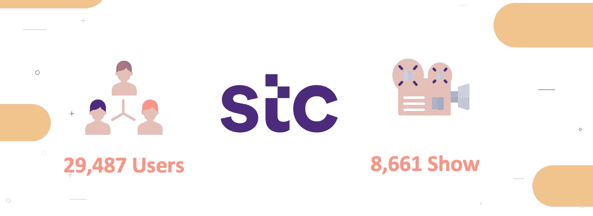
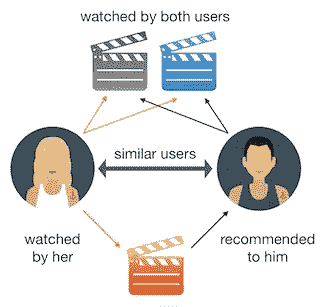
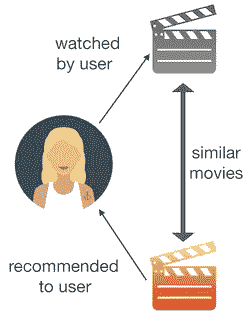
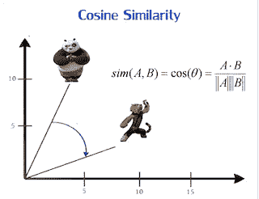
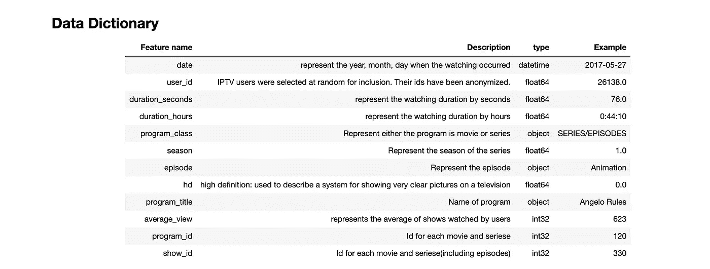
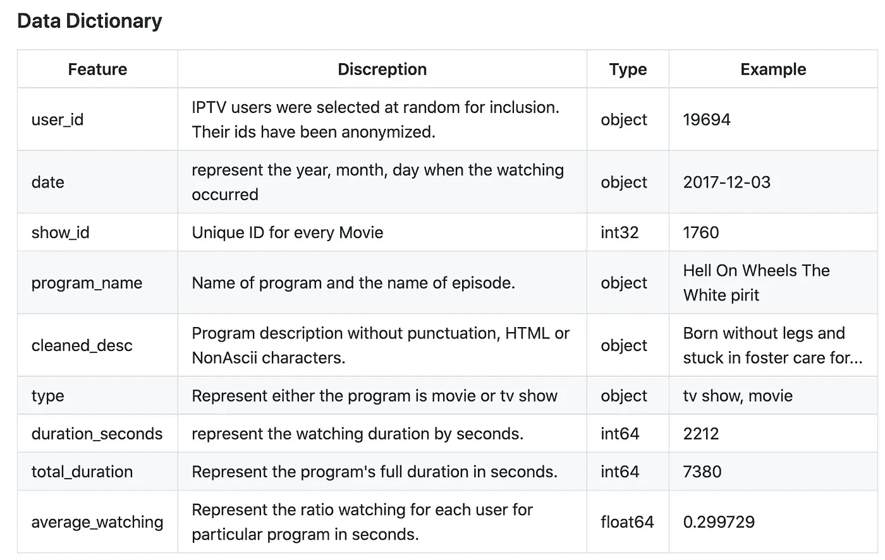
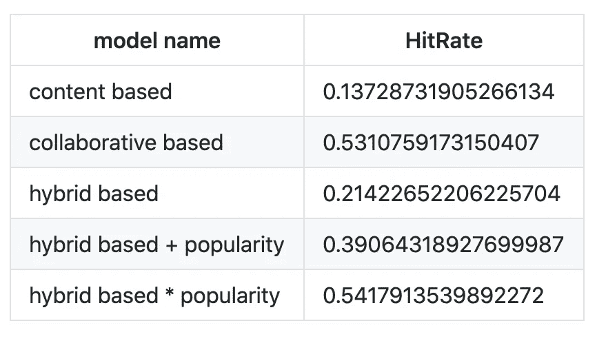
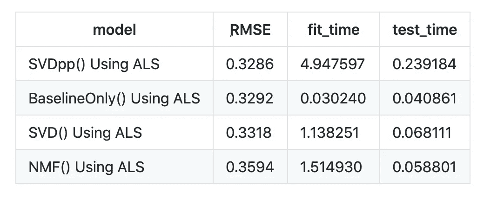

# 电影推荐系统

> 原文：<https://medium.com/mlearning-ai/movie-recommendation-system-f2f57290b1b8?source=collection_archive---------0----------------------->

> 这个项目由霓虹团队打造: [*艾莎·哈卡米*](https://www.linkedin.com/in/aisha-hakami-/)*[*莫尼拉·宾*](https://www.linkedin.com/in/monirah-bin-taleb-626b25100/) *塔勒布、* [*穆罕默德·阿里*](https://www.linkedin.com/in/m-s-alali/) *和* [*喇嘛阿尔哈比*](https://www.linkedin.com/in/lama-alroaithi/) 。*

**

*在我们的日常生活中，当我们在网上购物或寻找一部电影看时，我们通常会问我们的朋友或搜索它。当他们推荐我们不喜欢的东西时，他们会很享受。真是浪费时间对吧！！。那么，如果有一个系统可以理解你，并根据你的兴趣为你推荐，那该多好啊。这正是推荐系统的用途。*

*来到流媒体网站，理解用户的行为总是一个挑战。不论性别、年龄或地理位置，每个人都喜欢在家看电影。许多人喜欢特定类型的电影，比如爱情片、动作片或喜剧片，而其他人则喜欢主角和导演的视角。我们都通过这个奇妙的媒介联系在一起。然而，最令人兴奋的事实是，我们的选择和组合在节目的偏好方面是多么与众不同。但是，当我们考虑所有已经说过的话时，很难概括一部电影并说每个人都会喜欢它。因此，推荐系统就像是用户需求的特殊助手。*

**

*我们发现 [STC](https://www.stc.com.sa/wps/wcm/connect/english/individual/campaign/bigdata?utm_source=twitter&utm_campaign=open_data_day&utm_medium=tweet&utm_content=arabic) 发起了一个开放数据倡议来支持那些对数据科学感兴趣的人，这些数据与 Jawwy 相关联，这是他们的 IPTV 服务。我们决定这将是 neon 推荐系统之旅的开始。由 8k 内 29，487 个用户行为组成的数据全部显示在 3m 行中。我们不仅从用户的所有行为模式中提取汁液，也从电影本身中提取汁液。*

**

# ***建模***

*我们决定使用 6 种模式来尽可能满足用户偏好，这些模式是:*

# *协作过滤器*

*这种类型的过滤器是基于用户的观看历史，它会给我们推荐我们还没有看过，但是和我们相似的用户有并且喜欢的电影。为了确定两个用户是否相似，该过滤器考虑他们观看的电影。通过查看共同的电影，这种类型的算法基本上会根据相似用户的观看历史，为尚未观看该电影的用户推荐该电影。*

**

*优点:*

1.  *协同过滤系统由系统中的人来工作，人们应该比计算函数更擅长评估信息。*

*缺点:*

1.  *冷启动:协同过滤技术的一个主要挑战是如何为最近进入系统的新用户做推荐；这就是所谓的冷启动用户问题。*

*4.流行偏见:*

*   *无法向品味独特的人推荐商品。*
*   *倾向于推荐热门商品。*

# *基于内容的过滤器*

*根据我们喜欢的内容，算法会简单地挑选一部内容(故事描述)相似的电影推荐给我们。这种类型的过滤器不涉及其他用户。*

**

*优点:*

1.  *没有冷启动问题，不像协同过滤，如果程序有足够的描述，我们避免了“新项目问题”。*
2.  *能够推荐给口味独特的用户*

*缺点:*

1.  *基于内容的倾向于过度专业化:他们会推荐与已经消费过的商品相似的商品，有制造“过滤泡沫”的倾向。*
2.  *从不推荐用户内容档案之外的项目，人们可能有多种兴趣。*

# *基于流行度的推荐系统*

*   *这是一种推荐系统，它的工作原理是流行或任何流行的东西。这些系统检查流行的或最受用户欢迎的电影，并直接推荐它们。*
*   *例如，如果大多数用户经常观看一个节目，那么推荐系统将知道该节目是最受欢迎的，因此对于每个新用户，推荐系统将向该用户推荐该节目。*

# *混合过滤:*

*   *克服以前的缺点。*
*   *创建一个加权推荐器(权重平均选择，结合预测 _cf 和预测 _cn 的结果)。*
*   *创建不同权重的推荐器(权重被相等地选择，结合预测 _cf、预测 _cn 和预测 _ 流行度的结果)*
*   *使用加权 CL 和 CB 基于流行度创建推荐器(哪些 CL 和 CB 预测受流行度预测影响)*
*   *保持 CL、CB 和流行模式的优势。*
*   *克服 CL、CB 和流行模式的缺点。*

```
*indices = pd.Series(df_program_desc.index)

*#  defining the function that takes in movie title* 
*# as input and returns the top 10 recommended movies*
**def** recommendations(title,type_of_recommendation,  cosine_sim = cosine_sim, cosine_sim_w = cosine_sim_w, prec_watch_mat = prec_watch_mat):
    *'''*
 *type_of_recommendation values:*

 *0: the similarity scores of program description (Content Based),*
 *1: the similarity scores of watch history (Collaborative filtering),*
 *2: the similarity scores between watch history and program description (Hybrid),*
 *3: the similarity scores between watch history and program description* 
 *with popularity of program as indepent variables (Hybrid),*
 *4: the similarity scores between watch history and program description* 
 *as depent variables on popularity of program (Hybrid).*
 *'''*

    *# initializing the empty list of recommended movies*
    recommended_movies = []

    *# gettin the index of the movie that matches the title*
    idx = indices[indices == title].index[0]

    **if** type_of_recommendation == 0:

        *# creating a Series with the similarity scores of program description in descending order*
        score_series = pd.Series(cosine_sim[idx]).sort_values(ascending = **False**)

    **elif**  type_of_recommendation == 1:

        *# creating a Series with the similarity scores of watch history in descending order*
        score_series = pd.Series(cosine_sim_w[idx]).sort_values(ascending = **False**)

    **elif**  type_of_recommendation == 2:

        *# creating a Series with the similarity scores between watch history and program description in descending order*
        score_series = pd.Series(cosine_sim_w[idx]*0.5 + cosine_sim[idx]*0.5).sort_values(ascending = **False**)

    **elif**  type_of_recommendation == 3:

        *# creating a Series with the similarity scores between watch history and program description* 
        *# with popularity of program as indepent variables in descending order*
        score_series = pd.Series(cosine_sim_w[idx]*0.33 + cosine_sim[idx]*0.33 + prec_watch_mat*0.34).sort_values(ascending = **False**)

    **elif**  type_of_recommendation == 4:

        *# creating a Series with the similarity scores between watch history and program description* 
        *# as depent variables on popularity of program in descending order*
        score_series = pd.Series((cosine_sim_w[idx]*0.5 + cosine_sim[idx]*0.5) * prec_watch_mat).sort_values(ascending = **False**)

    **else**:
        print('You have entered wrong value')
        **return**

    *# getting the indexes of the 10 most similar movies*
    top_10_indexes = list(score_series.iloc[1:11].index)

    *# populating the list with the titles of the best 10 matching movies*
    **for** i **in** top_10_indexes:
        recommended_movies.append(list(df_program_desc.index)[i])

    **return** recommended_movies*
```

# *余弦相似度是如何工作的？*

*上面的所有过滤器都将使用余弦相似度，这是一种用于衡量文档相似程度的度量标准，与文档的大小无关。在数学上，它测量的是在多维空间中投影的两个向量之间的角度余弦。余弦相似性是有利的，因为即使两个相似的文档相距欧几里德距离很远(由于文档的大小)，它们仍有可能更靠近在一起。角度越小，余弦相似度越高。*

**

```
**# instantiating and generating the count matrix*
count = CountVectorizer()
count_matrix_desc = count.fit_transform(df_program_desc['cleaned_desc'])

*# generating the cosine similarity matrix on program description*
cosine_sim = cosine_similarity(count_matrix_desc, count_matrix_desc)

*# generating the cosine similarity matrix on watch history*
cosine_sim_w = cosine_similarity(watch_crosstab_transpose.values, watch_crosstab_transpose.values)*
```

## *惊喜*

*我们还使用了这个库，它是一个 Python scikit，用于构建和分析处理显式评级数据的推荐系统。*

*这个惊喜的设计有以下几个目的:*

*   *让用户完全控制他们的实验。*
*   *提供各种现成的预测算法，如基线算法、邻域法。*
*   *使新算法思想的实现变得容易。*

# *数据工程:*

*为了应用上述所有方法，我们需要添加一些原始数据没有的特征。*

**

*因此，我们使用一个外部数据集来获取每部电影的描述和总时长。有电影名的那一栏需要清理。当我们合并所有的表时，所有的内容都需要小写以避免重复。我们还清理了描述*

```
**# Function for removing NonAscii characters*
**def** _removeNonAscii(s):
    **return** "".join(i **for** i **in** s **if**  ord(i)<128)

*# Function for converting into lower case*
**def** make_lower_case(text):
    **return** text.lower()

*# Function for removing stop words*
**def** remove_stop_words(text):
    text = text.split()
    stops = set(stopwords.words("english"))
    text = [w **for** w **in** text **if** **not** w **in** stops]
    text = " ".join(text)
    **return** text

*# Function for removing punctuation*
**def** remove_punctuation(text):
    tokenizer = RegexpTokenizer(r'\w+')
    text = tokenizer.tokenize(text)
    text = " ".join(text)
    **return** text

*# Function for removing the html tags*
**def** remove_html(text):
    html_pattern = re.compile('<.*?>')
    **return** html_pattern.sub(r'', text)

*# Applying all the functions in description and storing as a cleaned_desc*
newdf['cleaned_desc'] = newdf['description'].apply(_removeNonAscii)
newdf['cleaned_desc'] = newdf.cleaned_desc.apply(func = make_lower_case)
newdf['cleaned_desc'] = newdf.cleaned_desc.apply(func = remove_stop_words)
newdf['cleaned_desc'] = newdf.cleaned_desc.apply(func=remove_punctuation)
newdf['cleaned_desc'] = newdf.cleaned_desc.apply(func=remove_html)*
```

*此外，为了使用惊喜库，我们需要用户的评级，因为我们的数据中没有它，我们决定做一个替代方案，即用户是否看了一半以上的电影，然后他喜欢它，否则不喜欢。我们使用(regex)提取分钟，并将其转换为适当的类型，然后将其从分钟转换为秒。我们计算观看平均数，以此作为用户评级。*

```
**# Extract minute by usinf (regex) and convert to appropriate type* 
merged_df_movie['total_duration'] = merged_df_movie['duration'].str.replace(r'min', '')
merged_df_movie['duration_seconds'] = pd.to_numeric((merged_df_movie['duration_seconds']) , errors='coerce').astype('Int64')
merged_df_movie['total_duration'] = pd.to_numeric((merged_df_movie['total_duration']) , errors='coerce').astype('Int64')

*# convert from min to sec*
merged_df_movie['total_duration']=(merged_df_movie['total_duration']*60)*
```

*最终数据集:*

****

*我们使用命中率作为余弦矩阵算法的评估指标*

*点击率为用户生成前 n 名推荐，并将它们与用户观看的推荐进行比较。如果它们匹配，则将命中率增加 1，对整个数据集执行此操作以获得命中率。因为我们想向用户推荐新电影，所以越接近 0 越好。我们将前 N 名列表中每部电影的点击数相加，然后除以电影总数。*

**

*因为我们想向用户推荐新电影，所以越接近 0 越好。基于内容的模型代表了一个很好的分数。而协作性没那么好。混合动力车型保持了之前车型的优势，获得了不错的成绩。混合和流行在某种程度上偏向于用户偏好，也代表了一个不错的分数。*

*为了惊喜*

**

*我们使用 RMSE 和 SVDPP 等算法来评估惊喜模型，SVD PP 是 SVD 的扩展，考虑了隐式评级。*

**

*我们开发了一个用三个框架编写的网站演示，从处理 python 模型的 flask 开始，然后将结果发送到连接到 API 的 ajax，以获取电影海报和细节。最后将所有这些渲染到 HTML 中，以优雅的风格显示出来:)*

*你不能从[这里](https://neon-recommendation-system.herokuapp.com/)开始尝试*

*感谢您阅读这篇文章，希望您喜欢我们的作品！！*

*感谢我的团队朋友们如此努力地工作，也感谢我们的主管:[穆克什·米特拉库马](https://www.linkedin.com/in/mukesh-mithrakumar/)*