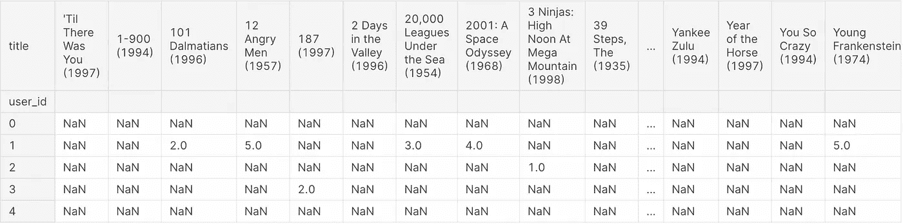
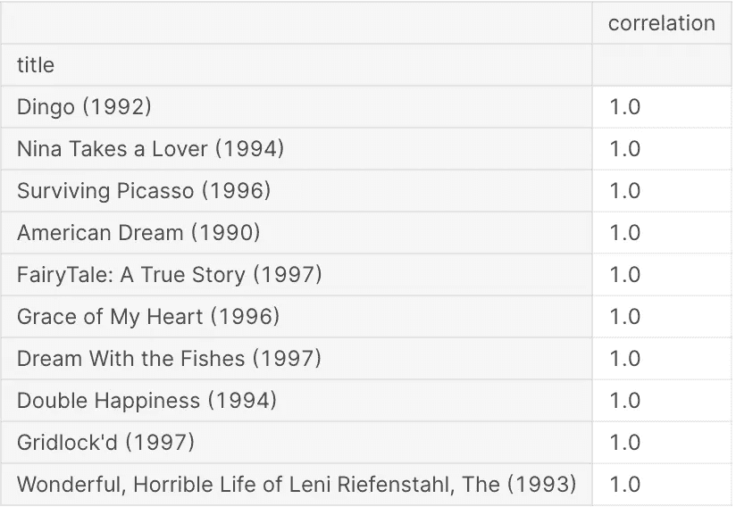
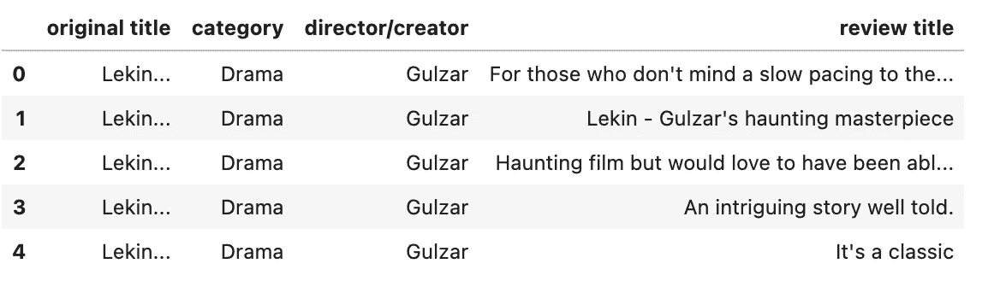
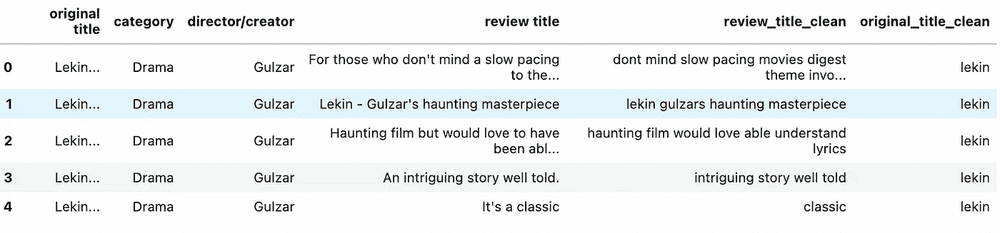
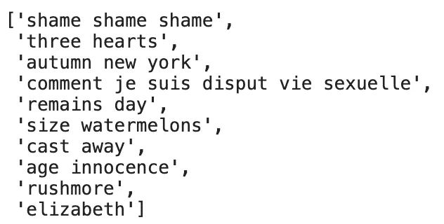

# 电影推荐系统

> 原文：<https://medium.com/mlearning-ai/movie-recommender-system-b348ecb0e19f?source=collection_archive---------4----------------------->


Image by [pixabay](https://pixabay.com/illustrations/question-mark-pile-question-mark-1495858/)

在这篇文章中，我将展示一些流行的推荐算法。

推荐系统用例广泛应用于电子商务、在线娱乐平台(网飞、Spotify、Youtube 等)、健康技术等等。

它真的可以有效地为我们的用户提供他们需要的商品，而无需在平台上手动搜索。我个人认为，作为一名数据科学家或分析师，我们至少需要了解推荐引擎的基本工作原理。

因此，在第一部分，推荐将基于每个电影名称的评级和电影之间的相关性。

接下来，将会有一个只有文本数据的推荐系统。

文章指南:

1.  通用推荐系统
2.  基于内容的推荐系统

## **通用推荐系统**

对于我们的第一个推荐系统，我们将使用包含电影名称及其基于平台上每个用户的相应评级的数据集。

因此，我将使用来自 Kaggle 的数据集(请参考下面的链接)，数据集包含以下主要特征:

1.  item_id:每部电影的唯一 id
2.  标题:电影的名字
3.  user_id:每个用户的唯一 id
4.  评级:电影评分(1-5)

从以上特征，我们可以简单地通过计算每个电影之间的相关性来简单地开发我们的推荐模型。

```
#Generating Pivot Table for each movie titledf_title = pd.read_csv('/kaggle/input/dataset/Movie_Id_Titles.csv')
df_dataset = pd.read_csv('/kaggle/input/dataset/Dataset.csv')

df_merged = pd.merge(df_title, df_dataset, left_on = 'item_id', right_on = 'item_id')pivot = df_merged.pivot_table(index = 'user_id',columns = 'title', values = 'rating')
pivot.head()
```



上面的数据透视表告诉我们每个用户给数据集中的每部电影多少分。

如您所见，数据集中有许多 NaN 值，最好保持原样，而不是用平均值或中值替换这些值(因为这将在测量电影之间的相关性时产生偏差结果)。

接下来，我们将生成一个函数来衡量我们观看的电影与其他电影的相关性，并根据高相关值提供推荐。

```
def movie_correlation(movie_title, n) :
    movie_rating = pivot[movie_title]
    similar_to_movie = pivot.corrwith(movie_rating)
    corr_ = pd.DataFrame(similar_to_movie, columns=['correlation'])
    corr_.dropna(inplace=True)
    return corr_.sort_values(by ='correlation',ascending=False).head(n)

movie_correlation('12 Angry Men (1957)', n = 10)
```



最终结果显示了基于我们观看的电影的前 10 部电影推荐，在这种情况下，电影“12 个愤怒的人(1957)”提供了上述 10 部电影名称，因为它与它具有高度的相关性。

带有评级的一般推荐开发起来很简单，生成结果也很快，但有时评论并不容易获得，推荐引擎向其用户提供任何推荐都是不可持续的。

因此，另一种选择是开发基于内容的推荐。

## 基于内容的推荐系统

在这一节中，我将简单地演示我们如何利用文本数据来创建一个推荐系统。

本部分使用的数据来自 Kaggle(请参考下面的链接)。

对于这些特性，我们将在本文中使用以下内容:

1.  原标题:电影片名
2.  类别:电影类型
3.  导演/创作者:电影制片人
4.  审阅标题:审阅的标题

```
df = pd.read_csv('/kaggle/input/imdb-320000-movie-reviews-sentiment-analysis/IMDB_dataset_320.000_reviews.csv')df_final = df[['original title','category','director/creator','review title']]
df_final.head()
```



我要对这些数据做的是使用余弦相似度根据“评论标题”值推荐一个电影列表。

余弦相似度是用于测量两个文档的字数之间的欧几里德距离和角度的术语(角度越小，余弦相似度越高)。

```
#Import Library for Text Preprocessing and Model Developmentfrom nltk.corpus import stopwords
from sklearn.metrics.pairwise import linear_kernel, cosine_similarity
from sklearn.feature_extraction.text import TfidfVectorizer
import rereplace_by_re = re.compile('[/(){}\[\]\|@,;]')
symbols_re = re.compile('[^0-9a-z #+_]')
stopwords_ = set(stopwords.words('english'))def clean_text(text) :

    text = text.lower()
    text = replace_by_re.sub('', text)
    text = symbols_re.sub('', text)

    text = ' '.join(word for word in text.split() if word not in stopwords_)

    return text

df_final['review_title_clean'] = df_final['review title'].apply(clean_text)
df_final['original_title_clean'] = df_final['original title'].apply(clean_text)
df_final.head()
```



现在，在清理“评论标题”和“原始标题”数据后，我们有了必要的数据集。

接下来，我们将开始使用 tfidf 矢量器和余弦相似度来构建我们的模型。

```
df_final = df_final[~df_final.duplicated()]df_final.set_index('original_title_clean', inplace = True)tf = TfidfVectorizer(analyzer = 'word', ngram_range = (3,3), min_df = 1)tfidf_matrix = tf.fit_transform(df_final['review_title_clean'])cosine_similarities = cosine_similarity(tfidf_matrix, tfidf_matrix)indices = pd.Series(df_final.index)#Function for Developing Recommendation Model def movie_recommendations(title,cosine_similarities = cosine_similarities) :

    recommendation_movies = []

    idx = indices[indices == category].index[0]

    score_series = pd.Series(cosine_similarities[idx]).sort_values(ascending = False)

    top_10_index = list(score_series[1:11].index)

    for a in top_10_index :
        recommendation_movies.append(list(df_final.index)[a])

    return recommendation_moviesmovie_recommendations('logans war bound honor')
```



以下是基于上述代码的逐步过程:

1.  将我们的目标结果设置为数据框架中的索引
2.  使用 TfidfVectorizer 将文本数据(review_title_clean)转换为字数
3.  从 Tfidf 矩阵数据中寻找余弦相似性
4.  从数据帧中生成一个由索引组成的变量

完成所有 4 个步骤后，我们可以开始构建我们的推荐模型。

推荐模型将使用电影标题作为输入，基于其余弦相似性的得分来生成推荐。

所以基于上面的模型，基于余弦相似性得分，电影《洛根战争界限荣誉》与其他 10 部电影(从上面的图像中可以看出)有相似性。

本文到此结束，我希望这能简化推荐系统的开发过程，给所有的读者。

还有其他的推荐系统主题我还没有涉及，那就是协同过滤推荐系统。将来，我会写一篇关于它的文章，但现在，我认为这足以让你们对推荐系统如何工作有一个大致的了解。

再次感谢你的支持，如果你觉得我的内容有帮助，请鼓掌或订阅我的页面。另外，如果你们有想要阅读的特定主题，请随时告诉我。

参考资料:

[](https://www.kaggle.com/code/kelvinprawtama/movie-recommendation-system-in-python/notebook) [## Python 中的电影推荐系统

### 使用 Kaggle 笔记本探索和运行机器学习代码|使用来自电影推荐系统的数据

www.kaggle.com](https://www.kaggle.com/code/kelvinprawtama/movie-recommendation-system-in-python/notebook) [](https://www.kaggle.com/code/kelvinprawtama/movie-recommendation-system) [## 电影推荐系统

### 使用 Kaggle 笔记本探索和运行机器学习代码|使用来自 IMDB 320.000 电影评论、情感…

www.kaggle.com](https://www.kaggle.com/code/kelvinprawtama/movie-recommendation-system) [](/mlearning-ai/mlearning-ai-submission-suggestions-b51e2b130bfb) [## Mlearning.ai 提交建议

### 如何成为 Mlearning.ai 上的作家

medium.com](/mlearning-ai/mlearning-ai-submission-suggestions-b51e2b130bfb)