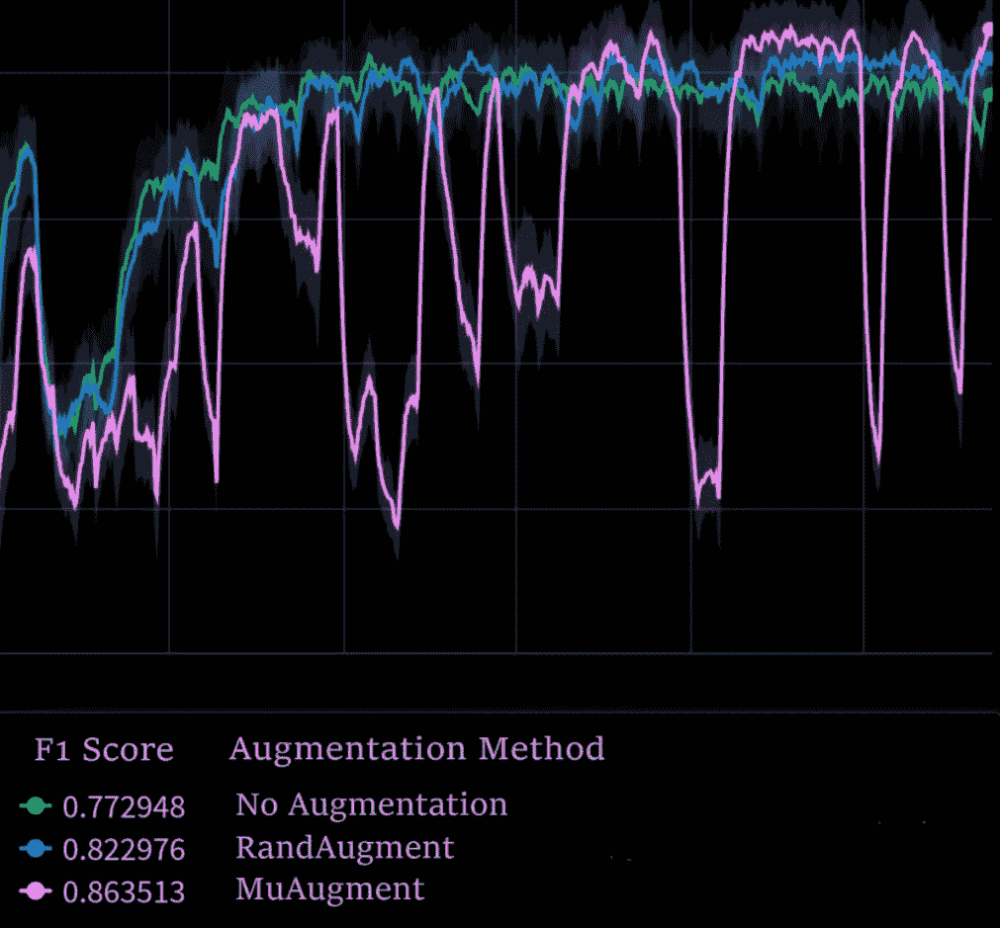

# muaraugation:SOTA 数据扩充的最简单方法

> 原文：<https://medium.com/mlearning-ai/muaraugment-easiest-way-to-sota-data-augmentation-39a535826636?source=collection_archive---------2----------------------->


All images are created by the author.

我想要一种简单的方法来获得最先进的图像增强管道，不需要手动迭代，不需要训练单独的模型，也不需要思考。为此，我创建了 MuarAugment(**M**odel**U**n certainty-**A**nd**R**和基于内存的 **Augment** ation)，这是一个基于 Pytorch、Albumentations 和 Kornia 的 GPU 支持的 Python 包。

本文将指导您将 MuarAugment 整合到您的计算机视觉管道中。

有一些资源你可以用来掌握。有 Colab 教程演示 mua raugation。本文中的大部分材料都来自于这些。

*   [这里的](https://github.com/adam-mehdi/MuarAugment/blob/master/MuAugmentTutorial.ipynb)是在 colab 上使用 MuarAugment 的算法`MuAugment`的端到端分类任务。(1)
*   [这里的](https://github.com/adam-mehdi/MuarAugment/blob/master/RandAugmentTutorial.ipynb)是在 colab 上使用 MuarAugment 的`RandAugment`实现的模板。(2)
*   另请参见我的[上一篇*中的*后一篇](https://adam-mehdi23.medium.com/automatic-data-augmentation-an-overview-and-the-sota-109ffbf43a20)文章，了解自动数据增强方法和 muaraugement 的动机，以及 RandAugment 和 muaraugement 算法。
*   MuarAugment [GitHub](https://github.com/adam-mehdi/MuarAugment) 包含代码和额外的资源(当且仅当您发现 MuarAugment 有用时，请给它打一颗星)。

# 高级演练

MuarAugment 采用领先的管道搜索算法 RandAugment[1]和基于模型不确定性的增强方案[2](此处称为 MuAugment)，并修改它们以在 GPU 上批量工作。Kornia[3]和 Albumentations 分别用于批量转换和项目转换。

让我们进入 MuarAugment 的使用。

```
# You can install MuarAugment via PIP:!pip install MuarAugment
```

## MuAugment

`MuAugment`是 MuarAugment 中的重型自动数据扩充策略。它比基于 GANs 的自动数据扩充管道简单，但比`RandAugment`或手动扩充复杂。

MuAugment 的训练在验证集上令人困惑地不稳定(它在训练损失上单调递减)，但它最终的表现明显优于竞争方法。



Record of training vanilla ResNet50s on the Kaggle Plant Dataset.

对于`MuAugment`，只需修改训练逻辑，正常训练即可。

在 PyTorch 闪电中:

在纯 PyTorch 中:

有关更多详细信息，请参见 MuAugment (1)上的 colab 笔记本教程。

## 随机扩增

MuarAugment 还提供了 RandAugment 的直接实现，这是一个简单而有效的自动数据扩充策略，使用了白蛋白:

参见 colab 笔记本教程(#2)了解更多关于`AlbumentationsRandAugment.`的细节

# 享受

我将在训练输入图像的神经网络时使用 MuarAugment，使用`MuAugment`进行图像分类，使用`RandAugment`进行其他任务。(目前我在变形金刚组成的创成式模型中使用`AlubumentationsRandAugment`。)我希望你会和我一样发现这个包很有用。

## 参考论文

1.Cubuk，Ekin 等人，“RandAugment:无需单独搜索的实用数据增强”，2019，[arXiv](【http://arxiv.org/abs/1909.13719】[)。
2。吴，森等，“线性变换在数据增强中的泛化效应”，2020，[arXiv](](http://arxiv.org/abs/1909.13719))。
3。Riba，Edgar 等人，“Kornia:py torch 的开源可区分计算机视觉库”，2019，[arXiv]([https://arxiv.org/abs/1910.02190](https://arxiv.org/abs/1910.02190))。