# NVIDIA GPUs 的多进程服务(MPS)

> 原文：<https://medium.com/mlearning-ai/multi-process-service-mps-of-nvidia-gpus-2d8683df273f?source=collection_archive---------2----------------------->

这篇全面的文章收集了理解 NVIDIA GPUs 的多进程服务(MPS)能力所需的所有信息。这篇文章就像一个时间线故事，详细阐述了理解 MPS 如何工作所需的概念。从 CPU 和 GPU 的区别入手，阐述了 GPU 的利用不足问题；之后，它深入研究 CUDA 流，讨论 Hyper-Q，最后到达 MPS。如果读者想直接阅读 MPS，他们可以向下滚动到 MPS 部分或使用 Nvidia 文档，如参考资料部分所示。

# 介绍

与中央处理单元(CPU)相比，图形处理单元(GPU)为计算中具有并行特性的应用提供了显著更高的性能增益。然而，开发顺序程序比开发并行程序容易得多，因为它不需要并行思维和解决问题的技能。另一方面，并行程序的设计和调试通常需要更多的时间和脑力。然而，这是在软件层面获得加速的代价。此外，与 CPU 相比，GPU 拥有更多内核。考虑以下 CPU 和 GPU 规格差异的示例。A100 GPU 有大约 7000 个简单内核，而 AMD EPYC 7742 只有 64 个复杂内核。

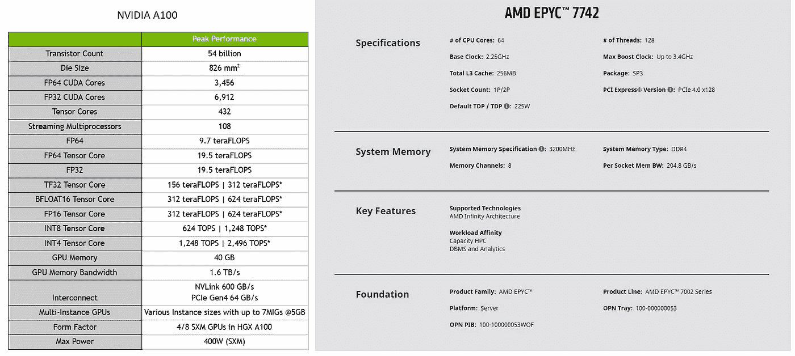

CPU and GPU specification difference [[NVIDIA A100](https://www.nvidia.com/en-us/data-center/a100/)][[AMD EPYC 7742](https://www.amd.com/en/products/cpu/amd-epyc-7742)]

下图显示了它们在架构方面的不同之处。CPU 采用大型缓存层次系统，这使它们成为面向延迟的处理器，而 GPU 是面向吞吐量的。

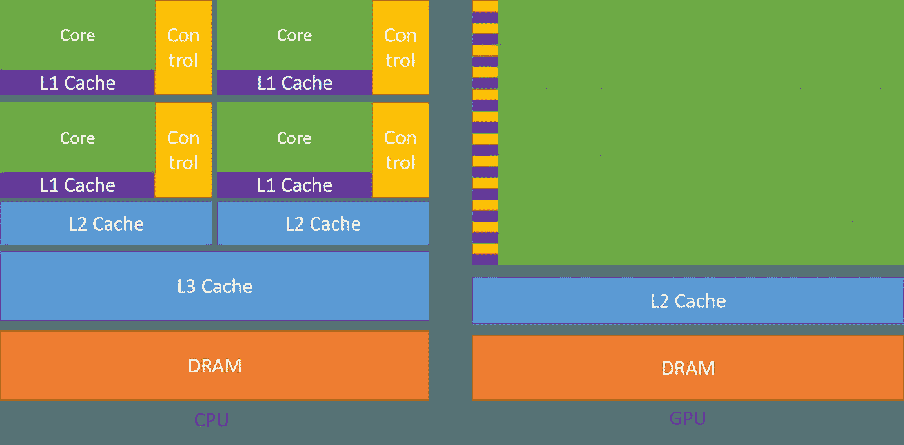

Image credit [[CUDA c programming guide](https://docs.nvidia.com/cuda/cuda-c-programming-guide/)]

因此，GPU 压缩了程序必须利用的许多硬件资源。然而，大多数时候，开发或拥有使用这些资源的程序是不可能的。这个问题就是众所周知的“利用不足”问题。解决方案是在同一个 GPU 上同时运行几个应用程序，以提高利用率。然而，与 CPU 不同，GPU 缺乏细粒度的共享机制。此外，GPU 没有虚拟内存。此外，由于要移动的数据量通常非常大，因此上下文切换会带来非常昂贵的开销。因此，NVIDIA first 在 2013 年 2 月推出了 Hyper-Q 技术，使几个 CPU 线程能够在单个 GPU 上启动工作。

# NVIDIA Hyper-Q 技术

Hyper-Q 支持多个 CPU 线程在单个 GPU 上启动内核，从而提高了 GPU 利用率，并**减少了 CPU 空闲时间**。Hyper-Q 还消除了错误的依赖关系，以提高 GPU 利用率。为了深入研究 Hyper-Q 如何工作，首先，我们需要回顾 CUDA 流并理解它们是如何工作的，这是 GPU 的主要处理方式。NVIDIA 在 Fermi (2010)之后推出了采用开普勒架构的 Hyper-Q(2012)。

# CUDA 流

为了简化学习过程，请记住，我们通常使用不同的流进行重叠数据传输(数据传输发生在 CPU 内存和 GPU 内存之间)和计算。CUDA 流是在 GPU 上按照 CPU 代码启动的顺序执行的内核队列。但是，来自不同流的内核可以交错。

> **注意，流式多处理器是一个不同于流的概念。**

CUDA 中所有的 GPU 操作(**内核和数据传输**)都是在一个流中运行的。当内核中没有指定流时，使用默认流(或空流)。以下句子摘自 NVIDIA 博客，描述默认流[ [ref](https://developer.nvidia.com/blog/how-overlap-data-transfers-cuda-cc/) ]。

> 在设备上的任何流中的所有先前发布的操作*完成之前，默认流中的任何操作都不会开始，并且默认流中的操作必须在任何其他操作(设备上的任何流中的)开始之前完成。*

在 **CUDA 7** 和更新的版本中，每个主机线程可以有单独的默认流。考虑下面的 CUDA C++例子[ [我使用了 NVIDIA 博客文章 ref](https://developer.nvidia.com/blog/how-overlap-data-transfers-cuda-cc/) 中的这个例子。指令(1)将数据从系统的主内存复制到 GPU 的内存中。当复制完成时，指令 2 启动一个内核，它有一个由 N 个线程组成的块。这些线程在 GPU 核上以并行方式执行。然后完成内核执行后，开始从 GPU 内存复制数据。

```
cudaMemcpy(gpu_array, sys_array, numBytes, cudaMemcpyHostToDevice);   // (1)

increment<<<1, N>>(gpu_array);                                        // (2)

cudaMemcpy(sys_array, gpu_array, numBytes, cudaMemcpyDeviceToHost);   // (3)
```

GPU 不知道 CPU(主机)端发生了什么。在下面的代码片段中，当指令 2 在设备上启动时，指令 3 开始在 CPU 上执行。当内核执行在 GPU 上完成时，指令 4 将完成数据移动。

```
cudaMemcpy(gpu_array, sys_array, numBytes, cudaMemcpyHostToDevice);   // (1)

increment<<<1, N>>(gpu_array);                                        // (2)

aCpuFunction(b);                                                      // (3)

cudaMemcpy(sys_array, gpu_array, numBytes, cudaMemcpyDeviceToHost);   // (4)
```

在创建了一个非默认的流之后，我们可以指定我们希望内核在哪个流上启动，如下所示:

```
cudaStream stream1;
cudaError_t result;
result = cudaStreamCreate(&stream1); // creating a non-default stream

increment<<<1, N, 0, stream1>>>(gpu_array);
result = cudaMemcpyAsync(gpu_array, sys_array, N, cudaMemcpyHostToDevice, steam1);

result = cudaStreamDestroy(stream1); // destroying the previously created stream
```

*cudamemacpyasync*用于非默认流，使 CPU 计算与 GPU 计算重叠。*cudamemacpyasync*发出复制操作后将控制权返回给主机线程。

以下来自 NVIDIA 博客的示例清楚地显示了如何明智地使用流，因为更多的并行性而导致更高的性能。

```
const int block_size = 256, number_of_streams = 4;
const int n = 4 * 1024 * block_size * number_of_streams;
const int stream_size = n / number_of_streams;
const int stream_bytes = stream_size * sizeof(float);
const int bytes = n * sizeof(float);

// Version 1

for (int i = 0; i < number_of_streams; ++i) {
  int offset = i * stream_size;
  cudaMemcpyAsync(&gpu_array[offset], &sys_array[offset], stream_bytes, cudaMemcpyHostToDevice, stream[i]);
  kernel<<< stream_size/ block_size, block_size, 0, stream[i]>>>(gpu_array, offset);
  cudaMemcpyAsync(&sys_array[offset], &gpu_array[offset], stream_bytes, cudaMemcpyDeviceToHost, stream[i]);
}
```

```
// Version 2

for (int i = 0; i < number_of_streams; ++i) {
  int offset = i * stream_size;
  cudaMemcpyAsync(&gpu_array[offset], &sys_array[offset], stream_bytes,cudamemcpyHostToDevice, cudamemcpyHostToDevice, stream[i]);
}

for (int i = 0; i < number_of_streams; ++i) {
  int offset = i * stream_size;
  kernel<<<stream_size/ block_size, block_size, 0, stream[i]>>>(gpu_array, offset);
}

for (int i = 0; i < number_of_streams; ++i) {
  int offset = i * stream_size;
  cudaMemcpyAsync(&gpu_array[offset], &sys_array[offset], stream_bytes,cudamemcpyDeviceToHost, cudamemcpyDeviceToHost, stream[i]);
}
```

下面显示了在 GPU 设备上执行单副本和内核引擎对它们进行排队的结果。顺序版本是当使用*cudamemacpy*代替*cudamemacpyasync*时。

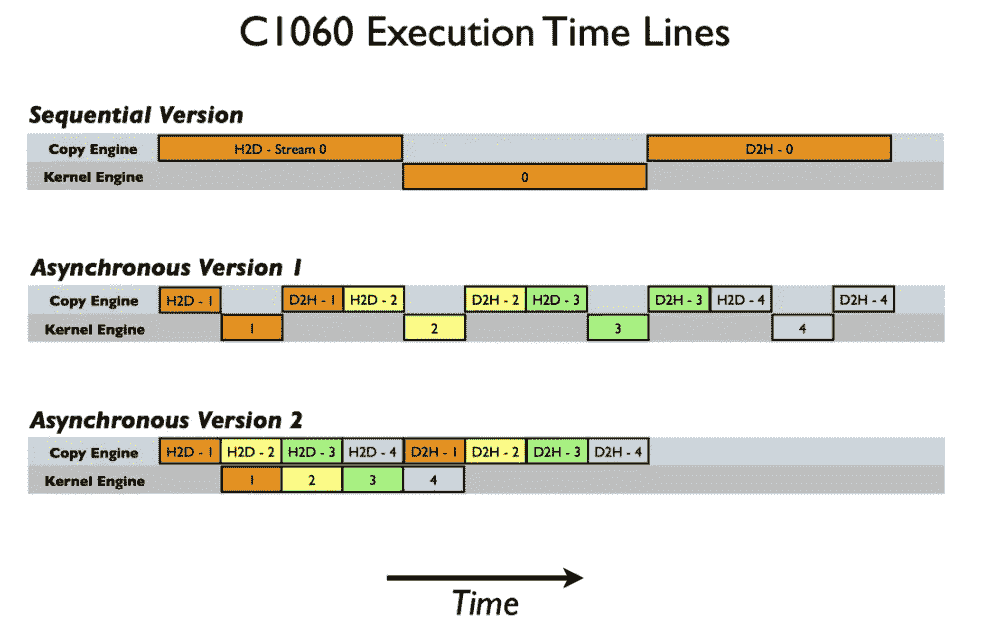

image credit [NVIDIA blog post: [How to Overlap Data Transfers in CUDA C/C++](https://developer.nvidia.com/blog/how-overlap-data-transfers-cuda-cc/)]

下面显示了在具有两个副本和一个内核执行流的 GPU 上执行的结果。

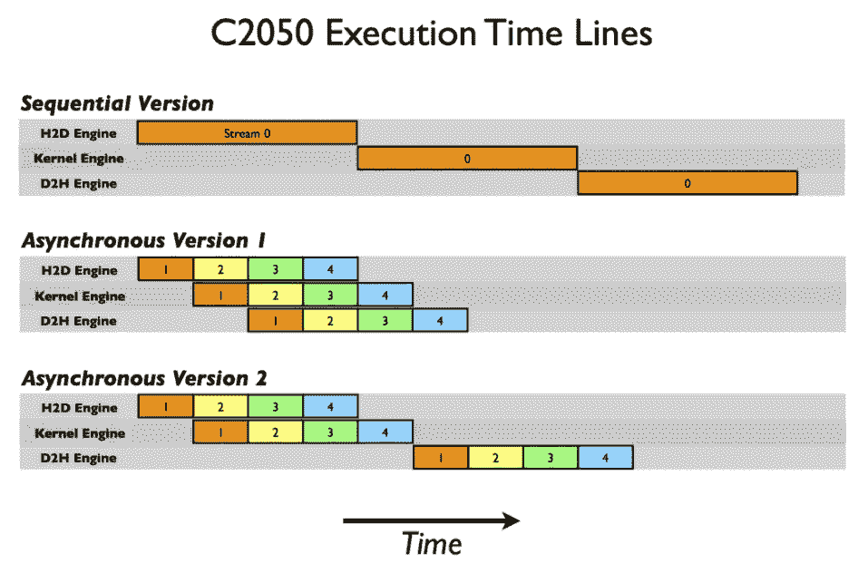

image credit [NVIDIA blog post: [How to Overlap Data Transfers in CUDA C/C++](https://developer.nvidia.com/blog/how-overlap-data-transfers-cuda-cc/)]

当多个内核在不同的非默认流中在 GPU 上启动时，GPU 调度程序会尝试启用这些内核的并发执行。GPU 延迟通常在每次内核完成后出现的完成信号，这是内存复制操作的开始标志。因此，虽然在我们的异步代码的第二个版本中，主机到设备的传输和内核执行之间有重叠，但是内核执行和设备到主机的传输之间没有重叠。

请记住，异步操作会在设备完成请求的作业之前将控制权返回给主机线程。因此 CPU 可以发送更多的作业，引擎将它们排队等待执行。这些命令是:

*   **内核启动**
*   **存储器在两个地址之间复制到同一个设备存储器**
*   **从主机到设备的 64 KB 或更小内存块的内存拷贝**
*   **内存复制由带有** `**Async**` **后缀**的函数执行
*   **记忆设置功能调用**

要在 CUDA 7 和更高版本中启用每线程默认流，您可以在包含 CUDA 头文件(`*cuda.h*`或`*cuda_runtime.h*`)之前，使用`*nvcc*`命令行选项`*--default-stream per-thread*`或`*#define*`编译`*CUDA_API_PER_THREAD_DEFAULT_STREAM*`预处理宏。

值得注意的是:当代码由`nvcc`编译时，您不能使用`*#define CUDA_API_PER_THREAD_DEFAULT_STREAM*`在. cu 文件中启用这种行为，因为`nvcc`在翻译单元的顶部隐式地包含了`cuda_runtime.h`。

## 多流示例

```
const int N = 1 << 20;

__global__ void kernel(float *x, int n)
{
    int tid = threadIdx.x + blockIdx.x * blockDim.x;
    for (int i = tid; i < n; i += blockDim.x * gridDim.x) {
        x[i] = sqrt(pow(3.14159,i));
    }
}

int main()
{
    const int num_streams = 8;

    cudaStream_t streams[num_streams];
    float *data[num_streams];

    for (int i = 0; i < num_streams; i++) {
        cudaStreamCreate(&streams[i]);

        cudaMalloc(&data[i], N * sizeof(float));

        // launch one worker kernel per stream
        kernel<<<1, 64, 0, streams[i]>>>(data[i], N);

        // launch a dummy kernel on the default stream
        kernel<<<1, 1>>>(0, 0);
    }

    cudaDeviceReset();

    return 0;
}
```

如果使用标准 nvcc 命令编译代码，如下所示:

```
$ nvcc ./stream_test.cu -o stream_legacy
```

因为未启用每线程默认流，所以设备通常会执行。分析结果将显示:

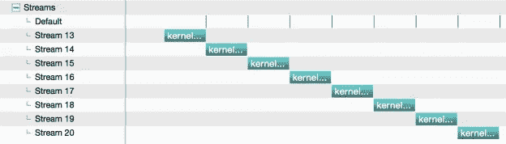

image credit [[NVIDIA blog, “GPU Pro Tip: CUDA 7 Streams Simplify Concurrency”](https://developer.nvidia.com/blog/gpu-pro-tip-cuda-7-streams-simplify-concurrency/)]

但是，使用以下命令:

```
$ nvcc --default-stream per-thread ./stream_test.cu -o stream_per-thread
```

它将执行如下相同的程序:


image credit [[NVIDIA blog, “GPU Pro Tip: CUDA 7 Streams Simplify Concurrency”](https://developer.nvidia.com/blog/gpu-pro-tip-cuda-7-streams-simplify-concurrency/)]

多线程可以在设备上启动内核，借助 CUDA 7 中引入的每线程默认流，这些内核可以并行化。如果您想查看代码并进行更多调查，请点击此处。

# 超 Q 技术

在 Hyper-Q 和 Kepler (2012)之前，不同的线程可以在不同的流上提交任务(CUDA 7+)。工作分配器过去常常在检查所有的依赖关系都得到满足之后，从管道的负责人那里接管工作，并在可用的 SMs 上开展工作。

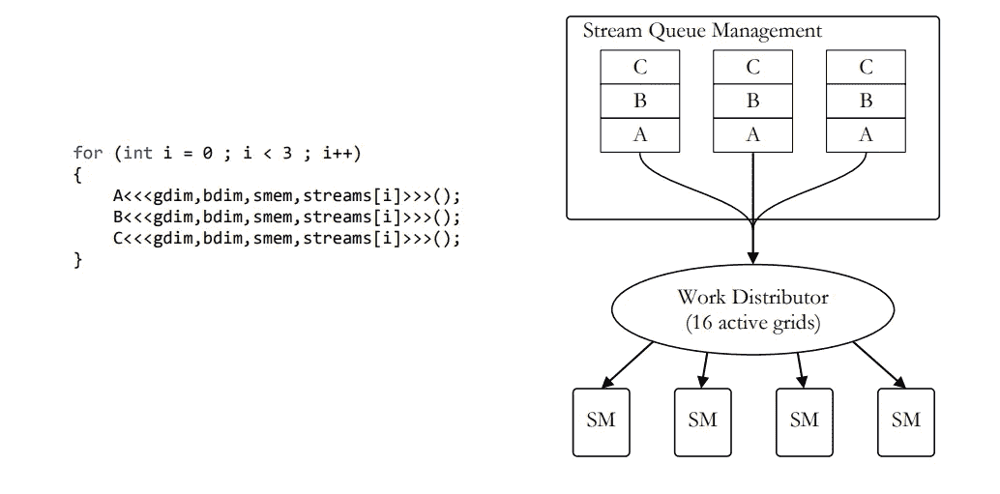

image credit [[Hyper-Q Example by NVIDIA](https://developer.download.nvidia.com/compute/DevZone/C/html_x64/6_Advanced/simpleHyperQ/doc/HyperQ.pdf)]

对于费米架构的单管道(一个执行引擎，记住 streams 中的例子)，这种深度优先的启动序列将导致错误的依赖关系。结果，硬件只能确定它可以同时执行阴影线对。

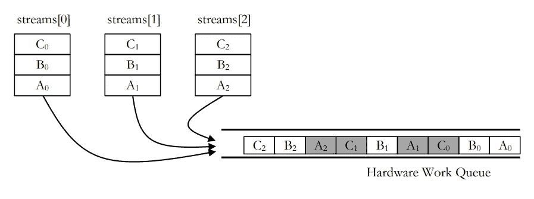

image credit [[Hyper-Q Example by NVIDIA](https://developer.download.nvidia.com/compute/DevZone/C/html_x64/6_Advanced/simpleHyperQ/doc/HyperQ.pdf)]

随着开普勒架构和 Hyper-Q，网格管理单元( **GMU** )被引入。GMU 创建多个硬件工作队列来**减少**或消除虚假依赖。

> SMX 代表下一代流式多处理器！

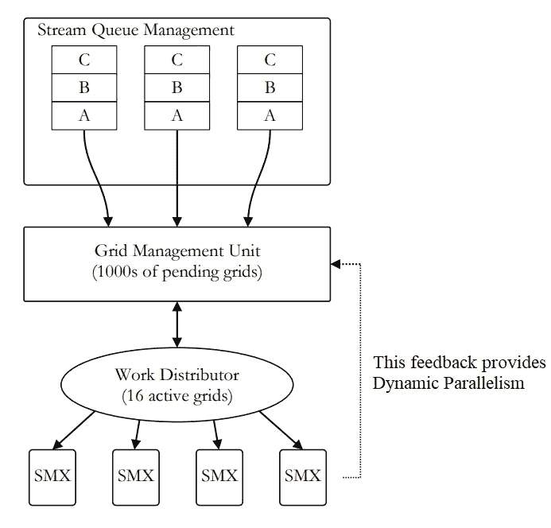

image credit [[Hyper-Q Example by NVIDIA](https://developer.download.nvidia.com/compute/DevZone/C/html_x64/6_Advanced/simpleHyperQ/doc/HyperQ.pdf)]

下面的例子显示了在没有和有 Hyper-Q 的设备上代码片段的执行是如何不同的。

```
for (int i = 0; i < number_of_streams; i++) {
kernel_A <<<1, 1, 0, streams[i]>>>(&gpu_array[2 * i], time_clocks);
kernel_B <<<1, 1, 0, streams[i]>>>(&gpu_array[2 * i + 1], time_clocks);
}
```

不带 Hyper-Q:

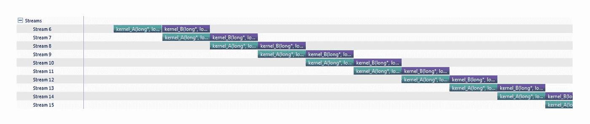

image credit [[Hyper-Q Example by NVIDIA](https://developer.download.nvidia.com/compute/DevZone/C/html_x64/6_Advanced/simpleHyperQ/doc/HyperQ.pdf)]

借助 Hyper-Q 消除虚假依赖:

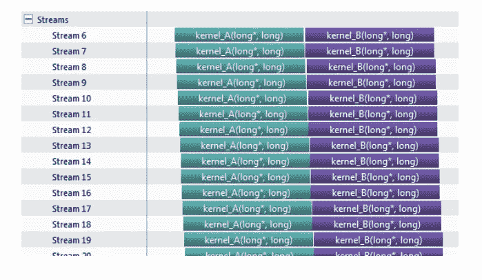

image credit [[Hyper-Q Example by NVIDIA](https://developer.download.nvidia.com/compute/DevZone/C/html_x64/6_Advanced/simpleHyperQ/doc/HyperQ.pdf)]

# 主生产计划

**它是 CUDA API** 的一个替代和二进制兼容的实现。MPS 支持协作式多进程 CUDA 应用，通常是 MPI 作业，以利用基于开普勒或更新架构的 NVIDIA GPUs 上的 Hyper-Q 功能。 **Hyper-Q 使得在一个 GPU 上同时处理 CUDA 内核成为可能，当单个应用程序未充分利用 GPU 计算能力时，这有利于提高性能。**

与 Pascal 架构相比，基于 Volta 架构的 MPS 增加了新功能。在 Volta 中，QoS 受到尊重，因此对 GPU 的配置有限制。此外，所有 MPS 客户端都有 GPU 内存地址空间。

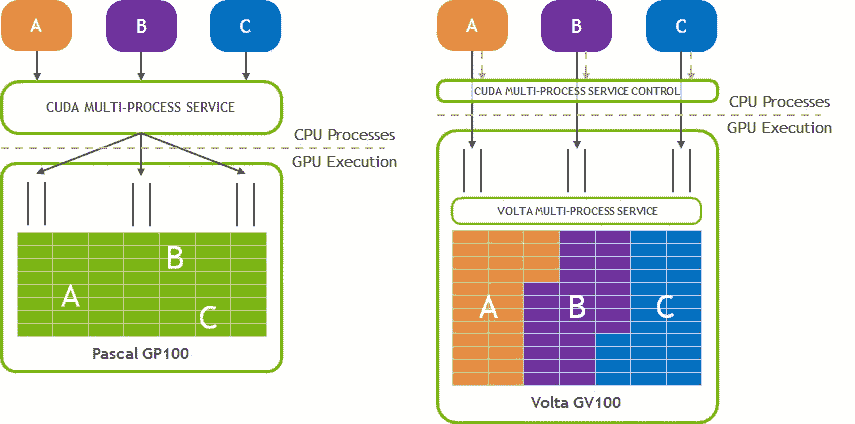

综上所述，MPS 提高了 GPU 利用率，减少了 GPU 上的上下文存储和切换。

## 何时以及如何使用 MPS

当每个应用程序的工作不能使 GPU 饱和时，使用 MPS 是有益的。每个网格包含少量块的应用程序无法充分利用 GPU。使用 MPS 时，GPU 要设置为**EXCLUSIVE _ PROCESS**compute 模式，保证只有一台 MPS 服务器使用 GPU 才有一个仲裁点。

对于使用 MPS，考虑你有两个不同的源代码，并想在一个 GPU 上同时执行它们。首先，必须更改 GPU 的计算模式，然后启动 MPS 服务器。

```
$ nvidia-smi -i 0 -c EXCLUSIVE_PROCESS
$ nvidia-cuda-mps-control -d
```

然后，应用程序可以按如下方式启动:

```
$ ./app1 &
$ ./app2 &
$ ./app3 &
```

要关闭 MPS 服务器:

```
$ echo quit | nvidia-cuda-mps-control
$ nvidia-smi -i 0 -c DEFAULT
```

请注意:

*   一个系统中只有一个用户可以拥有活动的 MPS 服务器。
*   独占模式限制适用于 MPS 服务器，而不是 MPS 客户端。

下面给出了一个使用 MPS 的脚本示例。请注意，要将 GPU 设置为独占执行模式，我们必须拥有 root 权限。

```
mkdir /tmp/mps_0
mkdir /tmp/mps_log_0

export CUDA_VISIBLE_DEVICES=0
export CUDA_MPS_PIPE_DIRECTORY=/tmp/mps_0
export CUDA_MPS_LOG_DIRECTORY=/tmp/mps_log_0

nvidia-smi -i 0 -c EXCLUSIVE_PROCESS

nvidia-cuda-mps-control -d

# Launching two applications on the GPU index = 0
application1 &
application2 &
```

# 参考

[1][https://developer . download . NVIDIA . com/compute/DevZone/C/html _ x64/6 _ Advanced/simple hyperq/doc/hyperq . pdf](https://developer.download.nvidia.com/compute/DevZone/C/html_x64/6_Advanced/simpleHyperQ/doc/HyperQ.pdf)

[2][https://developer . NVIDIA . com/blog/how-optimize-data-transfers-cuda-cc/](https://developer.nvidia.com/blog/how-optimize-data-transfers-cuda-cc/)

[3][https://developer . NVIDIA . com/blog/how-overlap-data-transfers-cuda-cc/](https://developer.nvidia.com/blog/how-overlap-data-transfers-cuda-cc/)

[4][https://developer . NVIDIA . com/blog/GPU-pro-tip-cuda-7-streams-simplify-concurrency/](https://developer.nvidia.com/blog/gpu-pro-tip-cuda-7-streams-simplify-concurrency/)

[5][https://docs . NVIDIA . com/deploy/pdf/CUDA _ Multi _ Process _ Service _ overview . pdf](https://docs.nvidia.com/deploy/pdf/CUDA_Multi_Process_Service_Overview.pdf)

[6][https://stack overflow . com/questions/34709749/how-do-I-use-NVIDIA-multi-process-service-MPs-to-run-multiple-non-MPI-cuda-app](https://stackoverflow.com/questions/34709749/how-do-i-use-nvidia-multi-process-service-mps-to-run-multiple-non-mpi-cuda-app)

[7][https://www . olcf . ornl . gov/WP-content/uploads/2021/06/MPS _ ORNL _ 2021 08 17 . pdf](https://www.olcf.ornl.gov/wp-content/uploads/2021/06/MPS_ORNL_20210817.pdf)

[](/mlearning-ai/mlearning-ai-submission-suggestions-b51e2b130bfb) [## Mlearning.ai 提交建议

### 如何成为 Mlearning.ai 上的作家

medium.com](/mlearning-ai/mlearning-ai-submission-suggestions-b51e2b130bfb)