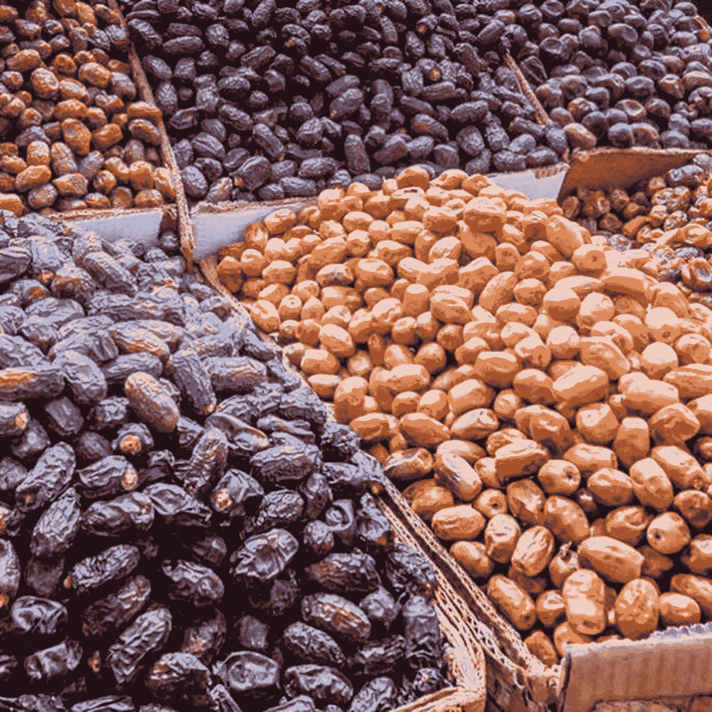
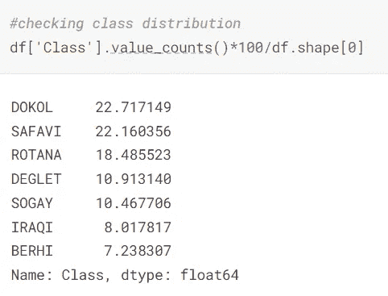
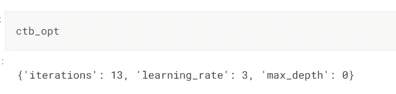
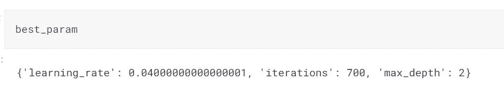
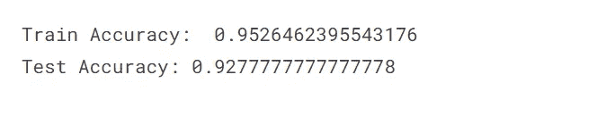
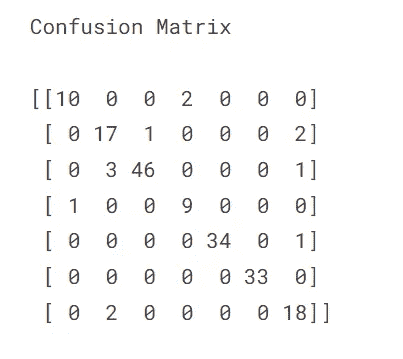
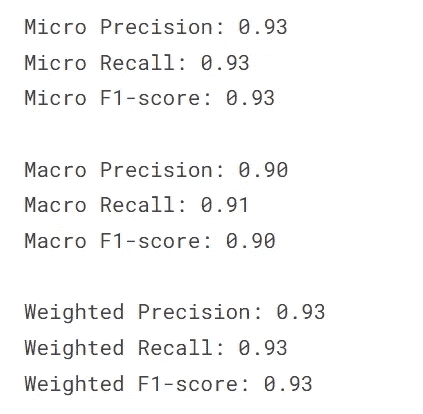

# 具有自动调整 CatBoost 的多类分类

> 原文：<https://medium.com/mlearning-ai/multiclass-classification-with-auto-tuning-catboost-5d352e30778d?source=collection_archive---------0----------------------->

> 带有 HyperOpt 的 CatBoost 成为多类分类的完美工具…



Image from [Kaggle](https://www.google.com/url?sa=i&url=https%3A%2F%2Flightfieldstudios.net%2Fstock-photos%2Fdates-fruit.html&psig=AOvVaw0wuEZzZoABqoXX0LIblb9r&ust=1653654249772000&source=images&cd=vfe&ved=0CAwQjRxqFwoTCOiQvKyU_fcCFQAAAAAdAAAAABAP)

在本文中，我们将研究一个枣果的 Kaggle 数据集。数据集由 7 种类型的 34 个相关特征组成。我们的任务是将枣果分为 7 类。你可以通过下面的链接了解更多关于数据集的信息

[](https://www.kaggle.com/datasets/muratkokludataset/date-fruit-datasets) [## 枣果数据集

### 7 类；巴尔希、德格莱特·努尔、苏凯里、罗塔卜·莫扎法蒂、鲁萨纳、萨法维、萨盖

www.kaggle.com](https://www.kaggle.com/datasets/muratkokludataset/date-fruit-datasets) 

经过以上环节，我们了解到枣果的外观对其类型有很大影响。从 898 幅水果图像中提取了包括形态特征、形状和颜色在内的 34 个特征。

从逻辑回归到人工神经网络的不同技术已经在这个数据集上使用过。使用这些方法获得的性能结果分别为 91.0%和 92.2%。堆叠这些模型可获得 92.8%的最高性能。

我们将使用 CatBoost 并用 HyperOpt 调整超参数，并检查我们是否可以做得更好或与之前的结果匹配。

现在让我们导入数据集并进行一些分析。

```
import numpy as np 
import pandas as pd
import os
from sklearn.preprocessing import LabelEncoder
from sklearn.model_selection import train_test_split
from sklearn.metrics import accuracy_score, f1_score, recall_score, confusion_matrix,precision_score

import catboost as ctbfrom hyperopt import hp
from hyperopt import fmin, tpe, STATUS_OK, STATUS_FAIL, Trials!pip install openpyxl # to read excel file#reading the Kaggle datasetdata_path = "../input/date-fruit-datasets/Date_Fruit_Datasets/Date_Fruit_Datasets.xlsx"
data=pd.read_excel(data_path) df = data.copy()#To understand the data distribution
df.describe()#To understand the data types
df.dtypes#To check for nulls in data
df.isnull().sum()*#checking class distribution*
df['Class'].value_counts()*100/df.shape[0]
```

通过在 [Kaggle 笔记本](https://www.kaggle.com/code/nandakishorejoshi/datefruit-catboost-with-hyperopt)上运行上面的代码，我们将能够将 Date_Fruit 数据导入到熊猫数据框(df)中。在这篇文章之后，我们运行几个命令来分析数据，观察结果是

1.  描述完数据后，我们看到大多数特征的平均值和中间值(第 50 百分位)非常接近。这意味着数据是正态分布的。
2.  在检查数据类型时，我们看到除了目标变量(Class ),所有其他变量都是数字类型
3.  数据集中没有缺失值
4.  所有七类枣果都不是均匀分布的。各等级的分布百分比如下图所示。



Figure 1 : Class distribution (in %)

通过上述分析，并了解到之前在该数据集上使用了逻辑回归和人工神经网络(如 Kaggle 上的[数据集描述](https://www.kaggle.com/datasets/muratkokludataset/date-fruit-datasets)中所述)，我们可以使用另一组强大的模型。

> **增压机**

这里可以使用的一些常见的提升算法有 XGBoost、LightGBM 和 CatBoost。这些算法的比较将在下面的文章中解释

[](https://towardsdatascience.com/performance-comparison-catboost-vs-xgboost-and-catboost-vs-lightgbm-886c1c96db64) [## 性能比较:CatBoost 与 XGBoost 以及 CatBoost 与 LightGBM

### 机器学习中的助推算法——第七部分

towardsdatascience.com](https://towardsdatascience.com/performance-comparison-catboost-vs-xgboost-and-catboost-vs-lightgbm-886c1c96db64) 

从上面的文章中我们可以得出结论，LightGBM 在性能和执行速度上都超过了 Catboost 和 XGBoost。下一个关于速度的是 Catboost，然后是 XGBoost。我们还可以看到，这三种算法的性能几乎相同。

这一次，我们将选择 Catboost(该系列中最新、探索最少的)，并尝试设定新的基准。

现在，让我们对这些类进行标签编码，并创建测试和训练数据集

```
#label encodeing the Class feature
le = LabelEncoder()
df['label'] = le.fit_transform(df.Class.values)#Creating train and test datasets by defining dependent and independent featuresX,Y=df.drop(['Class','label'],axis=1),df['label']
X_train, X_test, y_train, y_test = train_test_split(X, Y,
                                                    test_size=0.2,
                                                    random_state=42,
                                                    shuffle=True)
```

当我们使用 Catboost 时，让我们在下面的链接中探索可以调整的一组超参数

[](https://catboost.ai/en/docs/concepts/parameter-tuning) [## 参数调谐

### CatBoost 为参数调整提供了一个灵活的界面，可以进行配置以适应不同的任务。本节…

catboost.ai](https://catboost.ai/en/docs/concepts/parameter-tuning) 

从上面的链接我们可以看到，有相当多的超参数，取值范围很广。下面的代码中定义了一些超参数及其取值范围

```
*#define parameter range*
learning_rate=np.linspace(0.01,0.1,10)
max_depth=np.arange(2, 18, 2)
colsample_bylevel=np.arange(0.3, 0.8, 0.1)
iterations=np.arange(50, 1000, 50)
l2_leaf_reg=np.arange(0,10)
bagging_temperature=np.arange(0,100,10)#define the categorical features if any in the dataset for catboost to handle
categorical_features_indices = np.where(X_train.dtypes == np.object)[0]
```

手动调整所有超参数并找到正确的值来构建最佳模型非常困难。出于这个原因，我们使用一个自动超参数调谐包称为 Hyperopt。Hyperopt 是用 Python 编写的分布式异步超参数优化包。下面的链接中提到了 Hyperopt 的细节。

 [## 远视文件

### 从 PyPI pip 安装 hyperopt 运行您的第一个示例#定义一个目标函数 def…

hyperopt.github.io](http://hyperopt.github.io/hyperopt/) 

远视主要有三个组成部分

1.  目标函数:

目标函数是手头的任务。它可能是求解一个简单的线性代数方程，或者只是一个简单的 if 语句，从而产生一个动作，或者训练一个机器学习模型来找到最佳的超参数。

2.搜索空间:

这是目标函数可以使用的值的空间。在我们的例子中，我们称之为参数空间。这里我们定义了每个超参数的取值范围。上面代码段中定义的那个

3.最小化功能:

这是使目标函数在参数空间或搜索空间上产生的损失最小化的函数。

为每个目标定义正确的损失函数是获得超参数最佳组合的关键。为 Catboost 调整超参数的所有上述步骤的代码如下所示

```
*#Define parameter space, fit conditions*
ctb_clf_params = {
    'learning_rate':     hp.choice('learning_rate',    learning_rate),
    'max_depth':         hp.choice('max_depth',         max_depth),
    *#'colsample_bylevel': hp.choice('colsample_bylevel', colsample_bylevel),*
    'iterations':       hp.choice('iterations',            iterations),
    *#'l2_leaf_reg':       hp.choice('l2_leaf_reg',            l2_leaf_reg),*
    *#'bagging_temperature':       hp.choice('bagging_temperature',            bagging_temperature),*
    'loss_function':       'MultiClass',

}
ctb_fit_params = {
    'early_stopping_rounds': 5,
    'verbose': False,
    'cat_features': categorical_features_indices
}
ctb_para = dict()
ctb_para['clf_params'] = ctb_clf_params
ctb_para['fit_params'] = ctb_fit_params
```

在上面的代码中，我们用拟合条件定义了参数空间。(一些参数空间被注释为对这些参数进行调优会降低性能。因此，使用默认值。表示只是在实现的情况下给出一个想法)。拟合条件定义模型拟合条件。

```
*#define Hyperopt class*
class **HYPOpt**(object):

    def __init__(self, x_train, x_test, y_train, y_test):
        self.x_train = x_train
        self.x_test  = x_test
        self.y_train = y_train
        self.y_test  = y_test

    def process(self, fn_name, space, trials, algo, max_evals):
        fn = getattr(self, fn_name)
        try:
            print('entering fmin')
            result = fmin(fn=fn, space=space, algo=algo, max_evals=max_evals, trials=trials)  **#----1**
        except **Exception** as e:
            return {'status': STATUS_FAIL,
                    'exception': str(e)}
        return result

    def ctb_clf(self, para):     **#---- 2**
        clf= ctb.CatBoostClassifier(**para['reg_params'])
        print('ctb initialized')
        return self.train_clf(reg, para)

    def train_clf(self, clf, para):    **#----- 3**
        print('fitting model')
        clf.fit(self.x_train, self.y_train,
                eval_set=[(self.x_train, self.y_train), (self.x_test, self.y_test)],
                **para['fit_params'])
        print('model fitted')
        pred = clf.predict(self.x_test)
       f1=sklearn.metrics.f1_score(self.y_test,pred,average='micro')
        f1=f1*(-1)                     **#---- 4**
        print(f1)
        return {'loss': f1, 'status': STATUS_OK}
```

#1-定义内置远视最小化功能

#2-客观罚款

#3-适合模型的函数

#4-损失函数(负 F1 用作损失)

在上面的代码中，我们创建了一个 Hyperopt 类并定义了一个目标函数。这里的目标是构建一个 Catboost 模型。我们使用函数 *ctb_clf* 来定义模型，使用 *train_clf* 来训练模型。

我们还定义了一个损失函数。这里我们使用 F1 作为衡量标准。Hyperopt 总是试图用其内置的 *fmin* 方法将损失降到最低。因此，我们将负 F1 传递给 *fmin* ，从而最大化 F1 分数。

```
*#define objective and find the best hyperparameters*

obj = HYPOpt(X_train, X_test, y_train, y_test)
ctb_opt = obj.process(fn_name='ctb_clf', space=ctb_para, trials=Trials(), algo=tpe.suggest, max_evals=5)
```

在上面的代码中，我们实例化该类并调用*进程*函数来启动超参数优化。使用来自参数空间 *ctb_para 的参数的不同组合创建 catboost 的五次迭代(max_evals =5)。*产生最小损耗的参数作为*过程*函数的输出存储到 *ctb_opt* 中，如图 2 所示。



Figure 2 : Indexes of Optimal parameters

上面的输出是超参数空间的值的索引。我们需要存储实际值。字典用于存储实际值，如下面的代码所示

```
*#Save best parametrs in a dictionary*
best_param={}
best_param['learning_rate']=learning_rate[ctb_opt['learning_rate']]
best_param['iterations']=iterations[ctb_opt['iterations']]
best_param['max_depth']=max_depth[ctb_opt['max_depth']]
```

Hyperopt 选择的最佳参数如下所示



Figure 3 : Actual value of Optimal parameters

借助 Hyperopt 的最佳参数，我们使用这些参数来构建最终的 Catboost 模型，并在测试数据上对其进行测试。

```
*#build model with the best hyperparameters*
model=ctb.CatBoostClassifier(iterations=best_param['iterations'], 
                             depth=best_param['max_depth'],
                             learning_rate=best_param['learning_rate'],
                            loss_function='MultiClass',
                            random_seed=42
                            )model.fit(X_train,y_train,cat_features=categorical_features_indices, eval_set=None, plot=True)
```

建立了最佳模型后，我们需要验证测试数据的结果。我们将检查各种度量，从混淆矩阵到训练和测试数据的准确性，以检查过度拟合。我们还将看到微观、宏观和加权精度、召回和 F1 分数，以了解每个类的模型性能。

下面的代码帮助我们检查测试和训练的准确性，并得到混淆矩阵

```
train_pred = model.predict(X_train)
train_acc = accuracy_score(y_train,train_pred)
print('Train Accuracy: ', train_acc)

test_pred = model.predict(X_test)
test_acc = accuracy_score(y_test,test_pred)
print('Test Accuracy:', test_acc)
y_pred=test_predconfusion = confusion_matrix(y_test, test_pred)
print('Confusion Matrix**\n**')
print(confusion)
```

我们可以借助下面的代码检查微观、宏观和加权精度、召回和 F1 分数

```
print('Micro Precision: **{:.2f}**'.format(precision_score(y_test, y_pred, average='micro')))
print('Micro Recall: **{:.2f}**'.format(recall_score(y_test, y_pred, average='micro')))
print('Micro F1-score: **{:.2f}\n**'.format(f1_score(y_test, y_pred, average='micro')))

print('Macro Precision: **{:.2f}**'.format(precision_score(y_test, y_pred, average='macro')))
print('Macro Recall: **{:.2f}**'.format(recall_score(y_test, y_pred, average='macro')))
print('Macro F1-score: **{:.2f}\n**'.format(f1_score(y_test, y_pred, average='macro')))

print('Weighted Precision: **{:.2f}**'.format(precision_score(y_test, y_pred, average='weighted')))
print('Weighted Recall: **{:.2f}**'.format(recall_score(y_test, y_pred, average='weighted')))
print('Weighted F1-score: **{:.2f}**'.format(f1_score(y_test, y_pred, average='weighted')))
```

所有代码的输出如下图所示



Figure 4 : Train and Test Accuracy



Figure 5 : Confusion matrix



Figure 6 : Micro, Macro, Weighted metrices

从上面的数字中我们可以看到，测试精度与 Kaggle 竞赛获得的最佳结果相当。微观和加权指标超过了最佳结果。

**总结**

在本文中，我们尝试实现 Catboost 来解决 Kaggle 数据集。我们学到的一些要点是:

1.  Catboost 是一个非常强大的模型。它主要用于独立特征包含分类变量的情况。
2.  Catboost 有大量参数需要优化。
3.  超图是一种为所有最大似然模型寻找最佳超参数的有效方法。

下面是带完整代码的 Kaggle 笔记本的链接:

[](https://www.kaggle.com/code/nandakishorejoshi/datefruit-catboost-with-hyperopt) [## 枣果 _ 催化剂 _ 用 _ 超高倍

### 使用 Kaggle 笔记本探索和运行机器学习代码|使用枣果数据集的数据

www.kaggle.com](https://www.kaggle.com/code/nandakishorejoshi/datefruit-catboost-with-hyperopt) [](/mlearning-ai/mlearning-ai-submission-suggestions-b51e2b130bfb) [## Mlearning.ai 提交建议

### 如何成为 Mlearning.ai 上的作家

medium.com](/mlearning-ai/mlearning-ai-submission-suggestions-b51e2b130bfb)