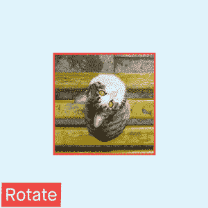
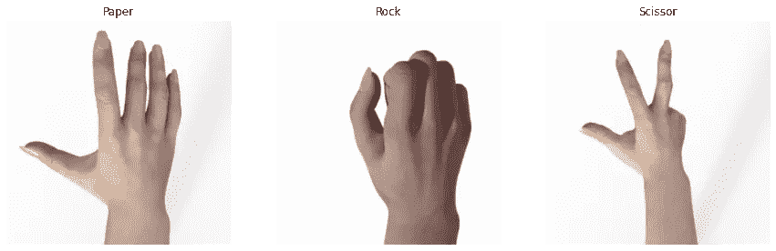
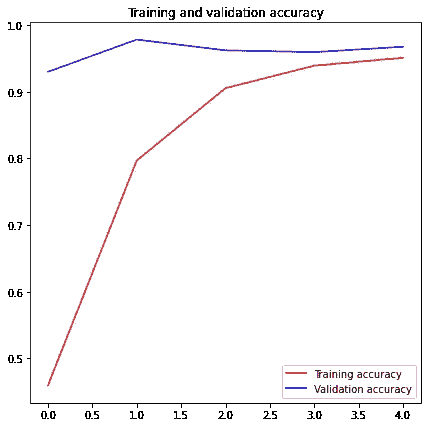
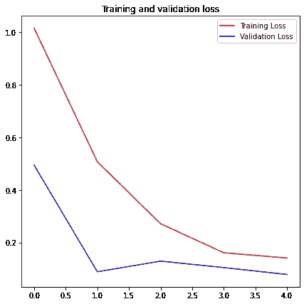
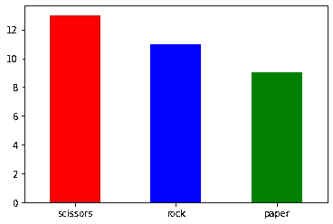
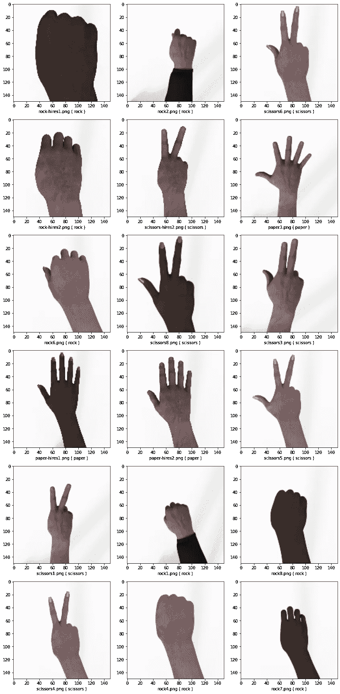

# 图像增强的多类分类

> 原文：<https://medium.com/mlearning-ai/multiclass-classification-with-image-augmentation-834c16122a3b?source=collection_archive---------3----------------------->

## 这篇文章解释了多类图像分类的基础知识以及如何执行图像增强。


Photo by [Marcus Wallis](https://unsplash.com/@marcus_wallis)on [Unsplash](https://unsplash.com/s/photos/rock-paper-scissors)

什么是图像增强？

我法师增强，解决了**数据有限的问题**。图像增强是一种技术，可用于通过在数据集中创建图像的修改版本来人工**扩展训练数据集**的大小。图像增强包括一套增强训练图像的大小和质量的技术，以便可以使用它们建立更好的深度学习模型。



Image Augmentation

# 张量流的安装

# 先决条件

*   Linux，macOS，Windows
*   Python ≥ 3.7

# 安装 TensorFlow

**纯 CPU**

```
pip install “tensorflow>=1.15.2,<2.0”
**or** 
conda install tensorflow’>=1.15.2,<2.0.0'
```

**GPU 支持**

```
pip install “tensorflow-gpu>=1.15.2,<2.0”
**or** 
conda install tensorflow-gpu’>=1.15.2,<2.0.0'
```

# 健全性检查

```
**>>** import **tensorflow** as **tf** >> **tf**.__version__
'2.3.0'
```

现在，我们将使用来自 Kaggle 的[石头剪刀布数据集](https://www.kaggle.com/sanikamal/rock-paper-scissors-dataset)来执行多类图像分类。

# 让我们投入进去吧！！！

# 1.数据集探索

数据集有三个目录，即训练、测试和验证。这里，train 和 test 有三类图像，validation 有一个要测试的图像列表。

输出是，

```
Train set -->  ['paper', 'scissors', 'rock']
Test set -->  ['paper', 'scissors', 'rock']
Validation set -->  ['paper8.png', 'paper1.png', 'scissors-hires1.png']
```

# 2.数据集示例

让我们显示数据集中每个类的随机图像。

所以，这些图像是，



# 3.定义 CNN 模型

该模型包括五种不同类型的层，

*   **卷积层**:该层将从图像中提取重要特征
*   **汇集层** r:该层通过隔离重要特征，减少卷积后输入图像的空间体积
*   **展平层:**将输入展平成一维数组
*   **隐藏层**:也称为密集层，将网络从一层连接到另一层
*   **输出层**:是由神经元组成的最后一层，与类别数相等

这里，我们有三类图像，因此，输出层应该有三个神经元。

这个模型的总结是，

```
Model: "sequential"
_________________________________________________________________
Layer (type)                 Output Shape              Param #   
=================================================================
conv2d (Conv2D)              (None, 148, 148, 32)      896       
_________________________________________________________________
max_pooling2d (MaxPooling2D) (None, 74, 74, 32)        0         
_________________________________________________________________
conv2d_1 (Conv2D)            (None, 72, 72, 64)        18496     
_________________________________________________________________
max_pooling2d_1 (MaxPooling2 (None, 36, 36, 64)        0         
_________________________________________________________________
conv2d_2 (Conv2D)            (None, 34, 34, 128)       73856     
_________________________________________________________________
max_pooling2d_2 (MaxPooling2 (None, 17, 17, 128)       0         
_________________________________________________________________
conv2d_3 (Conv2D)            (None, 15, 15, 128)       147584    
_________________________________________________________________
max_pooling2d_3 (MaxPooling2 (None, 7, 7, 128)         0         
_________________________________________________________________
flatten (Flatten)            (None, 6272)              0         
_________________________________________________________________
dense (Dense)                (None, 512)               3211776   
_________________________________________________________________
dense_1 (Dense)              (None, 1)                 513       
=================================================================
Total params: 3,453,121
Trainable params: 3,453,121
Non-trainable params: 0
_________________________________________________________________
```

# 4.模型编译和回调函数

对于这个模型，我们使用 *adam* 优化器和*分类 _ 交叉熵*作为损失函数。
这里的回调函数将在达到准确率> 95%时，在历元结束时停止模型的训练。

# 5.发电机

## 具有图像增强的训练生成器

```
Found 2520 images belonging to 3 classes.
```

## 验证生成器

```
Found 372 images belonging to 3 classes.
```

# 6.拟合模型

因为我们使用发电机代替*型号。fit* 我们需要使用*型号。拟合 _ 生成器*功能

```
Epoch 1/10
126/126 - 46s - loss: 1.0141 - accuracy: 0.4591 - val_loss: 0.4937 - val_accuracy: 0.9301
Epoch 2/10
126/126 - 27s - loss: 0.5067 - accuracy: 0.7968 - val_loss: 0.0886 - val_accuracy: 0.9785
Epoch 3/10
126/126 - 27s - loss: 0.2712 - accuracy: 0.9056 - val_loss: 0.1290 - val_accuracy: 0.9624
Epoch 4/10
126/126 - 27s - loss: 0.1608 - accuracy: 0.9393 - val_loss: 0.1045 - val_accuracy: 0.9597
Epoch 5/10

Reached >95% accuracy so cancelling training!
126/126 - 26s - loss: 0.1408 - accuracy: 0.9512 - val_loss: 0.0784 - val_accuracy: 0.9677
```

# 7.可视化模型训练

让我们将模型的准确性和损失分布在整个时期

得到的图形是，



我们可以看到，对于每个历元，精度增加，损耗下降

# 8.预言；预测；预告

## 测试数据的准备


## 测试生成器

```
Found 33 validated image filenames.
```

## 模型预测法

## 标签映射

为了识别图像的标签，使用了*class _ indexes*函数

```
{0: 'paper', 1: 'rock', 2: 'scissors'}
```

## 绘制预测图



## 在看不见的图像上模拟性能



## 看不见的图像上的模型精度

```
Accuracy of the model on test data is 93.94%
```

完整的代码可在[这里](https://www.kaggle.com/kamalkhumar/multiclass-classification-with-image-augmentation)

感谢阅读！！！