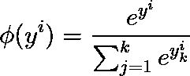
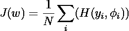
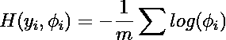
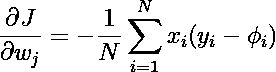
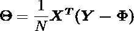
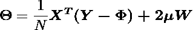
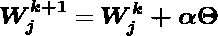

# 用 Python 实现多类逻辑回归

> 原文：<https://medium.com/mlearning-ai/multiclass-logistic-regression-with-python-2ee861d5772a?source=collection_archive---------0----------------------->

将我们的知识从二项逻辑回归扩展到多项逻辑回归


Photo by [Federico Scarionati](https://unsplash.com/@federicoscarionati?utm_source=unsplash&utm_medium=referral&utm_content=creditCopyText) on [Unsplash](https://unsplash.com/s/photos/multiple-choice?utm_source=unsplash&utm_medium=referral&utm_content=creditCopyText)

# 多类逻辑回归

多类逻辑回归也称为多项逻辑回归。与[二项式逻辑回归](https://python.plainenglish.io/logistic-regression-a-classifier-with-a-sense-of-regression-83ce49ba3f5b)相反，多类逻辑回归用于将输出标签分为两类以上。

在多类逻辑回归的情况下，我们用 [softmax 函数](https://en.wikipedia.org/wiki/Softmax_function)替换 sigmoid 函数:



Equation.1 Softmax Function. Image by **the Author.**

我们将 y 定义为


Equation. 2 Softmax input y. Image by **the Author.**

现在，给定权重和净输入 y(i)，该 softmax 函数计算特征 x(i)属于类 *j.* 的概率。因此，我们计算 *j = 1，…，k* 中每个类标签的概率φ。请注意分母中的归一化项，它导致这些类概率的总和为 1。

## 梯度下降

现在，为了通过梯度下降训练我们的逻辑模型，我们需要定义一个我们希望最小化的成本函数 *J* :



Equation. 3 cost function. Image by **the Author.**

其中 H 是交叉熵函数，定义如下:



Equation. 4 cross-entropy. Image by **the Author.**

这里，y 代表已知标签，φ代表通过 softmax 计算的概率；*不是*预测的类标签。

为了找到最佳权重，我们需要成本函数的梯度



Equation. 5 gradient of the cost function. Image by **the Author.**

或者以矩阵形式:



Equation. 6 gradient of the cost function. Image by **the Author.**

在哪里

θ=成本函数的梯度

x =特征矩阵

y =已知标签的向量

φ=未知标签的概率向量

我们可以在成本函数中加入一个 L2 正则项



Equation. 6 gradient of the cost function with l2 regularization. Image by **the Author.**

其中:

μ=正则化因子

w =权重矩阵

然后，权重矩阵的更新步骤写成:



Equation. 7 Updating steps of weights. Image by **the Author.**

其中，α是学习率。注意，w 是类别的权重向量 *y=j*

## 履行

现在我们将使用 Python 构建逻辑回归。导入必需品模块

```
from sklearn.preprocessing import OneHotEncoder
from sklearn.datasets import load_iris
import numpy as np
import pandas as pd
from scipy.special import softmax
from sklearn.model_selection import train_test_split
```

然后将该类定义为

```
class MultipleLogRegression:

    def __init__(self,learning_rate=0.1,n_iters=1000):
        self.lr=learning_rate
        self.iters=n_iters
        self.W=None

    def fit(self,X,y,mu):
        ones=np.ones(X.shape[0])
        features=np.c_[ones,X]
        onehot_encoder = OneHotEncoder(sparse=False)
        y_encode=onehot_encoder.fit_transform(y.reshape(-1,1))
        self.W=np.zeros((features.shape[1], y_encode.shape[1]))
        samples=X.shape[0]

        for i in range(self.iters):
            Z=-features@self.W
            prob_y=softmax(Z,axis=1)
            error=y_encode-prob_y
            dW=1/samples * (features.T @ error) + 2 * mu * self.W
            self.W-=self.lr*dW

    def predict(self,X):
        ones=np.ones(X.shape[0])
        features=np.c_[ones,X]
        Z=-features@self.W
        y=softmax(Z,axis=1)
        return np.argmax(y,axis=1)
```

其中:

1.  `__init__`是标准的构造器方法，以`learning_rate`和`n_iters`作为梯度下降中的学习速率和迭代次数。
2.  `fit`是拟合方法。这是梯度下降将运行的地方。首先，我们将 1 的向量的一列添加到特征矩阵`X`中。然后使用`sklearn`的`OneHotEncoder`模块的`fit_transform`将已知标签`y`编码成相应的数值类。然后在迭代中，我们使用来自`scipy`模块的`softmax`函数计算标签的概率。然后计算将在权重矩阵`W`的更新步骤中使用的成本函数`dW`的梯度
3.  `predict`是预测法。使用`softmax`函数从特征矩阵`X`简单计算标签的概率向量。然后使用`np.argmax`确定最大概率

## 结论

在本文中，我们了解到:

1.  多类逻辑回归作为多类标签的机器学习分类器算法。
2.  使用 softmax 函数确定输出标签的概率
3.  在多类逻辑回归中实现梯度下降。

[](/mlearning-ai/mlearning-ai-submission-suggestions-b51e2b130bfb) [## Mlearning.ai 提交建议

### 如何成为 Mlearning.ai 上的作家

medium.com](/mlearning-ai/mlearning-ai-submission-suggestions-b51e2b130bfb)