# 多项式逻辑回归

> 原文：<https://medium.com/mlearning-ai/multinomial-logistic-regression-adb2a76eedcf?source=collection_archive---------6----------------------->

Photo by [Charlie M](https://unsplash.com/@chollz?utm_source=unsplash&utm_medium=referral&utm_content=creditCopyText) on [Unsplash](https://unsplash.com/?utm_source=unsplash&utm_medium=referral&utm_content=creditCopyText)

## 讨论逻辑回归的概念并为一个简单的分类问题实现逻辑函数

嗨，伙计们！

本文将讲述对**分类问题**最有帮助的**回归模型**之一。

在深入概念之前，我们先来问一个常见的问题！

假设你决定去野餐，你会问自己的第一个问题是*天气如何*因为如果天气不好，你会过得很糟糕！所以你的答案可能是晴天、刮风、阵雨等。，但我们知道它不像一个实数，不可能是无穷大。
但你是怎么回答的？你会用很多参数比如风速，湿度，季节，还有你过去一年在那个地方的经历来回答！

我们可以说，你试图通过考虑每个参数在天气突变预测中的重要性来得到一个具体的答案。

现在你扮演的是天气预测的机器学习模型角色！但是机器怎么能学会这种思维方式呢！除了逻辑回归什么都做不了。

首先让我们仔细看看这个概念。

## 什么是逻辑回归？

考虑到你知道回归的基本原理，我们可以说逻辑回归是线性回归的高级模型，因为它使用了几个与线性回归相关的概念。

**有什么不同？为什么不用线性？**
线性回归将所有数据自由绘制成图，将每一个 X 匹配到对应的 Y，会给出无穷大的输出！但是如你所见，我们没有无限状态！逻辑回归产生了在两个可接受值 1 和 0 之间的周围结果的机制；这些值是一对“是”和“否”

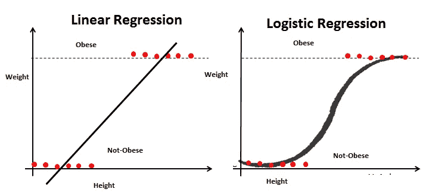

Linear Regression Graph vs. Logistic Regression Graph by [analyticsvidhya](https://www.analyticsvidhya.com/blog/2020/12/beginners-take-how-logistic-regression-is-related-to-linear-regression/)

逻辑回归使用 **Sigmoid** 函数来挤压该范围内的值，并最终制作一个 S 曲线图形。

**什么是乙状结肠功能？**

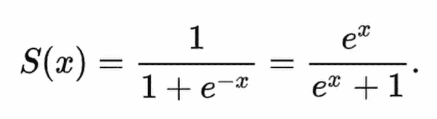

sigmoid function formula Image by Author

sigmoid 是统计学和机器学习中著名的函数之一，它将实数的值映射为 0 和 1 或-1 和 1。统计学学生知道它是 Logit 函数的反函数。

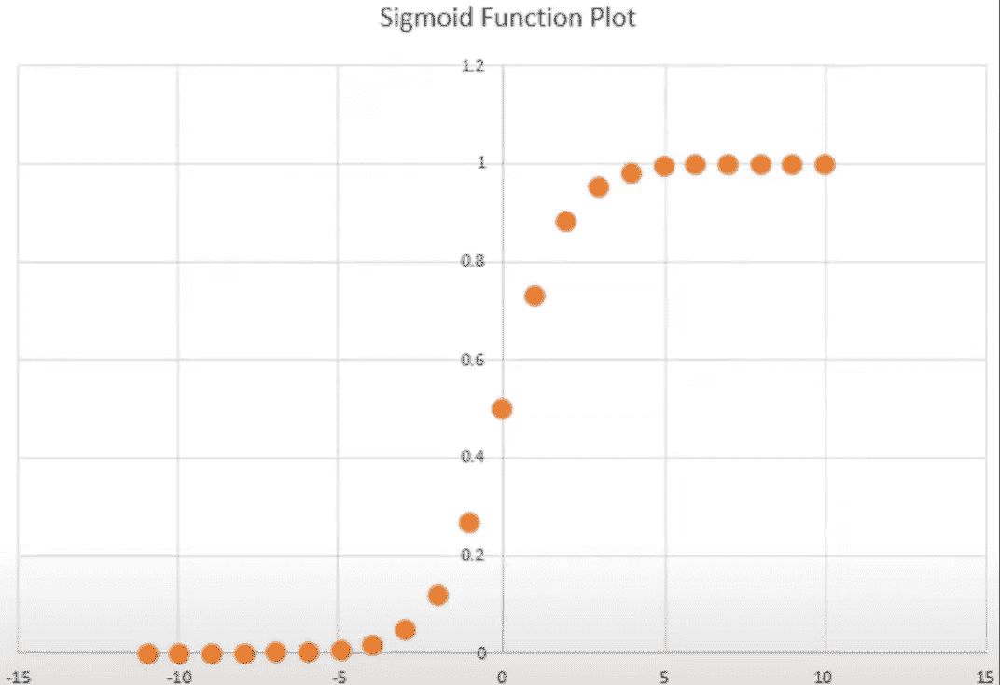

Sigmoid Function graph Image by Author

每个不同输入的输出显示，如果 x 等于+ꝏ，那么我们得到 1，如果它等于-ꝏ，它将给出 0 输出。

现在我们对幕后有了足够的了解，让我们更进一步，找出我们应该如何在现实世界的问题中使用这些理论。

## **逻辑回归实施**

我将使用 python 和 Jupiter notebook 来实现。
首先要一窥数据集；这可以从[这里](https://github.com/sinadalvand/LogisticRegression/blob/master/dataset.xls)进入

数据集如下图所示:

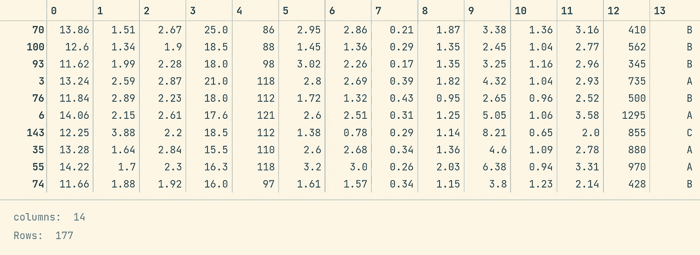

a small sample from the whole Dataset Image by Author

我们通过第一眼就意识到了一些技巧:

*   数据集有 14 列，包含 13 个要素
*   最后一列显示了三个标签，我们知道这是一个多项式问题
*   特征值不在同一个范围内，需要调整

**从数据集获取数据并解析成数据帧** 在这个项目中，我们使用了两个著名的库，Pandas 和 NumPy

> 这增加了对大型多维数组和矩阵的支持，以及对这些数组进行操作的大量高级数学函数。

Fetch data from Dataset

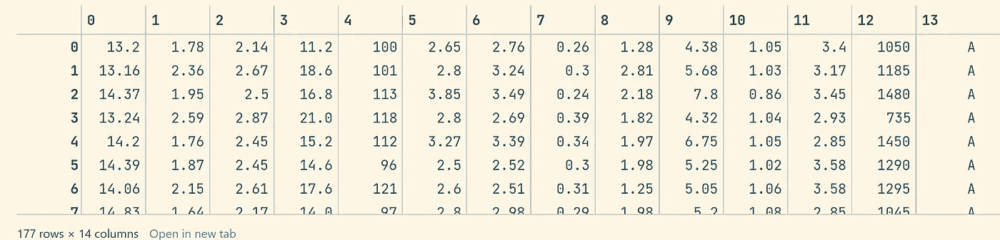

the output of Logestic_regression_Imports.py Image by Author

**数据拆分**

现在，我们需要将数据分为训练集和测试集，因为模型将通过考虑每个记录的特征和标签来训练和调整其参数(thetas ),并最终使用训练集(包含看不见的数据)来评估精确度。根据这个描述，我们应该将数据集的 70%用于训练阶段，30%用于测试集！

> 常用的比率有: **70%训练，30%测试**。 **80%训练，20%测试**

为了实现这个 splitter 函数，我使用了一种简单的方法:

在第二行中，完整数据记录的计数将从数据集中获得，并计算 70%的数据大小，它将是大约 144/0.7~ 101 条记录。

然后在第三行中，我们创建一个数组，它包含整个数据记录大小的 True 和 False 值，但我们通过为训练集生成 True 和为测试集生成 False 来区分它。现在我们有一个包含 70%真值和 30%假值的数组。

数据应该随机拆分，我们不知道当前数据集是否按特定方式排序！因此，让我们打破它，并洗牌生成真/假数组，以确保它将随机收集。所以我使用了随机播放功能。

然后尝试将每个真和假压缩到数据集中相应的索引，并将它们放在一起。

最后，通过过滤成对的数据，我们可以得到两个分离列表:训练集和测试集。

**从集合中提取特征和标签**

为了更直接地访问数据，我决定区分特征和标注，并将它们放入一个单独的数组中。

那么训练集将是这样的:

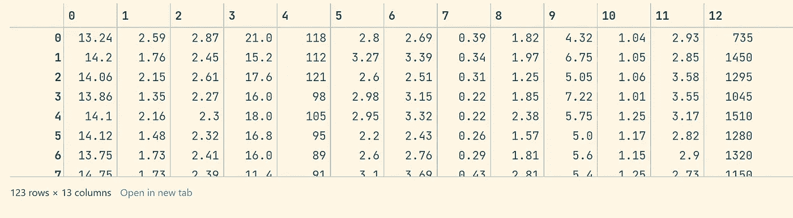

X_train values Image by Author

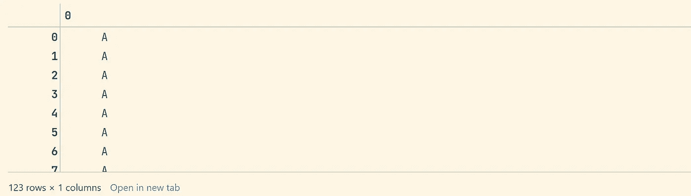

Y-train values Image by Author

**将特性值缩放到所需大小**

正如我们在数据集提示中提到的，要素值需要在相同的范围内，我们可以通过对其应用归一化并快速将值置于 0 和 1 之间来实现这一点:)

Normalization statistic formula Image by Author

根据正确的公式，为了实现，我们需要在 Numpy 中使用两个函数，“Numpy.mean()”和“Numpy.std()”用于计算一组特征中每个单个元素的平均值。

首先，我定义了 *normalize* 函数，该函数获取特性作为输入，然后将所有值解析为 float 类型以防止编程错误。

然后，我对训练集和测试集特性进行了缩放。

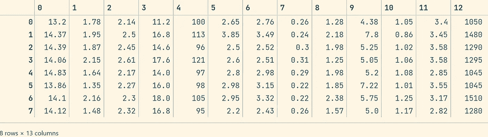

X_train before applying normalization Image by Author

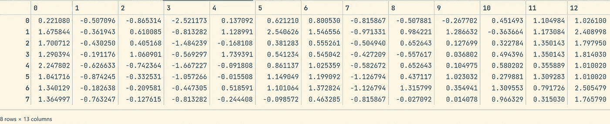

X_train after using normalization Image by Author

如顶部表格所示；所有值都介于 0 和 1 之间。

**每个 theta 都需要一个对应的特征**

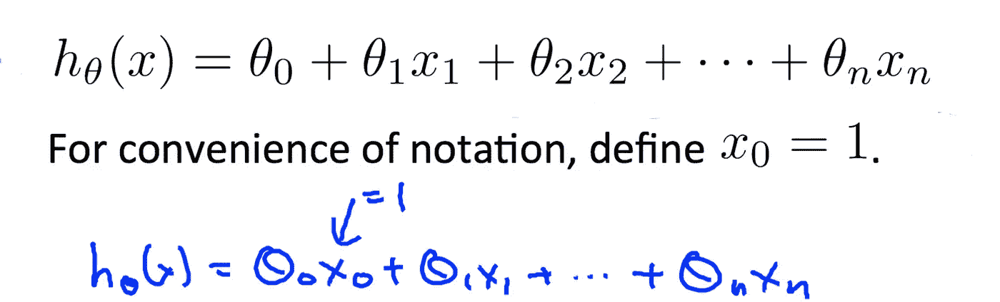

Linear Regression Hypothesis function Image by Author

如果你还记得线性回归假设函数，我们假设 xₒ
等于 1，以使矩阵计算更方便。

这里我们有相同的，但是有一点不同的假设公式:

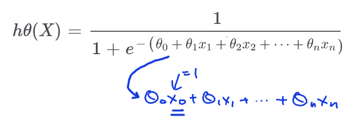

Logistic Regression Hypothesis function Image by Author

我们需要在特性中插入一个 one 列作为第一个索引。

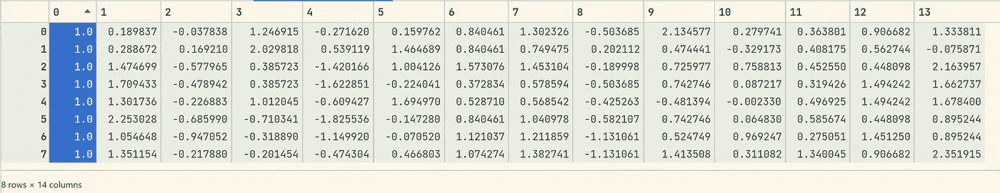

Ones column added to features Image by Author

**触摸核心**

现在是时候说说这个过程的主要部分了！
在开始实施之前，让我们先讨论一下这个概念，了解一下围绕它发生了什么。

Linear Regression Cost Function Image by Author

我们记得在线性回归中，我们用成本函数(损失函数) *J* ( *θ* )来表示优化目标，用梯度下降进行最小化。

幸运的是，我们在逻辑回归中有相同的方法！但是请问*为什么这些问题*我们不用线性回归的代价函数，答案是很多局部极小！

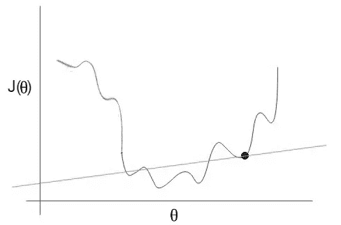

Using the Linear Regression cost function for Logistic Regression Image by Author

如图所示，我们有许多局部最小值，而且它不是凸图！这使得寻找最佳的情况变得复杂，因为当你认为你处于全局最小点时，可能存在更好的情况，但你被困在你有限的视野中:)

因此，为了解决这个问题，我们必须使用另一个与逻辑回归相关的成本函数，这就是:

Logistic Regression Cost Function Image by Author

如果我们把这些功能压缩成一个，它会是这样的:

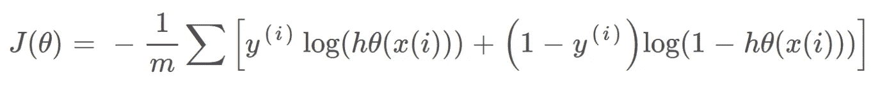

Logistic Regression Cost Function Image by Author

好了，现在是使用梯度下降来最小化成本函数的时候了:

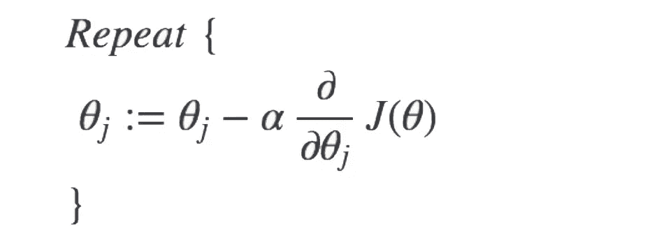

Gradient descent formula Image by Author

在导数之前有一个α，这就是学习率，我希望你们之前知道

如您所见，我们需要导数成本函数，其计算方式如下:

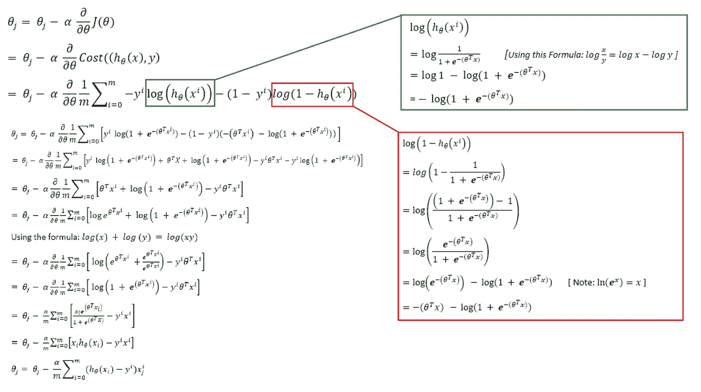

derivate of cost function Image by Author

最后，我们有:

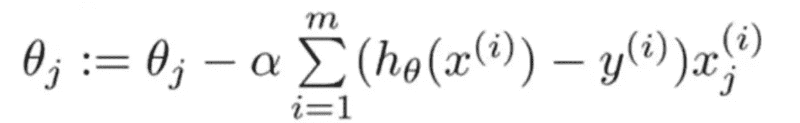

Derivated Logistic Cost function Image by Author

理论上，任务成功完成了，现在让我们动手吧:

没有预先构建的 sigmoid 函数，我们看到的比任何东西都多
,所以需要编写的第一个函数是 sigmoid，我们之前讨论过

sigmoid function implementation

第二个常见的函数是逻辑回归中的假设函数:

Hypothesis Function in Logistic Regression

好了，现在是梯度下降的时候了:

哇，与其他代码相比，这是很多复杂的代码！🤯
让我们尽可能简单地逐行描述

输入参数:

*   x:将特征训练为 2d 矩阵
*   y:功能集的相应类别标签
*   阿尔法:学习率
*   iter:用于停止算法的迭代次数

在第一行中，我们获取要素的计数以了解需要多少个 thetas，然后在第二行中，我们尝试使用 pure python 将所有标签转换为一个唯一的集合，其工作方式如下:

set function sample

set function sample result Image by Author

然后在第三行，我们为将来的 thetas 创建了一个空数组。

第一个循环是多项式和二元逻辑回归的不同点。为了更容易理解，让我们来看看:

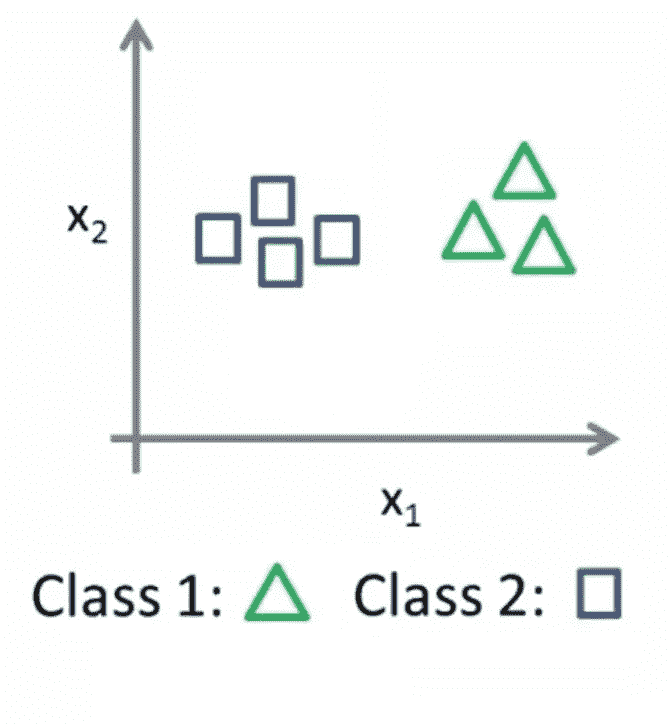

Binary classification Image by Author

在二进制分类中，我们只有两类！当你想训练你的模型时，你只有两种类型的数据，三角形和正方形。当你试图调整 thetas 时，因为类型只有两个，它属于三角形；否则属于正方。这种比较可以一步完成。正因如此，你不需要一个一个的互相比较！因此二元逻辑回归的代码应该是这样的:

Binary Logistic Regression Implementation

但是在多项式分类中，我们有两个以上的类别标签，这使得过程更加困难。让我们从一个简单的图形形状示例开始:

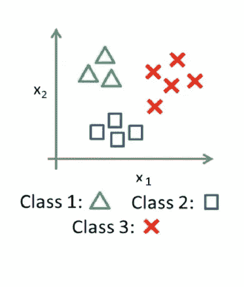

Multinomial Problem Image by Author

我们本能的知道 Logistic 回归是二进制的，所以要根据工作风格来改变问题！我们需要将类分组为二进制模式，并将三角形作为一个类，将所有其他类型作为另一个类；使用这种方法，我们有一个二进制问题，但应该考虑到它需要为每个类重复。即，在下一步中，正方形将是一个类，而另外两个将是另一个类。

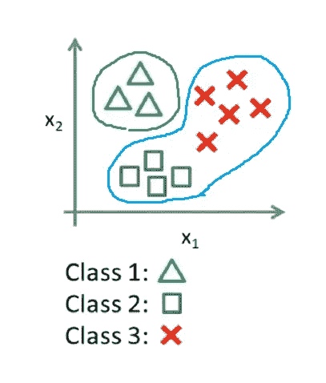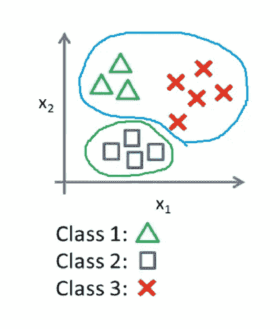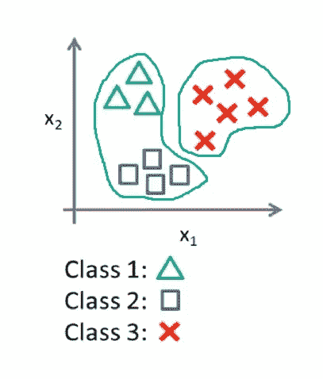

Classes group in multinomial Logistic Regression Image by Author

按照这个方法，现在我们知道第一个循环的原因了！它试图对每种类型进行分组，并为特定类型的类调整教学大纲！
此外，它为特定类型生成初始θ，然后区分索引 Y 和其他
Ops！还有一点功能之前没有提到:

extract specific label from Y_train

并且这种区分是由上述函数和过滤器 Y 针对特定的类标签而发生的:即，过滤是通过使所选择的类型值为 1 而其他的为 0 来完成的。

从现在开始，一切就像二元逻辑回归

上述功能正是以下功能的实现:

theta updated simultaneously Image by Author

在函数结束时，我们返回用于下一步的标签和类标签。

让我们运行逻辑回归:

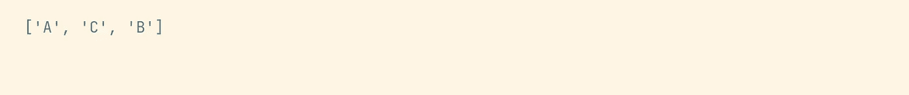

classes variable value Image by Author

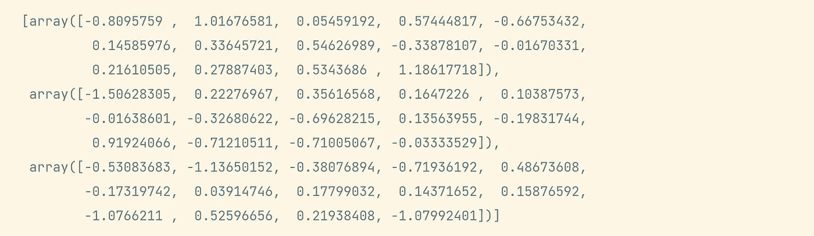

theta variable values Image by Author

**评估你的火车**

在所有这些步骤之后，让我们进行最后一步，评估模型预测准确性；我们先用训练数据试试！
期望达到 100%:

evaluate the Model by training data

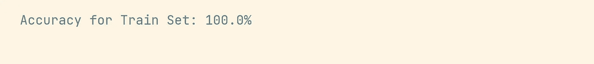

evaluation result for train data Image by Author

现在转到测试集(这是一个更可靠的原因，你可能会陷入过度拟合的问题)

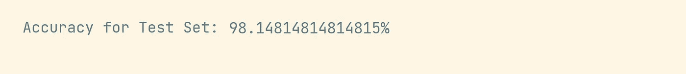

evaluation result for test data Image by Author

98%对于一个模型来说是很高的准确率，听起来不错。

**但是**什么是 **predict()** 函数？

如您所见，我们使用*预测*函数通过提供θ将 X(特征)应用到假设函数中，并且*预测*如下所示:

注意:@运算符是对两个矩阵的点积运算

应用参数后，在逻辑回归假设函数中，使用 argmax 检测哪个输出最大，以将其分配给特定的类标签。

**如需联系，请随意:**

**电子邮件**:[dalvandsina@yahoo.com](mailto: dalvandsina@yahoo.com)

**Github**:[www.github.com/sinadalvand](https://github.com/sinadalvand)

 [## Mlearning.ai 提交建议

### 如何成为 Mlearning.ai 上的作家

medium.com](/mlearning-ai/mlearning-ai-submission-suggestions-b51e2b130bfb)