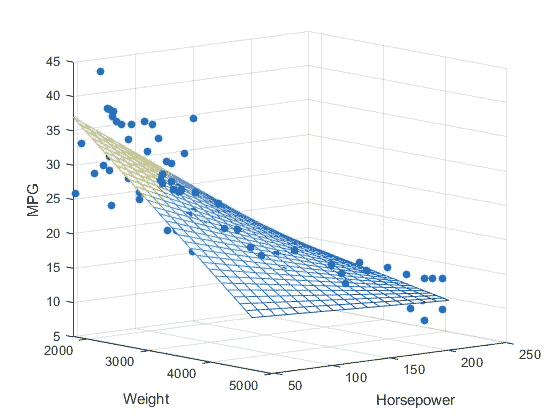

# Python 中的多元线性回归基础和建模

> 原文：<https://medium.com/mlearning-ai/multiple-linear-regression-fundamentals-and-modeling-in-python-60db7095deff?source=collection_archive---------0----------------------->

在这篇博文中，首先，我将尝试解释多元线性回归的基础知识。然后，我将通过 Python 使用数据集构建模型。最后，我将通过计算均方差来评估模型。让我们一步一步开始吧。

Resource: [https://medium.com/analytics-vidhya/new-aspects-to-consider-while-moving-from-simple-linear-regression-to-multiple-linear-regression-dad06b3449ff](/analytics-vidhya/new-aspects-to-consider-while-moving-from-simple-linear-regression-to-multiple-linear-regression-dad06b3449ff)

# 什么是多元线性回归？

多元线性回归的主要目的是找到表达因变量和自变量之间关系的线性函数。多元线性回归模型有一个因变量和多个自变量。在另一个来源中，它被定义如下:

> **多元线性回归**用于估计**两个或多个自变量**与**一个因变量**之间的关系。当您想知道以下内容时，可以使用多元线性回归:
> 
> -两个或更多自变量和一个因变量之间的关系有多强(例如，降雨量、温度和施肥量如何影响作物生长)。
> 
> -自变量的某个值处的因变量的值(例如，在特定降雨量、温度和施肥水平下的作物预期产量)。

那么它和简单的线性回归有什么不同呢？我可以解释如下的区别。当我们对现实生活中的问题进行预测分析时，我们可能无法用单个自变量进行很好的预测。使用几个独立变量进行估计会更容易，也更准确。

例如，假设您想要估计一辆汽车的销售价格。因变量是销售价格。想象一下，如果你有一些关于汽车的信息，你就能猜出它的售价。这些是；

*   公里信息，
*   发动机功率，
*   生产年份，
*   损坏率

在这种情况下，您有 4 个参数。有了这 4 个独立变量，你可以更准确地预测汽车的销售价格。

所以实际上我们仍然在寻找一个线性关系，比如简单的线性回归。但是我们会用更多的论据来证明。

多元线性回归在世界各地都很常见。它有一些假设。

## 多元线性回归的假设

多元线性回归与简单线性回归有相似的假设。这些是；

*   误差呈正态分布。
*   这些误差是相互独立的，它们之间没有共同的相关性。
*   每次观测的误差项方差是常数。
*   变量和误差项之间没有关系。
*   自变量之间没有问题`Multiple Linear Relationship`。

现在让我们试着理解多元线性回归的数学。

# 多元线性回归模型

Multiple Linear Regression Formula

*   y →因变量的预测值。
*   β0 →是要在数据集中找到的参数。它是指简单线性回归线与 Y 轴相交的点。
*   β1x 1→第一个自变量的回归系数(B1)。(X1)(也称为增加独立变量的值对预测的 **y** 值的影响)
*   βnXn →最后一个自变量的回归系数。
*   ϵ →指误差项。

# 用 Python 建模

现在让我们在一个样本数据集上建立一个`Multiple Linear Regression`模型。然后让我们计算模型的平方根，这将给出模型误差。

首先，我导入`pandas`库。然后，我将广告数据集保存在数据帧中。此数据集中的第一列是错误的索引列。这就是为什么我没有在数据框架中包括这个列。我正在用`df.head()`回顾前 5 个观察结果

然后我把自变量 X 放入数据帧。我用 Drop 函数做到了这一点。我把销售以外的东西保存在一个数据框架中。我将因变量 Sales 保存为不同数据框架中的 y。作为这些操作的结果，我们把因变量和自变量彼此分开。

我正在查看 y 和 X 数据框架的前 5 个观察值。

## **用 Statsmodel 建立模型**

分离因变量和自变量后；首先，我们将使用 Statsmodel 建立多元线性回归模型。这是一个有点原始的方法。我导入 Statsmodel 库来安装模型。然后我用 OLS 方法创建 lm 模型对象。当我们用 Statsmodel 建立一个模型时，我们获得了一个可以了解更多的模型。

*   OLS →普通最小二乘法

除了 OLS，还有两种不同的方法，WLS 和 GLS。

*   WLS →加权最小二乘法
*   GLS →广义最小二乘法

更多关于`Statsmodel`的信息，可以访问网站。

[https://www.statsmodels.org/stable/index.html](https://www.statsmodels.org/stable/index.html)

当我们说`model.summary()`时，我们可以访问我们已经构建的模型的所有概要信息。对我们来说很重要的价值观是:

*   r 平方→随着变量数量的增加，膨胀。
*   Adj. R-squared →防止因变量数量增加而膨胀。
*   方法→多元线性回归模型中的方法。
*   coef →最后的自变量是系数。
*   P>|t| →它给出了系数是否有意义的信息。如果小于 0.05，则模型显著。

此外，其他数据也提供了重要信息。但是我不会在这篇博文中谈论多元线性回归，所以我不会讲太多细节。如果你愿意，你可以自己研究一下。

## 使用 Scikit Learn 构建模型

现在我们来看对我们来说更重要的部分。我们将使用 Scikit 学习库安装多元线性回归模型。

首先，我从 Scikit 学习库中导入 LinearRegression。然后我用 LinearRegression 创建 lm 模型对象。然后我们用物体 lm 来拟合模型。

我们用 intercept_ 来看模型的常系数。

我们使用 coef_ 来查看模型自变量的系数。

我们将这些系数解释如下。例如，我们发现电视的值为 0.04576465。假设其他变量不变，电视支出每增加一个单位，将导致因变量(即销售额)平均增加 0.04576465 个单位。

现在让我们继续用我们建立的模型进行预测。

## 模型预测法

首先，我在一个数组中给出新的数据，以便模型能够做出预测。然后我转置这个数组。因为我们输入的数据属于每一列的一个独立变量。它不应包含在一个单独的列中。

因此，我们所要做的预测就是将新数据作为参数提供给 predict 函数。

利用我们建立的多元线性回归模型，我们估计当我们在电视上做 30 个单位的广告，在广播上做 10 个单位的广告，在报纸上做 45 个单位的广告时，销售额是 6.15 个单位。

我们用`model.score()`来衡量模型的成功。我们对因变量和自变量的计算如下。

对于模型来说，一切似乎都很好。但是目前我们不知道这个模型有多大的误差。现在让我们计算数据集中的实际销售额和我们估计的销售额之间的平均误差平方。为此，我们将使用`mean_squared_error`函数。

`mean_squared_error`函数获取真实的 y 值作为第一个参数，获取估计的 y 值作为第二个参数。

我们计算均方误差的平方根如下。

> **MSE:** 简单来说，均方差告诉你一条回归曲线与一组点有多接近。MSE 衡量机器学习模型(预测器)的性能，它总是为正，可以说 MSE 值接近零的预测器性能更好。
> 
> **RMSE:** 这是一种二次度量，经常用于查找机器学习模型的预测值和实际值之间的距离，并测量误差的大小。RMSE 估计误差的标准差(残差)。也就是说，残差是回归线距离数据点有多远的度量；RMSE 是衡量这些残留物扩散程度的标准。换句话说，它会告诉您最符合数据的线周围的数据密度。RMSE 值的范围可以从 0 到∞。负向分数，即具有较低值的预测值，表现更好。零 RMSE 值意味着模型没有错误。RMSE 的优势是惩罚更大的错误，所以它可能更适合某些情况。RMSE 防止在许多数学计算中不必要的使用绝对值。

## 模型调整

我们进行调整过程，以最大化机器学习模型，防止过度学习和高方差。

***什么是模型调优？***

> 调整通常是一个反复试验的过程，通过该过程，您可以更改一些超参数(例如，基于树的算法中的树的数量或线性算法中的 alpha 值)，再次对数据运行该算法，然后比较其在验证集上的性能，以确定哪组超参数会产生最准确的模型。

用于模型调整；首先，我们将数据集分为训练集和测试集。我们用`train_test_split`来做这件事。使用`train_test_split`函数中的 test_size，我们可以确定我们拥有的数据集中有多少百分比将成为测试集。`random_state`关于数据集的不同划分。如果我们不输入值，每次运行模型时，我们都会使用不同的数据进行计算。

同样，如我们所知，我们使用 lm 模型对象在训练数据集上建立模型。

然后我们分别计算训练和测试数据的均方误差。

## k 倍交叉验证

> 交叉验证是一种重采样过程，用于在有限的数据样本上评估机器学习模型。
> 
> 该过程有一个称为 k 的参数，它指的是给定数据样本要被分成的组的数量。因此，该程序通常被称为 k 倍交叉验证。当选择了 k 的特定值时，它可以用来代替模型引用中的 k，例如 k=10 成为 **10 重交叉验证。**

我通过对我安装的模型进行 10 重交叉验证来计算 MSE 和 RMSE 值。在这种情况下，我们计算 10 种不同的误差。因为我们说 cv = 10，所以训练集被分成 10 个不同的部分。首先，用 9 个选定的零件建立模型，然后用剩余的 1 个零件估算模型。这个过程每次针对不同的零件计算 10 次。因此，我们通过取这 10 个误差的平均值得到一个测试误差。

**数据集:**【https://www.kaggle.com/ashydv/advertising-dataset 

# 最后

首先，我们在这篇博文中研究了什么是多元线性回归。然后我们讲了多元线性回归的假设。数学上，我们检查了这个算法的模型。然后，我们通过在 Python 中建立多元线性回归模型来计算误差值。最后，我们调整了模型，并使用 k-fold 交叉验证计算了验证的误差值。

# 资源

1.  [https://www . scribbr . com/statistics/多元线性回归/](https://www.scribbr.com/statistics/multiple-linear-regression/)
2.  [https://book down . org/ll t1/202 s21 _ notes/multiple-linear-regression-fundamentals . html](https://bookdown.org/llt1/202s21_notes/multiple-linear-regression-fundamentals.html)
3.  [https://veribilimcisi . com/2017/07/14/MSE-RMSE-Mae-mape-metrikleri-nedir/](https://veribilimcisi.com/2017/07/14/mse-rmse-mae-mape-metrikleri-nedir/)
4.  [https://www.datarobot.com/wiki/tuning/](https://www.datarobot.com/wiki/tuning/)
5.  [https://machinelearningmastery.com/k-fold-cross-validation/](https://machinelearningmastery.com/k-fold-cross-validation/)