# 使用 NVIDIA 的迁移学习工具包进行多对象检测

> 原文：<https://medium.com/mlearning-ai/multiple-object-detection-using-nvidias-transfer-learning-toolkit-e7cfc1b5a381?source=collection_archive---------1----------------------->

这篇文章并不是对机器或深度学习的深入解释，而是为项目设置对象检测的实用指南。这篇博文将介绍使用 [NVIDIA 的转移学习工具包(TLT)](https://developer.nvidia.com/transfer-learning-toolkit) 构建一个自定义的对象检测系统。*需要注意的是，使用 TLT 的训练只在 x86 上使用 NVIDIA GPU 如 V100 通过 TLT 训练的模型可以部署在任何 NVIDIA 平台上。*我写过一些关于如何用 Fast 构建一个[对象分类模型的博文。AI](https://ronak-k-bhatia.medium.com/building-an-object-detection-model-with-fast-ai-c1694c7a521e) 以及使用 [TensorFlow 的对象检测 API 进行多对象检测](https://ronak-k-bhatia.medium.com/building-a-multiple-object-detection-model-with-tensorflows-object-detection-api-5a71eaaa5b96)。

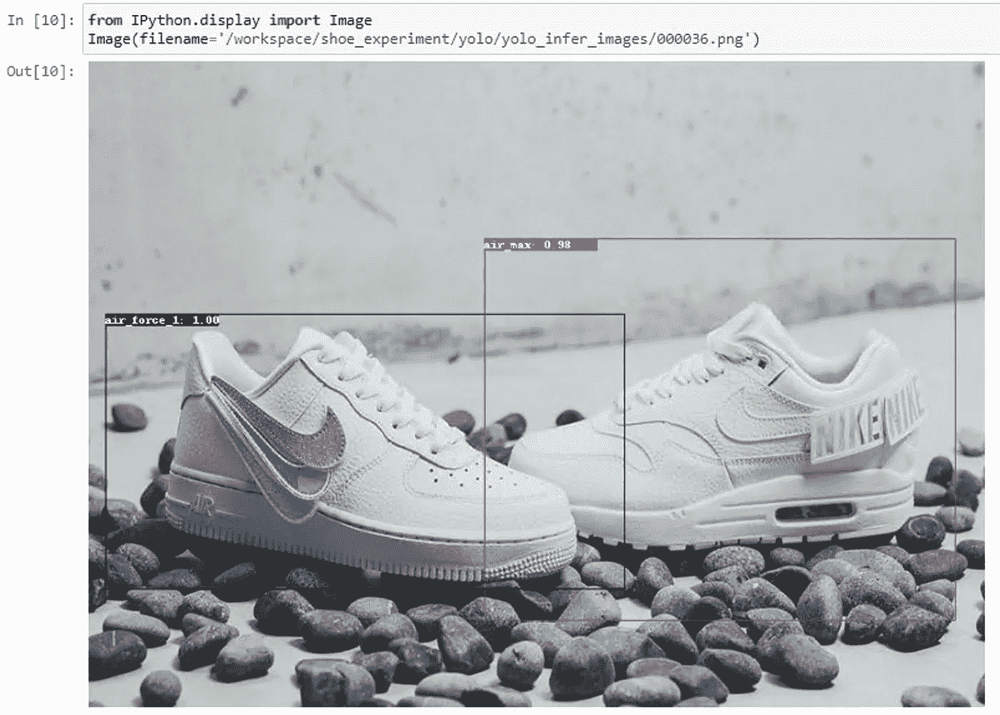

Example Output of an NVIDIA TLT Objection Detection Model Trained on Nike Shoes

NVIDIA 的 Transfer Learning Toolkit 是一个基于 Python 的人工智能工具包，用于获取预先构建的人工智能模型，并用您自己的数据定制它们。迁移学习包括从现有的神经网络中提取学习到的特征到新的神经网络中；当创建大型训练数据集不可行时，通常会使用它( [NVIDIA](https://developer.nvidia.com/transfer-learning-toolkit) )。该工具声称通过优化的预训练模型和模型修剪来减少人工智能训练和开发时间。你不需要人工智能框架的专业知识来使用它，也不需要编写额外的代码。*但是，请注意，通过 TLT 进行的培训只能通过 NVIDIA GPU 进行*。

这篇博文的目的是介绍设置 TLT 的细微差别，因为对于使用自定义数据的人来说，现有的文档可能不清楚。这篇文章将涵盖(1)获取和修改 TLT 的数据；(2)用 TLT 训练模型；以及(3)模型优化和可视化结果。为了我们的培训目的，我们使用了一个[英伟达 DGX-1](https://www.nvidia.com/en-us/data-center/dgx-1/) ，我们远程访问它。如果使用其他设置，您的训练时间可能会更长。此外，对于数据操作和转换，我使用了一台 Macbook Pro，规格如下:`macOS Catalina, Version 10.15.7, 16GB RAM, 2.3 GHz, 8-Core Intel i9`。

# 参考文献和鸣谢

在开始这篇文章之前，我想感谢下面的人和资源，这些人和资源或者是这篇文章的参考，或者是因为它们才成为可能。Joev Valdivia 有一个令人难以置信的 YouTube 频道,通过使用 TLT 工具，我发现它非常有用，并且是这个演练的基础。此外，我要感谢那些通过 [NVIDIA 的开发者论坛](https://forums.developer.nvidia.com/c/accelerated-computing/intelligent-video-analytics/transfer-learning-toolkit/17)帮助我们团队的人。这个资源非常适合提问，让我们能够缩小问题的范围。接下来，我要感谢 Eddie Weill 有用的[转换数据集工具](https://github.com/eweill/convert-datasets)将 COCO 数据集转换为 KITTI 格式。Mityakov Aleksandr 的用于将 XML 转换成 KITTI 的工具也非常有用。此外，我想感谢 Naveen Malwani 的[有用文章](https://towardsdatascience.com/how-to-easily-download-googles-open-images-dataset-for-your-ai-apps-db552a82fc6)关于下载 Google 的 OpenImages 数据集用于人工智能应用。最后，我要感谢 Allison Youngdahl，她帮助我校对了这篇文章，并与我一起完成了这个项目。本教程的部分内容摘自她编写的文档和代码。

# 获取和修改 TLT 的数据

在我看来，使用 TLT 工具最困难的部分是它要求数据采用 KITTI 格式。如果您有一个不同格式的数据集(例如 COCO)，您需要将其转换为 KITTI。此外，根据您使用的型号，您需要调整图像的大小，或者确保图像符合 TLT 的大小要求。

正如 NVIDIA 所说，“tlt-train 工具不支持对多种分辨率的图像进行训练，也不支持在训练过程中调整图像大小。所有图像必须离线调整大小到最终的训练尺寸，并且相应的边界框必须相应地缩放。”更多信息，请参见[下面的链接](https://docs.nvidia.com/metropolis/TLT/tlt-getting-started-guide/text/supported_model_architectures.html)。此链接还包含有关各个型号的图像大小要求的信息(例如，YOLOv3 的 C * W * H[其中 C = 1 或 3，W > = 128，H > = 128，W，H 是 32 的倍数]。我们的团队在两个数据集上使用了 TLT 工具:(1)我们为运动鞋创建的自定义数据集，以及(2)我们使用来自谷歌 [OpenImages](https://storage.googleapis.com/openimages/web/factsfigures.html) 的附加图像创建的数据集。本文包括关于获取和修改这两个选项的数据的说明。

## 继续之前的重要步骤

为了节省时间和后续步骤的麻烦， ***请确保将任何非 PNG 格式的照片转换为 PNG*** 。我们注意到，如果使用 JPEG 格式的照片，TLT 工具包就不能正常工作。请在获得要转换为 KITTI 的数据之后，但在实际转换数据之前执行此步骤。如果你从谷歌的 OpenImages(解释如下)下载图像和标签，它有时会把图像放在 JPEG 格式。将图像转换为 PNG 的快速方法是在终端中运行以下程序:

```
mkdir pngs; sips -s format png *.* --out pngs
```

这将创建一个名为`pngs`的目录，并将转换后的照片放在那里。然后，您可以删除非 PNG 的照片，并用上面的照片替换它们。例如，假设我有一个名为`images`的文件夹，里面有 JPEG 图像。

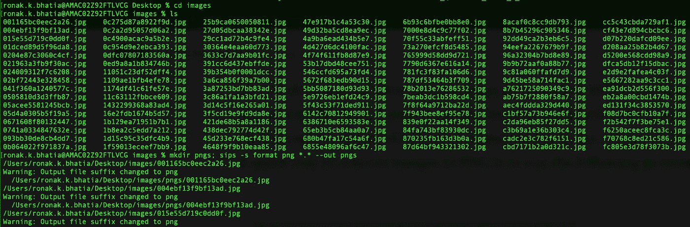

Running the Command for Converting JPEGs to PNGs.

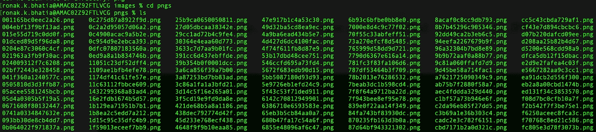

The Completed Output: PNGs are Stored in a Folder Called “pngs.”

## 选项 1:修改 TLT 的自定义数据集

对于我们的自定义数据集，我们有 XML 格式的相关注释，例如如下所示。

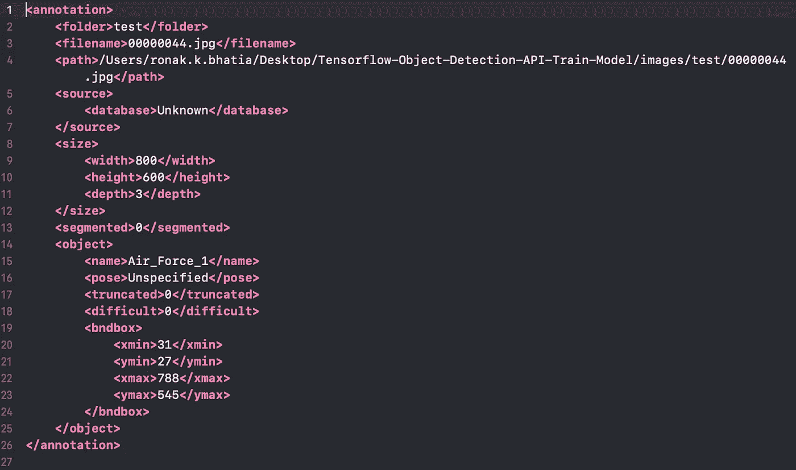

Example of XML Data for Object Detection for a Custom Dataset

XML 文件包含在名为`test`和`train`的两个文件夹中。为了快速方便地将这种格式转换成 KITTI，我们使用了[跟随工具](https://github.com/krustnic/xml2kitti)。Git 克隆存储库后，导航到根文件夹并运行以下命令:

```
python3 xml2kitti.py {Path}
```

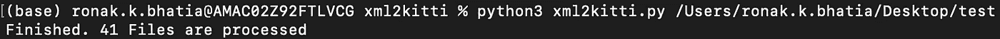

Successful Output for Running the XML2KITTI Script (python3 xml2kitti.py [name of folder]).

这将把指定文件夹中的所有 XML 文件转换成 KITTI 格式(作为文本文件),而不会删除 XML 文件。请确保标签(如 air_force_1)是小写的。例如，如果我回到我的测试文件夹，我会看到以下输出:

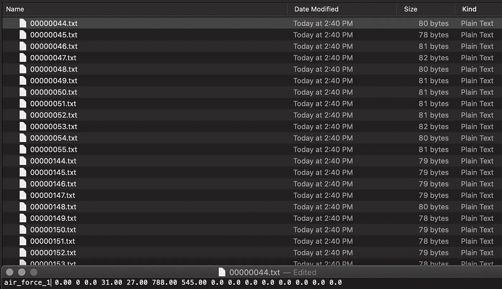

Properly Converting the XML Files to the KITTI Format.

虽然如果这些都是步骤就很理想了， *TLT 要求 KITTI 格式只包含 15 个元素*。目前，每个文本文件有 16 个元素；为了减轻这种情况，我们需要删除所有生成的文本文件的最后一个零。对此最方便快捷的解决方案是运行以下 CLI 命令，然后删除生成的结果文件`.bat`。该命令将获取现有的`.txt`文件，并编辑它们以删除最后的 0。由于命令一直在运行，我们必须在所有文件被修改后按 CTRL+C(假设每个文本文件大约 0.5 秒)。

```
find . -maxdepth 1 -name '*.txt' -exec sed -i.bak 's/[[:space:]]\{1,\}[^[:space:]]\{1,\}$//' {} \;sed 's/[[:space:]]\{1,\}[^[:space:]]\{1,\}$//'
```

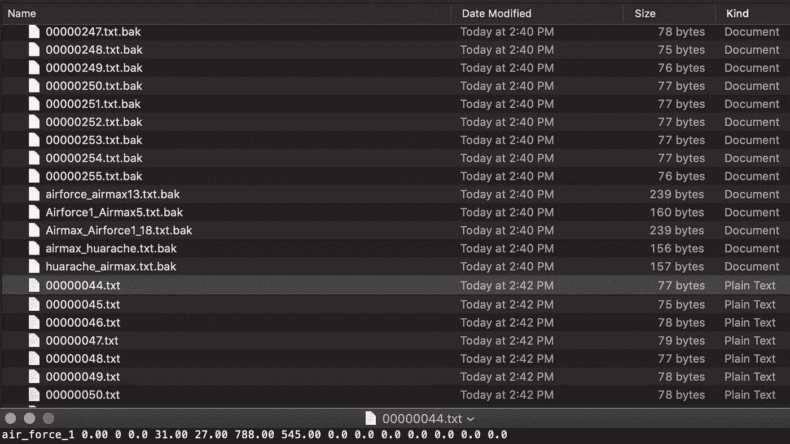

The Original Text Files are now in the Correct KITTI Format with Fifteen Elements.

对于训练和测试数据，请遵循以下步骤。如果您想要一种系统的方法来检查您的标注是否正确完成(例如，有 15 个元素)，请尝试在一个空的 Jupyter 笔记本中运行以下 Python 命令来检查元素的数量。

```
# This code checks if you have 15 Fields for your labels.import glob
rootdir = "{your_path}" #e.g., Data/testing/label_2for i in glob.glob(rootdir + "/*.txt"):
    with open(i, 'r') as j:
        for line in j.readlines():
            label = line.strip()
            length = len(label.split(" ")) 
            print("This label have {} fields".format(length))
            assert length == 15, 'Ground truth kitti labels should       have only 15 fields. And make sure there is not empty lines. Please check the label in the file %s' % (j)
```

在继续下一步之前，请确保您的照片是本文开头提到的 PNG 格式。此外，我们希望确保照片符合 YOLO 的适当尺寸要求。根据 YOLOv3 的要求，png 的宽度和高度必须是 16 的倍数。

在我们的例子中，我们必须调整自定义数据集图像的大小来满足这一要求。以下代码将我们自定义数据集中的原始图像(800x600)修改为 800x576，并在此作为如何根据需要调整图像大小的示例。

```
import glob
from PIL import Imagerootdir = "{your_path}/training/image_2" 
#e.g., Data/training/image_2for i in glob.glob(rootdir + "/*.png"):
    print(i)
    # Opens a image in RGB mode
    im = Image.open(i)# Size of the image in pixels (size of original image)
    width, height = im.size  #800, 600# Setting the points for cropped image
    left = 0
    top = 0
    right = width
    bottom = height - 24

    # Cropped image of above dimension
    im = im.crop((left, top, right, bottom))
    newsize = (800, 576)
    im = im.resize(newsize)# Save resized image
    im.save(i)
```

因此，我们还需要修改标签以匹配新的图像大小。

```
import os, re
import globrootdir = "{your_path}/training/label_2"
for i in glob.glob(rootdir + "/*.txt"):
    print(i)

    data = open(i,'r').read().replace('\n', '')
    data_list = re.split(" ", data) #list of values
    y_max = data_list[7] #extract bounding box#fit inside resized 576x800 image size

    if float(y_max) > 576.0 :
        data_list[7] = '576.0'new_data = " ".join(data_list)f = open(i, 'w')
    f.write(new_data)
    f.close()
```

## 选项 2:从谷歌的 OpenImages 为 TLT 获取数据

*如果你没有自定义数据集，你可以使用谷歌的 OpenImages* 创建一个。我们使用了[下面的教程](https://towardsdatascience.com/how-to-easily-download-googles-open-images-dataset-for-your-ai-apps-db552a82fc6)来下载 Google 的 OpenImage 数据。首先，通过以下命令安装 openimages 包:

```
pip install openimages
```

然后，选择您感兴趣的项目或类别。您可以在下面的[链接](https://storage.googleapis.com/openimages/web/visualizer/index.html?set=train&type=segmentation&r=false&c=%2Fm%2F01xs3r)中观察到各种不同的项目。例如，假设我对获取糕点的标签和照片感兴趣；我将在命令行中输入以下命令(这是假设您将使用 DarkNet-19 架构和 YOLO 进行对象分类):

```
oi_download_dataset --base_dir ~/dir_Pastry --labels Pastry --format darknet --limit 2000 
```

或者，如果您希望目录显示在桌面上，请执行以下操作:

```
oi_download_dataset --base_dir /Users/[your name]/Desktop/dir_Pastry --labels Pastry --format darknet --limit 2000
```

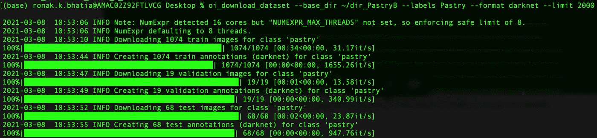

The Output from Running the Above Command. It May Take a Few Minutes to Run Completely.

这一行将创建一个`dir_Pastry`文件夹，其中分别包含全部注释信息和图像/标签。如果您计划检测多个对象，请对不同的类别运行此过程，直到您有了每个项目的目录。如果您查看`dir_Pastry`，您将看到一个`darknet_obj_names.txt`文件，其中包含类名(在本例中为 pastry)和一个名为 pastry 的文件夹，其中包含图像和标签(名为 darknet)。我们现在需要正确地将 darknet 文件夹中的文本文件转换成 KITTI 格式。

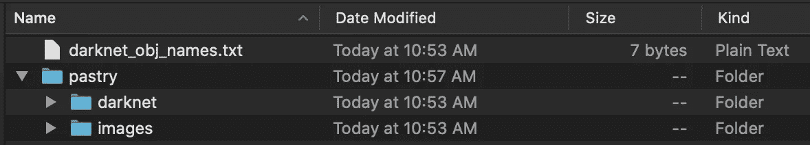

Directory After Running the Above Commands

为了将这种格式转换成 KITTI 格式，我们将使用下面的[工具](https://github.com/eweill/convert-datasets)。克隆存储库，并为您提取图像和标签的每个项目创建两个文件夹(格式为`[classname]`和`[classname]KITTI`)。例如，如果我对检测背包、手提箱、手提包和公文包感兴趣，我将在 convert-datasets 中有以下文件夹:

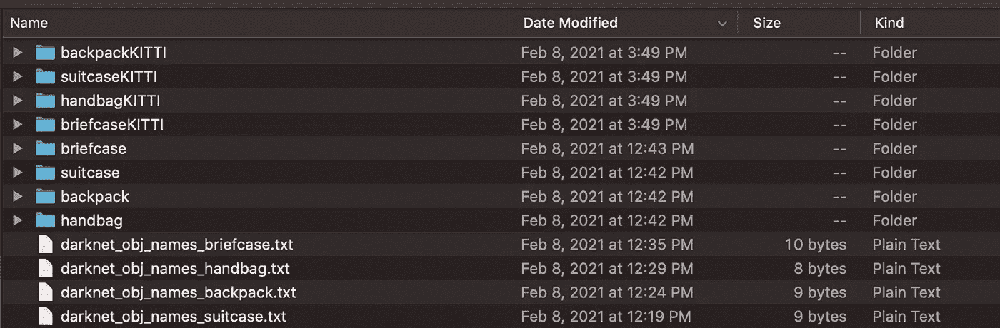

Initial Folder Structure for Convert-Datasets Directory. Renamed `darknet_obj_names.txt` for Various Classes and Added Them to Repository.

现在，对于每个只有类名的文件夹(例如，公文包)，创建一个名为 train 和 val 的文件夹。*我们需要这样做，因为这是 convert-dataset 工具识别的格式*。在 train 文件夹中，复制`dir_[classname]B` (如`dir_Briefcase`)的 darknet 和 images 文件夹，分别重命名为 labels 和 images。对 val 文件夹做完全相同的事情，对您感兴趣的所有不同的类重复这些步骤。

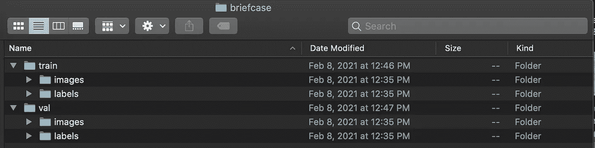

Example File Structure for Each Individual Class in Convert-Datasets.

同样，将`dir_[classname]`文件夹中的`darknet_obj_names.txt`文件重命名为`darknet_obj_names_[classname].txt`(例如`darknet_obj_names_briefcase.txt`)。然后，将其移动到 convert-datasets 存储库的根文件夹中。对所有正在使用的类都这样做。

现在，返回 convert-datasets 的根目录并运行以下命令:

```
# Generic python3 convert-dataset.py --from yolo --from-path [classname]/ --to kitti --to-path [classname]KITTI/ --label darknet_obj_names_[classname].txt# Example with Pastry python3 convert-dataset.py --from yolo --from-path pastry/ --to kitti --to-path pastryKITTI/ --label darknet_obj_names_pastry.txt
```

如果运行此命令有问题，请尝试执行以下操作:

```
# Installing Pillow (run via command line) 
python3 -m pip install --upgrade pillow# Installing LXML (run via command line) 
pip3 install lxml 
```

然后，您应该会收到以下内容；请键入“是”进行覆盖。

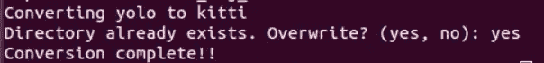

A Successful Conversion to the KITTI Format

有时，您不会收到“转换完成！!"输出，命令将挂起。在这种情况下，它可能实际上已经完成了转换，您只需`CTRL + C.`检查您的标签，以确保它们已正确转换为 KITTI 格式。举个例子:

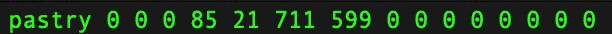

Proper Output to KITTI Format Using the Pastry Example

但是，如果你数元素，有 16 个元素。如前所述， *TLT 要求 KITTI 格式只包含 15 个元素*。对此最方便快捷的解决方案是运行以下 CLI 命令，然后删除生成的结果文件`.bat`。该命令将获取现有的`.txt`文件，并编辑它们以删除最后的 0。

```
find . -maxdepth 1 -name '*.txt' -exec sed -i.bak 's/[[:space:]]\{1,\}[^[:space:]]\{1,\}$//' {} \;sed 's/[[:space:]]\{1,\}[^[:space:]]\{1,\}$//'
```

完成这些步骤后，你的`[classname]KITTI`目录中就会有你的数据。您可以删除 val 文件夹中的标签目录，因为它不会被使用。

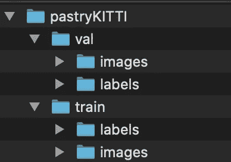

Example Output for the Pastry Example.

## 获取 KITTI 格式数据后的步骤

在这一点上，你应该有你的照片训练/测试和他们的 KITTI 标签，尊重。如果您遵循 OpenImages 方法，您将拥有一个或多个标记为`[classname]KITTI`的目录，其中包含一个 train 和 val 目录。对于您自己的自定义数据集，您将分别拥有一个包含标签的文件夹和一个包含 train/val 集照片的文件夹。但是，重要的是将所有这些信息(无论使用何种方法)整合成一种适用于 TLT 的标准格式。因为 TLT 包含一个示例 Jupyter 笔记本和检查特定文件标签和格式的预写代码，这个标准格式允许对代码进行最小的修改，并防止在未来的步骤中出现错误。

首先，我们需要确保图像和标签遵循一个升序的数字顺序，除了大小合适之外，还要从四个零开始。 ***请注意，无论您使用何种方法获取 KITTI 数据*** ，您只需重命名验证数据集的图像以及训练数据集的图像和标签数据。如果您只有一个存储库或数据集，这个过程相当简单，因为您可以创建一个空的 Jupyter 笔记本，并对训练和验证存储库运行以下命令。对于训练数据集中的标签数据:

```
import osi=0
# Path to labels data (e.g., {your-path}/convert)
# datasets/pastryKITTI/train/labels) path="{your_path}/test/labels" 
dir = os.listdir(path)
dir.sort()for filename in dir:
  os.rename(path+'/'+filename,path+'/0000'+str(i)+'.txt')
  i = i + 1
```

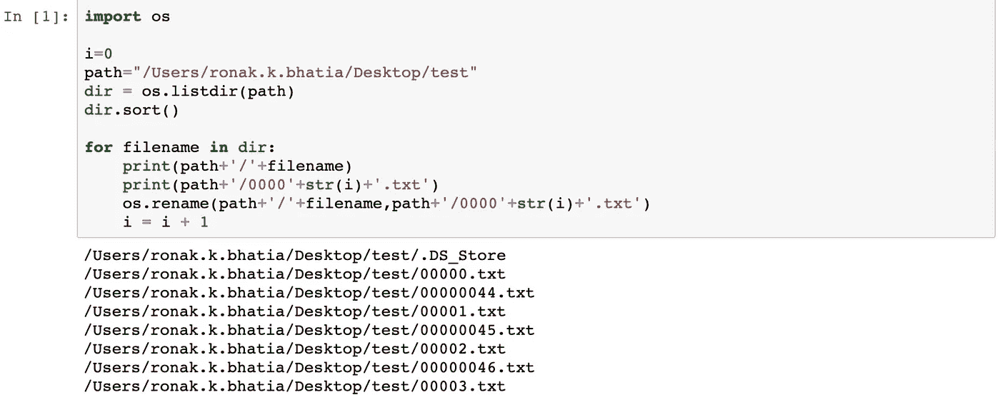

Example Output of Running the Above Command.

此命令按升序重命名文件夹中的所有内容。接下来，对 PNG 图像执行相同的命令。注意，每个类的文本文件的数量应该与 PNG 图像的数量相同。对于图像数据:

```
import osi=0
# Path to labels data (e.g., {your-path}/convert 
# datasets/pastryKITTI/train/images)
path="{your_path}/test/images"
dir = os.listdir(path)
dir.sort()for filename in dir: 
    os.rename(path+'/'+filename,path+'/0000'+str(i)+'.png')
    i = i + 1
```

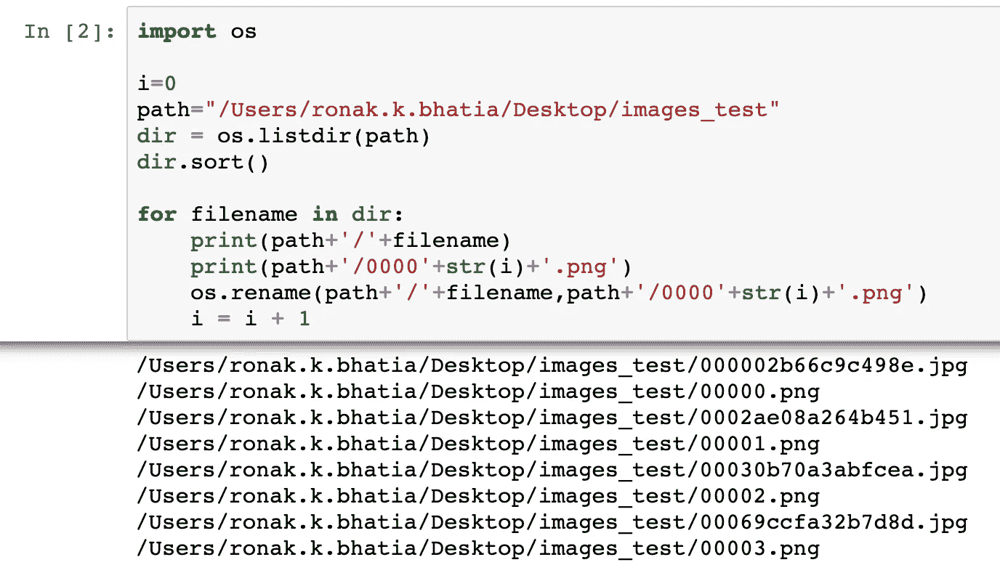

Example Output of Running the Above Command.

现在，您应该有了按数字升序排列的标签和图像，其中`00001.txt`对应于`00001.png`等等。如果你使用 Google OpenImages 的方法，并且不同的类有多个目录，这有助于将你的照片和标签合并到一个目录中，因为 TLT 假设你的数据存储在一个存储库中。我们发现，当在不同的类上提取信息时，图像和标签可能共享相同的名称。因此，如果您要立即将照片/标签合并到一个文件夹中，您将拥有引用不同信息的副本；这有助于在整合之前分别重命名每个存储库中的文件。

在第一个类的存储库中执行上述步骤，然后对于后续的类，您可以使用相同的代码，但是将`i=0`替换为`i=[1 + last label number of previous repo]`。换句话说，如果第一个存储库有 100 个图像，那么我们将使用`i=101`对第二个存储库的标签和图像重新运行上面的命令。完成后，将图像和标签合并到一个文件夹中；关于这种特定格式的更多信息如下。

无论采用何种方法，我们都需要创建或使用一个文件夹(例如`tlt-experiments/data`)，该文件夹有两个文件夹`training`和`testing`，其中测试包含*仅用于验证/测试的图像*，训练包含用于训练的*图像和标签*。换句话说，数据的格式应该是这样的:

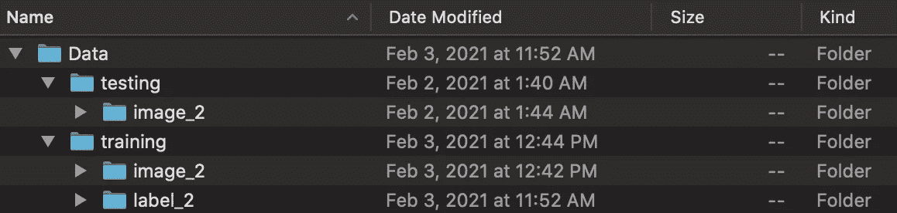

Folder Chart for Datasets for TLT. Use Label_2/Image_2 as the Internal Folders Within Training and Testing.

我们使用这种特定格式的原因是，它与英伟达为 TLT 提供的 YOLO Jupyter 笔记本样本中的预期格式相匹配。现在将我们的数据转换成这种格式可以为我们以后的工作节省时间。

你可以从你的图片中随机选择一个子集放到`image_2`下的`testing`中，或者完全选择新的图片(确保它们遵循前面提到的升序格式)。为了训练，将您的合并图像文件夹放在那里，并将其重命名为`image_2`。然后，将您的合并标签文件夹放在那里，并将其重命名为`label_2`。现在，检查标签和调整信息。

一旦你的数据文件夹设置好了，就把它上传到 Github，或者使用其他的存储方法来获取数据。我们将数据上传到 Github，然后上传到 DGX 1 号。

# 和 TLT 一起训练模特

## 设置 TLT 以供使用

接下来，我们需要设置 TLT 以供使用。NVIDIA 对此的说明也在这里[提供](https://ngc.nvidia.com/catalog/containers/nvidia:tlt-streamanalytics)。提醒一下，我们在远程访问的 DGX 1 号上运行 TLT，使用的是 2.0 版。看起来 3.0 版本对此有不同的处理方式，没有明确地使用 docker 有关更多信息，请参见之前链接的文档。首先，运行:

```
docker pull nvcr.io/nvidia/tlt-streamanalytics:v2.0_py3
```

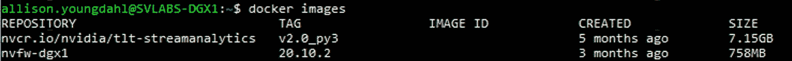

Resulting Output of Running the Above Command

接下来，进入下面的[站点](https://ngc.nvidia.com/signin)创建一个 NGC 账户，输入你的电子邮件，选择创建账户，然后输入你的信息，点击下一步。然后，通过`ngc config set`配置 NGC 命令行界面。您将被要求提供一个 API 密钥，您可以从下面的中的[获得该密钥(假设您已登录 NGC)。复制 API 密钥，粘贴到终端中；对于其余的设置，使用默认选项。在这一部分之后，您将运行 TLT docker 映像(确保添加您自己的项目文件夹)。在我们的例子中，我们已经将数据上传到 Github。我们通过 Git 将数据(这是在前面步骤中创建的数据文件夹)提取到 DGX-1，并将其移动到一个 purestorage 目录。](http://ngc.nvidia.com/setup/api-key)

```
*docker run --gpus all -it -v /purestorage/{project_name}:/workspace/{project_name} -p 8848:8848 nvcr.io/nvidia/tlt-streamanalytics:v2.0_py3 /bin/bash*
```

由于我们的数据存储在 purestorage 中，我们的位置从`/purestorage`开始。您应该用数据的位置替换这一部分。此外，`-p 8848:8848`线路支持端口 8848 上的端口转发，我们需要这样做以便从远程桌面访问 DGX-1 上的 Jupyter 笔记本。如果您没有远程运行任何东西，您可能不需要运行这行代码。

第一次运行可能需要几分钟。本质上，这启动了一个 docker 容器，其中包含 NVIDIA 用于对象检测的示例 Jupyter 笔记本。在我们的例子中，我们想使用 YOLO 的例子。

将目录切换到您感兴趣的示例(如`/workspace/examples/yolo`)并运行`jupyter notebook`。打开 localhost 并导航到相关的。ipynb 文件(本例中为`yolo.ipynb`)。为了在给定的设置下运行 Jupyter Notebook，我们使用了以下命令:

```
jupyter notebook –-ip 0.0.0.0 –-port 8848 –-allow-root
```

这将允许在端口 8848 上进行根访问和端口转发。在远程桌面中，在 Chrome 中打开`[http://localhost:8848](http://localhost:8848)`,或者使用带有令牌的终端中提供的 URL 之一。

注意:如果你完成了并想离开 docker，只需按下`CTRL + P + Q`即可离开 docker，但保持容器运行。如果你想完全停止容器，只需键入 exit。要查看所有正在运行的容器，可以运行`docker ps -a`。要移除容器，请键入`docker rm [container_name]`。要启动一个容器(假设您已经启动了一个项目，已经对它进行了配置，并且想要恢复工作)，您可以运行下面的命令:`docker start -i [container_id]`并按下`Enter`。

假设您已经成功启动并打开了 Jupyter 笔记本(例如`yolo.ipynb`)，您首先需要输入一些关于数据存储位置的信息。

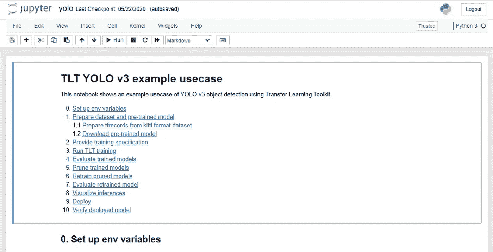

If You Run Everything Successfully, This Will Be The Jupyter Notebook.

第一步是设置我们的环境变量。首先，在 Set up Env variables 部分，将前一部分中的 API 键放在名为 key 的变量下。然后，在`USER_EXPERIMENT_DIR`下，放置包含`yolo`文件夹的目录(在我们的例子中，这是`workspace/{project_name}/yolo`)。接下来，在`DATA_DOWNLOAD_DIR`下，放置包含前一部分中的`Data`文件夹的目录(对我们来说，这是`/workspace/{project_name}/data`)。然后，运行代码块。您可以通过以下方式查看文件夹中是否包含图像和标签:

```
!dir /workspace/{project_name}/data/training/image_2
!dir /workspace/{project_name}/data/training/label_2
```

接下来，您可以跳到“准备数据集和预训练模型”中的最后一个代码块用下面的代码添加一个新的代码块，它将根据您的数据生成最佳的锚点大小。

```
!python kmeans.py -l $DATA_DOWNLOAD_DIR/training/label_2 -n 9
```

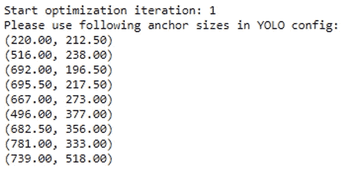

Example Output of Running the Above Command.

现在，我们需要修改 yolo_tfrecords 规范中的路径。如果你去`127.0.0.1:{port_number. For us, this was 8848}/tree`点击`specs`目录，就叫`yolo_tfrecords_kitti_trainval.txt`。更改`root_directory_path`和`image_directory_path`以匹配您所拥有的(您的训练数据所在的位置)。在我们的例子中，格式如下:

```
root_directory_path: "/workspace/{project_name}/data/training"
image_directory_path: "/workspace/{project_name}/data/training"
```

一旦你修改了这个文件，确保你保存它，然后回到 Jupyter 笔记本。现在可以用`tlt-dataset-convert`运行代码块。这将创建一个目录并将 TF 记录放在那里。

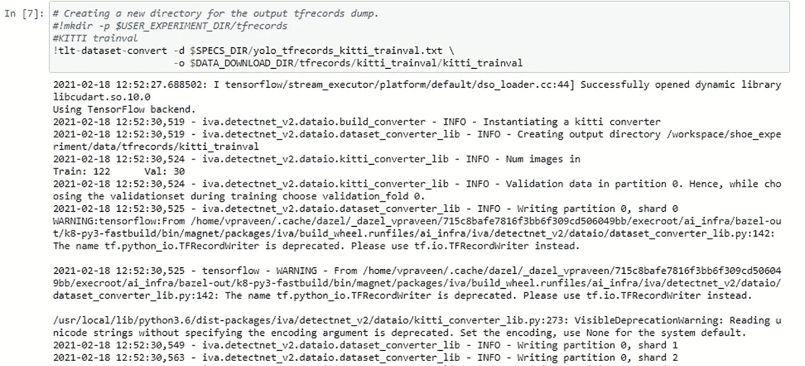

Successfully Running the Above Command.

如果一切顺利，最后的输出应该会说`Tfrecords generation complete.`接下来，Juptyer 笔记本会引导你查看生成的 TF 记录。

下一步是下载预先训练好的模型。我们将使用 NGC CLI 获取预训练模型(`!ngc registry model list nvidia/tlt_pretrained_object_detection:*`将显示存在哪些模型)。我们对 Darknet 感兴趣，所以让我们在创建目录后运行下面的命令(`!mkdir -p $USER_EXPERIMENT_DIR/pretrained_darknet19/`)。这些步骤应该已经在 Juptyer 笔记本上了。

```
!ngc registry model download-version nvidia/tlt_pretrained_object_detection:darknet19 --dest $USER_EXPERIMENT_DIR/pretrained_darknet19
```

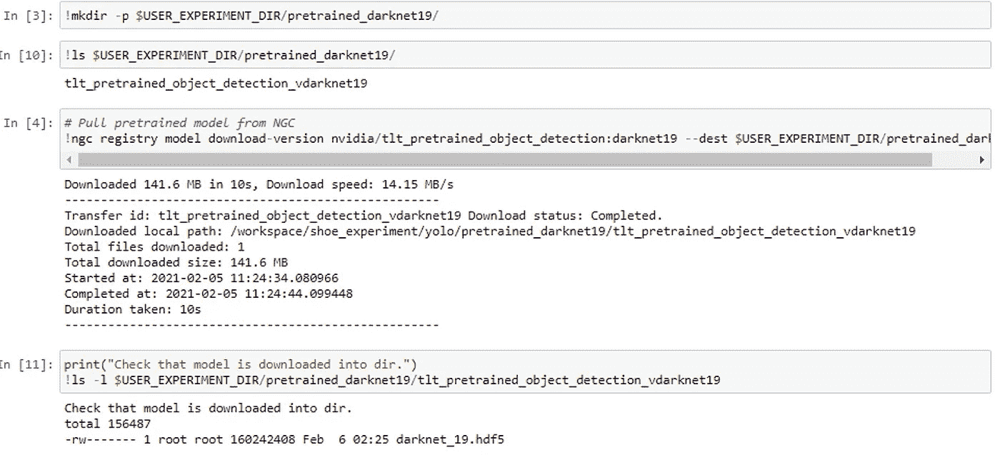

Example Output for Running the Above.

下一步是提供培训规范。还记得我们之前运行的命令吗？我们现在将使用该输出。我们需要修改`yolo_train_resnet18_kitti.txt`中的信息。如果你去`127.0.0.1:{port_number. For us, this was 8848}/tree`点击`specs`目录，它被称为`yolo_train_resnet18_kitti.txt`。在`yolo_config`下，改变锚点形状以匹配输出。

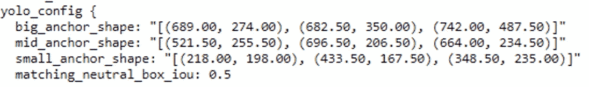

Changing the Anchor Boxes for Yolo_Config.

然后，将`arch`参数改为“暗网”，将`nlayers`改为 19。您也可以在这里更改`batch_size_per_gpu`参数和`num_epochs`，这是推荐的，但会根据您的情况(即工作站)和您拥有的数据量而有所不同。如果你得到的结果很差，试着改变这些值，看看是否有区别。

在`augmentation_config`下，可以更改，比如`output_image_width`为 800，`output_image_height`为 576。另外，`crop_right`和`crop_bottom`将分别为 800 和 576。现在，在`dataset_config`下，更改`tfrecords_path`以匹配您的 tfrecords 的存储位置(例如`“/workspace/{project_name}/data/tfrecords/kitti_trainval/kitti_trainval*`)。您还需要将`image_directory_path`更改为图像的路径，如下所示:`/workspace/{project_name}/data/training`。最后也可能是最重要的部分是确保你包含了`target_class_mapping`下的所有类，这些类应该有一个键和值以及你的类名。把你要检测的所有类放在这里。例如，如果我有一个数据集，并试图检测不同的耐克鞋，我的`dataset_config`可能如下所示:

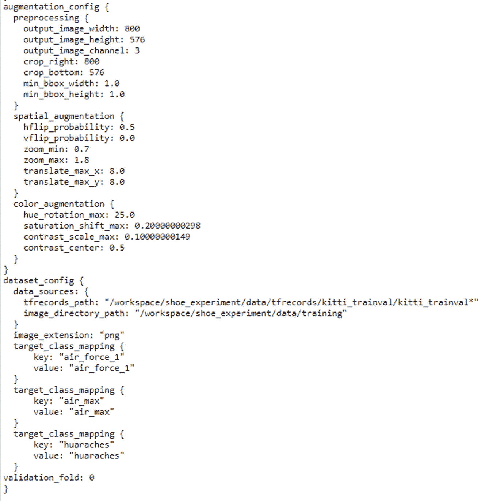

Part of the Yolo_Train_Resnet18_KITTI.txt File.

完成此操作后，保存文件并在 Jupyter 笔记本中继续第 3 步。在此步骤中，我们将运行实际的培训过程，这可能需要一些时间，具体取决于您机器的容量。此外，请更改 GPU 的数量以匹配您的系统，并包括 DarkNet-19 预训练模型(我们没有更改规格文件的名称，所以它仍然显示 resnet18，尽管它使用的是 darknet19)。它应该如下所示:

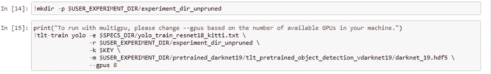

Running the Training Command.

完成后，您将看到最终的纪元编号将分别显示类别/模型的 AP 和 mAP 值。然后您可以检查每个纪元的模型是否通过`!ls -ltrh $USER_EXPERIMENT_DIR/experiment_dir_unpruned/weights`保存。然后，您希望通过以下方式浏览并选择精度最高的模型:

```
# Now check the evaluation stats in the csv file and pick the model with highest eval accuracy. Outputs all the models' accuracies. !cat $USER_EXPERIMENT_DIR/experiment_dir_unpruned/yolo_training_log_darknet19.csv# For example. Likely, you may have more than 80 epochs and the most accurate epoch may be a different number. 
%set_env EPOCH=080
```

下一步是通过以下方式评估经过培训的模型:

```
!tlt-evaluate yolo -e $SPECS_DIR/yolo_train_resnet18_kitti.txt \ -m $USER_EXPERIMENT_DIR/experiment_dir_unpruned/weights/yolo_darknet19_epoch_$EPOCH.tlt \ -k $KEY
```

# 优化模型&使用 TLT 可视化结果

下一步涉及模型修剪。您只需按照 Juptyer 笔记本中的说明进行操作，该部分如下所示:

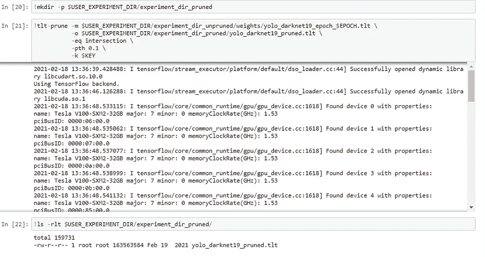

The Output of the Pruning Trained Models Step.

接下来，我们将重新训练修剪后的模型，以恢复修剪后的精度。在这种情况下，我们需要更改`yolo_retrain_resnet18_kitti.txt`的规格文件，该文件位于规格文件中(与其他规格文件位于同一位置)。在这种情况下，进行与在这里对`yolo_train_resnet18_kitti.txt`文件所做的相同的更改，并保存该文件。

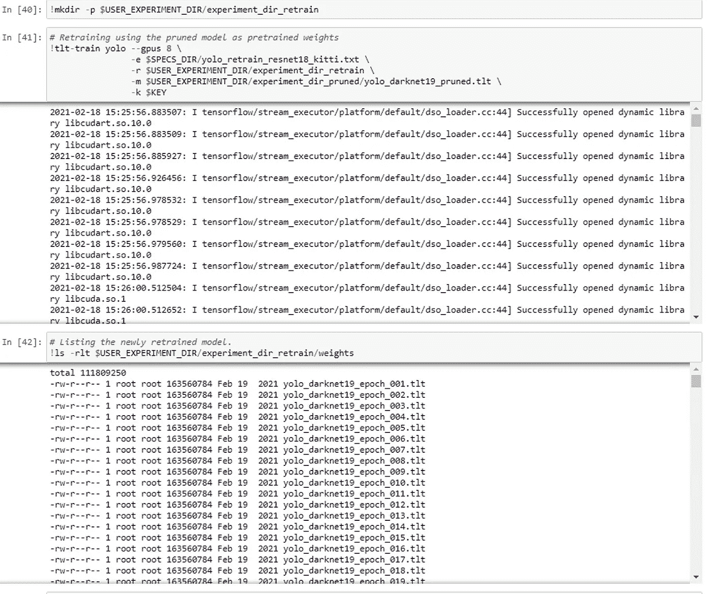

Output of Running the Above Commands.

就像上一节一样，在运行第七步之前，确保您`%set_env EPOCH`到了评估精度最高的模型，如下所示。

```
!tlt-evaluate yolo -e $SPECS_DIR/yolo_retrain_resnet18_kitti.txt \-m $USER_EXPERIMENT_DIR/experiment_dir_retrain/weights/yolo_darknet19_epoch_$EPOCH.tlt \ -k $KEY
```

现在，为了可视化输出(最后)，我们运行以下程序(它将复制一些测试图像并在这些图像上运行对象检测):

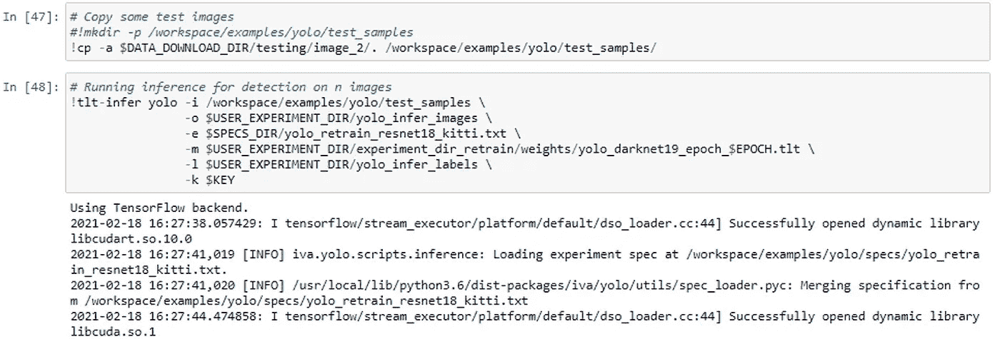

Running the Output of the Above Commands.

Jupyter 笔记本确实包含代码，允许您以网格状格式可视化输出，但我们觉得图像太小，看不到标签。这是所提供代码的示例输出:

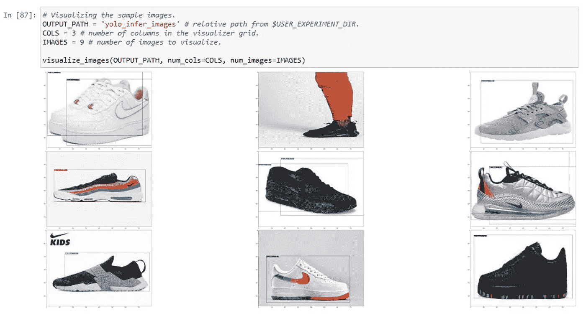

Example Output of the YOLO Object Detection Model

因此，我们使用以下代码逐个查看图像:

```
from IPython.display import ImageImage(filename='/workspace/{project_name}/yolo/yolo_infer_images/000038.png') # replace with the pathname of the image you want. 
```


Example Output of the Object Detection Model

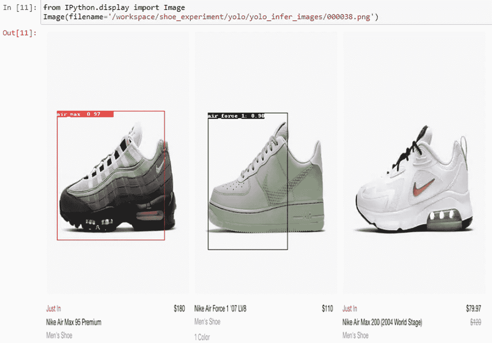

Another Example Output of the Object Detection Model

如果结果不令人满意，请考虑更改一些参数(例如，纪元大小)并重新训练您的模型。希望您会发现本指南很有帮助。如果您有任何问题，请随时留言。