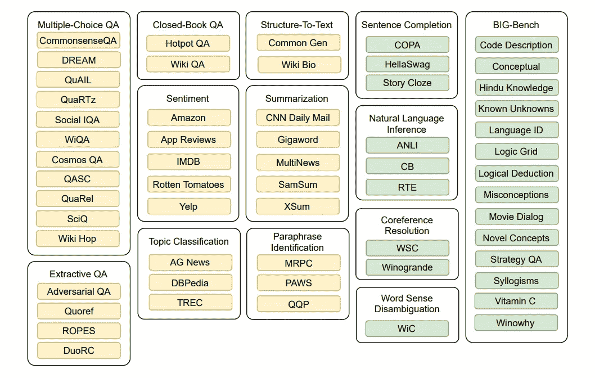

# 多任务激励学习

> 原文：<https://medium.com/mlearning-ai/multitask-prompted-learning-62b87a9b8665?source=collection_archive---------3----------------------->

## 训练多大的语言模型？

## 背景

在现代 NLP 领域，都是关于迁移学习的。当前基于神经网络的模型的优势是可扩展性，这意味着我们可以简单地在更大的数据集上训练更大的模型。值得庆幸的是，我们有一个成熟的自我监督学习框架，互联网上的文本数据也非常丰富— —例如，通用爬虫[项目](https://commoncrawl.org/)每月产生大约 20TB 的从网页中提取的文本数据。

因此，近年来，自然语言处理研究者们致力于发展迁移学习方法。一切都从这篇论文开始:用统一的文本到文本转换器— [链接](https://arxiv.org/abs/1910.10683)探索迁移学习的极限。

简而言之，它是一个统一的框架，将每个文本处理问题都形成一个“文本到文本”的问题:给定一个文本序列作为输入，模型输出一个文本序列。它允许将相同的模型、目标、训练过程和解码过程应用于每个常见的 NLP 任务。(包括翻译、问答、分类等)。

T5 stands for “Text To Text Transfer Transformer”, [link](https://arxiv.org/pdf/1910.10683.pdf)

## 提示

T5 等文本到文本预训练模型的开发使提示成为多任务学习的一种特别有用的方法。如上所示，我们首先从不同的任务中获取数据集，然后在原始训练集之前添加一些指导性描述。经过预处理的训练数据称为提示。

重要的是输入是人类可读的(！)我们走过了漫长的道路。当前的大型 NLP 模型像人类一样阅读，像人类一样回答。把预先训练好的大型模型想象成婴儿尤达:它对其包含在模型内部的通用知识是非常强大的 W.R.T，但我们不知道在下游任务中什么样的行为(提示)可以触发超能力。

From internet

对于每种数据集(或任务类别)，它选择一个提示模板来将训练数据传输到提示。

From paper, [link](https://arxiv.org/abs/1910.10683)

## 零镜头文本概括

在前人工作的基础上，论文《多任务提示训练实现零射击任务泛化——[环节](https://arxiv.org/abs/2110.08207)》重点研究了在监督和大规模多任务方式下对语言模型的显式训练。它试图回答这两个问题:

1.  多任务提示训练能提高对看不见的任务的概括吗？
2.  对更大范围的提示进行训练是否能提高对提示措辞的稳健性？

它以这种方式进行实验:按任务对数据集进行分组，在一些组上进行训练，并在保留的数据集上测试模型。通过确保不发生数据泄漏，它能够测试零镜头泛化的能力。

## 什么是“任务”？

> 我们使用术语“任务”来指代由一组特定数据集测试的一般 NLP 能力。为了评估对新任务的零命中率概括，我们在任务的子集上进行训练，并在坚持的任务组上进行评估。
> 
> — [链接](https://arxiv.org/pdf/2110.08207.pdf)

Yellow datasets are in the training mixture. Green datasets are held out and represent tasks that were not seen during training. Zero-shot task generalization experiments are evaluated on green datasets. — [link](https://arxiv.org/pdf/2110.08207.pdf)

## 模型培训详细信息

关键词:编码器-解码器架构/自回归/最大似然训练

> 我们训练的所有模型都基于 T5，这是一个基于转换器的编码器-解码器语言模型，在来自 C4 的 1T 令牌上使用掩蔽语言建模风格的目标进行预训练( [Raffel 等人，2020](https://arxiv.org/abs/1910.10683) )。由于 T5 的预训练目标包括从已删除的输入文本中填充标记，因此它与我们提示数据集中使用的条件文本生成格式有很大不同。因此，我们使用公开可用的来自 [Lester et al. (2021)](https://arxiv.org/abs/2104.08691) 的 LM 适应的 T5 模型(称为 T5+LM)，该模型是通过在标准语言建模目标上在来自 C4 的 100B 个附加标记上训练 T5 而产生的。除非另有说明，否则我们使用具有 11B 参数的 XXL 版本。

(未完待续)

## 参考

*   用统一的文本到文本转换器探索迁移学习的极限—[https://arxiv.org/abs/1910.10683](https://arxiv.org/abs/1910.10683)
*   多任务提示训练使零射击任务普遍化—[https://arxiv.org/abs/2110.08207](https://arxiv.org/abs/2110.08207)
*   参数高效的快速调优的规模力量—[https://arxiv.org/abs/2104.08691](https://arxiv.org/abs/2104.08691)

 [## Mlearning.ai 提交建议

### 如何成为 Mlearning.ai 上的作家

medium.com](/mlearning-ai/mlearning-ai-submission-suggestions-b51e2b130bfb) 

🟠在 MLearning.ai 成为[作家](/mlearning-ai/mlearning-ai-submission-suggestions-b51e2b130bfbv)