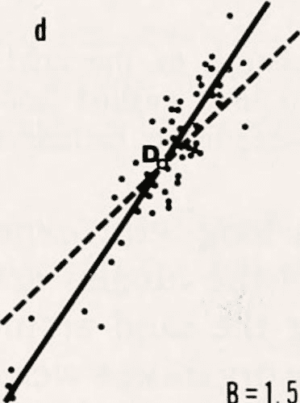

# 使用 statsmodels 和 sklearn 的多元线性回归

> 原文：<https://medium.com/mlearning-ai/multivariate-linear-regression-using-statsmodels-and-sklearn-18080e19faf3?source=collection_archive---------0----------------------->

我不得不承认，statsmodels 是一个我没有花太多时间探索的 Python 库。我对 sklearn 更加熟悉，这也是为什么我的大多数帖子都以某种方式使用这个库的原因。因此，当我参加了 Coursera 课程，Python 和金融分析统计，我抓住了机会，学习如何使用 Python 来进行…