# 多元关系

> 原文：<https://medium.com/mlearning-ai/multivariate-relationships-three-is-seldom-a-crowd-8c0a9e09b5c?source=collection_archive---------1----------------------->

## 三个人很少拥挤

寻找关联是我们人类的工作。当我们看云或画时，当我们读书、看电视或与人交谈时，我们会这样做。我们一直在这么做，所以在通往因果关系的三级阶梯上，[联想排在第一](https://en.wikipedia.org/wiki/The_Book_of_Why)也就不足为奇了。诚然，联想只能给因果关系以最轻微的暗示，但却是绝对必要的。

联想的基本需要是两个变量需要共同变化。不需要在 B 之前或者 B 在 A 之前有变化，但是随着 A 的变化，B 也必须变化。这是联想的前提。“相关≠因果”。

在这篇文章中，我想告诉你用图表的方式找到一个关系是多么容易，但是当你添加第三个变量时，它就溜走了。在一个充满多元关系的整体世界里，三个人很少是一群人。

现在，新冠肺炎是一个很好的例子，在这里你可以看到联想的壮举是如何被创造、传播并被认为是真理的。至少，它会让你[出版](https://link.springer.com/content/pdf/10.1007/s10654-021-00808-7.pdf)，而且相当快。我相信有时候太快了。例如，见下图，这是不同国家的两个变量的横截面切片，来自公开可用的 [OWID 数据](https://ourworldindata.org/coronavirus)。

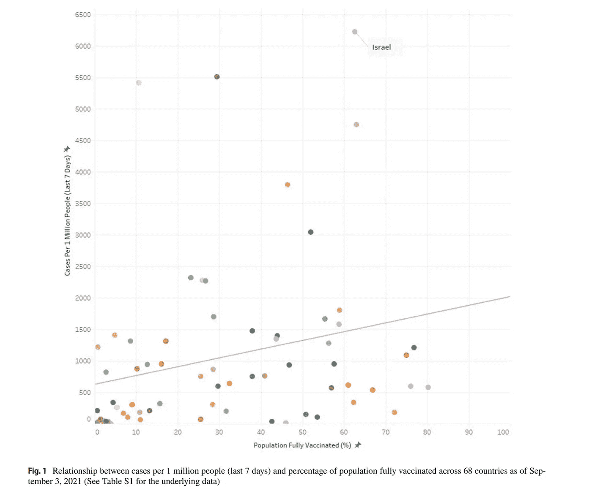

我自己下载了数据，重新创建了包含两个、三个甚至四个变量的简单的信息图。然而，在一个整体的世界里，这很少足以说明任何形式的因果关系。如果可能的话。分析在 r。

```
library(tidyverse
library(umap)
library(M3C)
library(lubridate)
library(psych)

coviddat <- read_csv("owid-covid-data.csv")
coviddat$vax_perc<-(coviddat$people_fully_vaccinated/coviddat$population)*100
coviddat$emc_perc<-(coviddat$excess_mortality_cumulative/coviddat$population)*100
coviddat$week<-week(coviddat$date)
coviddat$month<-month(coviddat$date)
coviddat$year<-year(coviddat$date)

coviddat2<-coviddat%>%dplyr::select(date,
                                    week,
                                    month,
                                    year,
                                    location, 
                                    continent, 
                                    vax_perc,
                                    emc_perc,
                                    total_deaths_per_million,
                                    total_cases_per_million)%>%
  group_by(location)%>%
  filter(year=="2021" & month=="11")%>%
  summarise(.,
            location=location,
            continent=continent,
            vax_max=max(vax_perc,na.rm=TRUE),
            tdpm_max=max(total_deaths_per_million,na.rm=TRUE),
            tcpm_max=max(total_cases_per_million,na.rm=TRUE))%>%distinct()%>%
  filter(tcpm_max>0 & tdpm_max>0 & vax_max>0)%>%
  filter(!is.na(continent))
coviddat2$vaxcat<-cut(coviddat2$vax_max, seq(0,120,10))

coviddat2%>%filter(tcpm_max>0 & tdpm_max>0)%>%
  ggplot(., aes(x=tcpm_max, y=tdpm_max))+
  geom_point(size=2, alpha=0.8,show.legend = FALSE) +
  geom_smooth()+
  labs(title="Relationship between Total Deaths and Total Cases per Million",
       x="Total Cases per Million",
       y="Total Deaths per Million")+
  theme_bw()
```

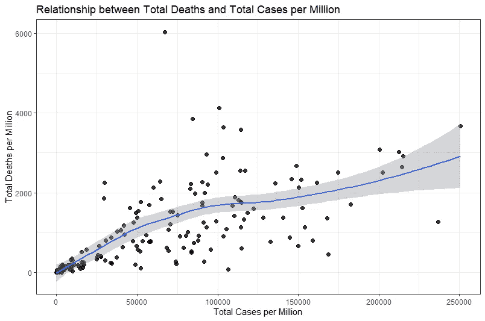

```
coviddat2%>%filter(tcpm_max>0 & tdpm_max>0)%>
  ggplot(., aes(x=tcpm_max, y=tdpm_max,colour=as.factor(continent)))+
  geom_point(size=2, alpha=0.8,show.legend = FALSE) +
  geom_smooth(aes(fill=as.factor(continent)))+
  labs(title="Relationship between Total Deaths and Total Cases per Million per Country",
       x="Total Cases per Million",
       y="Total Deaths per Million")+
  guides(colour=guide_legend(title="Continent"))+
  guides(fill="none")+
  theme_bw()
```

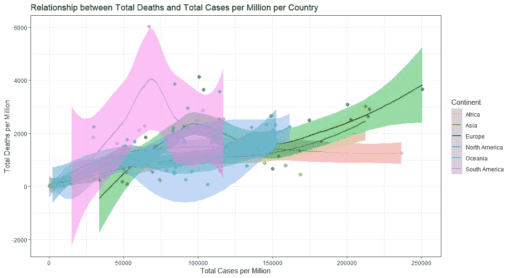

现在，让我们添加一些变量，而不仅仅是 X，Y 和颜色。下面你可以看到 11 月底各大洲的总病例数、总死亡率、疫苗接种率之间的关系。下面的样条线建立了甚至不一定存在的联系，但在大线条中，这种关系似乎可以跨洲复制。

```
coviddat2%>%filter(tcpm_max>0 & tdpm_max>0)%>
  ggplot(., aes(x=tcpm_max, y=tdpm_max))+
  geom_point(aes(colour=vaxcat), size=2, alpha=0.8) +
  geom_smooth(colour="black")+
  facet_wrap(~continent)+
  labs(title="Relationship between Total Deaths and Total Cases per Million",
       x="Total Cases per Million",
       y="Total Deaths per Million")+
  theme_bw()
```

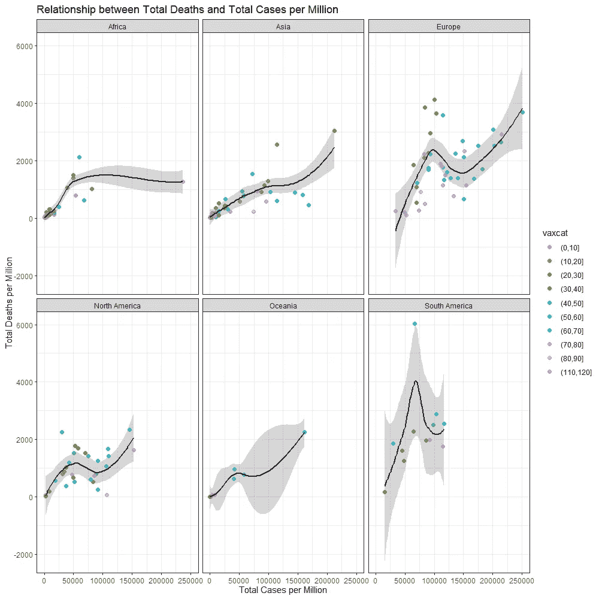

让我们更深入地探究大陆与总病例和死亡之间的关系。为了使它更明确，我想张贴地点的名称。预期让我认为一个大陆上的国家紧密团结在一起。最后，图表看起来比它提供的信息更好。

```
ggplot(coviddat2,aes(x=tcpm_max, y=tdpm_max,colour=as.factor(continent)))
  geom_point(aes(colour=as.factor(continent)), size=2, alpha=0.8) +
  geom_text_repel(aes(tcpm_max, tdpm_max, label = location), size = 3, max.overlaps = 20)+
  labs(title="Relationship between Total Deaths and Total Cases per Million per Country",
       x="Total Cases per Million",
       y="Total Deaths per Million")+
  guides(colour=guide_legend(title="Continent"))+
  theme_bw()
```

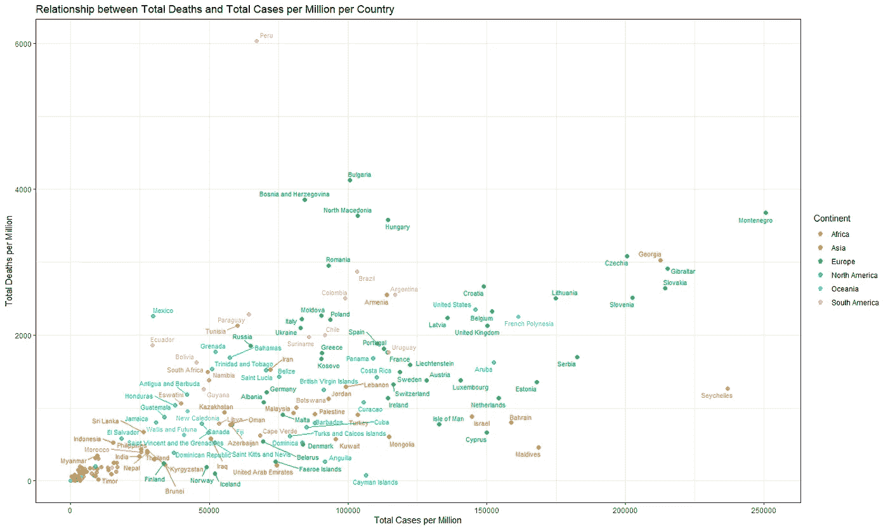

当包含两个以上的数值变量时，查看关系的另一个好方法是创建密度图。下面你可以看到代码和密度图的结果，显示了总病例数和死亡率之间的关系。正如你所看到的，肯定有集群和关系严重扇出。

```
coviddat2%>%filter(tcpm_max>0 & tdpm_max>0)%>
  ggplot(.,aes(x=tcpm_max, y=tdpm_max))+
  geom_point() +
  geom_density_2d_filled(alpha = 0.4) +
  geom_density_2d(colour = "black")+
  theme_bw()+
  labs(title="Relationship between Total Deaths and Total Cases per Million",
       x="Total Cases per Million",
       y="Total Deaths per Million")
```

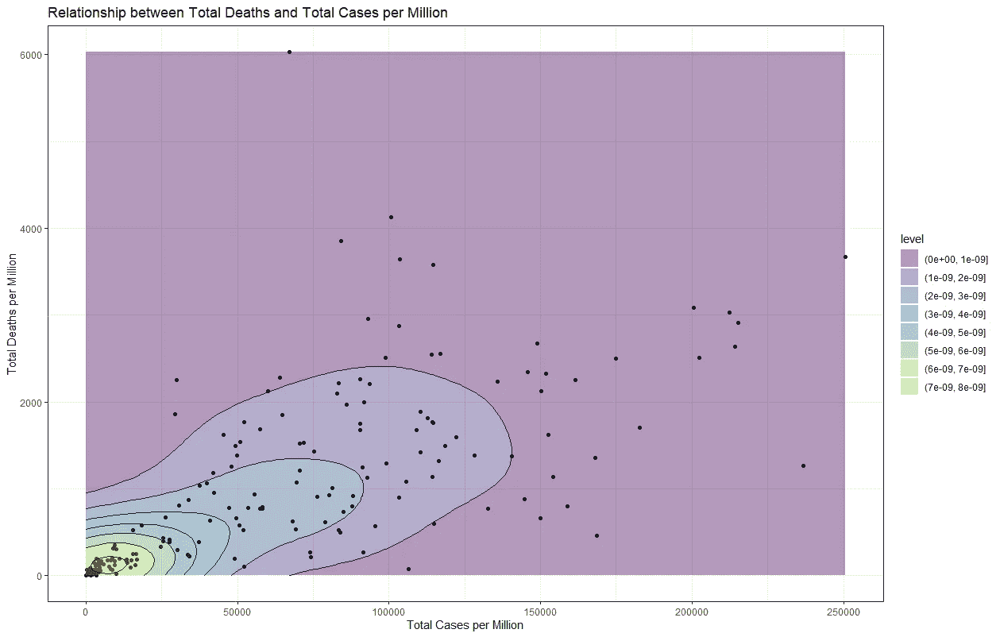

```
pairs.panels(coviddat2[,3:5]
             method = "pearson", # correlation method
             hist.col = "#00AFBB",
             density = TRUE,  # show density plots
             ellipses = TRUE, # show correlation ellipses
             smooth=TRUE,
             rug=TRUE)
```

一个简单的相关图，寻找完全接种疫苗的人口比率与总病例数和死亡率之间的关系。数据不是正态分布的，所以这些数字只是看上去的。就我个人而言，我更多的是在黄土回归中寻找有趣的东西。

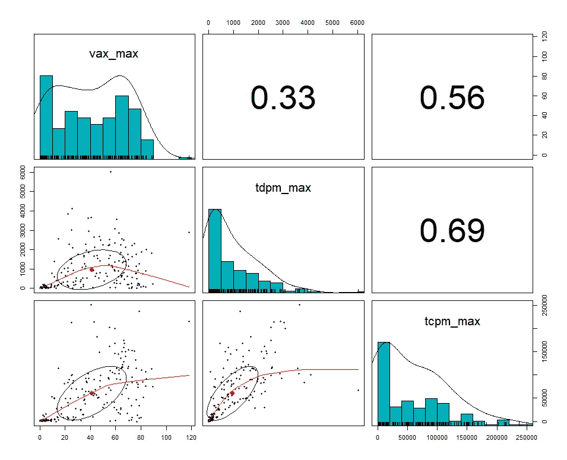

接下来的情节就有趣多了。它通过颜色和大小显示了疫苗接种率的作用。你可以清楚地看到，接种率把对角线的上下部分分开了。但是，一如既往，还是有国家“越界”。

```
coviddat2%>%filter(tcpm_max>0 & tdpm_max>0)%>
  ggplot(.,aes(x=tcpm_max, y=tdpm_max, colour=vax_max))+
  geom_point(aes(size=vax_max), alpha=0.95) +
  scale_color_gradient2(midpoint=50, low="blue", mid="white",
                        high="red", space ="Lab" )+
  geom_text_repel(aes(tcpm_max, tdpm_max, label = location), size = 3, max.overlaps = 20)+
    guides(size=guide_legend(title="Vaccination Rate - Size"), 
           colour=guide_legend(title="Vaccination Rate - Colour"))+
  theme_bw()+
  labs(title="Relationship between Total Deaths and Total Cases per Million",
       x="Total Cases per Million",
       y="Total Deaths per Million")
```

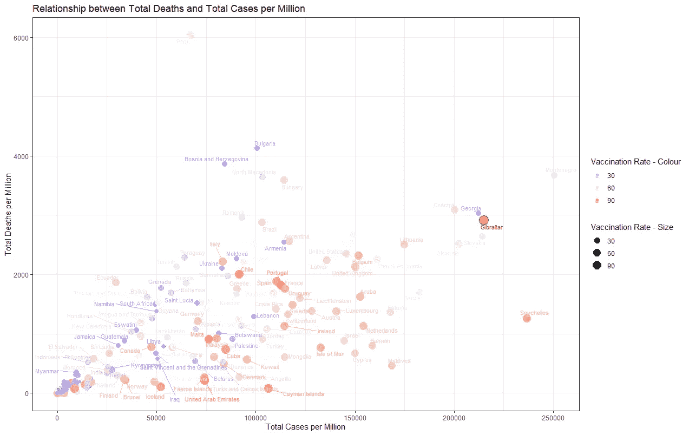

如果我通过添加更多的分类来添加更多的信息，会发生什么？如你所见，更多的信息意味着增加更多的灰度。意味着事情变得更加复杂。正如我们认为我们有一个很好的突破以上，似乎还有更多在发挥作用。

```
coviddat2%>%filter(tcpm_max>0 & tdpm_max>0)%>
  ggplot(.,aes(x=tcpm_max, y=tdpm_max, colour=vaxcat))+
  geom_point(aes(size=vax_max), alpha=0.95) +
  geom_text_repel(aes(tcpm_max, tdpm_max, label = location), size = 3, max.overlaps = 20)+
  guides(size=guide_legend(title="Vaccination Rate - Size"), 
         colour=guide_legend(title="Vaccination Rate - Colour"))+
  theme_bw()+
  labs(title="Relationship between Total Deaths and Total Cases per Million",
       x="Total Cases per Million",
       y="Total Deaths per Million")
```

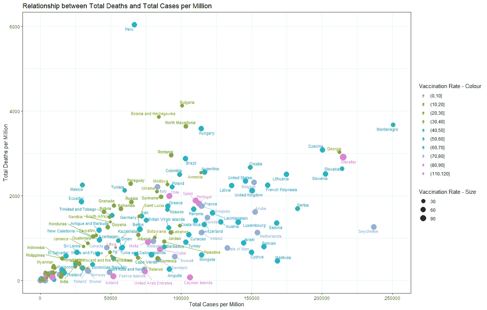

让我们开始添加更多的变量，也从相关矩阵开始。并不是说它真的有帮助(数据需要转换)，但它是大多数人做的。建立联系。

```
coviddat2<-coviddat%>%dplyr::select(date
                                    week,
                                    month,
                                    year,
                                    continent,
                                    population_density,
                                    extreme_poverty,
                                    diabetes_prevalence,
                                    male_smokers,
                                    female_smokers,
                                    handwashing_facilities,
                                    hospital_beds_per_thousand,
                                    human_development_index,
                                    cardiovasc_death_rate,
                                    aged_70_older,
                                    median_age,
                                    aged_65_older,
                                    gdp_per_capita,
                                    life_expectancy,
                                    location, 
                                    continent, 
                                    vax_perc,
                                    emc_perc,
                                    total_deaths_per_million,
                                    total_cases_per_million)%>%
  group_by(location)%>%
  filter(year=="2021" & month=="11")%>%
  filter(!is.na(continent))%>%
  summarise(.,
            location=location,
            continent=continent,
            population_density=population_density,
            extreme_poverty=extreme_poverty,
            diabetes_prevalence=diabetes_prevalence,
            male_smokers=male_smokers,
            female_smokers=female_smokers,
            handwashing_facilities=handwashing_facilities,
            hospital_beds_per_thousand=hospital_beds_per_thousand,
            human_development_index=human_development_index,
            cardiovasc_death_rate=cardiovasc_death_rate,
            aged_70_older=aged_70_older,
            median_age=median_age,
            aged_65_older=aged_65_older,
            gdp_per_capita=gdp_per_capita,
            life_expectancy=life_expectancy,
            vax_max=max(vax_perc,na.rm=TRUE),
            tdpm_max=max(total_deaths_per_million,na.rm=TRUE),
            tcpm_max=max(total_cases_per_million,na.rm=TRUE))%>%distinct()%>%
  filter(tcpm_max>0 & tdpm_max>0 & vax_max>0)
coviddat2$continent<-as.factor(coviddat2$continent)
coviddat2$vaxcat<-cut(coviddat2$vax_max, seq(0,120,10))

> names(coviddat2)
 [1] "location"                   "continent"                  "population_density"        
 [4] "extreme_poverty"            "diabetes_prevalence"        "male_smokers"              
 [7] "female_smokers"             "handwashing_facilities"     "hospital_beds_per_thousand"
[10] "human_development_index"    "cardiovasc_death_rate"      "aged_70_older"             
[13] "median_age"                 "aged_65_older"              "gdp_per_capita"            
[16] "life_expectancy"            "vax_max"                    "tdpm_max"                  
[19] "tcpm_max"                   "vaxcat"           

pairs.panels(coviddat2[,3:19]
             method = "pearson", # correlation method
             hist.col = "#00AFBB",
             density = TRUE,  # show density plots
             ellipses = TRUE, # show correlation ellipses
             smooth=TRUE,
             rug=TRUE)
```

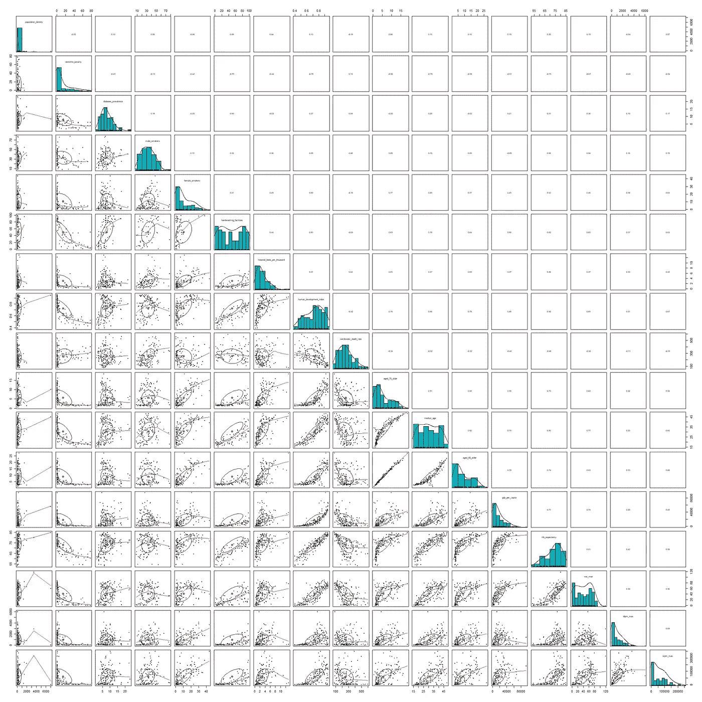

人类擅长在关系中思考，我们已经讨论过了。然而，我们很快高估了我们可以欺骗多少关系。把 A 和 B，或者 B 和 A 联系起来并不那么困难，我们甚至可以把 C 积分，这就把我们带到了辛普森悖论。但是如果我们加上 E，F，G，H，J 和 K 呢？这就是我们迷失方向和速度的地方，但我们常常不承认这一点，因为我们愿意认为我们是协会的主人。

一组真正擅长建立关联的算法是降维技术。这些模型可以很容易地整合数百个因素，分解它们，并寻找潜在的或支配性的因素。它们中的大多数只不过是数学构造，很难向他人解释，但它们确实有助于显示哪些观察结果基于它们的基本特征而聚集在一起。

首先是[多维扩展](https://en.wikipedia.org/wiki/Multidimensional_scaling)。

```
dist_covid_num <- dist(coviddat2[, 3:19], method = "canberra"
mds_covid_num <- cmdscale(dist_covid_num, eig = TRUE, k = 2)
mds_covid_num <- data.frame(
  MDS1 =mds_covid_num$points[, 1],
  MDS2 =mds_covid_num$points[, 2],
  label =coviddat2$location,
  classification = coviddat2$vaxcat)
ggplot(mds_covid_num, 
       aes(x = MDS1, y = MDS2,label=label, col = classification)) +
  geom_point() +
  guides( colour=guide_legend(title="Vaccination Rate Classification"))+
  ggrepel::geom_text_repel(cex = 2.5) + theme_bw() + 
  labs(title="Multidimensional Scaling",
       x="MDS1",
       y="MDS2"))
```

结果立即看起来比我之前展示的更加不同。我让 MDS 算法将 17 个变量分成两部分，分别标为 MDS1 和 MDS2。它们没有实际意义。我们需要通过使用数据集中包含的变量来覆盖一些潜在的含义。我试图通过查看感兴趣的国家和疫苗接种率来做到这一点。如果疫苗接种率真的很重要的话，我希望各国按照疫苗接种率进行分组。

正如你所看到的，似乎有一个总的趋势，但国家及其概况并不仅仅由疫苗接种率来界定。

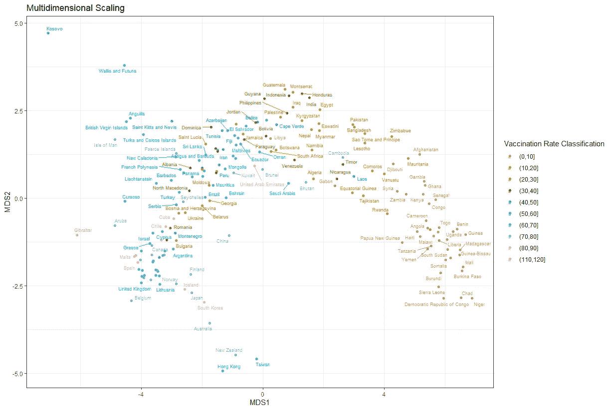

机器学习时代另一种常用的聚类形式是 [UMAP](https://arxiv.org/pdf/1802.03426.pdf) —统一流形逼近和投影。它的数学描述远远超出了这篇文章的目的，但就像任何形式的降维一样，它试图寻找多维尺度之间的联系。然而，与 MDS 不同，它需要完整的资料，所以我首先需要使用 K-最近邻(KNN)估算数据。并不完美，而且有一些变量的缺失并不真正适合 KNN，但至少我们可以完成这个例子。

```
require(bnstruct
coviddat2_imp<-as.data.frame(knn.impute(as.matrix(coviddat2[,c(3:19)]),
                          k = 10));names(coviddat2_imp)
covid.data = cbind(coviddat2[,c(1,2,20)],coviddat2_imp);names(covid.data)
custom.config = umap.defaults
custom.config$knn_repeats = 100
covid.umap=umap::umap(covid.data[,c(4:20)],config=custom.config);covid.umap
umap_plot_df<-cbind(coviddat2,as.data.frame(covid.umap$layout))
ggplot(umap_plot_df, aes(x=V1, y=V2, colour=continent))+
  geom_point(size=3, alpha=0.5)+theme_bw()+
  labs(title="UMAP results",
       x="Total Cases per Million",
       y="Total Deaths per Million"))
```

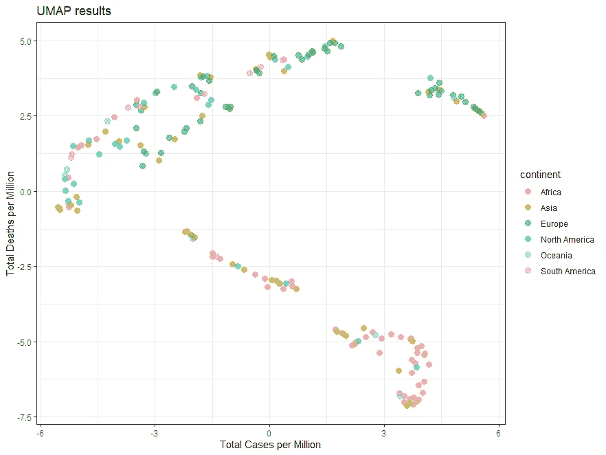

```
ggplot(umap_plot_df, aes(x=V1, y=V2,
                         label=location, 
                         col = vaxcat)) +
  geom_point() +
  guides( colour=guide_legend(title="Vaccination Rate Classification"))+
  ggrepel::geom_text_repel(cex = 2.5) + theme_bw() + 
  labs(title="UMAP",
       x="UMAP1",
       y="UMAP2")
```

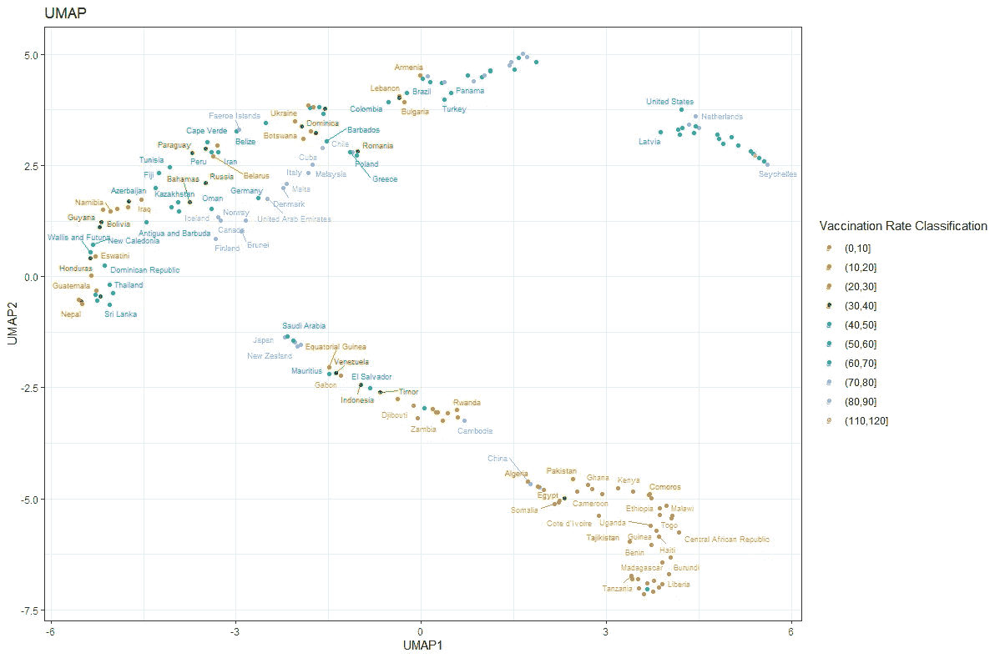

```
ggplot(umap_plot_df, aes(x=V1, y=V2,
                         label=location, 
                         col = life_expectancy)) +
  geom_point(aes(size=vax_max), alpha=0.95) +
  scale_color_gradientn(colours = rainbow(5))+
  ggrepel::geom_text_repel(size = 3, max.overlaps = 20) + theme_bw() + 
  labs(title="UMAP",
       x="UMAP1",
       y="UMAP2")
```

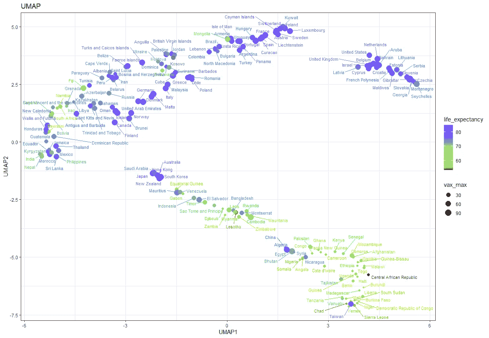

从上面的例子中你可以看到(我们可以通过应用更多的技术来扩展，比如 t-SNE ),基于两三个变量来渲染数据点是不够的。尽管 UMAP 的地图看起来是这样做的，但是他们包括了总共 17 个变量来创建两个新的变量。这些变量决定集群，而这些集群服务于关联的目的。你要寻找的是那些聚集在一起的国家和那些没有商业聚集在一起的国家。例如，蒙古这个国家和法国、西班牙、葡萄牙在同一个地方。我不知道为什么，也许这是 KNN 估算法的一个错误，但情况似乎确实如此。最好的办法是通过多种降维技术追溯发现，并更仔细地寻找关系。

老实说，这是个永无止境的故事。只要你记住两个变量是不够的。绝不可能。

```
coviddat2%>%filter(life_expectancy>0 & tdpm_max>0 & vax_max>0)%>
  ggplot(., aes(x=life_expectancy, 
                y=tdpm_max, 
                col=vax_max,
                label=location))+
  geom_point(size=2, alpha=0.5,show.legend = FALSE) +
  facet_grid(~continent)+
  scale_color_gradient2(midpoint=50, low="blue", mid="white",
                        high="red", space ="Lab" )+
  ggrepel::geom_text_repel(size = 1.5, max.overlaps = 20)+
  guides( colour=guide_legend(title="Vaccination Rate"))+
  labs(title="Relationship between Life Expectancy and Total Deaths per Million",
       x="Life Expectancy",
       y="Total Deaths per Million")+
  theme_bw()
```

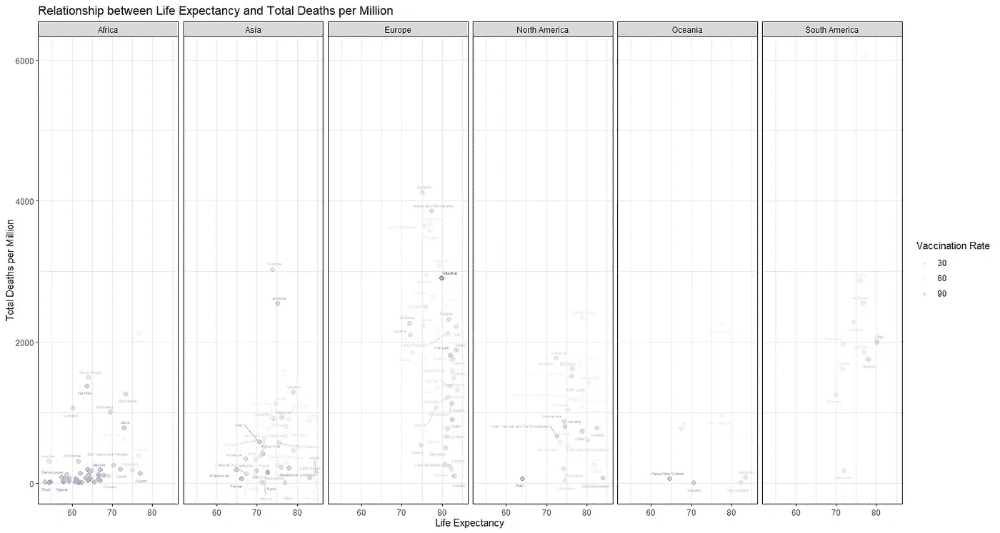[](/mlearning-ai/mlearning-ai-submission-suggestions-b51e2b130bfb) [## Mlearning.ai 提交建议

### 如何成为 Mlearning.ai 上的作家

medium.com](/mlearning-ai/mlearning-ai-submission-suggestions-b51e2b130bfb)