# 基于 FBProphet 的多元时间序列预测

> 原文：<https://medium.com/mlearning-ai/multivariate-time-series-forecasting-using-fbprophet-66147f049e66?source=collection_archive---------0----------------------->

大家好，希望你们都过得好。今天我想出了一个帖子，可以帮助我们使用 FBProphet 做多元变量时间序列预测。这是一个由脸书提供的扩展库，它将帮助我们基于多种特征对标记的输出进行预测。这个过程很简单，我想这篇文章可能会帮助你在你的个人项目中创建模型。

让我们从导入基本模块开始编码。

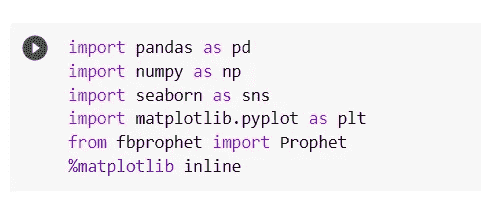

Basic modules imported

让我们尝试将数据集和列名可视化，并向您解释这个场景。在下面的数据集中，我们试图预测股票的开盘价，开盘价不仅取决于股票本身以前的价值，还取决于其他对其有很大影响的特征。在下面的例子中，像高、低、收盘这样的列在决定价格时起着重要的作用。

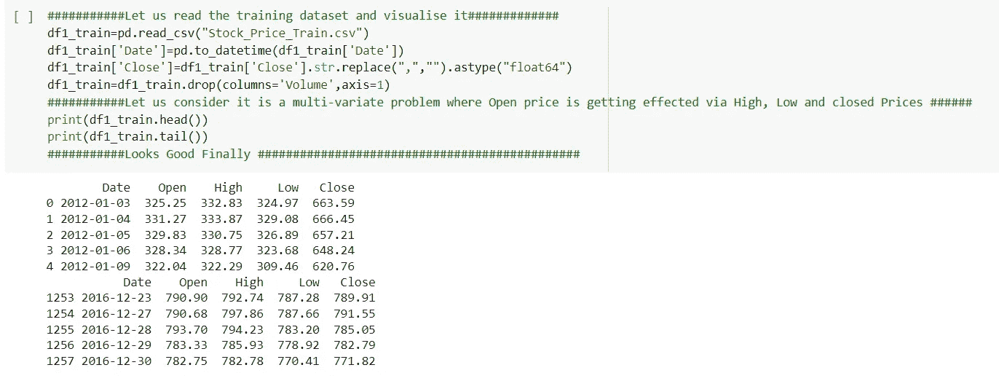

Data Training Visualization

我们也有一个类似的数据集，我们将在其上测试我们的模型，并尝试预测预测值。

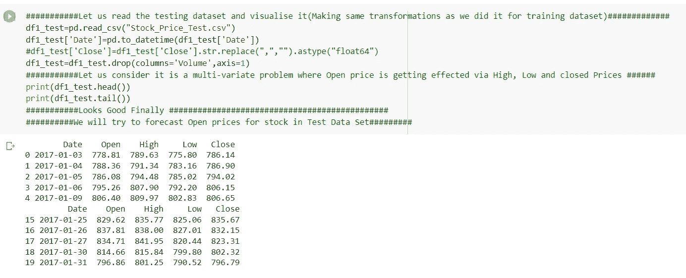

Visualization of test Dataset

在应用 FBProphet 模型之前，请验证所有列是否都具有所需的数据类型。

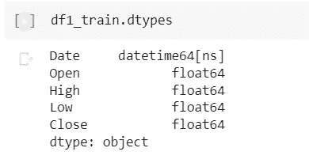

Training set Datatypes

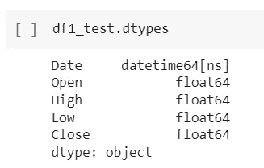

Testing set datatypes

让我们尝试使用我们的肉眼和智能来可视化所有单个列的数据集。-).我们正试图确定相同的趋势、季节性和模式。

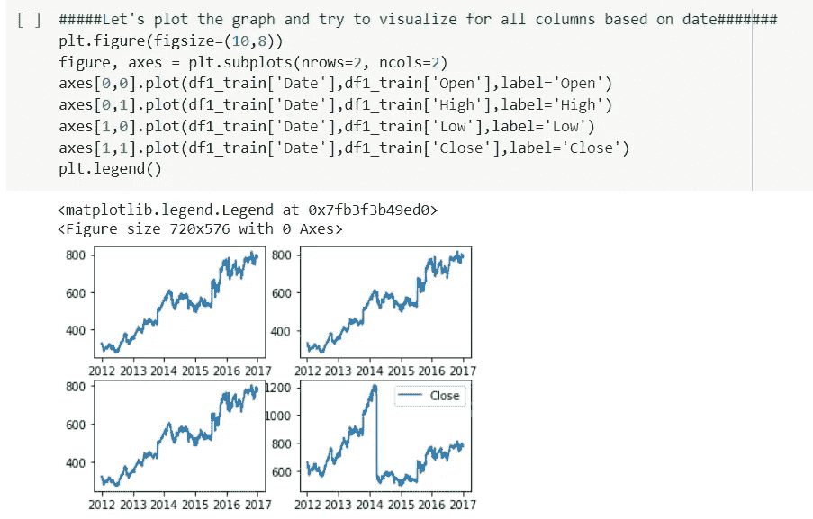

我能够确定使用探索性数据分析，股票开盘价是依赖或有保存的趋势，作为高价格和低价格的特点。虽然收盘时的股票特征趋势似乎与开盘价有很大不同。在应用该模型之前，请确保将日期列名转换为' **ds** ，将预测列名转换为' **y** '。其余的一切都可以保持原样。如果你有任何疑问，请参考下面的链接，我曾尝试使用 FBProphet 解决单变量时间序列问题。你会很容易理解的。

链接:[**https://medium . com/mlearning-ai/univariate-time-series-forecasting-using-fbprophet-ad 9 ad 68 e 59 BC**](/mlearning-ai/univariate-time-series-forecasting-using-fbprophet-ad9ad68e59bc)

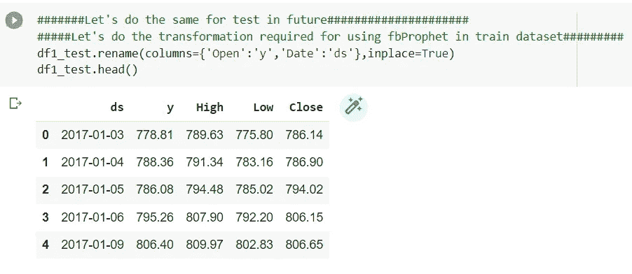

Renamed Columns

让我们尝试创建一个 FBProphet 模型的实例，并尝试适应我们的训练数据集。在这种情况下，它与我们没有使用 add_regressor 函数的单变量时间序列略有不同。我们正在尝试使用多种功能来确定我们的标签输出(“开放”)。

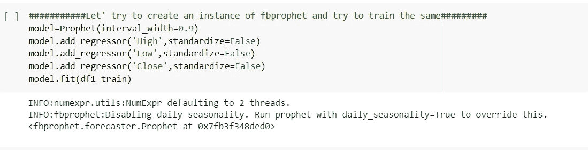

注意:如果你不确定季节性，请不要提及任何事情，因为 FBProphet 足够聪明可以这样做。

Parameters for my model

让我们试着创建另一个测试数据框，在这里我可以删除 Open 的实际值。它将帮助我们预测期望的输出。

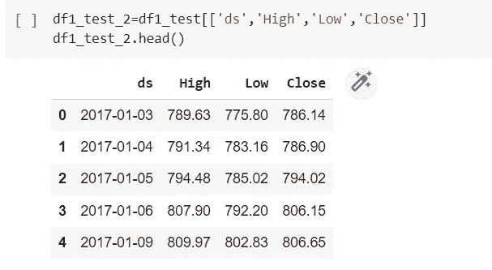

尝试为我的测试数据集预测' **Open** '值。

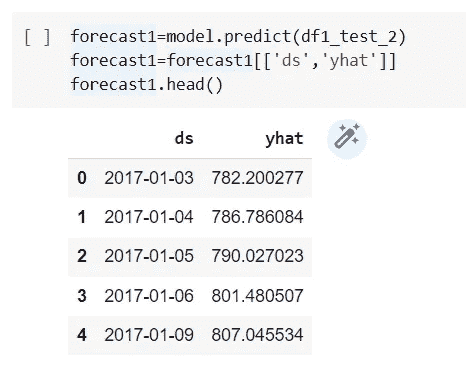

**yhat-Forecasted Open Value**

让我们试着将预测值和实际值放在一起，然后试着直观地看到它们之间的差异。如果你想和其他模型进行比较，你可以使用像 **MAE，MSE & RMSE 这样的指标。**

因为我已经有了实际值，所以我会尝试将它们与预测值进行比较。事情是这样的！！！！

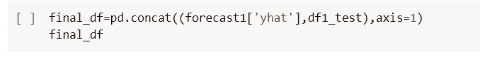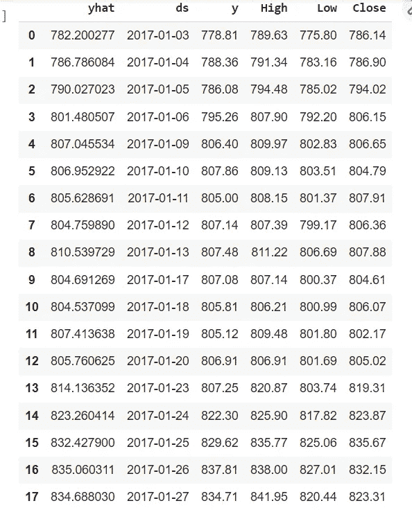

y-Actual_value, y_hat — Forecasted value

最终可视化:

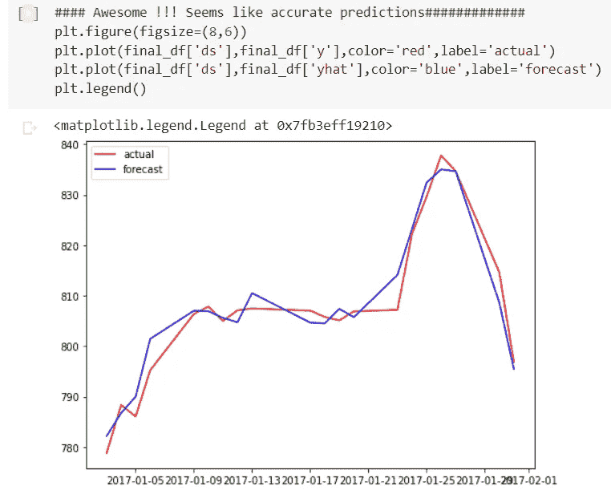

我觉得这个模型效果很好，比递归神经网络和 Arima 模型都好得多。在这种情况下，我觉得 RNN 可以用更好的方式来训练。我想请你在 LSTM 模型上玩更多的超参数调谐，这反过来可以帮助你有明亮的结果。

谢谢大家！！！如果您有任何疑问，请发表评论。这不仅有助于我改进和调整，而且我还能以更好的方式构建我的模型。再次感谢！！！

 [## Mlearning.ai 提交建议

### 如何成为 Mlearning.ai 上的作家

medium.com](/mlearning-ai/mlearning-ai-submission-suggestions-b51e2b130bfb)