# 使用 RNN(LSTM)的多元时间序列预测

> 原文：<https://medium.com/mlearning-ai/multivariate-time-series-forecasting-using-rnn-lstm-8d840f3f9aa7?source=collection_archive---------0----------------------->

我试图预测一个变量的未来值，这个变量不仅依赖于它本身以前的值，还依赖于其他变量以前/现在的值。在这种情况下，我们认为这是一个多变量时间序列预测问题。

**举例:**

让我们考虑一家试图出售两种不同的印度小吃，即 Samosa 和 Kachori 的商店。他想预测第二天必须准备的 samosas 的数量，以满足顾客的需求。在这种情况下，让我给你一个现实的例子。

Samosa(可用-是)，kachori(可用-是):

假设一位顾客打算购买 10 件 samosas，但店内也有 kachoris。他最后点了 5 份 samosa 和 5 份 kachori。由于 kachoris 的上市，萨莫萨的销量下降了。

Samosa(可用-是)，kachori(可用-否)

假设同一位顾客来到同一家商店，打算购买 5 件 samosas 和 5 件 kachoris，但由于缺货，他最终购买了 10 件 samosas。由于 kachoris 的缺货，samosas 的销量增加了。反之亦然。

在上述情况下，samosa 的销售额不仅取决于其以前的销售额，还取决于 kachori 当前和过去的销售额。因此，它成为多变量时间序列问题。希望，现在听起来干净清晰。

**问题陈述:**

现在，我们将解决预测公司“XYZ”股票开盘价的问题，该问题依赖于多个其他特征，如“高”、“低”和“收盘”价格。如果你对 LSTM 单变量不清楚，请参考博客([https://medium . com/@ soubhikkhankary 28/univariate-time-series-forecasting-using-rnn-lstm-32702 BD 5c F4](/@soubhikkhankary28/univariate-time-series-forecasting-using-rnn-lstm-32702bd5cf4))

该数据集与我用来预测未来值的数据集相同。在上面的数据中，我们将尝试根据上面提到的其他变量来预测“开盘价”的值。我们有 2012 年 1 月到 2016 年 12 月的数据。

excel first head()中数据集的快速浏览:

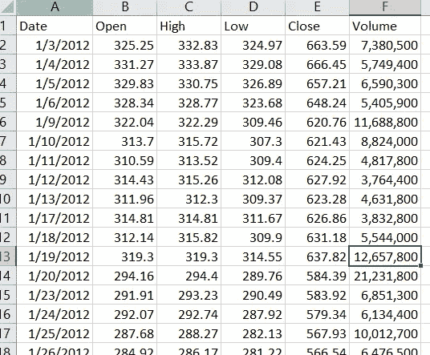

Top rows in excel.

请在 excel 中找到底部行(尾部)的数据集:

Bottom rows of the data set

让我们从 python 开始编码。

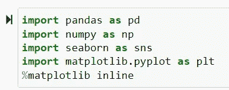

Importing necessary basic modules

我已经将股票数据集分为训练数据集和测试数据集。训练数据集是我将适合和嵌入 RNN 层的数据集，然后在测试数据集上对其进行测试。

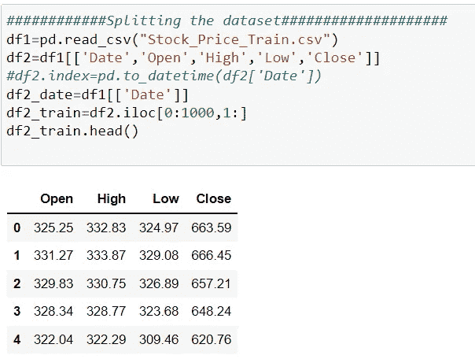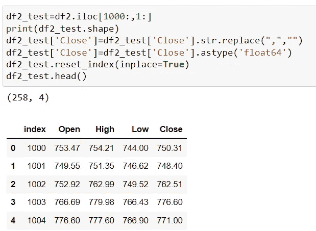

“关闭”列似乎是对象类型。我们需要转换成浮点型。下面是这样做的代码:

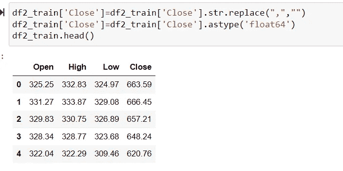

在神经网络中，对数据帧中的值进行缩放是非常必要的。在这种情况下，我使用标准定标器来为我的训练数据集定标值。请使用两个不同的 scaler 对象来缩放列。一个用于输入，另一个用于输出。

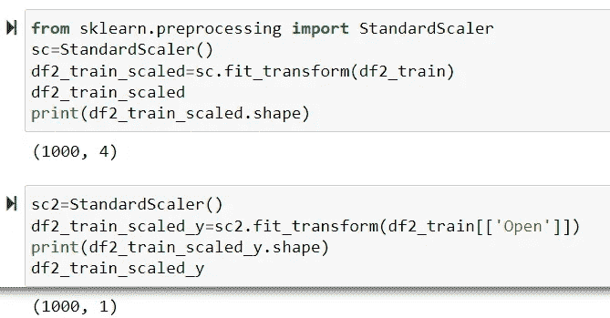

Now I have to create an array as I did in my previous post for the previous values for each column. As I have explained in detail about it in previous post. Please refer to the example to understand it easily.

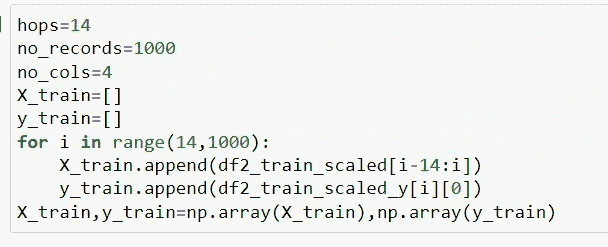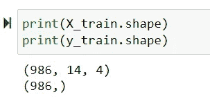

Reshape the array into 3-d as I did below. It is necessary to fit in RNN model.

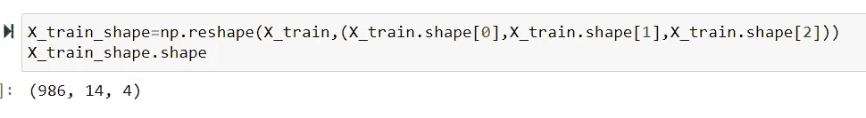

Now it has become easy to apply the RNN model with two embedded layers of LSTM layers and stack it with one dense layer.

SMALL EXPLANATION:

I have used two LSTM layers extensively and dropped out few neurons to make sure that my model doesn’t overfit . Please make sure to play around with different types of optimizers and loss if required . You should be able to write your own functions to hyper-tune the parameters.

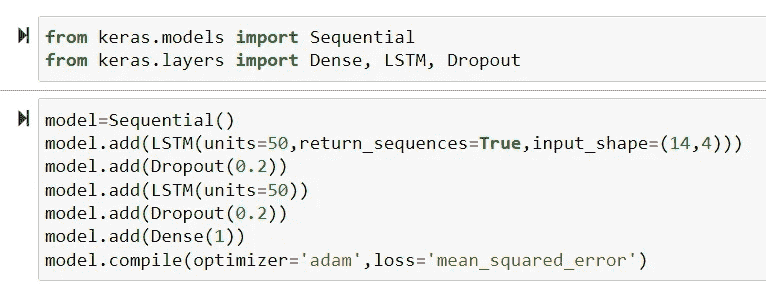

Let’s fit the model. I have used 100 epochs and batch size to 32 for each epochs.

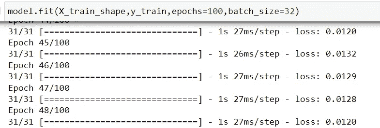

**Preparation of Test Dataset:**

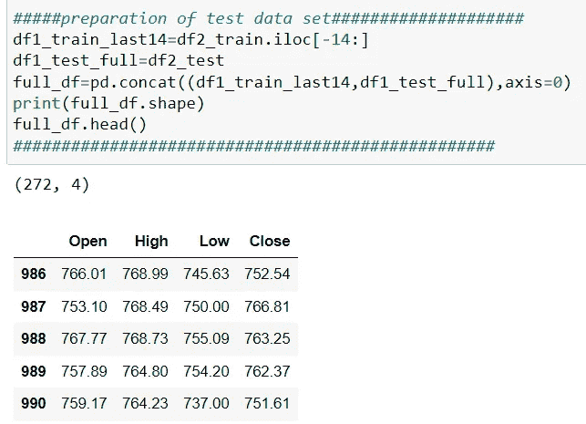

Rescaling the pandas dataframe>

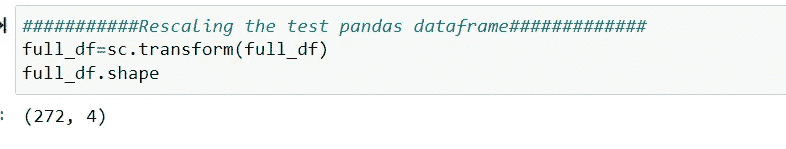

Reshaping the test data frame in similar way as we did for training dataset.

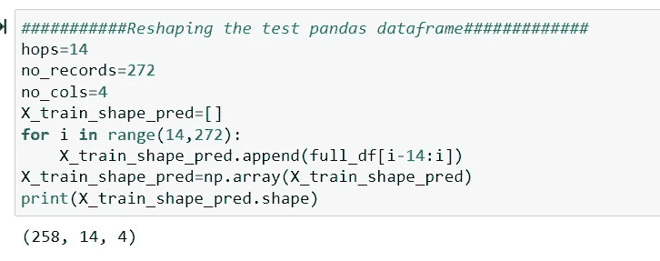

Try predicting the output for the Open Price and rescale it back to original value using inverse transform method.

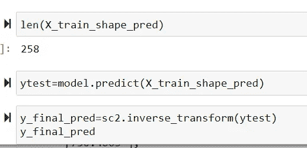

Converted the predicted values Series into Dataframe as i did below:

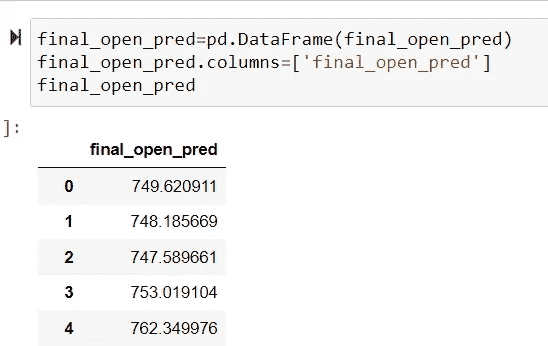

Finally, Concatenating the actual and predicted values in same dataframe and trying to visualize the differences.

Plotting the actual and forecasted values together on the graph to visualize the differences.

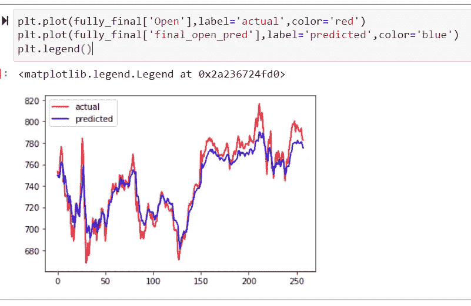

I see the forecast was quite close to actual values . I feel we all did a great job at the end. Hope I was able to explain you all very well how this forecasting worked. I will be coming up with many other methods which would be easier to implement and use. Thanks again!!!

In case of questions, please comment and I will be happy to help you out.

 [## Mlearning.ai Submission Suggestions

### How to become a writer on Mlearning.ai

medium.com](/mlearning-ai/mlearning-ai-submission-suggestions-b51e2b130bfb)