# 基于 VAR 模型的多元时间序列

> 原文：<https://medium.com/mlearning-ai/multivariate-time-series-using-var-model-efa215371738?source=collection_archive---------5----------------------->

大家好，如果你熟悉经典时间序列模型，那么在这种情况下，你一定已经知道 vectored(V)意味着在这种情况下涉及多个时间序列。今天，我将在数据集上实现 VAR 模型，该数据集包含季节性趋势和模式，只是为了向您展示如何实现 **VAR** 模型。如果你想应用微分和残差(即**移动平均线** ) ，我会很高兴看到你的评论。

**理论:**

**向量自回归可以有多种可能的组合，就像我们对 ARMA 的组合一样。**

1.  **VAR 模型**:这里涉及多个时间序列，每一列都有以前的滞后值。
2.  **VARMA 模型:**此处多个时间序列涉及以前的值及其移动平均值/残差。
3.  **VARIMA 模型:**这里数据集不是静态的，我们希望应用微分来确保数据集变得稳定。为了使它稳定所做的时间微分次数代表 I。

现在每个人都必须对 ARIMA 模式有清晰的了解，如果你不了解，请关注我下面的帖子:

 [## 基于 PYTHON 的 ARIMA 单变量时间序列预测

### 问题陈述:我试图解决一个问题陈述，这将有助于预测单变量…

medium.com](/mlearning-ai/univariate-variable-time-series-forecasting-using-arima-using-python-2faa012413e1) 

我将尝试实现 VAR 模型，并指导您一步一步地了解模型是如何实现的。让我们跳进来。

像往常一样导入非常基本的模块。

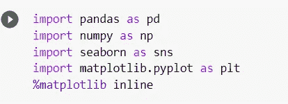

读取数据集并进行一些快速的小转换，以使解释更容易。今后，我们将尝试确定哪些时间序列相互影响，以及如何选择列。

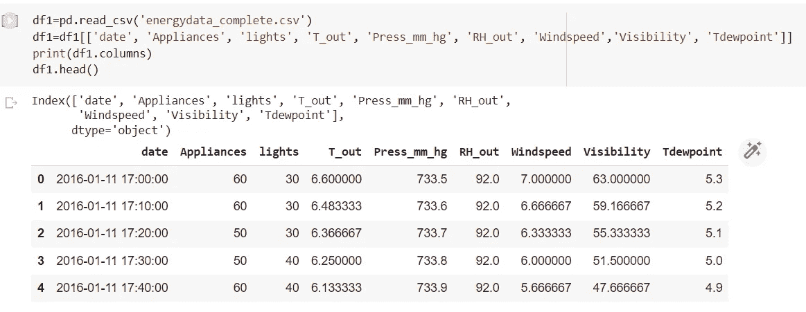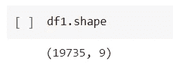

Feel the quantity of dataset

我们每小时有 6 条数据记录，因为我的传感器不断产生记录。基于小时汇总数据并重新采样。

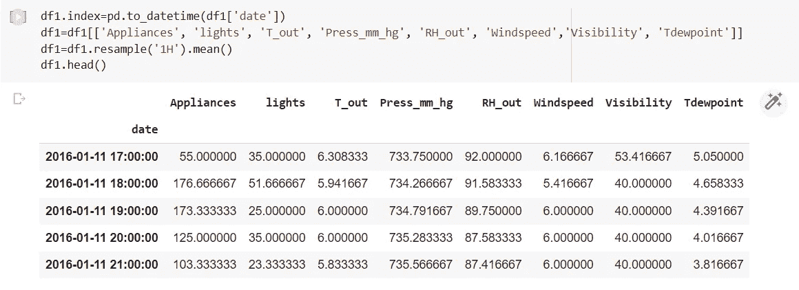

First 5 records

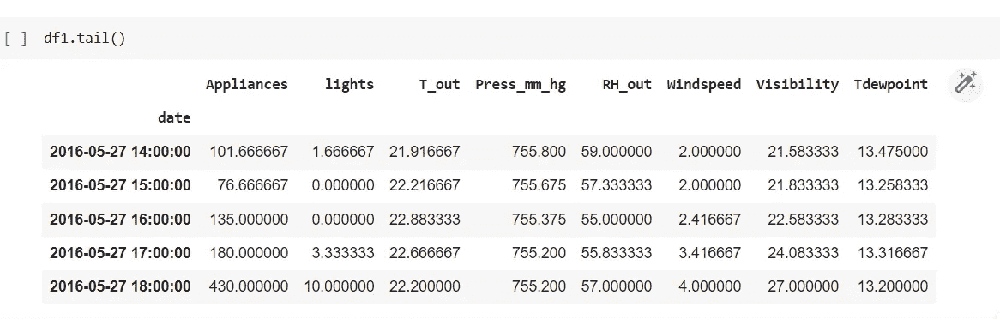

Last 5 records

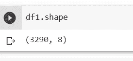

我相信我们将数据集从 19735 减少到了 3290。这是不是很棒，因为我们也降低了很多计算能力。

现在让我们做一些 EDA(探索性数据分析):

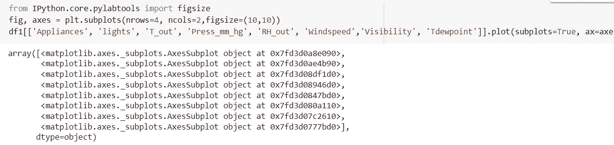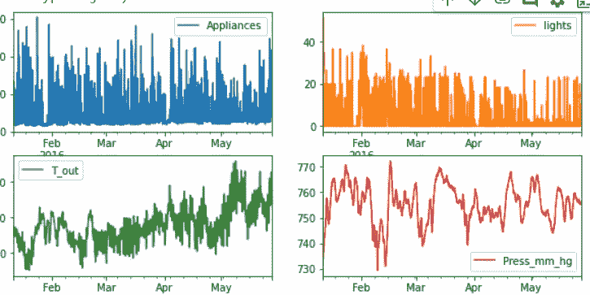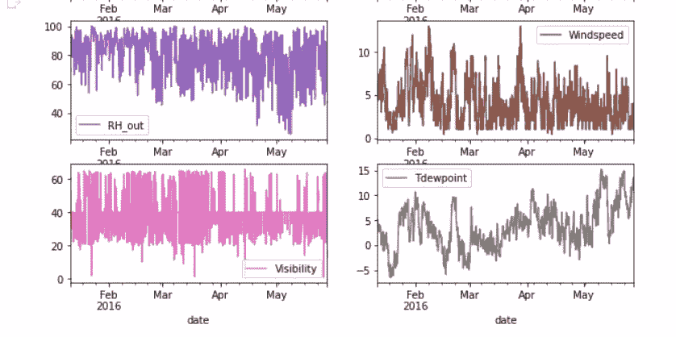

Data doesn’t look to be oscillating/changing too much

为了验证我的数据集是否是静态的，你们都必须知道要测试的进程的名字。它可以是 EDA(静态平均值和标准偏差测试)或 ADF 测试。在当前情况下，我们将继续进行增强的 Dickey Fuller 测试。它基于 P 假设。

H0->数据不是静止的

H1->如果 p≤0.05，数据是稳定的

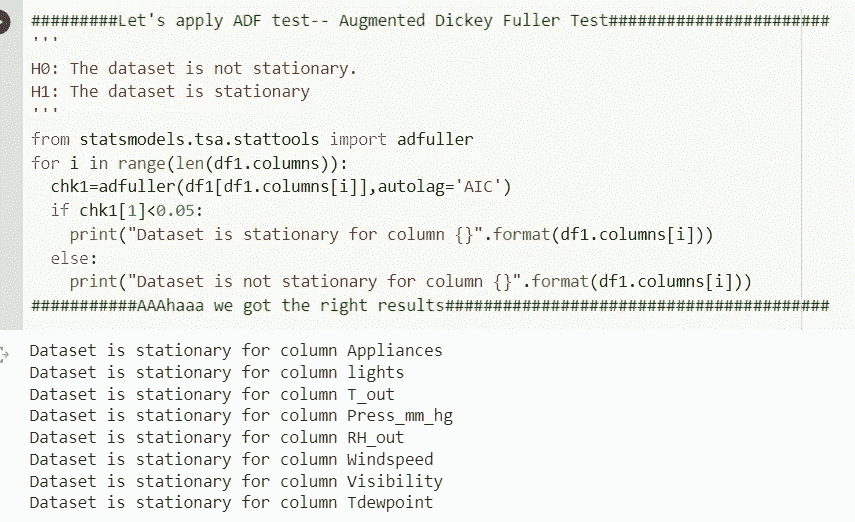

seems amazing

如果你的数据集不是稳定的，就必须做微分，这就是我要介绍的。这个过程与我们在 ARIMA 所做的一样。

现在我们有了维数灾难，你在机器学习中做 PCA 测试时听过这个术语。在这种情况下，我们有一些非常相似的东西。我们会做格兰杰因果检验，这也是 P 假设检验。让我们确定这是一个非常有趣的基本概念。

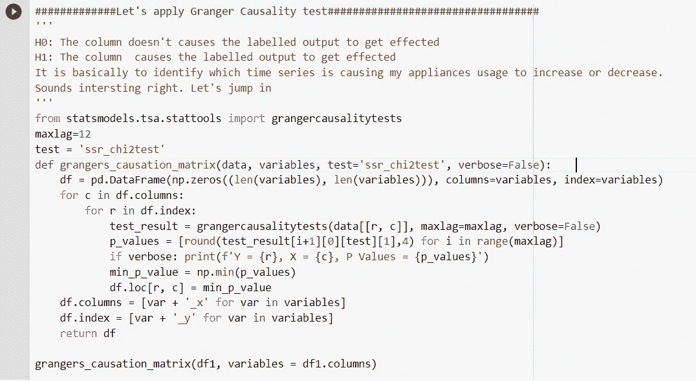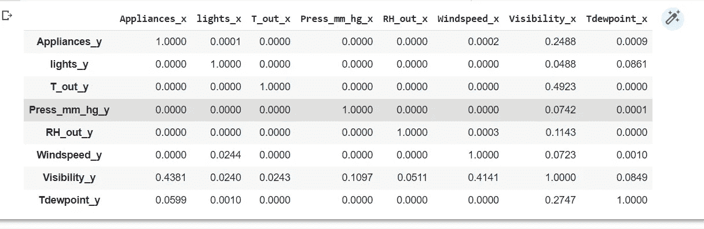

Table

上表解释了因果关系。X 轴表示特征，y 轴表示标注的输出。如上表所示，我们可以看到 **appliances_x** 导致 **T_out_y** 的 p 值为 0.000，这表明 **appliances_x 导致了 T_out 的值变化。**

换句话说，**器具 _x** 导致**可见度 _y 是 0.4381，这比值 0.05 和**高得多，因此我们可以得出器具对可见度的影响相当低的结论。因此，我们可以删除列设备，同时确定可见性的时间序列。

它看起来非常类似于降维问题。如果你很好的理解了上面的解释，那么你们可以进入下一步了。

考虑到复杂性，让我将其简化为 3 个特征的时间序列模型。

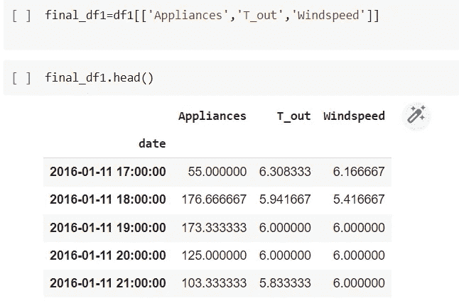

将数据分成训练和测试数据集。

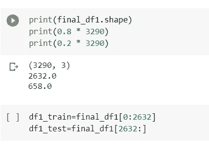

Splitting the dataset

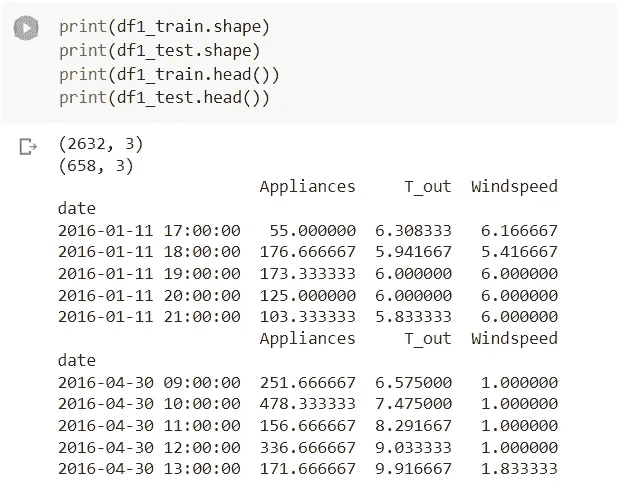

Look and feel for the test and train dataset

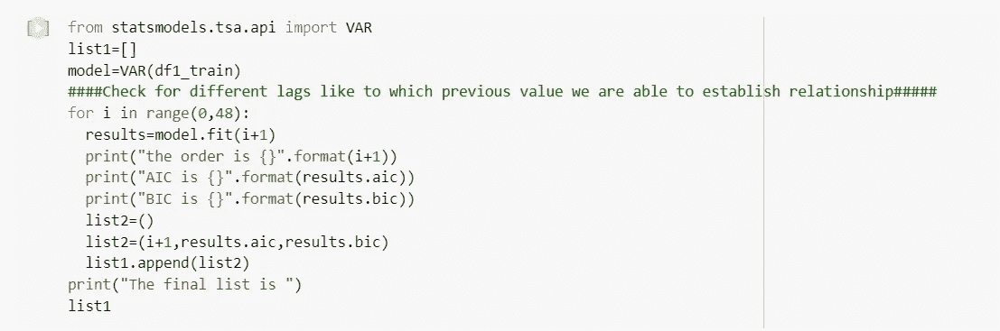

Finding out the best order for the lag

优化是非常必要的，更重要的是，找出最佳的滞后阶数可以解决我们所有的问题。我将向您展示两种这样做的方法。**第一种方法:**

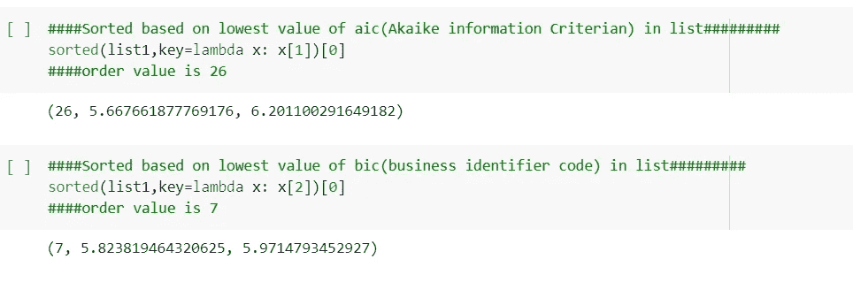

可以基于 AIC(赤池信息标准)或 BIC(商业信息标准)这两个标准找到优化的滞后。模型运行得越好，AIC 或 BIC 的值越低。在上面的例子中，两种情况下的顺序是不同的。但接下来我们将考虑基于 AIC 的滞后订单。

**第二种方法:**

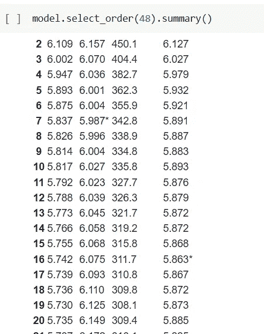

Star Marked will show the best lag orders

让我们使用 VAR 来创建模型。

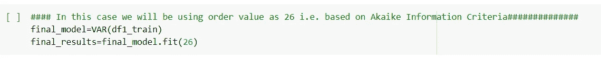

让我们试着想象一下模型的概要。

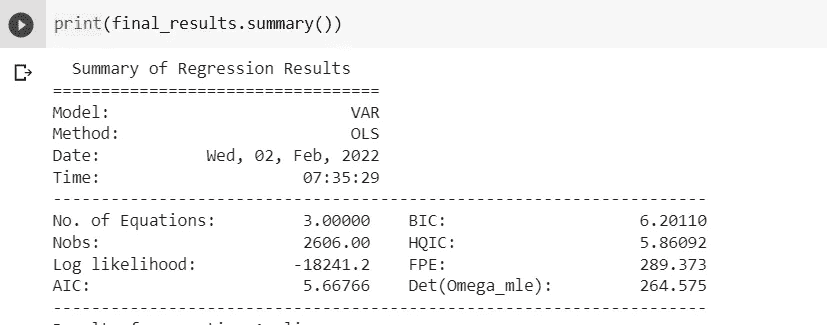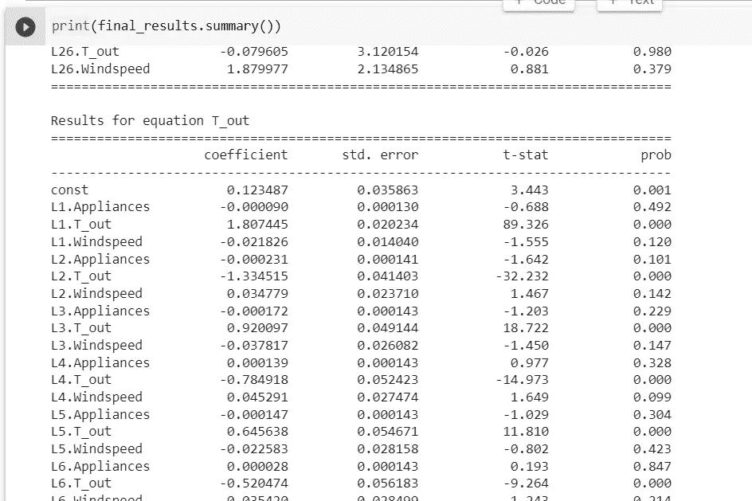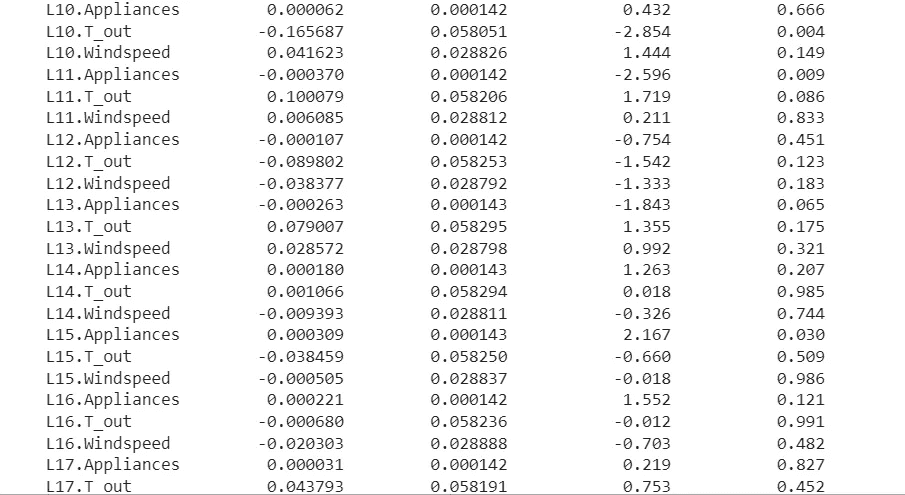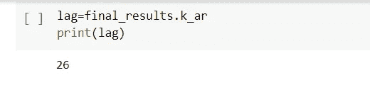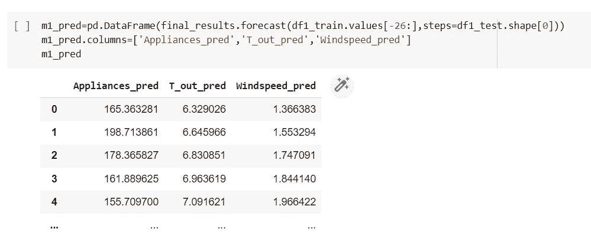

让我们在图表上绘制 Appliances actual 和 appliances_pred，以确定是否有任何巨大的差异。

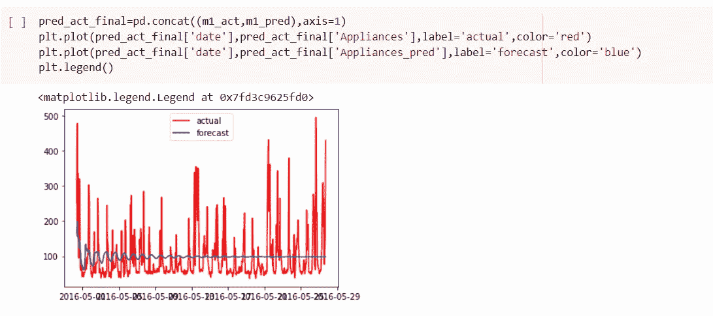

Appliances_actual vs appliances_pred

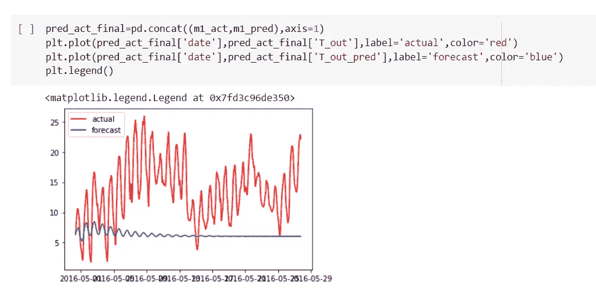

T_out actual vs T_out pred

预测没有那么好，我们可以用 VARMA 模型来提高精确度。请尝试实现相同的并提高模型的性能。你也可以想象特定的滞后的影响，并在此基础上画出你自己的线性方程。

让我给你看最后一招。

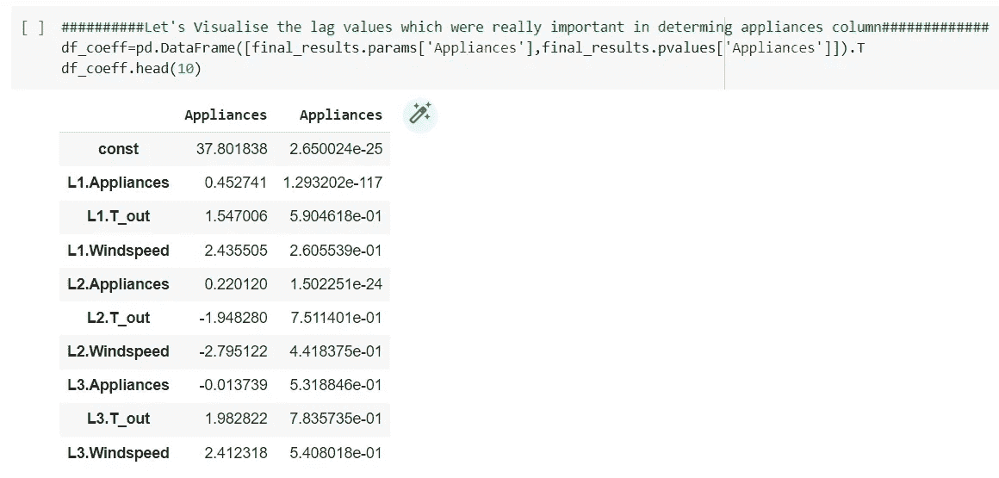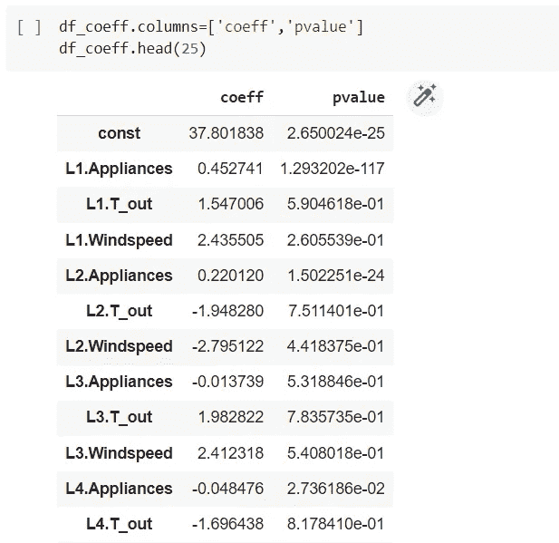

如果 p 值≤ 0.05，这意味着滞后对确定标签输出有较大影响。它将被考虑，其余的都可以被忽略。它可以转化为多元线性回归方法。

y=L1*x1+L2*x2+L3*x3…+const 等等。

只考虑那些 p 值小于 0.05 的系数。

希望，我能够帮助你一步一步地理解 VAR 模型的实现。虽然根据我们的预期，我的模型没有很好地工作，但我觉得每个人都必须一步一步地理解实施过程。非常感谢！！！

 [## Mlearning.ai 提交建议

### 如何成为 Mlearning.ai 上的作家

medium.com](/mlearning-ai/mlearning-ai-submission-suggestions-b51e2b130bfb)