# 用机器学习解释 AOTY 和 Metacritic 的音乐专辑评级

> 原文：<https://medium.com/mlearning-ai/music-album-ratings-explained-shap-values-for-release-decades-genres-labels-and-formats-9e64e8c0aaf1?source=collection_archive---------2----------------------->

## SHAP 对发行年代、类型、标签和格式的价值观

在本文中，我分析了包含来自两个已知音乐评论聚合器[年度专辑](https://www.albumoftheyear.org/) (AOTY)和[元评论](https://www.metacritic.com/music) *的大约 **3 万张音乐专辑**的**聚合评分**的数据集。数据集[在 Kaggle](https://www.kaggle.com/datasets/kauvinlucas/30000-albums-aggregated-review-ratings) 上公开。分析的全部细节可以在本公众 Kaggle 笔记本 中找到 [**。**](https://www.kaggle.com/code/dima806/album-ratings-explain)*

Photo by [Julio Rionaldo](https://unsplash.com/@juliorionaldo?utm_source=unsplash&utm_medium=referral&utm_content=creditCopyText) on [Unsplash](https://unsplash.com/s/photos/vinyl-records?utm_source=unsplash&utm_medium=referral&utm_content=creditCopyText)

# 步骤 1 —数据预处理

这里，数据预处理包括以下步骤:

*   将标签(用户和评论家的评分)从 0 重新调整到 100；
*   把发行年份换算成十年，去掉 40 年代发行的稀稀拉拉的专辑；
*   填充空值；
*   删除未使用的列；
*   最后，对[稀有分类变量](https://feature-engine.readthedocs.io/en/latest/user_guide/encoding/RareLabelEncoder.html)进行编码，每列不超过 60 个不同类别，每个类别至少 30 个相册。

# 步骤 2-设置机器学习模型来预测 AOTY 用户评级分数

上一步准备的数据在训练样本和测试样本之间随机分割，并使用明确考虑分类特征的 [CatBoostRegressor](https://catboost.ai/en/docs/concepts/python-reference_catboostregressor) 模型建模。最终模型的[均方根误差](https://scikit-learn.org/stable/modules/generated/sklearn.metrics.mean_squared_error.html) (RMSE)为**约 9.1 个百分点**，与基准模型 RMSE 的约 9.8 个百分点相比有所提高**(假设每张**专辑的**的**得分约为 71.2)。****

# 步骤 3-对获得的机器学习模型的解释

在这里，我们使用了[SHapley Additive exPlanations(SHAP)](https://shap-lrjball.readthedocs.io/en/latest/index.html)方法，一种最常见的探索机器学习模型的可解释性的方法。因此，SHAP 值的单位为**个百分点**。

首先，我们研究我们感兴趣的每个特征的 SHAP 值的跨度:

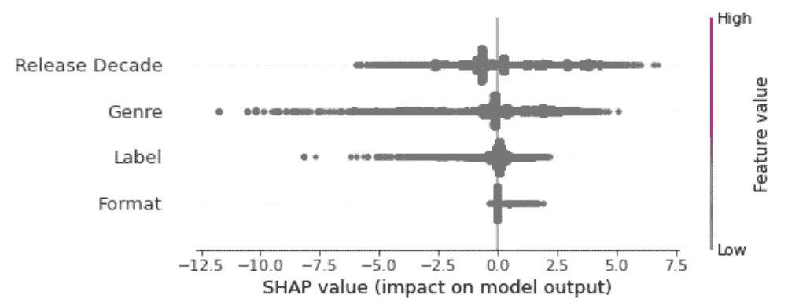

Source: author, [album_ratings_explain | Kaggle](https://www.kaggle.com/code/dima806/album-ratings-explain)

**预测 AOTY 用户评分**最重要的特征是**音乐专辑发行十年**、**流派**和**标签**，其次是**专辑格式**。

现在，我们来看看个人特征。

> 在**专辑发行十年**中，我们看到**最高 AOTY 用户评分评论与 20 世纪 50 年代、60 年代和 70 年代发行的专辑相关联**:

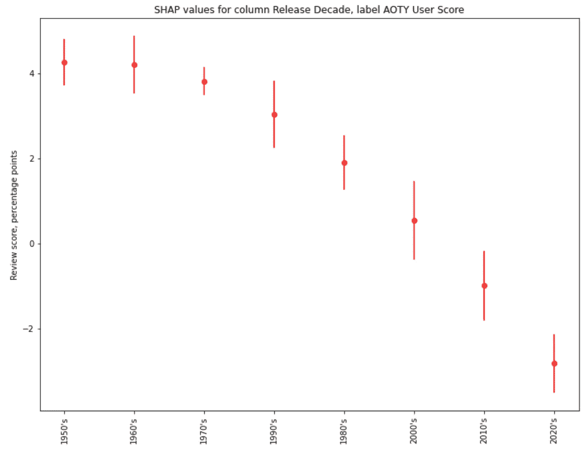

Source: author, [album_ratings_explain | Kaggle](https://www.kaggle.com/code/dima806/album-ratings-explain)

> 值得注意的是，与**最高 AOTY 用户评分评论**相关的**音乐流派**分别是 [**死亡金属**](https://en.wikipedia.org/wiki/Death_metal)**[**灵魂**](https://en.wikipedia.org/wiki/Soul_music) **，以及** [**前卫金属**](https://en.wikipedia.org/wiki/Progressive_metal) **，其次是** [**爵士**](https://en.wikipedia.org/wiki/Jazz)**[【T44](https://en.wikipedia.org/wiki/Post-hardcore)****

****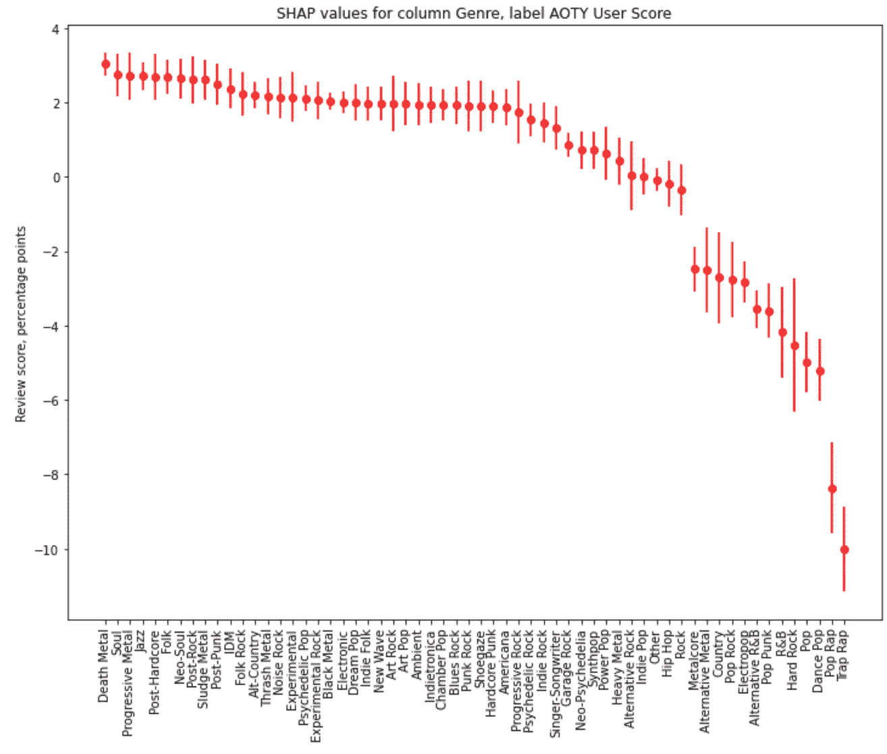****

****Source: author, [album_ratings_explain | Kaggle](https://www.kaggle.com/code/dima806/album-ratings-explain)****

> ****有趣的是，与**最高 AOTY 用户评分评论**相关联的**音乐厂牌**依次是****世纪传媒** [**XL**](https://en.wikipedia.org/wiki/XL_Recordings) **、** [**斗牛士**](https://en.wikipedia.org/wiki/Matador_Records) **和** [**蓝注**](https://en.wikipedia.org/wiki/Blue_Note_Records)******

****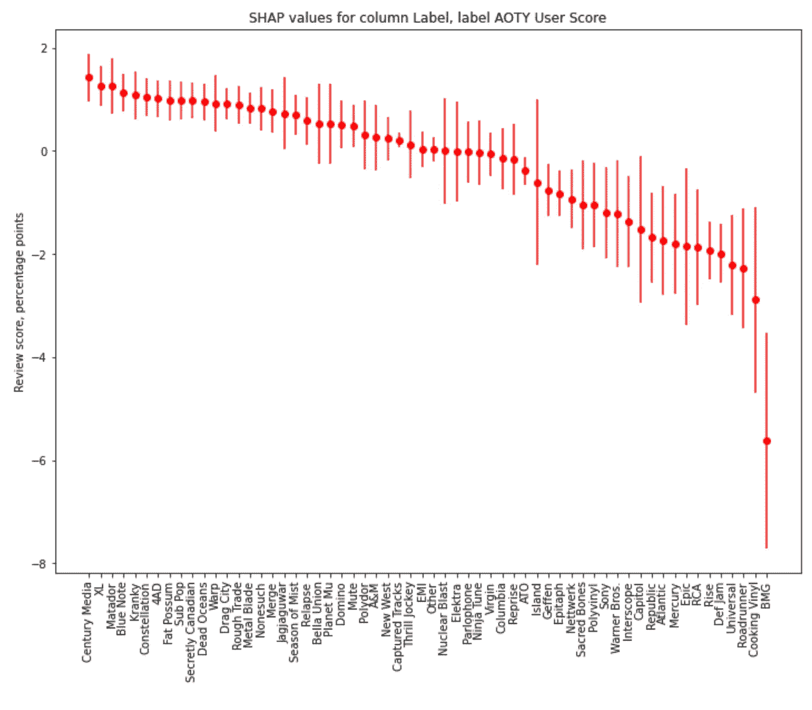****

****Source: author, [album_ratings_explain | Kaggle](https://www.kaggle.com/code/dima806/album-ratings-explain)****

> ****最后，**延长播放(7 英寸)格式的 AOTY 用户分数平均比长播放(12 英寸)格式高 0.7 个百分点**:****

****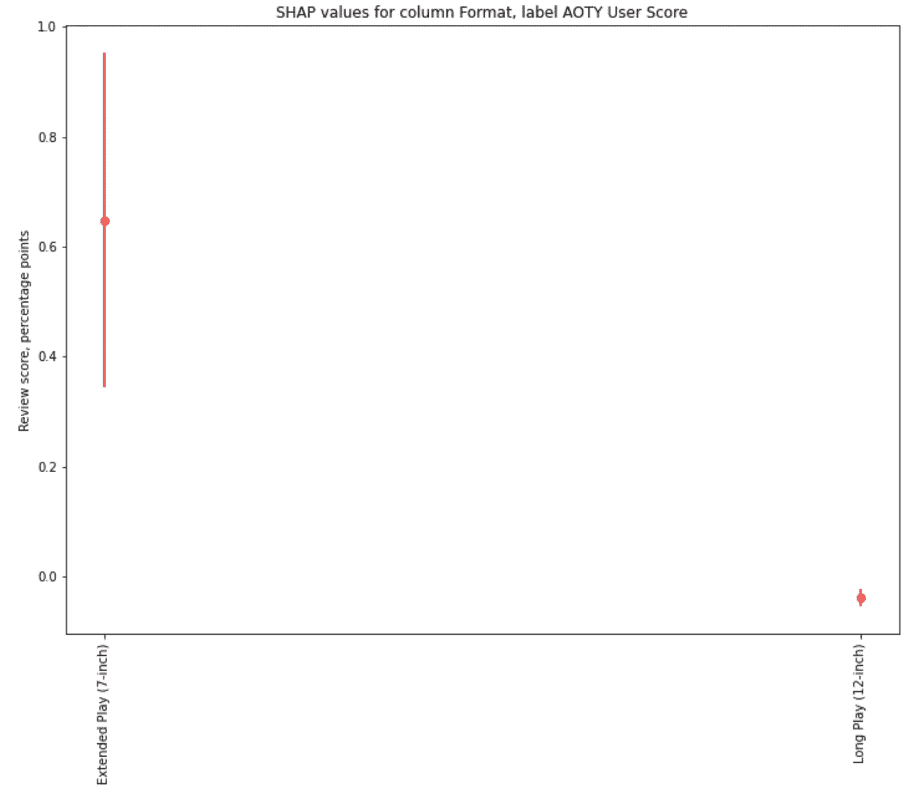****

****Source: author, [album_ratings_explain | Kaggle](https://www.kaggle.com/code/dima806/album-ratings-explain)****

# ****第 4 步——其他分数的建模及其对 SHAP 值的解释****

****在这里，我寻找关于数据集中提供的其他分数的更多细节，即 **AOTY 评论家分数**、**元批评用户分数**和**元批评评论家商店分数**。****

****从 **AOTY 评论家**的评分开始，我们看到最重要的变量是发行年代和流派:****

****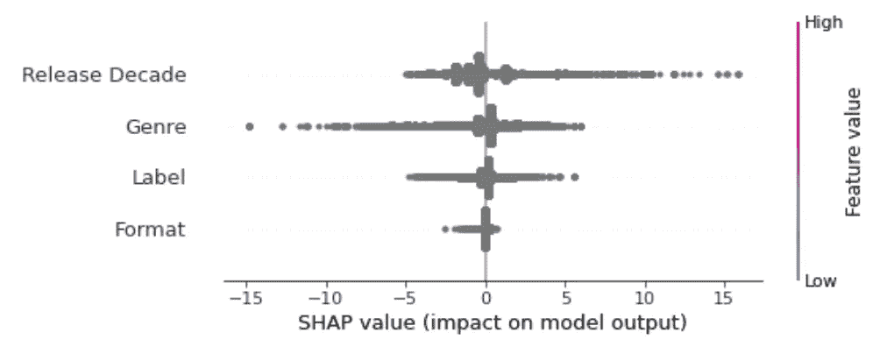****

****Source: author, [album_ratings_explain | Kaggle](https://www.kaggle.com/code/dima806/album-ratings-explain)****

> ****与 AOTY 用户评分相似，**最高 AOTY 评论家评分与 20 世纪 50 年代、60 年代和 70 年代发行的专辑相关联**:****

****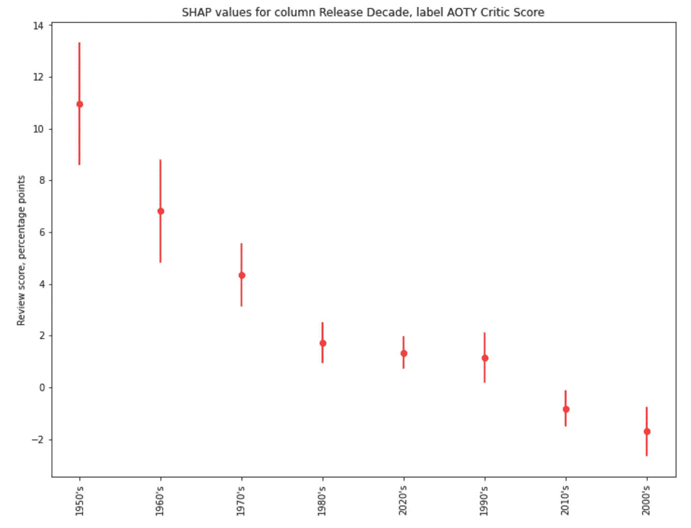****

****Source: author, [album_ratings_explain | Kaggle](https://www.kaggle.com/code/dima806/album-ratings-explain)****

> ****与 AOTY 用户评分不同，与**最高 AOTY 评论家评分评论**相关联的**音乐流派**有 [**爵士**](https://en.wikipedia.org/wiki/Jazz) **，** [**美式**](https://en.wikipedia.org/wiki/Americana_(music)) **，以及** [**污泥金属**](https://en.wikipedia.org/wiki/Sludge_metal) **，其次是** [**前卫金属**](https://en.wikipedia.org/wiki/Progressive_metal) **，******

****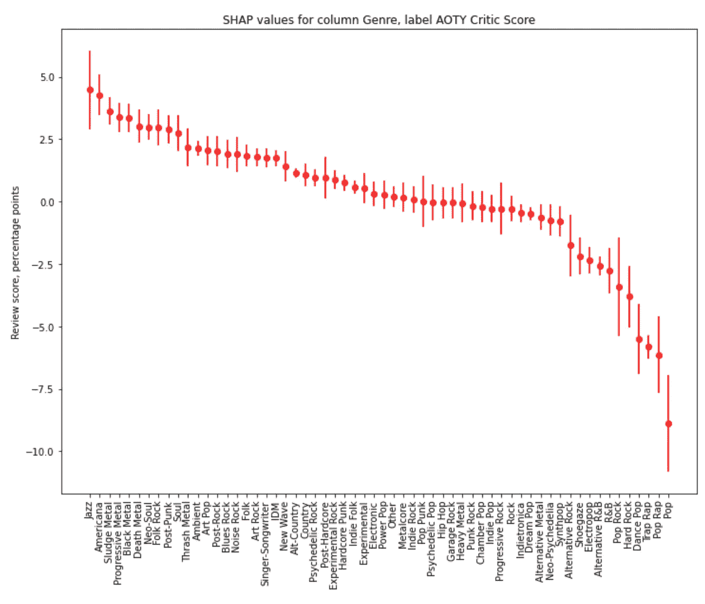****

****Source: author, [album_ratings_explain | Kaggle](https://www.kaggle.com/code/dima806/album-ratings-explain)****

> ****还有，与 AOTY 用户评分不同的是，与**最高 AOTY 乐评人评分评论**相关联的**音乐标签**是 [**蓝音符**](https://en.wikipedia.org/wiki/Blue_Note_Records) ，**其次是** [**复发**](https://en.wikipedia.org/wiki/Relapse_Records) **，** [**星座**](https://en.wikipedia.org/wiki/Constellation_Records_(Canada)) **，以及******

******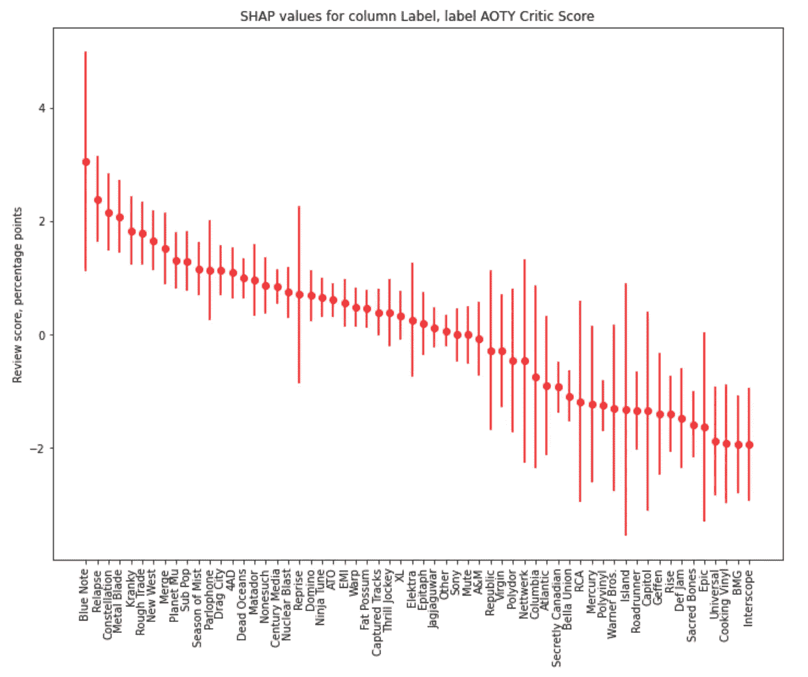******

******Source: author, [album_ratings_explain | Kaggle](https://www.kaggle.com/code/dima806/album-ratings-explain)******

> ******最后，**与 AOTY 用户分数不同，AOTY 评论家分数的长播放和扩展播放格式之间没有显著差异**:******

****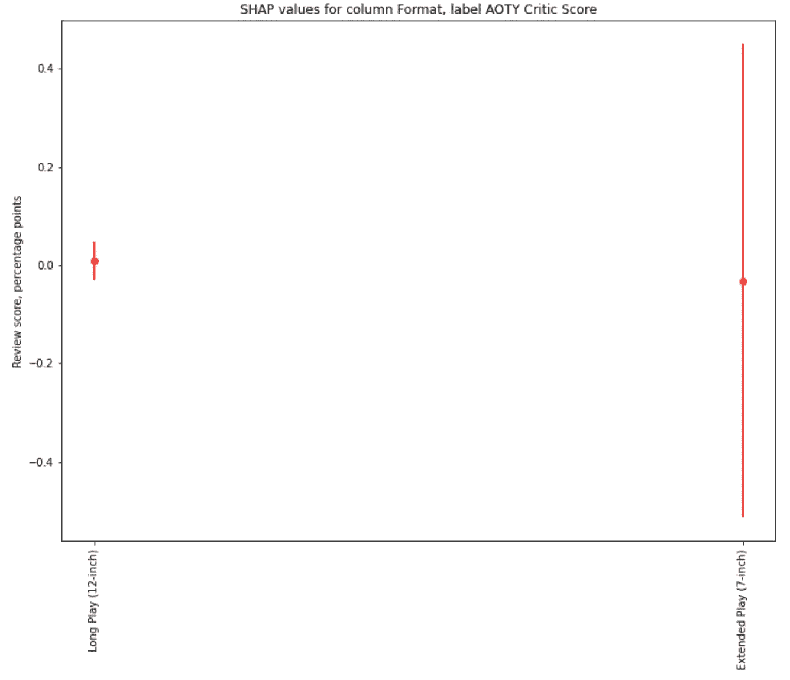****

****Source: author, [album_ratings_explain | Kaggle](https://www.kaggle.com/code/dima806/album-ratings-explain)****

****接下来，我们来看一下**元批评用户分数**。****

****首先，我们只能在 Metacritic 上看到相对较新的专辑:****

****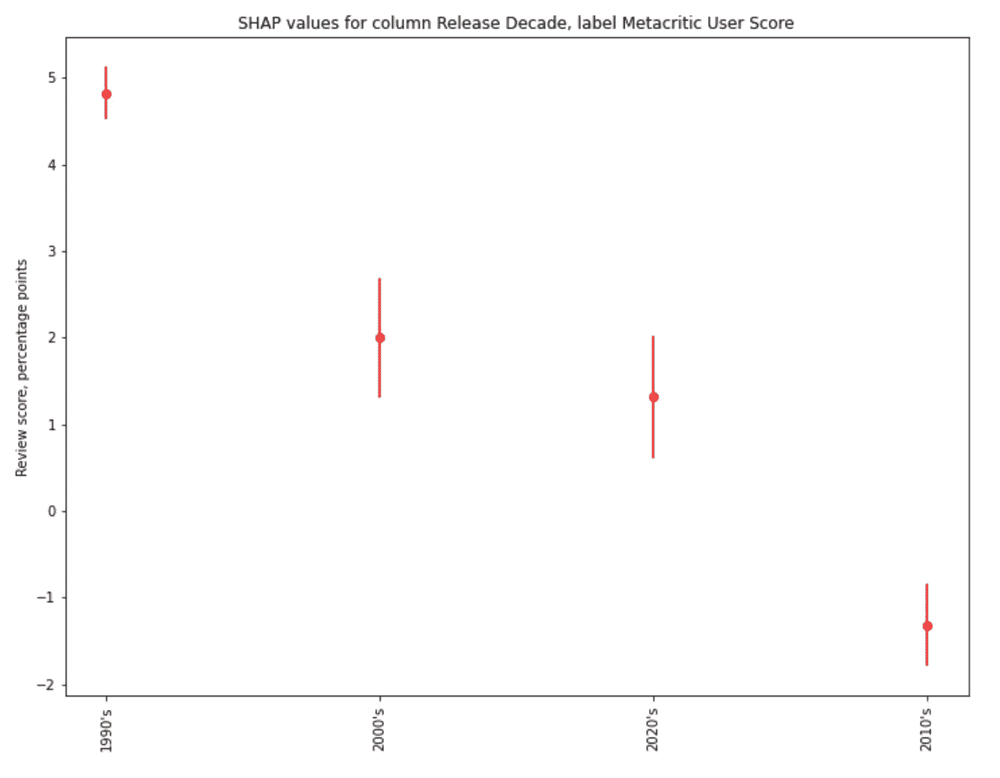****

****Source: author, [album_ratings_explain | Kaggle](https://www.kaggle.com/code/dima806/album-ratings-explain)****

> ****与**最高 Metacritic 用户评分评论**相关联的**音乐流派**是 [**车库摇滚**](https://en.wikipedia.org/wiki/Garage_rock)**[**前卫金属**](https://en.wikipedia.org/wiki/Progressive_metal)**[**后期硬核**](https://en.wikipedia.org/wiki/Post-hardcore) **，接下来是** [**后期摇滚**](https://en.wikipedia.org/wiki/Post-rock)********

******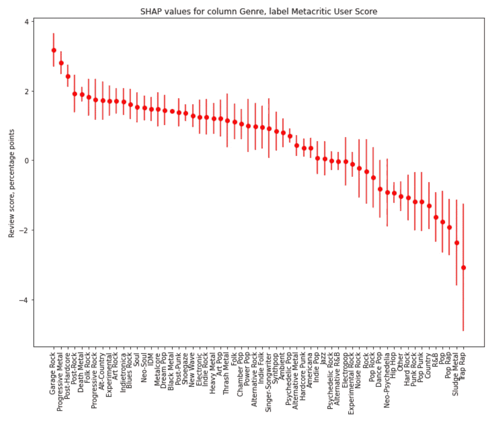******

******Source: author, [album_ratings_explain | Kaggle](https://www.kaggle.com/code/dima806/album-ratings-explain)******

> ******同样，与**最高 Metacritic 用户评分评论** **相关联的**音乐标签**是** [**金属刃**](https://en.wikipedia.org/wiki/Metal_Blade_Records) **，接下来是**[**Kranky**](https://en.wikipedia.org/wiki/Kranky_(record_label))**和** [**胖负鼠**](https://en.wikipedia.org/wiki/Fat_Possum_Records) :******

****

**Source: author, [album_ratings_explain | Kaggle](https://www.kaggle.com/code/dima806/album-ratings-explain)**

> **对于 Metacritic 用户评分评论，音乐专辑格式没有明显差异:**

**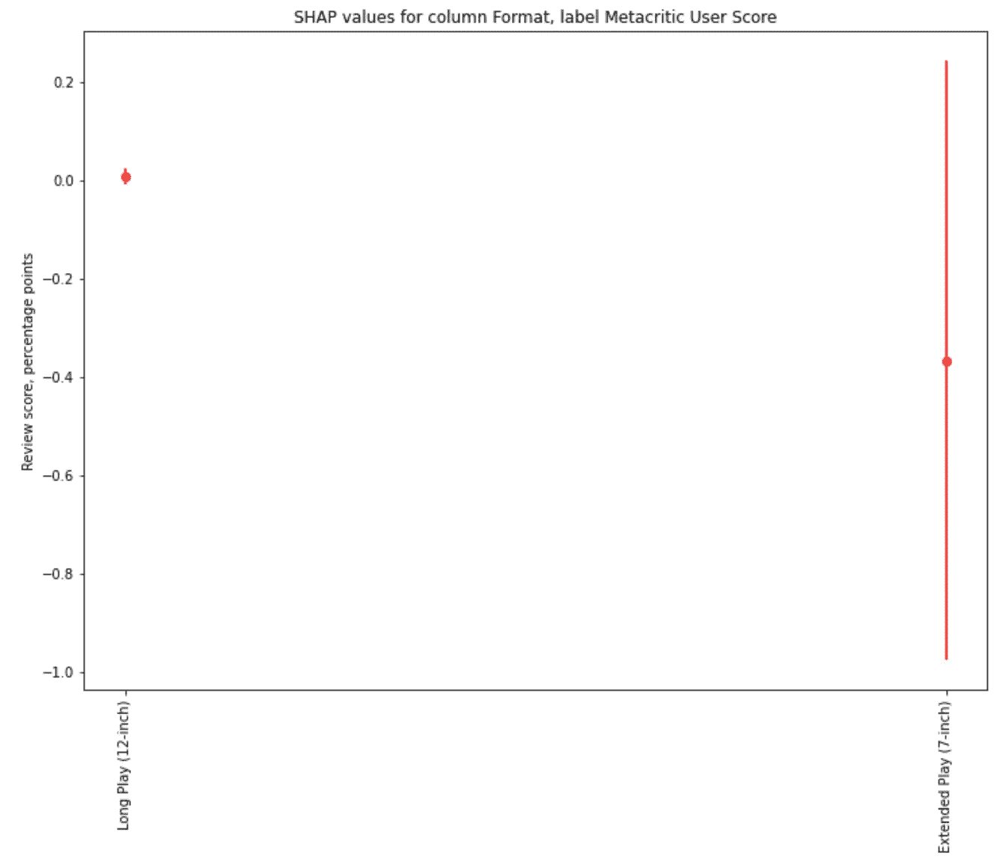**

**Source: author, [album_ratings_explain | Kaggle](https://www.kaggle.com/code/dima806/album-ratings-explain)**

**最后，我们来看 **Metacritic 评论家评分**。**

> **这里，**专辑发行数十年的依赖性与 Metacritic 用户评分**有些不同:**

**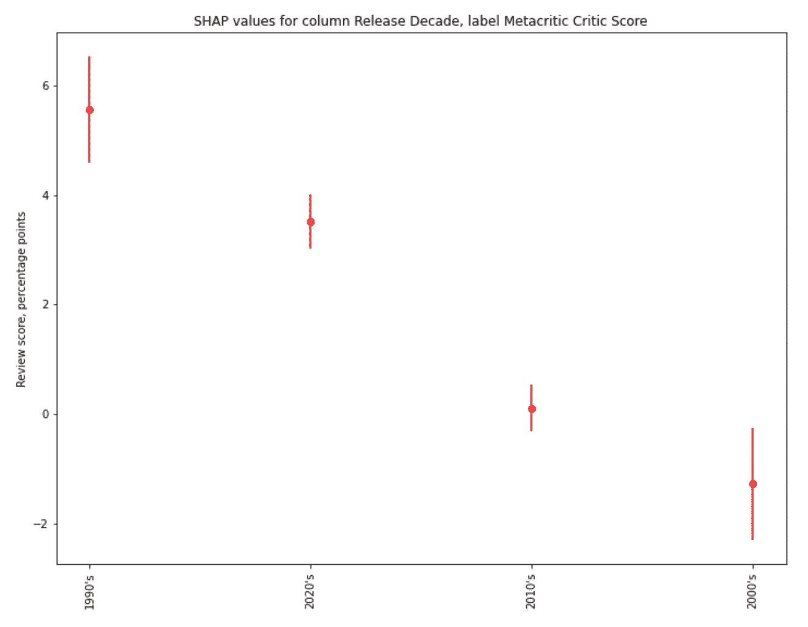**

**Source: author, [album_ratings_explain | Kaggle](https://www.kaggle.com/code/dima806/album-ratings-explain)**

**同样，**音乐流派**与**最高 Metacritic 评论家评分评论**分别是 [**黑色金属**](https://en.wikipedia.org/wiki/Black_metal) **，** [**美式**](https://en.wikipedia.org/wiki/Americana_(music)) **，** [**爵士**](https://en.wikipedia.org/wiki/Jazz) **，接下来是** [**死亡金属**](https://en.wikipedia.org/wiki/Death_metal) **，** [**金属核心【Metalcore】**](https://en.wikipedia.org/wiki/Metalcore)**

****

**Source: author, [album_ratings_explain | Kaggle](https://www.kaggle.com/code/dima806/album-ratings-explain)**

**与**最高 Metacritic 评论家评分评论**相关联的对应音乐标签是 [**【金属刃】**](https://en.wikipedia.org/wiki/Metal_Blade_Records) **，其次是** [**合并**](https://en.wikipedia.org/wiki/Merge_Records)**[**复发**](https://en.wikipedia.org/wiki/Relapse_Records) **，以及** [**星座**](https://en.wikipedia.org/wiki/Constellation_Records_(Canada)) :****

****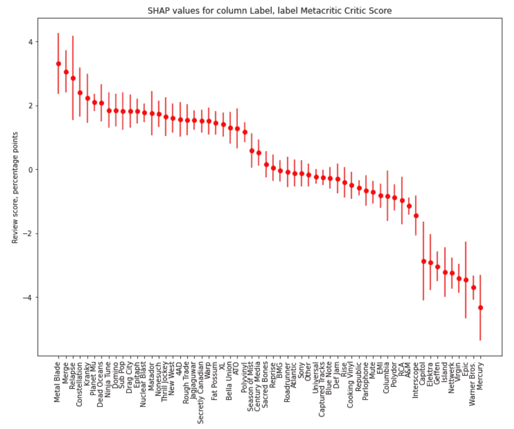****

****Source: author, [album_ratings_explain | Kaggle](https://www.kaggle.com/code/dima806/album-ratings-explain)****

****最后，对于**元批评评论家评分评论，长播放和扩展播放专辑格式**之间的**平均分数差异比元批评用户评分评论更明显:******

****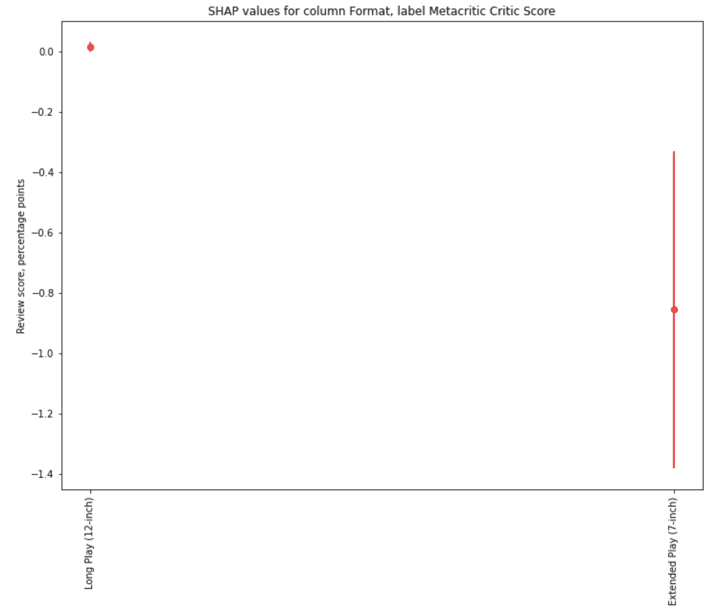****

****Source: author, [album_ratings_explain | Kaggle](https://www.kaggle.com/code/dima806/album-ratings-explain)****

****希望这些结果能对你有用。如果有问题/评论，不要犹豫，在下面的评论中写下或**通过 [LinkedIn](https://www.linkedin.com/in/dima806/) 或 [Twitter](https://twitter.com/dima806_dima) 直接联系我**。****

****你也可以 [**订阅我的新文章**](/subscribe/@dima806) ，或者 [**成为推荐媒介会员**](/@dima806/membership) 。****

**** [## Mlearning.ai 提交建议

### 如何成为 Mlearning.ai 上的作家

medium.com](/mlearning-ai/mlearning-ai-submission-suggestions-b51e2b130bfb)****