# 使用深度学习的音乐生成

> 原文：<https://medium.com/mlearning-ai/music-generation-using-deep-learning-49692851c57c?source=collection_archive---------0----------------------->

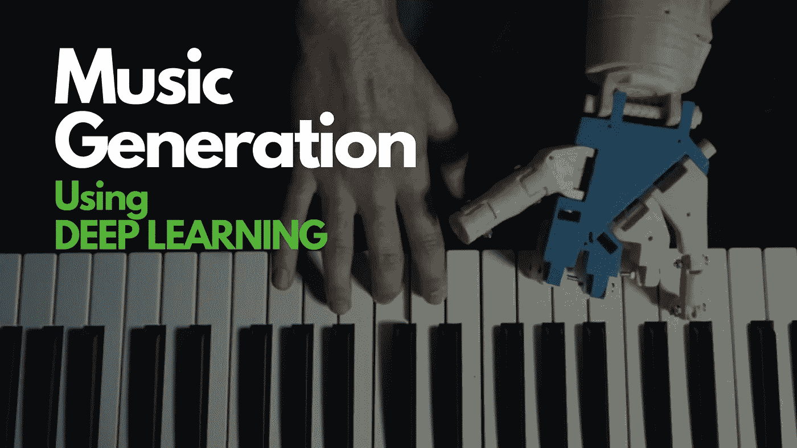

# 机器能产生音乐吗？

# 现实世界的问题

*   音乐生成的目标是利用人工智能探索关于音乐创作领域的深度学习。
*   案例研究的重点是使用递归神经网络(RNN)自动生成音乐。
*   我们不需要成为创作音乐的专家。即使像我这样的非专家也可以用 RNN 创作出低质量的创造性音乐。
*   迄今为止，创作音乐是人类独有的事情，但使用深度学习已经取得了一些重大进展。

# 目标

*   建立一个将现有音乐数据作为输入的模型，学习模式并生成“新”音乐。

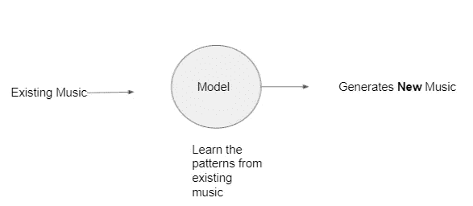

*   模型生成的音乐不需要专业，只要悠扬好听就行。
*   它不能简单地从训练数据中复制和粘贴。它必须从人类喜欢的现有音乐中学习模式。

# 现在，什么是音乐？

*   基本上，音乐是音乐成分/事件的序列。
*   音乐事件/音符的输入序列
*   输出-音乐事件/音符的新序列
*   在这个案例研究中，我把自己限制在单一乐器音乐上。你可以把它扩展到多种乐器的音乐。

# 一些用 RNNs 生成音乐的例子

 [## 民间 RNN -用递归神经网络生成民间曲调

### 机器民谣是一个社区网站，致力于由机器创作或与机器共同创作的民谣音乐…

folkrnn.org](https://folkrnn.org/) 

# 音乐的表现

## 1.活页乐谱

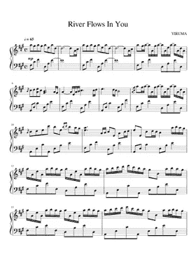

sheet music

基本上，活页乐谱用一种特定的符号表示音乐，音乐家使用这种演奏音乐。它既可用于单台仪器，也可用于多台仪器。活页乐谱是一种视觉文件。

## 2.ABC 符号

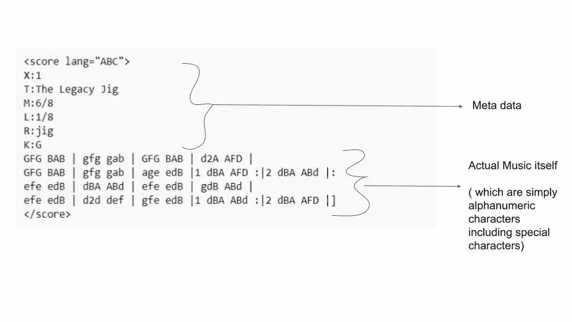

This is an example of the use of ABC notation from Wikipedia

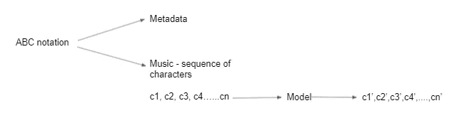

*   第一部分是生成的实际音乐的 ABC 符号的元数据。
*   x:当一个文件中有多个曲调时
    T:标题
    M:拍号
    L:默认音符长度
    R:曲调类型
    K:键
*   第二部分跟随元数据并表示曲调。
*   如果你知道音乐的 ABC 符号，你可以写乐谱，反之亦然。
*   你也可以将 abc 符号转换成 MIDI 并下载。

## 3.MIDI 表示

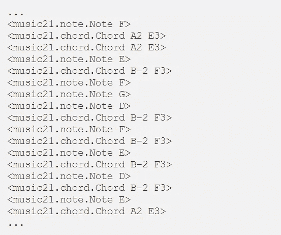

MIDI format

*   我们可以看到使用 Music21 读取的 midi 文件的摘录。
*   数据分为两种对象类型:音符和和弦。
*   音符对象包含关于音符的**音高**、**八度音程**和**偏移**的信息。
*   和弦对象本质上是同时播放的一组音符的容器。
*   每行基本上都是事件——事件 0、事件 1、事件 2……事件 n，它为我们提供了有关时间戳的信息。

> 在本案例研究中，我们将更多地关注 ABC 符号，因为它是最简单的符号，并且只使用了一个数字字符。

## 为什么 MP3 不被认为是音乐的代表？

*   Mp3 包含频率、振幅和时间戳。
*   音乐家使用 ABC 记谱法或活页乐谱作为一种更有效的表达方式，因为他们不是通过思考频率来创作音乐的。
*   因此，最好利用非凡音乐家设计的数千年音乐符号。
*   因此，我们不会使用 mp3 文件。我们将在符号的空间里创作我们的音乐。

# 夏尔-RNN 模型(高级概述)

所以，我们现在有一些领域知识，我们不需要成为专家。我们现在就来了解一下夏尔·RNN。因为我们的音乐是一个字符序列，所以我们明显的选择是 RNNs。

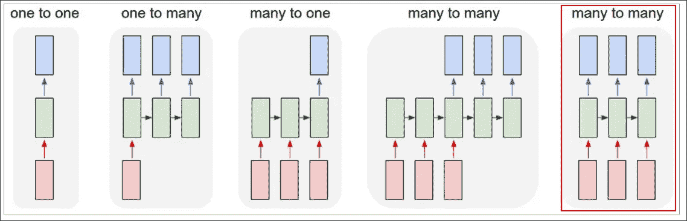

*   有一种特殊类型的 RNN 叫做“夏尔-RNN”。
*   我们将使用多对多 RNN。这里，我们将把序列中的字符一个接一个地输入 RNN，它将输出序列中的下一个字符。


*   这将允许我们一次生成一个新的曲调。
*   作为一个工作示例，假设我们只有四个可能字母“helo”的词汇表，并且想要在训练序列“hello”上训练一个 RNN。

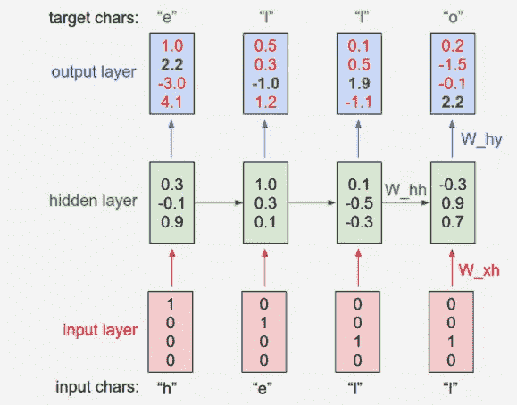

*   这个训练序列实际上是 4 个独立训练例子的来源:
    1。给定“h”的上下文,“e”的概率应该是可能的。
    2。“l”在“他”的上下文中应该是可能的。
    3。考虑到“hel”的上下文,“l”也应该是可能的。
    4。最后，考虑到“地狱”的上下文,“o”应该是可能的。
*   我们将使用一键编码将每个字符编码到一个向量中(即，除了词汇表中字符索引处的一个 1 之外，所有字符都是零)，并使用步进函数将它们一次一个地输入到 RNN 中。
*   然后，我们将观察 4 维输出向量的序列(每个字符一维)，我们将其解释为当前分配给序列中下一个字符的 RNN 的置信度。
*   我们希望输出层中的绿色数字较高，红色数字较低，从而得到目标字符。
*   请记住，在这种多对多模型中，操作系统输入的数量等于输出的数量。

# 数据

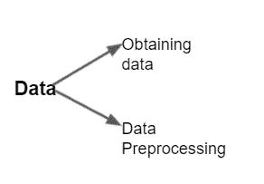

*   第一部分是获取数据本身。
*   第二部分是预处理数据并生成每个单独的批次，我们将使用这些批次及其构造，因为我们将在训练 Char-RNN 时应用 Batch-SGD 的变体。

## 数据获取:

*   参考:【http://abc.sourceforge.net/NMD】T4
*   上面写着“诺丁汉音乐数据库的 ABC 版本”,它包含了 1000 多首以特殊文本格式存储的民间曲调。
*   当然，像 1000 首曲子这种更大的数据，训练模型是要花很多时间的。所以我将使用包含大约 340 首曲子的夹具数据集。
*   你得到一个包含多首曲子的 txt 文件。
*   只需复制并粘贴到一个 txt 文件中作为 input.txt。
*   每首曲子都有元数据部分和音乐部分。

## 数据预处理:

我们希望将 input.txt 文件预处理成这样一种格式，即我们可以将其输入到 RNN 中，因为我们构建数据集的方式会严重影响模型，并且 RNNs 可能会比较棘手。

*   批处理大小= 16
    序列长度= 64
    input . txt 文件中字符的总长度= 129，665
    唯一字符数= 86

> char_to_idx = { ch: i for (i，ch)in enumerate(sorted(list(set(text))))}

*   这里，在 char_to_idx 中，char-to-idx 是将每个字符转换成一个索引或数值，其中 ch(character)是键和索引或数值，类似于 json 文件:
    这是 jusk like json 文件:
    {"\n": 0，" ":1，"！":2，" \ ":3，" #": 4，" %": 5，"& ": 6，" ' ":7，"(":8，")":9，"+": 10，"，":11，"-": 12，"。": 13, "/": 14, "0": 15, "1": 16, "2": 17, "3": 18, "4": 19, "5": 20, "6": 21, "7": 22, "8": 23, "9": 24, ":": 25, "=": 26, "?":27，" A": 28，" B": 29，" C": 30，" D": 31，" E": 32，" F": 33，" G": 34，" H": 35，" I": 36，" J": 37，" K": 38，" L": 39，" M": 40，" N": 41，" O": 42，" P": 43，" Q": 44，" R": 45，" S": 46，" T": 47，" U": 48，" V": 49，" W": 50，" X": 51，" y " " j": 67，" k": 68，" l": 69，" m": 70，" n": 71，" o": 72，" p": 73，" q": 74，" r": 75，" s": 76，" t": 77，" u": 78，" v": 79，" w": 80，" x": 81，" y": 82，" z": 83，" |": 84，" ~": 85}
*   批处理是如何构造的？

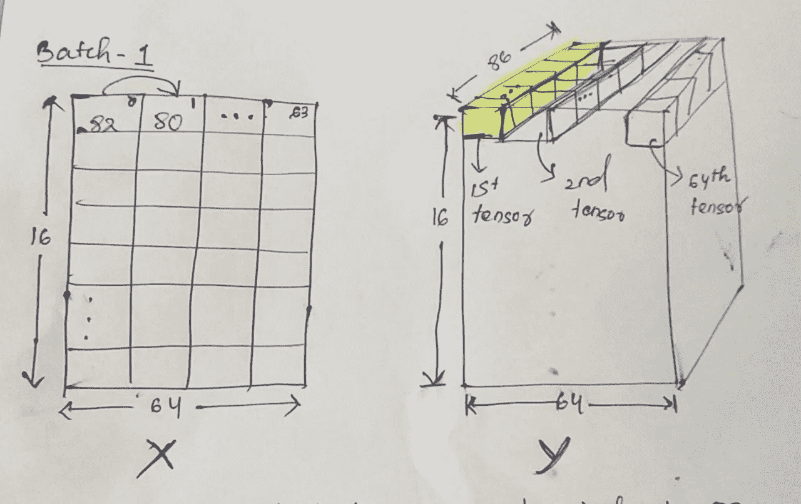

→假设 X 中的索引“0”是字符索引 82。
→所以，我想让我的 Y 预测为 80 作为下一个字符索引号。
→在“Y”中的张量是一个热编码，被认为是分类的一部分。
→X 的索引 0 处的字符索引 82 被送入 RNN，这给我们一个热编码向量，80 为“1”。如我们所知，我们已经给每个角色分配了索引。
→实际上，批次将包含相应字符的索引。

*   我试图每次使用名为“read_batches”的函数生成新的批处理。
    →一个批次包含 16 行(BATCH_SIZE)和 64 列(SEQUENCE_LENGTH)，使得一个批次中总共有(16*64) 1024 个字符，类似地，一个时期总共有 126 个批次。
    → *为什么我们不简单地在 batch_1 中使用前 1024 个字符，在 batch_2 中使用后 1024 个字符，以此类推，直到 batch_126？*
    它是序列数据，所以如果我们组合两个序列，就意味着我们给出了错误的数据。所以我们必须给一批中的所有序列以不同的方式。
    →假设序列长度为 64，批次大小为 16，我们需要构建 126 个批次，在第一个批次中，我们输入前 63 个字符，在第二个批次中，我们从第 64 个字符开始继续输入，以此类推，以保持序列不变。

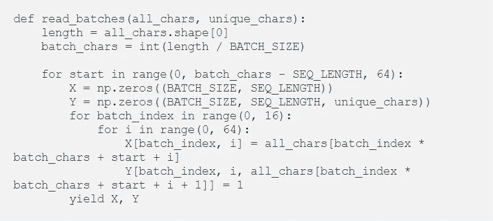

*The above code snippet is a function to create batches. Here, there are three nested loops. The first loop denotes the batch number. It runs every time when a new batch is created. The second loop denotes a row in a batch and the third loop denotes a column in a batch.*

# 多对多 RNN

*   在隐藏层中，我们可以有多个 lstm 用于生产目的，而不是单个 lstm。实际上，我们可以进行如下图所示的设置。

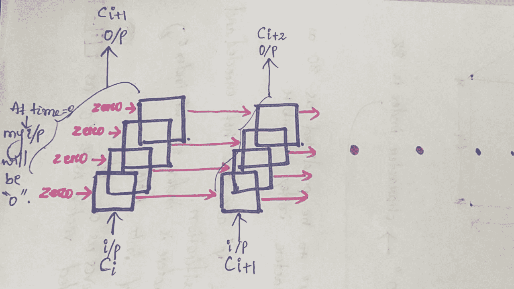

→假设，我们在隐藏层中有四个 lstms。
→我在时间“t”在输入层有一个输入“Ci”。
→现在，所有四个 lstms 将一起为我生成一个输出，理想情况下应该是“Ci+1”字符。
→第一个时间步的输出会转到下一个时间步，我的输入是“Ci+1”。
→又来了，会有四个 lstms 一起给我输出“Ci+2”。
→这个过程将继续下去。每个 lstm 单元将学习我们性格的不同方面。

*   为了能够构建这样的网络，我们需要了解返回序列和时间分布密集层。

```
def build_model(batch_size, seq_len, vocab_size):
    model = Sequential()
    model.add(Embedding(vocab_size, 512, batch_input_shape (batch_size, seq_len))) for i in range(3):
        model.add(LSTM(256, return_sequences=True, stateful=True))
        # It creates 256 lstms layers in hiden layers
        model.add(Dropout(0.2)) model.add(TimeDistributed(Dense(vocab_size))) 
    model.add(Activation('softmax'))
    return model
```

*   **返回序列:**

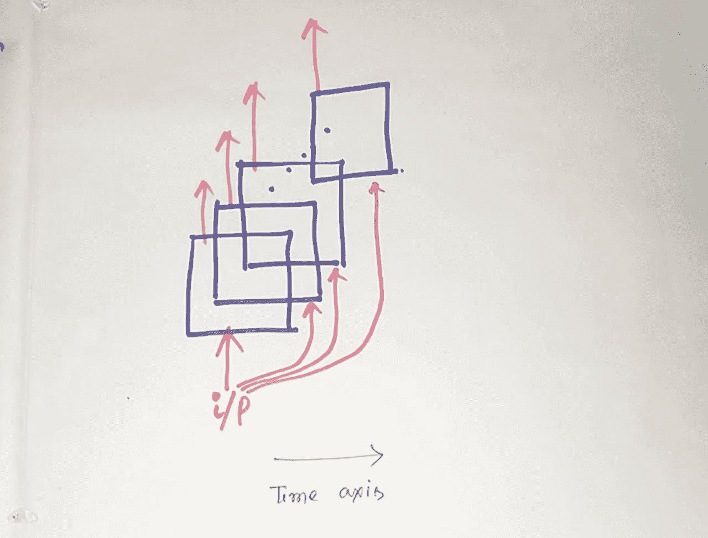

→对于每个时间步，我们给出一个输入，我们想要一个输出→这里你可以有 ***return-sequence = True。这就是我们想要的。*** *→* 对于每一个时间步，我们不断给输入，到最后，只有消耗完整个序列，它才给我们输出→这里可以有 ***return_sequence = False。***

*   **时间分布密集层:
    →** 我们的数据集中有 87 个独特的字符，我们希望每个时间戳的输出将是序列中 87 个字符之一的下一个字符。
    →时间分布密集层包含 87 个“Softmax”激活，它在每个时间戳创建一个密集连接。
    →最后，它将在每个时间戳生成 87 维输出，相当于 87 个概率值。它帮助我们保持多对多的关系。

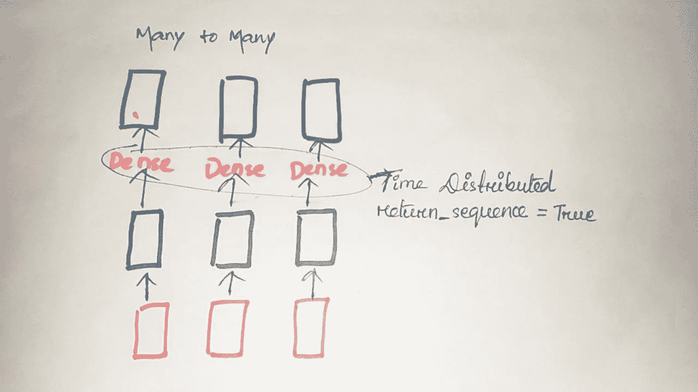

*   **有状态 RNN:
    -** 这与批处理操作模式有关。
    ——这里我们给出了“ **stateful = True** ”。
    -如果**为真**，那么一批中索引为‘I’的每一批的最后状态将被用作下一批中索引为‘I’的样本的初始状态。
    -这是因为所有批次都包含连续的行，我们的模型将学习更多更长的序列。
    -默认值为 stateful = False

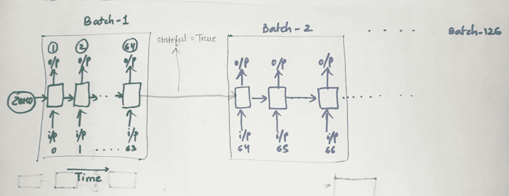

# 模型架构和培训

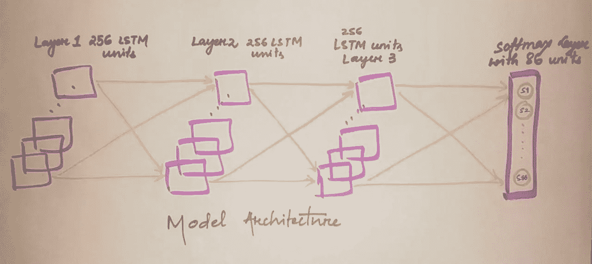

Model Architecture

```
def built_model(batch_size, seq_length, unique_chars):
 model = Sequential()

 model.add(Embedding(input_dim = unique_chars, output_dim = 512, batch_input_shape = (batch_size, seq_length))) 

 model.add(LSTM(256, return_sequences = True, stateful = True))
 model.add(Dropout(0.2))

 model.add(LSTM(256, return_sequences = True, stateful = True))
 model.add(Dropout(0.2))

 model.add(LSTM(256, return_sequences = True, stateful = True))
 model.add(Dropout(0.2))

 model.add(TimeDistributed(Dense(unique_chars)))
 model.add(Activation(“softmax”))

 return model
```

*   x 是(批量大小，SEQ 长度)= (16，64)的矩阵
*   y 是(批量大小，SEQ 长度，语音大小)= (16，64，86)的 3D 张量。考虑 vocab 大小是因为一位热码编码。
*   嵌入后，(巴克思大小，SEQ 长度，嵌入尺寸)= (16，64，512)
*   我们将“Y”编码为一个热编码，因为我们将在它上面应用 softmax。
*   现在，我们想预测下一个字符，它应该是 86 个唯一字符中的一个。所以，这是一个多类分类问题。因此，我们的最后一层是 86 个激活的 softmax 层。
*   因此，我将生成我的每一批并训练它们。对于每个训练时期，我将打印分类交叉熵损失和准确性。
*   下面是我的模型总结。所以，我总共有 1，904，214 个参数。

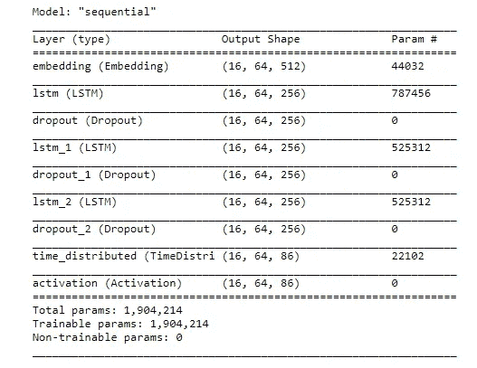

*   因为我们有如此多的参数，所以我们使用保持概率为 0.2 的退出。
*   当我们在训练中达到 100 个纪元时，大约 90%以上的时候，模型能够预测下一个字符是什么。所以，我们的模型做得很好。
*   在 10 个时期结束时，我们存储模型的权重。我们将使用这些权重来重建模型和预测。

# 音乐一代

*   现在我们已经有了训练好的模型，并且找到了我们的最佳权重。让我们看看我们将如何创造新的音乐。
*   我们的模型可以预测。
*   为了进行预测，我们将 87 个唯一字符中的任何一个作为我们模型的输入，它将通过 softmax 层生成 87 个概率值。从这些返回的 87 个概率值中，我们将概率性地选择下一个字符，最后，我们将再次将选择的字符反馈给模型，依此类推。
*   我们将继续连接输出字符，并生成所需长度的音乐。典型的数字在 300-600 之间。太小的数字几乎不会产生任何序列。
*   当我们试图使用较小时期的权重来预测音乐时，我们会出错。

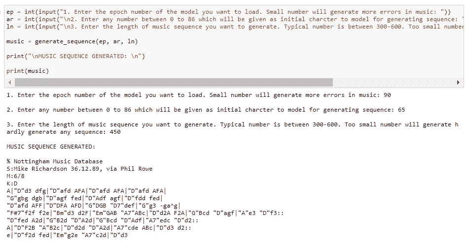

*   打开以下链接，将您生成的音乐粘贴到给定的空间，以便播放。

 [## abcjs 编辑器

### abcjs 是一个开源的 javascript 渲染引擎，用于解释 abc 格式的曲调。它将呈现活页乐谱…

www.abcjs.net](https://www.abcjs.net/abcjs-editor.html) 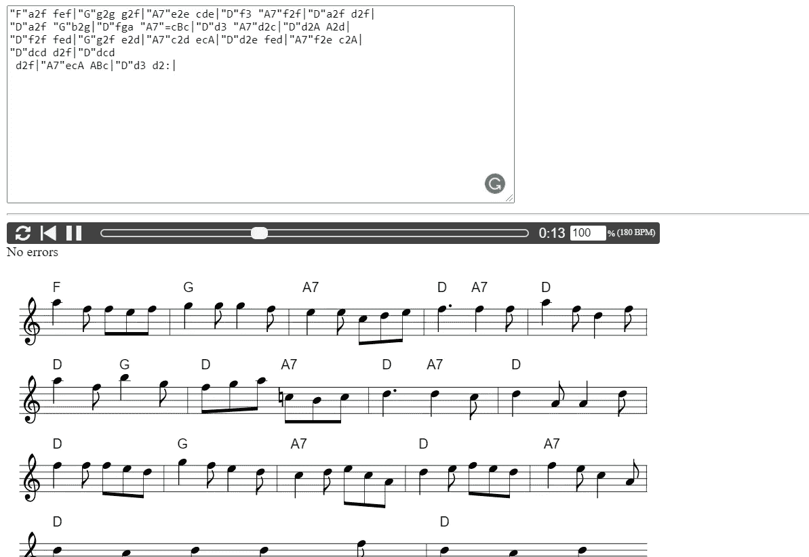

*   我用时代= 10 的 weights.10.h5 模型和时代= 100 的 weights.100.h5 模型生成音乐。

上面的音乐序列是我从模型中生成的一些例子。

# 生成 Tabla 音乐

您也可以使用夏尔-RNN 模型来生成 tabla 音乐。为了更好地理解，请参考这些博客。

[](https://www.trivedigaurav.com/blog/machines-learn-to-play-tabla/) [## 机器学习演奏塔布拉

### 更新:这篇文章现在有第二部分。如果你关注新闻中的机器学习话题，我相信现在你已经…

www.trivedigaurav.com](https://www.trivedigaurav.com/blog/machines-learn-to-play-tabla/)  [## 机器学习玩塔布拉，第 2 部分

### 这是我之前关于机器学习玩塔布拉的后续文章。你可能希望它先看看这个…

www.trivedigaurav.com](https://www.trivedigaurav.com/blog/machines-learn-to-play-tabla-part-2/) 

# MIDI 音乐一代

这里，Music21 库用于读取 MIDI 文件并将其转换为事件序列。你可以通过下面的博客更好地了解。

[](https://towardsdatascience.com/how-to-generate-music-using-a-lstm-neural-network-in-keras-68786834d4c5) [## 如何在 Keras 中使用 LSTM 神经网络生成音乐

### 使用 LSTM 神经网络创作音乐的介绍

towardsdatascience.com](https://towardsdatascience.com/how-to-generate-music-using-a-lstm-neural-network-in-keras-68786834d4c5) [](https://github.com/Skuldur/Classical-Piano-Composer) [## 斯库尔杜尔/古典钢琴作曲家

### 这个项目允许你训练一个神经网络来生成 midi 音乐文件，利用单个乐器…

github.com](https://github.com/Skuldur/Classical-Piano-Composer) 

# 进一步的范围

嗯，我们得到了相当好的结果，但我们可以通过用多种乐器的更多曲调来训练它，从而改进我们的模型。

在这里，我只用 350 首曲子训练我的模型。因此，我们可以将我们的模型暴露给更多的乐器和各种音乐曲调，这将导致更悠扬的各种曲调。我们可以添加一个方法，通过过滤未知音符，用已知音符替换，来处理音乐中的未知音符。

截至目前，我的模型是在单个乐器上训练的，所以生成的音乐只是一个乐器的。通过添加上述方法，并在增加类别数量的同时在大量数据上训练模型，我们可以生成更强健的质量和更悠扬的音乐。

# 此项目的代码链接

[https://github.com/Swetadas-1718/Music-Generation](https://github.com/Swetadas-1718/Music-Generation)