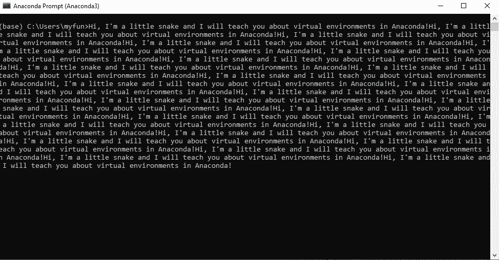

# 速成班:Anaconda 中的必备——虚拟环境

> 原文：<https://medium.com/mlearning-ai/must-have-in-anaconda-virtual-environments-d44754c7a342?source=collection_archive---------7----------------------->

Hi, I’m a little snake and I will teach you about Virtual Environments in Anaconda :D

如果你把每个项目的所有包都放在一个地方，那么 ython 可能是一个非常脏的地方。在一个包的基础上安装另一个包，然后因为依赖关系而破坏其他包，这是非常令人沮丧的。它还会破坏您的 python 或 Anaconda 安装。

在这篇文章中，我将向你展示如何干净利落地工作，没有任何破裂的危险…