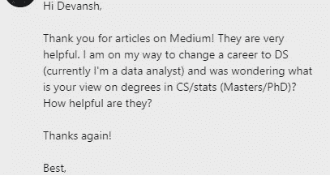
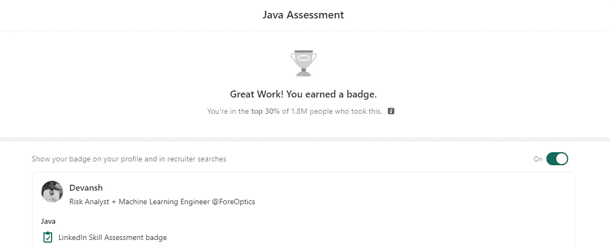
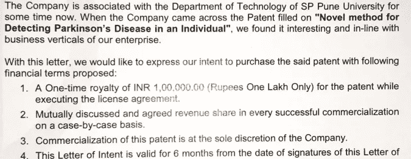
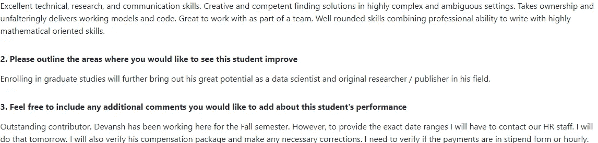
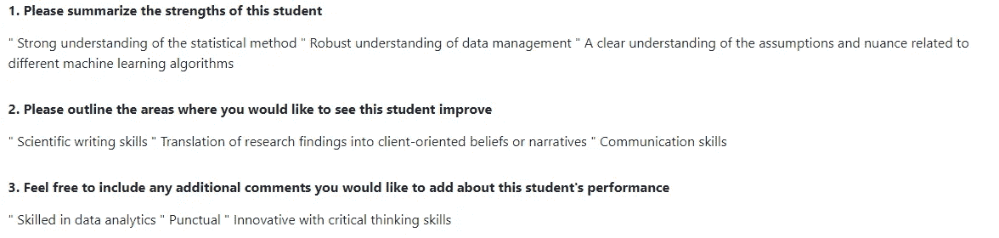
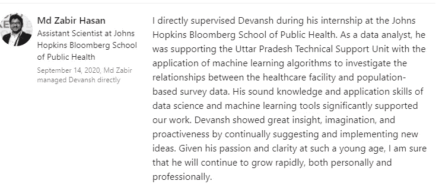
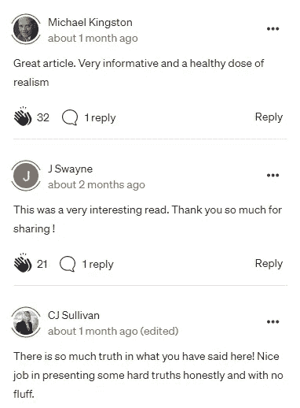

# 我 5 年的机器学习之旅

> 原文：<https://medium.com/mlearning-ai/my-5-year-machine-learning-journey-527949d94430?source=collection_archive---------1----------------------->

## 我去过哪里，我在哪里，我要去哪里。

为了帮助我了解您[请填写此调查(匿名)](https://forms.gle/7MfQmKhEhyBTMDUD7)

最近，我的内容浏览量突破了 10 万。我已经写了大约一年了(这个夏天，我真正学会了连贯性)。我从没想过会有如此高的收视率，或者我的作品会得到如此积极的评价。因此，这让我很惊讶。这让我想起了我的人工智能/人工智能/技术之旅。为了庆祝这个时刻，我想我应该写一些更私人的东西。我决定写下迄今为止我旅程的多个阶段。

Messages like these are getting quite common. The answer is that it depends.

我已经有很多人向我咨询他们的情况，询问我关于从不同部门过渡到这些领域的建议。我也和很多想进入这个领域的学生谈过。通过详细描述我走到今天的步骤，以及我学到的东西，希望人们能够从我的经历中学习。我的道路不同寻常。这不是现在推荐的通常的“获得硕士/证书以获得 ML 的入门级职位并逐步上升”的故事。我不反对这种方法，但不是每个人都有能力或愿望去走这条路。我的方式是一个有趣的选择

# 第一阶段:介绍(2016 年 6 月-2017 年 3 月)

我第一次真正接触人工智能是通过与技术学院院长 Aditya Abhyankar 博士一起工作。我妈妈把他介绍给了我哥哥，他在他的实验室工作过，收获颇丰。所以他愿意和我一起工作。他让我协助一个团队开发智能系统。我的角色是协助调试、记录和测试我们编写的机器人。除此之外，我偶尔还会帮助编写某些协议的实现。在这一点上，我已经修补了一些 Gridworld 项目和机器人，但没有在这个规模上。我学到了很多。从这次经历中我学到的最有价值的东西就是简单地了解了我们需要考虑多少小因素，以及评估不同步骤的进展有多重要。

This phase was the reason I was able to do well on the LinkedIn Java assessment even though I’ve barely used it in the last 5 years.

这个阶段我用的是 Java。这是我在学校学过的语言，幸运的是，它和我被分配的任务是兼容的。因为我还是新人，和我一起工作的人会给我很多帮助。我能够学到很多关于编程和解决问题的知识。

到最后，我已经相当熟练地完成了我的任务。我会和不同的团队一起工作，帮助他们完成测试、日志记录和报告生成方面的任务。我变得相当擅长自动化管道。

# 第二阶段:真正的 2017 年 9 月-2018 年 1 月)

我暂时离开 Abhyankar 博士，在 Anant Computing 的 Phani Bhushan 手下实习。他向我介绍了行业中的软件开发实践。这是一次非常有趣的经历，它教会了我如何编写好的代码，并向我展示了如何在项目中合作。大约在这个时候，我也开始涉足竞争性编程。

在一次黑客马拉松之前，我偶然看到了一个关于使用机器学习检测帕金森病的 Ted 演讲。该项目由苹果公司资助，他们已经达到了 99%的准确率。演讲者在网上发布了一小部分数据集。我决定我会试着玩这个。我为黑客马拉松做了些东西，但不幸的是，我的团队失败了。

Part of the commercialization paperwork. My LinkedIn has the link to the full thing.

但是我不断尝试不同的优化和技术。最终，我有了一个非常可靠的概念证明，并与 Abhyanker 博士分享。他很感兴趣，我们努力使研究正式化。最后，我们得到了一个低成本的算法，对噪声有很强的鲁棒性。该算法于 2018 年获得专利。一家公司在 2019 年向其发放了版权许可。

这绝对是一个游戏规则的改变。我真的开始进入机器学习，学会了 Python。这项专利也是我用来开始对话和引起潜在客户兴趣的工具。

# 第三阶段:自由职业者(2018 年 6 月-2020 年 3 月)

以专利和实习为起点，我开始到处做自由职业者。我有编码、Android 开发和 AI/ML 方面的经验。我会在各种项目中与不同的人一起工作。这不是全职的，但它让我开始接触不同领域的技术应用。我已经变得相对擅长学习不同的技术，并在工作中获得技能。这在我从事涉及 Python、Java、JS (+ HTML/CSS)、Kotlin 和 c 的项目时帮助很大。

Coop Feedback to my University from my Boss at ForeOptics (2021)

这个时期对我来说没有多少“显著”的成就。但它确实帮助我获得了很多经验，让我接触到了很多想法和挑战。这让我获得了创造力，学会了在事情不明显的情况下想出解决方案。这项技能对我的成长帮助很大。我的许多经理都称赞我有创新能力提出解决方案(如上图)。我相信这源于我在这个阶段的学习。

Feedback for a Coop I participated in at 2020

这个阶段也让我接触到了很多科技背后的假设和想法。这有助于我深入了解不同的协议和标准操作程序。例如，在这个视频中，[我回顾了强化学习，以及什么时候你可能需要使用它](https://www.youtube.com/watch?v=_J1Xn8fgUAc&t=21s)。

# 第四阶段:硬核大联盟(2020 年 6 月至今)

2020 年 6 月，我在约翰·霍普金斯大学工作。这是迄今为止我做过的最难的项目。我们正在分析一个州政府的卫生系统，以评估不同政府政策的影响。有 200 多个特征，大量丢失的数据和大量的噪音。这是一项艰苦的工作，但我们最终还是做了一些非常好的工作。

这段经历教会了我很多东西。我被迫阅读多种技术，翻阅论文和文档，并测试了许多想法。我开始在媒体上写作(并创造内容)是我在这里工作的直接结果。

这也是我简历上的一大亮点。在我的简历上写下这一点让我可以在很多地方找到工作，包括 ICICI 银行、埃默里大学(我差点就去那里工作了)和 ForeOptics(我在那里工作)。每一次经历都进一步丰富了我的成长，教会了我一些有趣的东西。我的工作大部分是用 Python 写的，目前它是我的首选语言。

# 那么，下一步是什么？

Some feedback from one of my articles

有很多令人兴奋的事情在进行中。我的工作经历和内容已经开始吸引人们的大量关注。我已经达到了这样一种境界，在接近面试的时候，我可以非常自信。我接触的多样性、我的学习能力以及我的良好记录使我能够以优势地位与人谈判。

我在 ForeOptics 的工作将于 12 月结束。我正在考虑几个提议，以决定下一步去哪里(如果你想和我一起工作，请联系我)。同时，我会继续学习 ML。通过我的内容和工作经验，我已经能够建立一个由研究人员、工人和其他感兴趣的团体组成的有趣的网络。通过它们，我可以看到有趣的论文，了解不同的领域，并了解该领域的最新动态。像这样的领域需要不断的进化，我真的很享受这个过程。

希望到目前为止，你能够从我的道路中学到东西。涉足多个领域有点不寻常。然而，这也帮助我学会了如何学习，这真的帮助了我。而且我会继续坚持学习。

如果你喜欢这篇文章，看看我的其他内容。我定期在 Medium、YouTube、Twitter 和 Substack 上发帖(所有链接都在下面)。我专注于人工智能、机器学习、技术和软件开发。如果你正在准备编码面试，请查看:[编码面试变得简单](https://codinginterviewsmadesimple.substack.com/)。

为一次性支持我的工作，以下是我的 Venmo 和 Paypal。任何数额都值得赞赏，并有很大帮助:

https://account.venmo.com/u/FNU-Devansh

贝宝:[paypal.me/ISeeThings](https://www.paypal.com/paypalme/ISeeThings)

# 向我伸出手

如果那篇文章让你对联系我感兴趣，那么这一部分就是为你准备的。你可以在任何平台上联系我，或者查看我的其他内容。如果你想讨论家教，发短信给我。如果你想支持我的工作，使用我的免费罗宾汉推荐链接。我们都有免费的股票，对你没有风险。**所以不使用它只是失去免费的钱。**

查看我在 Medium 上的其他文章。:【https://rb.gy/zn1aiu 

我的 YouTube:[https://rb.gy/88iwdd](https://rb.gy/88iwdd)

在 LinkedIn 上联系我。我们来连线:[https://rb.gy/m5ok2y](https://rb.gy/f7ltuj)

我的 insta gram:[https://rb.gy/gmvuy9](https://rb.gy/gmvuy9)

我的推特:[https://twitter.com/Machine01776819](https://twitter.com/Machine01776819)

我的子任务:[https://codinginterviewsmadesimple.substack.com/](https://codinginterviewsmadesimple.substack.com/)

获得罗宾汉的免费股票:[https://join.robinhood.com/fnud75](https://www.youtube.com/redirect?redir_token=QUFFLUhqa0xDdC1jTW9nSU91WXlCSFhEVkJ0emJvN1FaUXxBQ3Jtc0ttWkRObUdfem1DZzIyZElfcXVZNGlVNE1xSUc4aVhSVkxBVGtHMWpmei1lWWVKNzlDUXVJR24ydHBtWG1PSXNaMlBMWDQycnlIVXNMYjJZWjdXcHNZQWNnaFBnQUhCV2dNVERQajFLTTVNMV9NVnA3UQ%3D%3D&q=https%3A%2F%2Fjoin.robinhood.com%2Ffnud75&v=WAYRtSj0ces&event=video_description)

 [## Mlearning.ai 提交建议

### 如何成为 Mlearning.ai 上的作家

medium.com](/mlearning-ai/mlearning-ai-submission-suggestions-b51e2b130bfb)