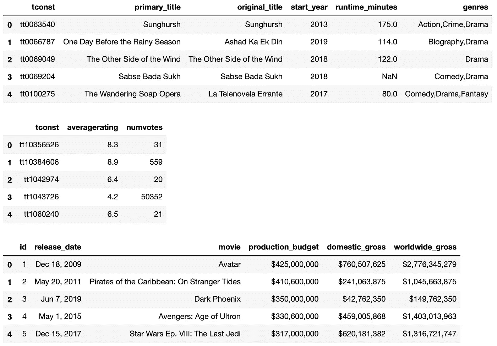
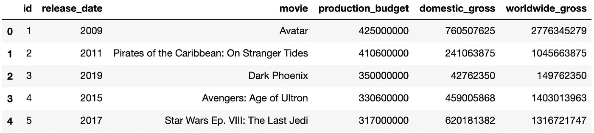

# 警告:数据清理正在进行中！

> 原文：<https://medium.com/mlearning-ai/my-approach-to-data-cleansing-17525dd4eaf8?source=collection_archive---------3----------------------->


Photo by [Oliver Hale](https://unsplash.com/@4themorningshoot?utm_source=medium&utm_medium=referral) on [Unsplash](https://unsplash.com?utm_source=medium&utm_medium=referral)

最近，我面临着成为数据科学家的第一步的挑战，即完成电影数据库的分析。我的项目的目标是提供可操作的见解，这些见解基于哪些因素对成功的电影有很好的记录。在我最后的 Jupyter 笔记本中，你可以随意跟随所有的代码和深入的分析。

一想到要应用我新发现的 Python 知识来执行复杂的分析并从我的数据集得出非常有见地的结论，我就兴奋不已，迫不及待地开始工作。然而，我很快了解到，到目前为止，分析过程中最耗时和最重要的部分是清理数据。

经过几天的反复奔跑”。head()”在提供给我的数据表上，我发现除了简单地处理 NaN 值和对重复项进行高级检查之外，还有更多需要注意的地方。

# 规划方法

我关注的第一件事是确定我需要保存包含关于流派、平均收视率、制作预算和国内总收入信息的表格。我认为这些栏目包含了与电影成功背后的原因和关键绩效指标最相关的信息。下面是我在分析中选择使用的表格的预览:

```
# Load and preview data files for ratings and revenue.imdb_title_basics_df = \
        pd.read_csv('zippedData/imdb.title.basics.csv.gz')
imdb_title_ratings_df = \
        pd.read_csv('zippedData/imdb.title.ratings.csv.gz')
budgets_df = pd.read_csv('zippedData/tn.movie_budgets.csv.gz')display(imdb_title_basics_df.head(), \
        imdb_title_ratings_df.head(), \
        budgets_df.head())
```



A preview of tables used in my analysis of successful movie titles

现在，因为我的相关数据分散在多个表中，所以我需要找出一种方法来有效地将这些表连接在一起，以创建一个巨大的数据集，该数据集包含所有与其各自的电影标题正确匹配的相关数据。如果我只根据电影名称来连接我的表，我将冒着将数据合并到多个电影上的风险，这些电影与其他电影具有相同的名称，但实际上是不同的电影。

[IMDB](https://www.imdb.com/) 是我的两个数据库之一，最方便的是，它提供了电影标题和一个标记为“tconst”的索引代码列，这使我可以合并来自多个数据集的电影数据，而不必担心合并两部同名电影的数据。

但是在来自[的数据表](https://www.the-numbers.com/)中，没有“tconst”索引列，我可以用它来一致而准确地合并我的数据。我必须处理的数据是发行日期，我可以用它和电影标题结合起来，在我的两个数据库的表之间进行合并。我做出这个决定的逻辑是，在同一年上映两部同名电影的可能性非常小。

因为发布日期在我的 IMDB 数据库中存储为整数年，但在我的 TN 数据库中存储为字符串对象，所以我使用以下代码来确保只存储发布年份，而不是完整日期:

```
# Convert release date to remove day and month
# and show only the year as int type.budgets_df['release_date'] = \
        budgets_df['release_date'].str[-4:].astype(int)
```

接下来，我格式化了 TN 表中的美元金额，删除了美元符号和逗号，并通过运行以下代码将其转换为整数类型:

```
# Remove commas from dollar amounts.budgets_df['production_budget'] = budgets_df['production_budget'] \
                                 .replace(',', '', regex = True)
budgets_df['domestic_gross'] = budgets_df['domestic_gross'] \
                              .replace(',', '', regex = True)
budgets_df['worldwide_gross'] = budgets_df['worldwide_gross'] \
                               .replace(',', '', regex = True)# Remove $ sign and convert to int type.budgets_df['production_budget'] = budgets_df['production_budget'] \
                                 .str[1:].astype(int)
budgets_df['domestic_gross'] = budgets_df['domestic_gross'] \
                              .str[1:].astype(int)
budgets_df['worldwide_gross'] = \
        budgets_df['worldwide_gross'].str[1:].astype(int)
```

通过将美元金额格式化为整数值，我已经成功地准备好了该表中的数据，如下所示，这些数据将与我的 IMDB 表合并，并绘制成图表:



Fully formatted TN table ready to be merged

很可能需要处理任何数据集中的重复数据，但考虑这些重复数据是否是数据收集过程中不准确的结果，或者它们是否应被视为有效的独立条目，就像具有重复电影标题的情况一样，这一点非常重要。未能过滤掉重复数据会导致数据集不正确地倾斜，但相反，在不正确的假设下过滤掉重复数据会很容易导致丢失实际相关的数据的问题。

# 合并

既然我已经清理并准备好了我的财务数据，那么是时候将这些数据合并到我已经从 IMDB 表中合并到一起的电影类型和评级数据中了。我必须记住的重要一点是，我不希望我的最终数据集中的电影缺少财务数据或评级和类型数据。所有这三个部分对我的分析都至关重要，任何没有这三个中任何一个的电影片名都需要被丢弃。解决这个问题最简单的方法是在我的 TN 和 IMDB 表之间进行内部连接，如下所示:

```
# Join financial data from tn_movie_budgets with title and rating 
# date from imdb_df.merged_df = budgets_df.merge(imdb_df, how='inner', \
                         left_on=['movie', 'release_date'], \
                         right_on=['original_title', 'start_year'])
```

# 最后的润色…

现在，剩下的就是将我的数据限制在一个相关的年数内，并设计任何对我的最终分析有用的特征。为了确保我的数据中不包括更老和过时的电影，我切掉了 2015 年至 2019 年之间上映的电影的数据。这背后的想法是，我不想包括整整十年的电影，因为社会趋势在这段时间内已经发生了变化。我之所以选择忽略 2020 年的数据，是因为全国范围内新冠肺炎关闭对电影业的影响有多严重。

然而，值得注意的是，我的决定是基于这样的假设，即超过 5 年的趋势可能会改变。理想情况下，我会通过确定 2010 年至 2014 年发行的电影与 2015 年至 2019 年发行的电影之间是否存在统计上的显著差异来证明这一点，但这超出了这个项目的范围。

这是我的数据清理过程结束的地方，因为我已经构建了一个包含与我的最终分析相关的列的最终数据表，并且已经被过滤掉了那些会干扰绘制数据点的丢失数据的条目。在使用我的数据创建多个情节之前，我的最后一步是设计一个功能，通过使用以下公式来指示每部电影的利润百分比:

*(国内生产总值预算)/生产预算*

这是一个很容易实现的特性，因为我所有的财务数据都来自一个来源，所以我不必太担心数据的不准确性。然而，由于不同的电影可以有相同的标题，我看到了合并是多么重要；没有准确的数据，任何工程特征都将毫无意义。

# 结论

当谈到数据清理时，没有适用于所有情况的直接方法，特别是考虑到在一个越来越重视技术空间的世界中，数据收集和构造成数据集的方式有很多。上面概述的过程与我的具体项目相关，但是在不同的环境中，必要的步骤必然会与我自己的大不相同。

然而，我可以肯定地说，在进入正式的清理过程之前，花大量时间摆弄数据确实对可视化和规划方法有很大的帮助，正如我想象的那样，这将是我未来所有数据科学项目的情况。

我花了大约 80%的时间来计划我的方法和清理数据，但是如果不在清理过程中投入这么多精力，我知道我基本上已经创建了一个无意义的分析。

与绘制和定制我的图形分析相比，清理过程确实感觉乏味，但通过我的第一个数据科学项目，我学到了宝贵的一课，即数据清理可以被视为整个分析中最重要的部分..