# 我的 DA 之旅— SQL 项目

> 原文：<https://medium.com/mlearning-ai/my-da-journey-sql-project-ee5e0c1cb416?source=collection_archive---------3----------------------->

我喜欢玩数据。它满足了好奇心——为什么？怎么会？真的吗？现实并没有被设定，直到它的边界被数据分析确定，即使那样，它也没有结束。

我曾在另一个环境中主要使用 JMP 进行数据分析，但迄今为止，我还没有使用 SQL 和编程等技术技能处理过数据。这篇博客文章和后面的文章将记录我作为数据分析师实习生进入数据世界的旅程。

到目前为止，我在培训中已经完成了 3 个项目，我将在这里分享最新的一个，题为“当代音乐中的歌词及其影响”。该任务包括数据清理、在 SSMS 和 Excel 上使用 SQL 进行分析，以及提交分析结果。

**目标和范围:**

我的项目的目标是研究英国当代音乐的歌词在 1960 年至 2019 年期间在使用积极和消极词汇方面的变化及其影响。正面词汇指的是赞美、崇拜和钦佩的词汇，而负面词汇指的是暗示、攻击、冒犯和贬损的词汇。该分析提取单词，并相应地将歌曲分类为词类——“正面”或“负面”。单词列表如下表所示:

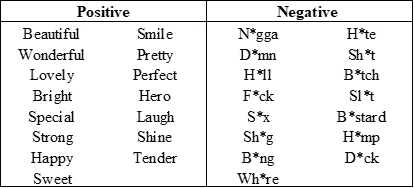

List of Positive and Negative Words To Search For In Lyrics (* is used to replace vowels for publishing purpose. Actual word and its various tenses are used in the SQL queries.)

分析范围包括 Billboard Top 100 歌曲，因为只有当歌曲受欢迎并具有代表性的受众规模时，推导其影响力才有意义。

**数据来源:**

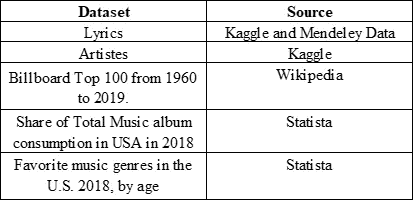

**流程:**

1.  使用 Excel 和 Power Query 完成了数据清理。Excel 已经足够了，但是我发现替换 unicode 字符串的便利性令人无法抗拒。
2.  以相同的结构排列文件。由于这些文件来自不同的源，因此有必要将它们安排在相同的结构中，以便在 SQL 查询中组合它们来获得正确的结果。
3.  运行 SQL 查询对原始数据进行完整性检查，并检查结果是否符合要求。

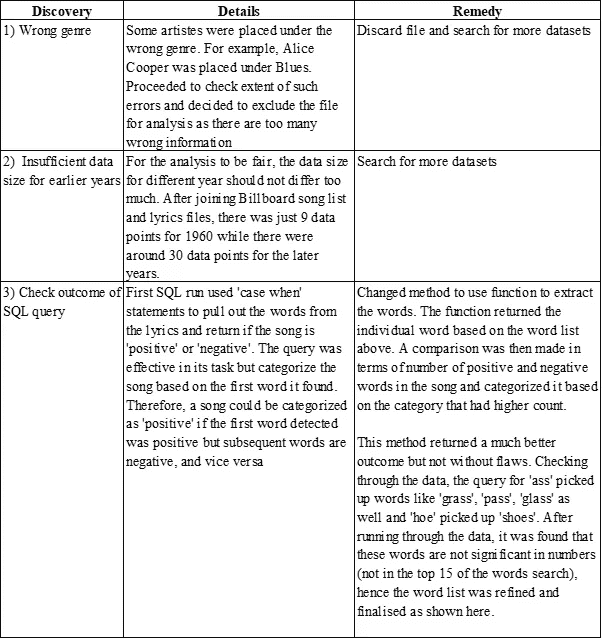

**ERD:**

**分析:**

1.  了解流派是如何随着时间的推移而变化的:

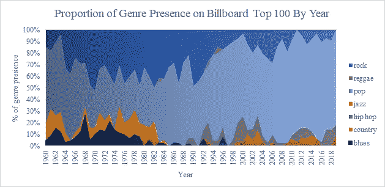

*   在 Billboard Top 100 排行榜上，流行音乐与其他音乐类型的竞争越来越激烈，摇滚音乐位居第二。
*   近年来，在 Billboard 排名前 100 的歌曲中，超过 80 首来自流行音乐，这并不奇怪，因为流行音乐很容易听，并以大众吸引力为卖点。
*   Hip Hop (grey)从 20 世纪 80 年代就加入了 Billboard 舞台，但并不具备与流行和摇滚同等的地位。
*   布鲁斯和爵士乐不再出现在广告牌上，甚至摇滚也减少了。到世纪之交，Billboard 主要是流行、摇滚、嘻哈和乡村音乐。

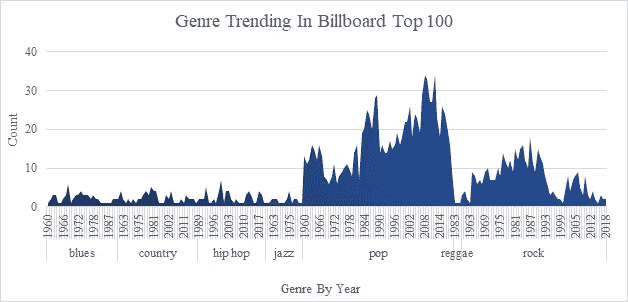

*   上面的图表清楚地显示了 Pop 在 Billboard Top 100 中的比重越来越大。

2.了解词类多年来是如何变化的:

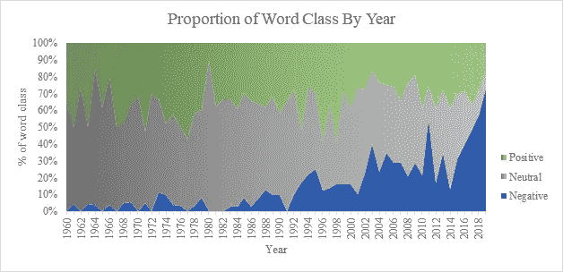

*   词类的定义:

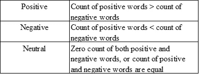

*   负面词类的歌曲比例从 80 年代的不到 10%上升到 2019 年的 70%以上。
*   正面词类的歌曲保持相当一致，而中性词类的歌曲有所减少。
*   2019 年，Billboard Top 100 的 100 首歌曲中，有 70 首歌曲属于负面词类。

3.按体裁理解词类:

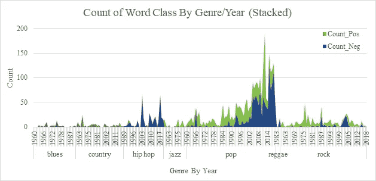

*   按流派划分，流行歌曲中负面词汇越来越多，而正面词汇越来越少。20 世纪 80 年代以前，很少有流行歌曲包含负面词汇。到了 80 年代，更多的歌曲属于负面词类。在世纪之交，负面词类的歌曲比例是正面词类的两倍多。
*   从 20 世纪 80 年代开始出现在广告牌上的嘻哈音乐主要属于负面词类。

4.十大正面词汇:

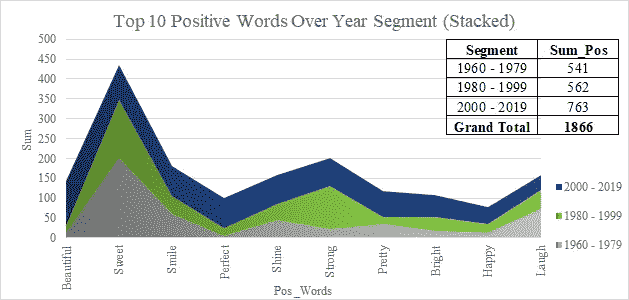

*   该图表分为大约 20 年的 3 个部分，然后按 2000 - 2019 年的最新部分排序。
*   “美丽”是最近一年中最常见的正面词，而“甜蜜”在所有年份中都非常受欢迎。

5.十大负面词汇:

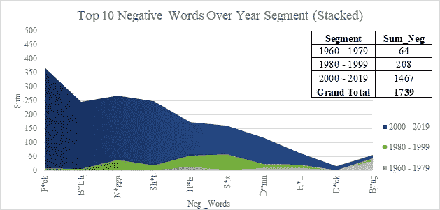

*   不出所料，“F*ck”及其派生词与其他带有种族和女性色彩的贬义词并列第一。
*   从 1980-1999 年到 2000 - 2019 年，负面词汇的总使用量增加了 7 倍。
*   值得一提的是，单词“B*ng”在 1960-1979 年这一年段的上升是由于雪儿在 1966 年创作的一首歌曲“Bang Bang ”(我的宝贝把我打趴下了)。这首歌是一个女孩和一个男孩玩射击游戏的回忆，她爱上了这个男孩，但这段关系没有成功，她觉得自己又被击中了。由于在这首歌中“bang”一词并没有以冒犯的方式使用，人们可以认为这首歌应该从这张图表中删除。然而，这将意味着筛选整个列表，以删除所有带有属性的负面词类歌曲。实际上，这是没有做到的，我们应该认识到，存在一个非常小的误差幅度。由于前 4 个否定词总共占 1467 个词中的 1057 个(72%)，并且这 4 个词不太可能以无害的方式使用，因此这种不准确性被认为非常小，并且相比之下,“B*ng”的计数非常低。

6.顶点-暴露和影响

*   为了研究流行歌曲歌词中使用的负面词增加的影响，创造了一个简单的负面词总数与按流派划分的歌曲总数的比率，称为曝光率。一个更复杂的公式可能被推导出来，然而这项研究的目的是评估负面词汇的总体影响，因此使用了一个简单的比率。

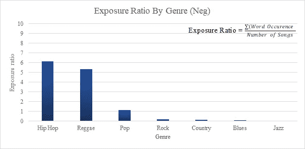

*   嘻哈的曝光率超过 6 意味着每首歌平均有 6 个负面词汇。
*   Hip Hop 每首曲目的负面字数按曝光率计算是 pop 的 6 倍。
*   虽然雷鬼也显示出很高的曝光率，但从早期的图表来看，他们的存在非常小，因此重点仍然是嘻哈和流行音乐。
*   为了理解暴露比率的影响，该比率乘以 scrobbles 的数量。

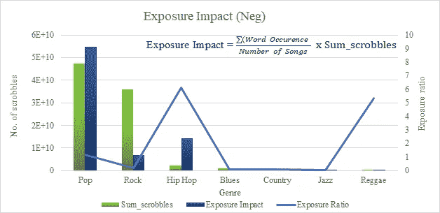

*   Hip Hop 的曝光率如此之高，以至于尽管它的 scrobbbles 数量很低，但它的曝光影响却超过了 scrobbbles 数量高得多的 Rock。

7.与现实相关的

寻找理由接受感官愉悦的东西，这是人的天性。有人可能会争辩说:流行音乐，以 scrobbles 的数量来看是最受欢迎的，平均每首歌只有 1 个负面词汇，而嘻哈音乐，由于它在 Billboard 上的出现率低得多，高曝光率没有任何影响。为了验证这一论点是否成立，我们应该利用我们从上述分析中得到的理解，根据 Billboard Top 100 之外的一般音乐人群来衡量影响。

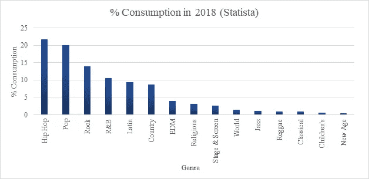

Share of Total Music album consumption in USA in 2018

*   Hip Hop 的消费量最高，尽管它在 Billboard Top 100 中并不占主导地位。这意味着不管站在广告牌上有多受欢迎，嘻哈音乐都被广泛地聆听。
*   根据 Statista (2018)的音乐类型消费细分数据，Hip Hop 的消费百分比最高，为 21.7%，领先于 Pop (20.1%)。因此，消费百分比最高的前两种类型是负面词汇曝光率最高的两种类型。由于高消耗率，暴露影响在横向上也同样高。
*   我们还应该有兴趣通过类型来了解观众:

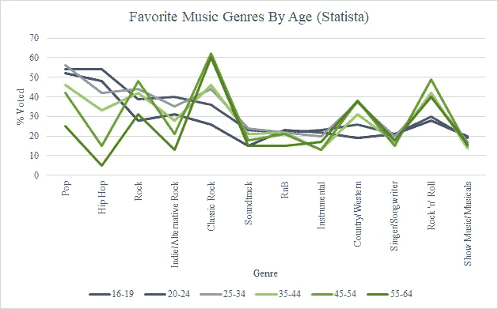

Favorite music genres among consumers in the United States as of July 2018, by age group

*   这是来自 Statista 的调查数据，涉及 3000 多名受访者，其中每个受访者为他/她最喜欢的类型投票，不限于 1。
*   流行音乐和嘻哈音乐最受年轻一代的喜爱。因此，一般来说，年轻一代受到负面词汇的影响最大。
*   观察到的经典摇滚、乡村音乐和摇滚乐的峰值可能与伴随这些流派长大的年龄组有关。
*   虽然不可能根据 Statista 的这两组数据来量化它们的确切影响，但考虑到所有因素——高曝光率、高 scrobbles 数量、高消费、高受欢迎程度和个人偏好——流行音乐和嘻哈音乐对社会的影响范围相当大。

**限制:**

*   scrobbles 的数量来自 Spotify，因为没有来自其他流媒体平台的数据。如果 Spotify 数据的人口统计数据可用，那将会很有趣。这可能会更清楚为什么嘻哈音乐的收入相对较低，但消费却很高。
*   这些数据并不是一个普遍的代表，但它足以公平地认为，在英语是一种普遍使用的语言和英语当代音乐随处可见的国家，这种影响是真实的。
*   可能值得探索不同的单词提取方法，如正则表达式，以比较不同方法的有效性。

**总结:**

*   歌词的趋势是负面词汇的使用急剧增加，主要是“f*ck”、“b*tch”、“n*gga”和“sh*t”。
*   歌词中负面词影响力最大的两个流派 Hip Hop 和 Pop 作为个人最爱的消费率和票数最高，Pop 连续霸占 Billboard Top 100。
*   由于负面词汇通常意味着性暗示和歧视，这种对社会和价值观日益增长的影响值得进行单独的广泛研究。

**以轻松的方式结束项目— SQL Juke Box:**

通常一首歌听几遍后，很自然的会下意识的记住一些歌词。虽然没有人能决定一个艺人如何写一首歌或排除一个完整的流派，但我们也许可以选择我们听什么。因此，我用一个存储过程来结束我的项目演示，以帮助用户根据淫秽程度、可跳舞性和歌曲时代来查找歌曲。

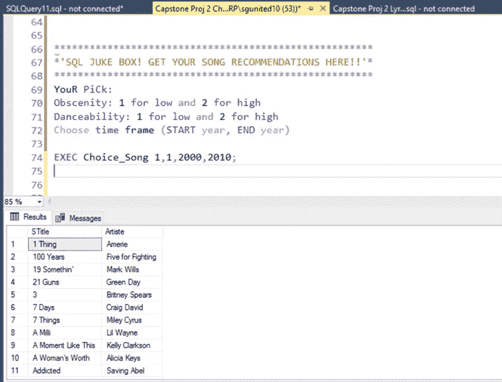

**边注:**

这对我来说是一个有趣的项目。在数据分析方面还有很多东西要学，我很享受每一刻。也许有一天我会用 Python 重新审视这个项目。

我很感激对这个项目的反馈。在 magcheong333@gmail.com 的[或者 linkedin.com/in/magcheong333 的](mailto:magcheong333@gmail.com)或者[联系我](https://www.linkedin.com/in/magcheong333)

谢谢你。