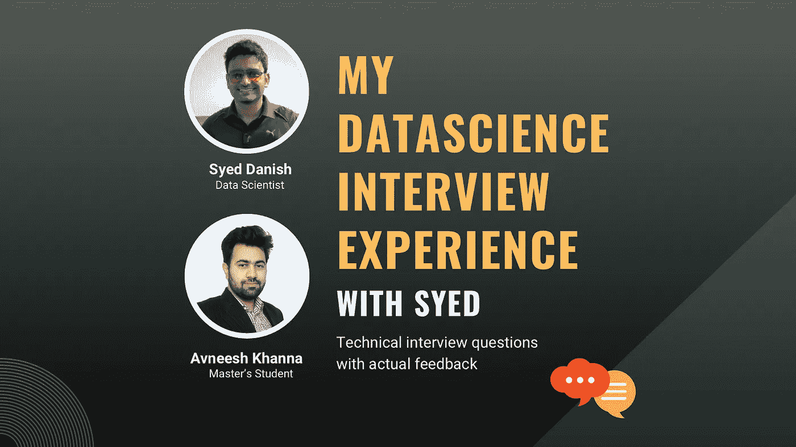

# 我的数据科学面试经历

> 原文：<https://medium.com/mlearning-ai/my-data-science-interview-experience-bccd2555479?source=collection_archive---------0----------------------->

## Syed Danish 的模拟数据科学采访|带答案、反馈和提示的技术问题

我最近参加了一个数据科学家职位的面试。这次面试是一次模拟，但它非常接近地模拟了一次真实的面试——是有时间限制的，并且涉及一个案例研究。它是由 Syed Danish 拍摄的，他是一位经验丰富的数据科学家，专门研究自然语言处理。面试进行得很顺利，我把它分享给了我的几个朋友。但后来我想，为什么只限于我的直系朋友呢？

所以事不宜迟，让我来分享一下面试中的问题和答案。希望这有益于任何想从事机器学习、数据科学或数据分析职业的人。好的一面是这是一个模拟——所以我也可以分享 Syed 对我的回答的反馈。问答当然是转述的。

# 问:你能介绍一下你自己吗？

[我]:当然可以。我正在卡内基梅隆大学攻读信息系统硕士学位，专业是机器学习和数据科学。在此之前，我在经营自己的初创公司，名为“The establishment”。在那里，我负责为公司构建软件基础设施。在此期间，我做了许多基于数据分析和机器学习的项目。例如，我部署了多个数据管道来消费用户交互，以便为我们公司创建的一个社交媒体应用程序构建一个推荐系统。

***【赛义德】*** :不错的介绍。我喜欢你为工作描述量身定做的方式。一些提示:不要把介绍写得太长，因为很多时候招聘人员都有一份清单要检查。你花在介绍上的时间越多，招聘人员评估你各个方面的时间就越少。

# 问:想象一个包含信用卡欺诈检测系统的数据集。你能猜到欺诈案件的百分比是多少吗？

[我]:我没有任何金融领域的背景。但如果我猜的话，可能是 12%？

***【赛义德】*** :猜得不错。我想知道你是否意识到将会有严重的阶级不平衡。

# 问:现在你看到了阶级失衡，你会如何对待它？

[我]:我会尝试获取更多的数据，可能是从性质相似的问题案例中获取。例如:如果我可以访问保险欺诈，SSN 欺诈等数据。，我将尝试从那里挑选数据并扩展我的原始数据集。

***【赛义德】*** :由于这是一个事务数据集，我们很可能无法从外部源添加任何事务。一种常见的方法是欠采样/过采样([链接](https://towardsdatascience.com/oversampling-and-undersampling-5e2bbaf56dcf))。过采样是指从少数类中复制样本，欠采样是指从多数类中减少样本。另一种可以帮助你创建合成样本的方法是 SMOTE 技术([链接](https://machinelearningmastery.com/smote-oversampling-for-imbalanced-classification/))。

# 问:如何在给定的数据集中选择相关要素？

[我]:你能解释一下数据字段是什么吗？

*字段:客户详细信息、位置、交易金额、交易时间戳、交易类型*

[我]:我可以使用的技术也许是 PCA ( [链接](https://programmathically.com/principal-components-analysis-explained-for-dummies/))。这将有助于我们降低数据的维度。

***【Syed】***:正确。我正在寻找的其他技术:递归和基于树的方法。([链接](https://it4agri.com/feature-selection-using-tree-based-method-and-recursive-feature-eliminationrfe/#:~:text=Feature%20selection%20using%20tree%20based%20approaches%20like%20random%20forest%20are,data%20scientists%20prefer%20this%20approach.))

# 问:解释 PCA 背后的直觉？

[我]: PCA 是一种帮助我们选择数据集最佳特征的技术。它通过选择使数据方差最大化的数据维度来做到这一点。我们可以选择那些数据方差高的维度，从而使它们成为新的特征。

***【赛义德】*** :正确

# 问:当你把事务时间加入到你的机器学习模型中时，你会面临什么样的挑战，以及如何克服它们？

[Me]:这是一个文本变量，很难通过模型以 dd/mm/yyyy 格式量化或解释。我们可以将其转换为 Unix，即毫秒时间戳。我要做的另一件事是通过将时间列拆分为月、日、周、年来丰富我的数据，因为对于欺诈检测来说，月、日和/或年可能比一天中的时间更重要。

***【赛义德】*** :正确

# 问:你如何对国家名称进行编码？

[Me]:由于它是一个分类变量，我将使用一个热编码，即一个长度=类别数的向量，其中它在记录它的类别的位置上有 1，否则有 0。

***【Syed】***:正确

# 问:对于像 age 这样的列，你在一键编码中发现了什么问题？

[Me]:从技术上讲，年龄可以是 15 到 95 之间的任何整数，一次性编码是低效的，因为我们将得到许多类。我会在一次性编码之前对数据进行分组。

***【赛义德】*** :正确

# 问:你如何处理缺失值？

【我】:看栏目的重要性。如果该列不重要，我可能会填充默认值。否则，我可能会采用该列的现有平均值，并用这些值填充缺失的单元格。

***【赛义德】*** :逻辑答案。还有一种常见的方法是 k-NN 插补([链接](/@kyawsawhtoon/a-guide-to-knn-imputation-95e2dc496e))，即确定最相似的行簇(使用 k-NN)，然后取它们的平均值来填充缺失值。

# 问:均值和中值有什么不同？

[我]:中位数可能是一个更好的指标，因为它受异常值的影响比平均值小。

***【Syed】***:正确

# 问:你如何处理我们数据中的异常值？

[我]:我们可以检查分布是否正常。如果是这样，我们可以移除超出 2 个标准差的异常值。

***【Syed】***:部分正确。标准差数量的阈值将取决于数据分布以及业务用例。事实上，对于欺诈检测问题，删除异常值可能不是一个好主意，因为欺诈案例可能是异常值/异常。

# 问:梯度下降算法的用途是什么，它是如何工作的？

[Me]:梯度下降是一种迭代算法，在机器学习中用作优化技术。它使用梯度作为达到最优解的指导。我们计算一个函数在当前位置的梯度，向相反方向迈一步，更新我们的参数，重新计算梯度，重复循环。

***【赛义德】*** :正确

# 问:你如何应对过度拟合？

[我]:一个显而易见的方法可能是获取更多的数据，但这可能是一个昂贵的方法。其他方法是使用 L2 正则化([链接](https://towardsdatascience.com/l1-and-l2-regularization-methods-ce25e7fc831c))，对于神经网络，使用退出([链接](https://machinelearningmastery.com/dropout-for-regularizing-deep-neural-networks/))。

***【赛义德】*** :正确。一些其他可能的技术是交叉验证([链接](https://machinelearningmastery.com/k-fold-cross-validation/#:~:text=Cross%2Dvalidation%20is%20a%20resampling,k%2Dfold%20cross%2Dvalidation.))、数据扩充([链接](https://nanonets.com/blog/data-augmentation-how-to-use-deep-learning-when-you-have-limited-data-part-2/))、减少神经网络大小、早期停止。

# 问:可以使用 L2 正则化进行特征选择吗？为什么或为什么不？

[我]:*无法回答*

***【Syed】***:一般不能用 L2。但是，您可以使用 L1 正则化。

# 问:机器学习模型中常用的评估指标是什么？对于我们的信用卡欺诈系统，什么是一个好的衡量标准？

【我】:我们一般用准确度、精密度、召回率([链接](/analytics-vidhya/model-evaluation-metrics-in-machine-learning-928999fb79b2))。对于我们的情况，我们可以使用准确性。

# 问:在这里，准确性是一个好的衡量标准吗？

[我]:嗯，我想没有。因为我们有一个阶级不平衡。我不太记得精确和回忆是如何工作的了。

***【Syed】***:你可以阅读这些指标。它们很重要。

# 问:你对这个角色有什么问题？

[我]:我想我的职责和项目是什么，加入日期是什么时候:)？

***【赛义德】*** :好问题。你可以问的另一件事是关于公司使用的技术堆栈。

[我]:好的。您的团队使用的是什么技术？

***【Syed】***:Python+py torch+AWS

[我]:知道了。谢谢大家！

***【Syed】***:没问题。祝你愉快。

> 注意:这段经历绝不是为这个角色做的全面准备。这只是一篇信息丰富的文章，作为面试准备的指南。此外，Syed 没有以招聘人员的身份工作。他抽出时间通过这次模拟面试提供了他的宝贵见解。

如果你觉得这篇文章有帮助，请在评论中告诉我，尤其是你觉得有用的地方！

 [## Mlearning.ai 提交建议

### 如何成为 Mlearning.ai 上的作家

medium.com](/mlearning-ai/mlearning-ai-submission-suggestions-b51e2b130bfb)