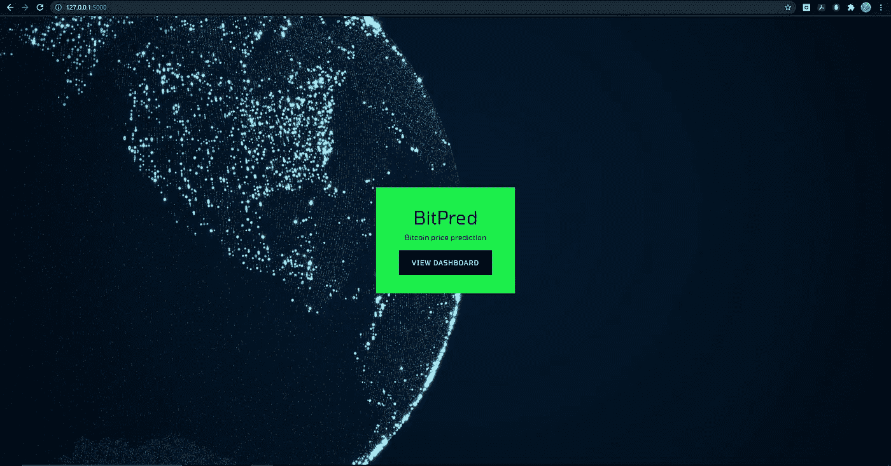
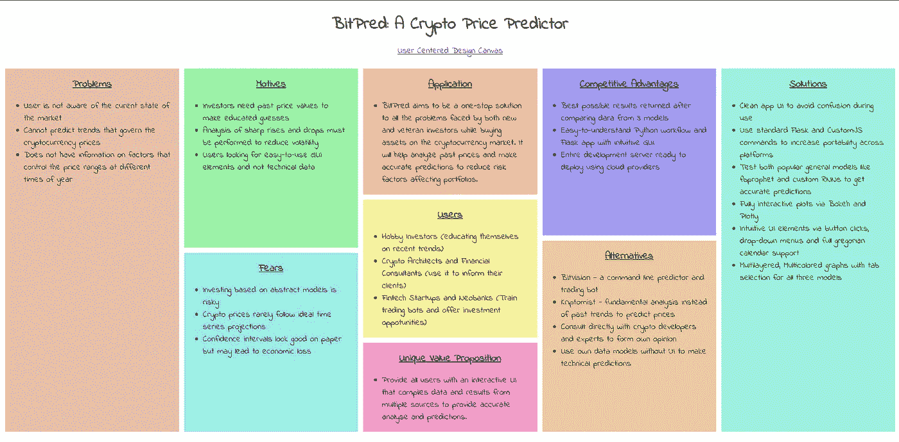
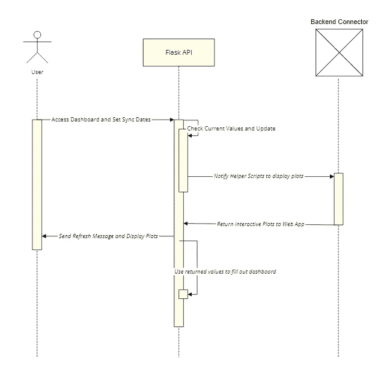
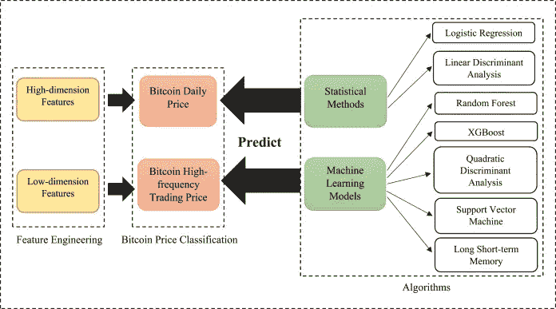
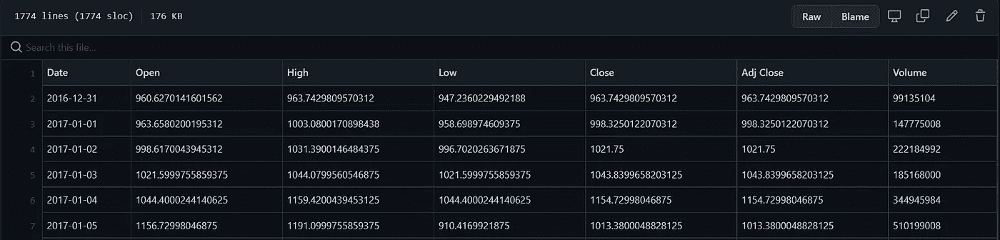
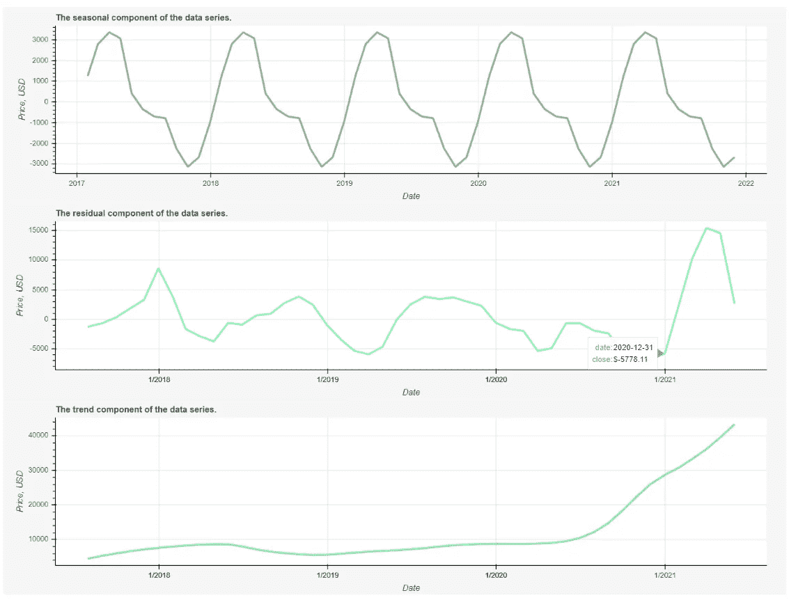
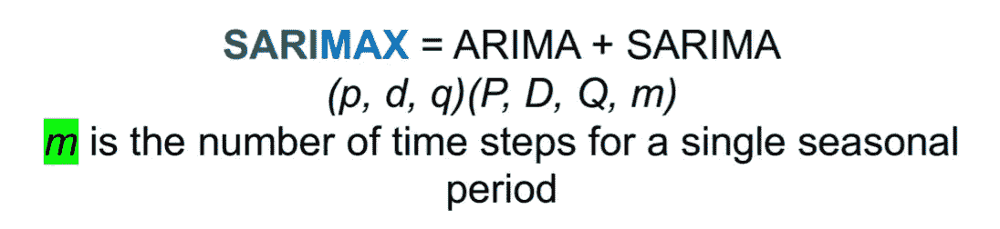
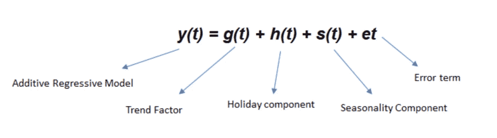
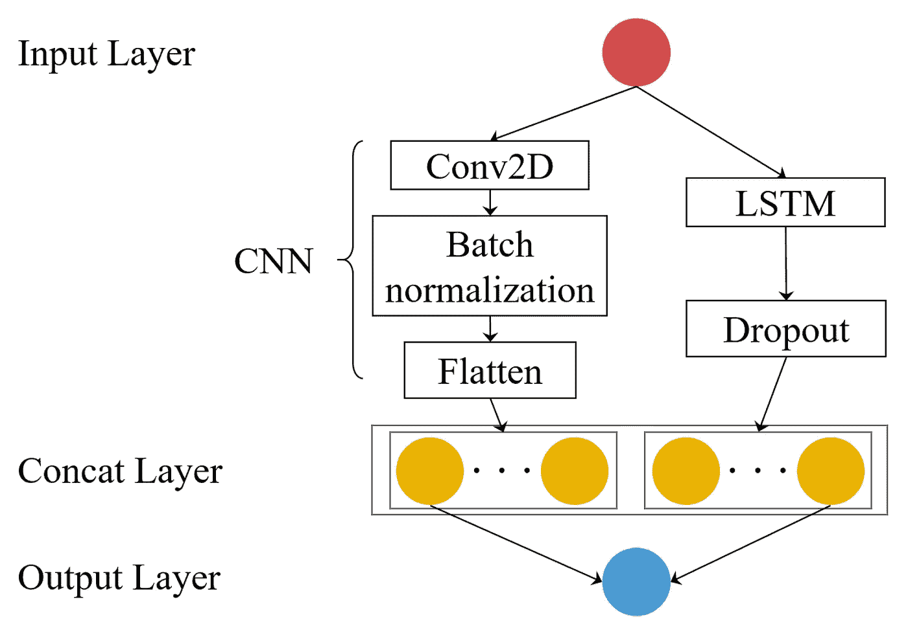
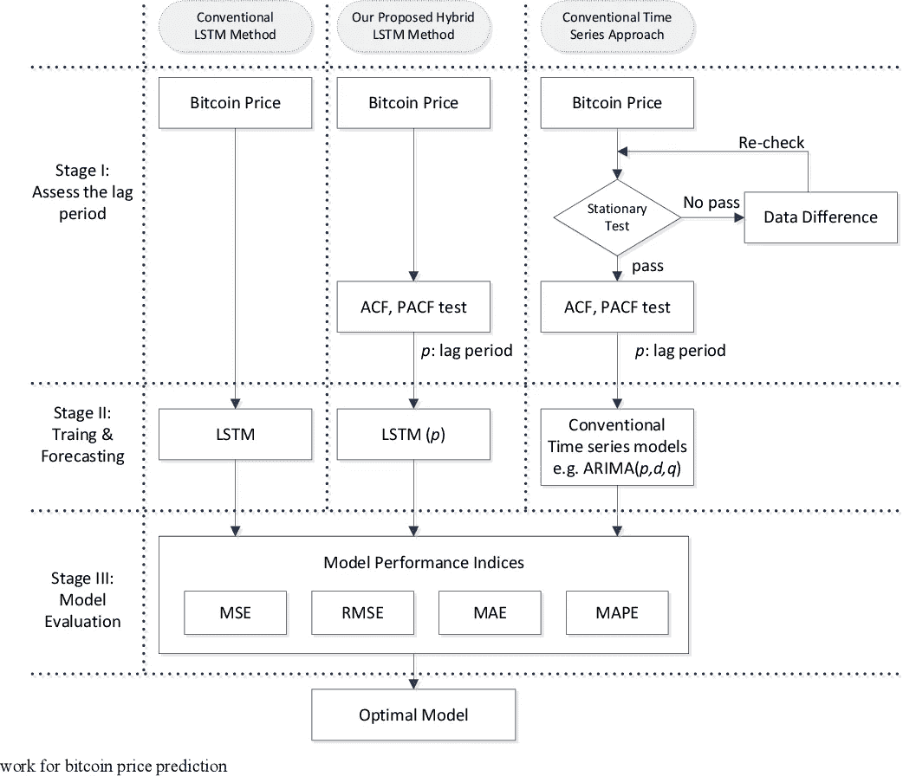

# 我创作“比特预言”的经历

> 原文：<https://medium.com/mlearning-ai/my-experience-creating-bitpred-3ab7296e6f12?source=collection_archive---------2----------------------->

The homepage of my web application

在为我第七学期的顶点项目考虑可能的想法时，我偶然发现了一个加密货币交易所的广告，它一直在宣传分散化金融投资是财务独立的下一件“大事”的说法。虽然这种观点的真实性仍在激烈辩论中，但它确实给了我一个想法，即使用深度学习 RNNs(递归神经网络)来开发一个预测模型，该模型分析过去的价格，并试图预测未来某个时候比特币(BTC)和以太坊(ETH)等货币的波动价格。

Salient points of the proposed solution

Sequence Diagram for the web application

现在，在像 [Anaconda](https://www.anaconda.com/) 和 [Colab](https://research.google.com/colaboratory/) 这样的数据科学平台上，创建模型和测试是相当容易的，但问题是，许多想要利用这些推理的人将讨厌浏览代码行和设置环境，只是为了暗示价格在未来几个小时内是上涨还是下跌。最大限度地提高所有用户的可访问性和生产力的最佳方式是预先训练我们的模型，然后将它们与面向 web 的前端打包在一起，作为一个 API，它将提供交互式图形和简单的 GUI 元素，使整个应用程序直观易用。

我在这个项目中使用的数据集来自 [yfinance](https://pypi.org/project/yfinance/) 开源 python 模块，可用于研究和教育用途。使用它的报价器模块和常规的 pandas [dataframe](https://pandas.pydata.org/docs/reference/api/pandas.DataFrame.html) 函数，我首先建立了一个动态的价格数据库，记录诸如日期、开盘价和收盘价、最高价和最低价、交易量等参数。将所有内容保存为一个. csv 文件可以让我在需要测试或演示模型时方便地访问。

Possible options to create a prediction workflow

How the price data is stored

一旦数据准备就绪，我现在必须分析捕获的信息，以理解准确的模型预测所需的参数。由于该数据集代表一个时间序列，因此第一个概述侧重于趋势中存在的季节性。由于这并没有立即产生任何有用的信息，我们现在转向一种更具技术性的统计方法，即[时间序列分解](https://otexts.com/fpp2/decomposition.html)。 [BitPred](https://github.com/HyperexD/BitPred) 自动分析用户选择的任何时间段之间的价格，并将数据趋势分为 3 个部分:

*   趋势分量-随着数据的长期变化而变化。这里的周期以固定的频率更新，显示了货币的感知价值如何随时间变化。
*   季节性-显示数据是否遵循受季节性因素影响的模式。根据样本规模和波动性，这些因素可能是每年、每周、每天甚至每小时。
*   residual——简而言之，这里记录了隔离上述两个组件后剩下的所有东西。由于密码市场的发展趋势很大程度上取决于公众对这些技术的兴趣，因此数据中总会有一些随机噪声，可以对这些噪声进行分析，但无法准确预测。

对 2017 年至 2021 年的数据应用[黄土分解](https://otexts.com/fpp2/stl.html)，我们开始看到一些我们的模型可以轻松利用的清晰模式。

Plotting components separately

该应用使用三个流行的时间序列预测器，[【脸书先知】](https://facebook.github.io/prophet/)和一个定制的 LSTM，旨在更好地告知用户预测的价格，在广泛的准确性检查和交叉验证后使用每个模型的最佳迭代。

# ***萨里马克斯***

带外生因素的季节性自回归综合移动平均模型是对经典 [ARIMA](https://en.wikipedia.org/wiki/Autoregressive_integrated_moving_average) 模型的扩展，该模型将数据集中的每个值作为过去残差分量的加权总和进行检查，并添加了一个积分项来区分不同的时间段。一个很数学的话题，你可以[点击这里](https://otexts.com/fpp2/arima.html)了解这个模型是如何预测价格的。我们的模型引入了季节性项，这有助于纠正 ARIMA 最大的缺点之一。

P is the autoregressive term, Q is number of lagged forecast errors and D is the number of nonseasonal differences needed to make the series stationary

# **脸书先知**

这是一个加法模型，这意味着它从数据中检测趋势和季节性，然后将结果结合起来，以实现大规模的准确预测值。

# **LSTM**

这是我从零开始开发的模型，模拟 RNN 层，进行超参数调整，然后建立多个具有不同数量特征的 LSTM 模型。

High level overview of a general LSTM

一旦这三个模型被测试和验证，它们都被存储为在助手中调用的单独脚本。py 文件，将他们的预测传递给交互式绘图库 [bokeh](https://bokeh.org/) ，然后绘制详细的图表，并在 HTML 网页上显示所有相关的预测和推断的模式。每个模型的均方误差和置信区间也会显示出来，帮助你决定如何、何时、何地投资，以分散你的投资组合。

The backend framework

这个应用程序的未来范围是巨大的，这里提到的一切只是第一步，在它成为一个实际的产品之前，我计划慢慢增加一长串可能的添加和升级。请将此视为如何使用深度学习来预测市场运动并开发常见咨询问题的尖端解决方案的概念证明。谢谢你看完了整个解释，下次见！

PS:如果你渴望更深入地研究比特币预测和 python 中的 ML 编程，你可以点击这里查看整个项目代码[，点击这里](https://github.com/HyperexD/BitPred)查看 LinkedIn 上一篇突出我的导师[的帖子。](https://www.linkedin.com/posts/kanishka-pandey-249a8a145_machinelearnig-bitcoin-capstoneproject-activity-6852174529544933377-tV2r)

 [## Mlearning.ai 提交建议

### 如何成为 Mlearning.ai 上的作家

medium.com](/mlearning-ai/mlearning-ai-submission-suggestions-b51e2b130bfb)