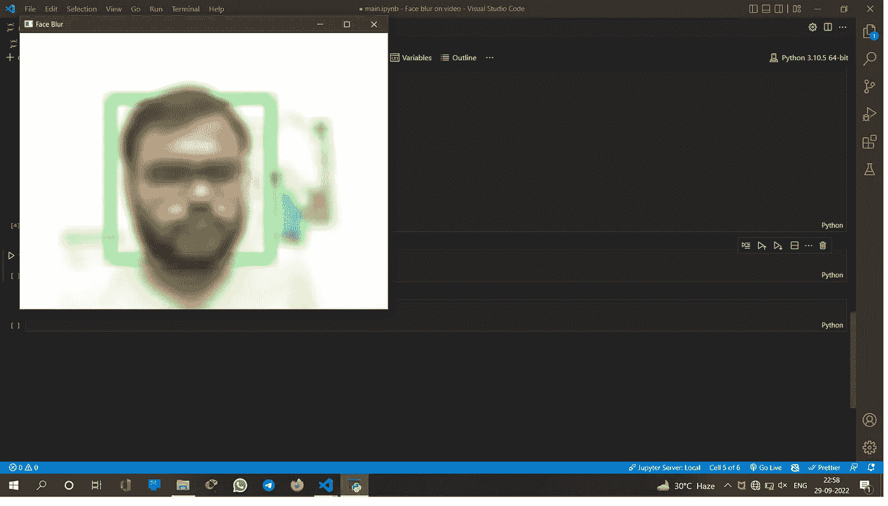
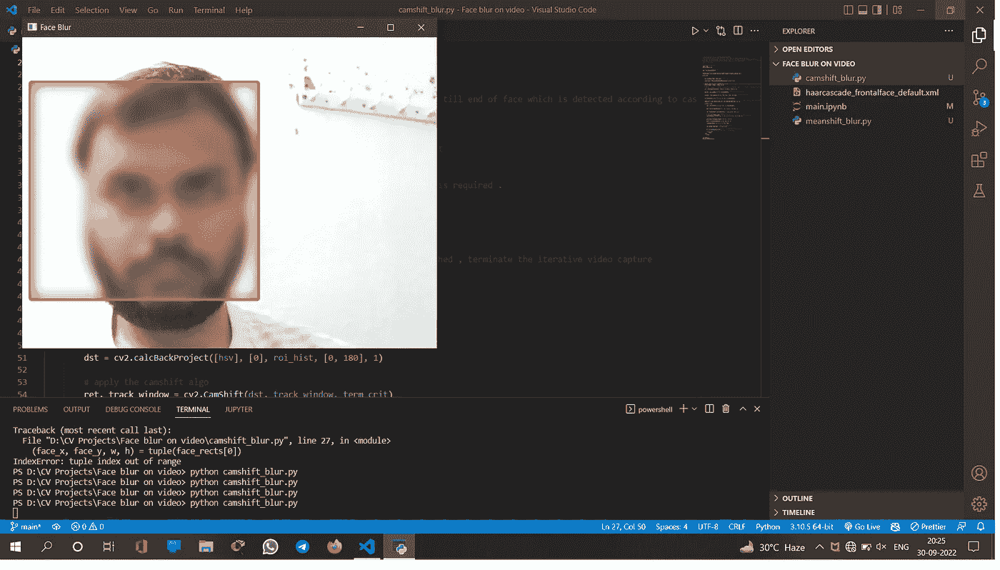

# 我的第一个计算机视觉项目

> 原文：<https://medium.com/mlearning-ai/my-first-computer-vision-project-e4bf93562405?source=collection_archive---------11----------------------->

大家好，我在这里分享我在计算机视觉领域做的一个小项目。我最近在 Udemy 上从何塞·波尔蒂利亚那里学完了 TensorFlow 2.0 和 OpenCV，我想测试一下我新学到的技能。

为此，我做了一个程序，可以在现场视频模糊脸。这种程序可以在网上用来隐藏一个人的身份，从而保护这个人的隐私。该程序使用 MeanShift 和 CAMShift 等对象跟踪算法来检测正面人脸特征，然后允许我们在检测到的区域上绘制一个矩形，随后使用 OpenCV 中可用的 3 种主要模糊方法对其进行模糊处理，即 blur()、medianBlur()、GaussianBlur()。

我还把这个项目上传到了我的 GitHub 上。您可以通过:-[**https://github.com/venu-banaras/face-blur-opencv**](https://github.com/venu-banaras/face-blur-opencv)访问

在这篇文章中，我将简单地强调我在做这个项目时学到的东西。首先，我们导入必要的库。接下来，我们使用 CascadeClassifier()方法来告诉 cv2 我们需要什么样的特性。CascadeClassifier()方法是 Viola-Jones 算法的一种实现，Viola-Jones 算法是一种对象检测算法，它接受 XML 文件作为输入，以训练它检测到了什么特征。XML 文件基本上是面部特征的代码版本，计算机可以用来学习检测面部。它创建级联特征，然后将它们应用于图像的像素。但是由于一幅图像可以有数千个特征点需要学习，而这些特征点会根据图像的大小而变化(例如 24*24 像素的图像会有 160000 多个特征)，我们使用 **Adaboost 从这些特征中选择最佳特征。**

在应用分类器之后，我们使用**检测多尺度()**方法将它们应用于正在捕获的实时视频的所有传入帧。该方法将返回分类器检测到人脸的坐标元组。我们通过使用元组解包将这些坐标存储在变量中，首先检索它们，然后将它们存储在变量中，在我的例子中，变量是 *track_window* 。在此之后，我们从输入帧中定义我们的感兴趣区域*ROI*，并使用切片在其上绘制一个矩形。

我们知道 HSV 颜色方案在检测颜色方面更有能力。所以我们使用 cvtColor()方法将我们的 *roi* 转换成 HSV 格式，这样当我们应用 MeanShift 和 CAMShift 算法时，它们可以更容易更好地识别人脸。之后，我们创建图像的 *hsv_roi* 的直方图，这是归一化图像所需要的。我们为所有的帧提供了 *hsv_roi* 和最小最大样式归一化。我们还需要为视频指定一个终止标准。如果达到一定的条件，我们将终止我们的网络摄像头捕捉帧的循环。

term_crit = (cv2。TERM_CRITERIA_EPS | cv2。TERM_CRITERIA_COUNT，10，1)

以上是我们的终止标准。在这种情况下，如果我们达到某个ε值或计数值，我们可以终止我们的视频。

然后，我们在我们的帧上应用反投影方法，因为 MeanShift 和 CAMShift 算法需要它来持续检测面部。然后，我们将 MeanShift 和 CamShift 算法应用于检测到的人脸。

现在，我们正在检测和跟踪摄像机画面中的人脸。我们现在通过从 CAMShift 或 MeanShift 算法获得检测到的面部的坐标来应用矩形。我们使用 *cv2.rectangle()* 方法在检测到的人脸上应用矩形。

在这之后，我们需要在脸上应用模糊。我们首先确定要应用模糊的区域，通过从算法接收面部的坐标并将其存储在一个变量中，在我的例子中是 *blur_area* 。然后我们在这个区域应用模糊。如前所述，我们可以在这里应用 3 种类型的模糊。我们选择 *GaussianBlur()* ，因为它是三者中效率最高的。

现在我们使用 *cv2.imshow()* 方法将这个模糊应用到我们想要模糊的帧区域并显示我们的帧。

在这里，我想指出发生的一个错误。上面我说过我们需要单独指定要模糊的区域。这是一个重要的步骤，因为如果我们不明确指定它，就会出现下面的错误:-

Whole frame gets blurred (By author)

这就是为什么我们首先显式存储模糊区域，然后选择模糊类型和模糊强度并为其提供模糊区域，最后单独将模糊应用于面部区域。

之后，我们指定 Esc 键作为退出窗口的命令。

该项目的最终结果是

Final result (By author)

这个项目存在于 GitHub [这里](https://github.com/venu-banaras/face-blur-opencv)。在存储库中，我已经分别存储了 MeanShift 和 CAMShift 算法，并且还提供了 haar cascade 文件，我用它来训练 *CascadeClassifier()。*

这是我的第一个测试项目，也是我在 Medium 上的第一篇文章。请为我提供反馈，告诉我如何改进，任何和所有的意见都非常欢迎。

谢谢你。

 [## Mlearning.ai 提交建议

### 如何成为 Mlearning.ai 上的作家

medium.com](/mlearning-ai/mlearning-ai-submission-suggestions-b51e2b130bfb)