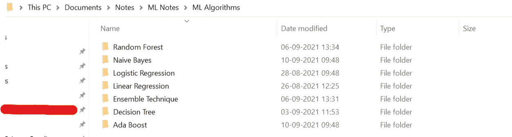
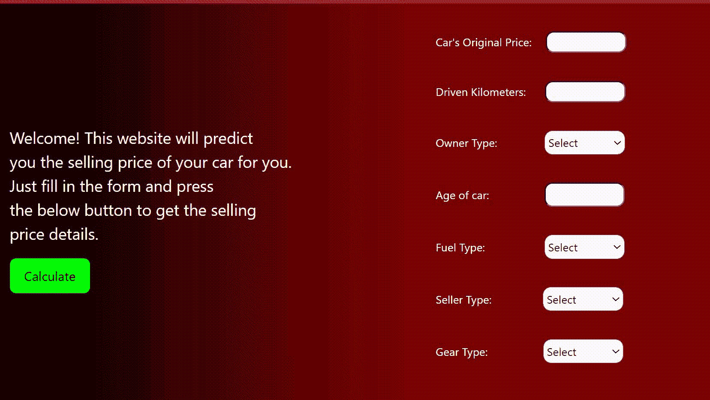
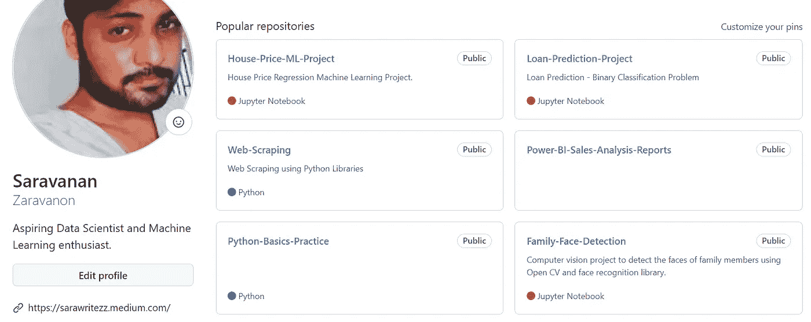
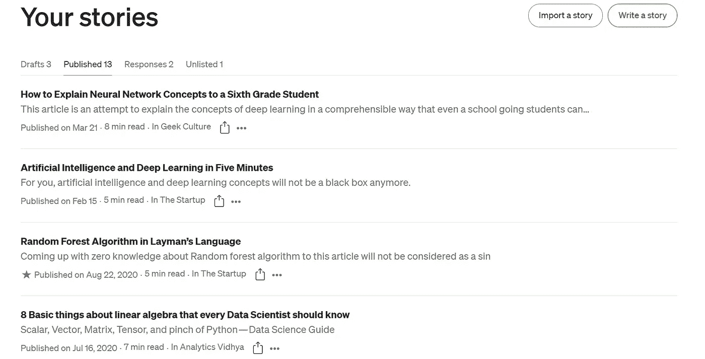
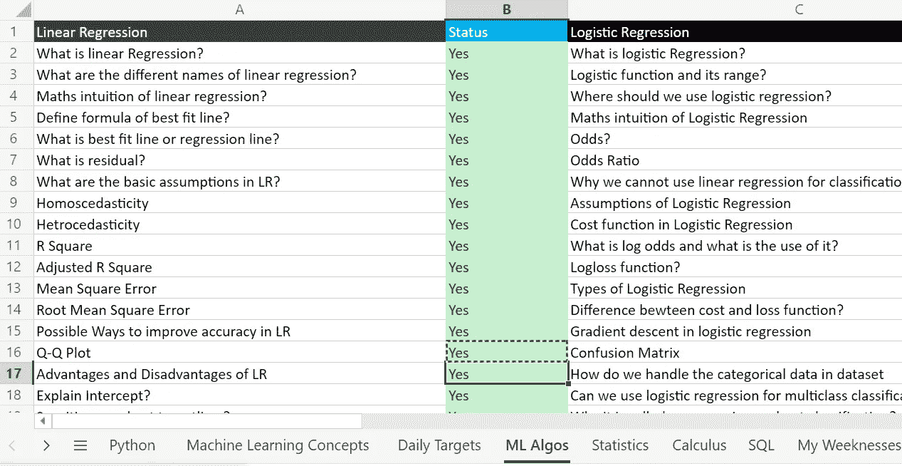

# 我的第一份数据科学工作！

> 原文：<https://medium.com/mlearning-ai/my-first-data-science-job-9fe5233f989a?source=collection_archive---------1----------------------->

## 本文将讲述我个人用来破解数据科学面试的技术

Photo by [Spencer Bergen](https://unsplash.com/@shutterspence?utm_source=unsplash&utm_medium=referral&utm_content=creditCopyText) on [Unsplash](https://unsplash.com/s/photos/win?utm_source=unsplash&utm_medium=referral&utm_content=creditCopyText)

显然，在没有任何相关经验的情况下，在数据科学领域找到一份工作并不是一件轻而易举的事情，同时，如果你做了正确的准备，这也不是一件非常艰难的事情。在本文中，我将分享迄今为止我遵循的所有策略，以破解数据科学面试。

最近，我收到了一家知名数据分析公司的邀请。我的职业生涯始于一家初创公司的初级网站开发人员，也曾在一家金融科技公司担任流程分析师。甚至当我在那里工作的时候，我就盯上了这个数据科学领域。

在没有太多这方面知识的情况下，我盲目地开始学习与数据科学相关的不同技术。我参加了一个在线的 Udemy 数据科学课程，该课程涵盖了所有相关领域的数据科学的一些基本知识。我学习了统计学、概率和数据可视化工具的基础知识。最初，我跟随一些最差的技术学习机器学习概念、算法及其工作机制。过了一段时间，我的错误教会了我很多。我开始了解熊猫的不同功能和 python 的 NumPy 库。我已经对 Python 和 SQL 语言有了很好的了解。

我在准备的时候，每天会花 5-6 个小时学习不同的数据科学相关技术。

中国哲学家孔子有句著名的谚语，

> 我听到我忘记了，我看到我记得，我明白了

所以在学完所有的基础知识后，我开始将这些全部付诸实践。那些时候，Kaggle 是我的脸书、Twitter 和 Instagram。

**卡格尔**

在 Kaggle，开始从事机器学习的基础项目，如泰坦尼克号生存预测和波士顿房价预测。如果你计划做机器学习的第一个项目，那么从这两个开始会帮助你更好地理解 ML。

想办法在 Kaggle 获得一个好的排名，机器学习都是为了增加模型的准确性。

**把你读到的写下来**

无论你读到什么，试着记录下来。我把我学到的所有东西都写在一个 Microsoft word 文件中，并在一个驱动器中保存一份副本。这就像在你的电脑上学习某样东西的时候，在你的头脑中保留一份确切的拷贝。即使过了几年，你也很容易准确地记得你是怎么学会的。你会忘记，但电脑不会。我很有信心，这是学习任何东西的最好方法。

**端到端 ML 项目**

进行端到端的 ML 项目，这肯定会吸引雇主的注意。我用 Python flask 框架开发了一个简单的车价预测 ML app，部署在 Heroku 平台上。在 Heroku 中，您可以免费部署多达五个应用程序。它引起了我雇主的注意，我接到了面试电话。

**投资组合**

创建一个整洁的文件夹，用一个合适的“自述”文件来描述你的项目。我所有的项目都在 Github 上。别忘了在简历中添加你的 Github 个人资料链接。您可以从 Github 直接将项目部署到 Heroku 中。

**为社区做贡献**

无论你学到什么，都要努力为社区做贡献。当我学习不同的概念时，我个人写了很多关于介质的数据科学文章。面试官听到我的数据科学文章后很好奇。这是详细学习概念的另一种方式。

**记录你的进度**

我亲自跟踪了一个在线 Excel 文件来跟踪我的进度。不同技术的面试问题我都在不同的 excel 表格里。例如，我在 SQL 表中有 130 个基本的 SQL 面试问题。每当我学到一个新的概念，我都会更新那张纸上的问题。我有一张不同的表格来记录我的日常任务，我习惯于设定我的日常任务，并试图在一天结束前完成它。那张床单是我的私人助理，它不停地告诉我在哪里，要做什么。为此，我使用了一个在线 excel 表格。在面试的时候有效地修改这个概念对我帮助很大。这样你就不会错过任何一个面试问题去修改。

**准备数据科学面试时要记住的事情**

1.  每天至少学习几个概念。不要给学习留下很大的停顿。
2.  学习 ML 算法的最好方法是，理解它在数学上是如何工作的。
3.  耐心和坚持是关键。
4.  继续申请所有相关的工作职位，没有人知道宝藏的确切位置。
5.  每天至少解决一个 SQL 和 Python 问题。
6.  数字用数学，数据用统计学。
7.  连基本概率都不知道，你是无法有效预测任何事情的。
8.  尝试解决 HackerRank SQL 问题。
9.  清理数据并使其适合分析是一件重要的事情。在你的准备中给这一部分更多的份量。
10.  Tableau 和 PowerBI 是数据分析师的好朋友。至少学其中任何一门。

**结论**

以上都是我的亲身经历。我遵循了所有这些技巧，这些东西至少对我有用。以上几点大部分都是通用的，所以任何准备面试的人都可以遵循这些步骤。

**万事如意！**