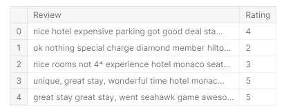
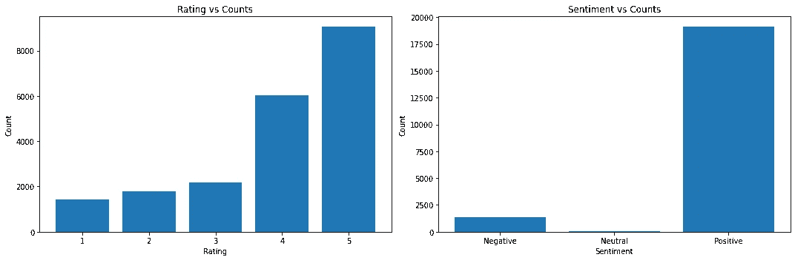
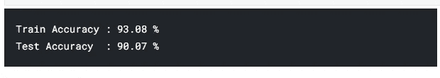

# 我在 Kaggle 上的第一个 NLP 问题

> 原文：<https://medium.com/mlearning-ai/my-first-nlp-problem-on-kaggle-d12904239e04?source=collection_archive---------2----------------------->


NLP 专注于分析语音数据，以生成单词预测或从语音数据中生成见解，如情感。我在 Kaggle 上处理的第一个 NLP 问题是猫途鹰网站评论的评级预测系统，我们从用户给出的评论中预测可能的评级。尽管这是一个简单的问题，但这个数据集让我开始学习 NLP。

**数据加载**

数据集是一个 CSV 文件，以**评论**和**评级**为列。

```
data = pd.read_csv(“../input/trip-advisor-hotel-reviews/tripadvisor_hotel_reviews.csv”)data.head(5)
data.isna().sum()
```



Display of the Dataset

数据集是干净的，没有缺失值。

**EDA**

这里要执行的 EDA 是每个评论的评分分布和情绪分布。为了产生情感，我使用了 TextBlob 库。

```
sentiments = []for review **in** data['Review']: if TextBlob(review).sentiment.polarity < 0: sentiments.append("Negative") if TextBlob(review).sentiment.polarity == 0: sentiments.append("Neutral") if TextBlob(review).sentiment.polarity > 0: sentiments.append("Positive")data["Sentiment"] = np.array(sentiments)
```

让我们现在生成可视化。

```
plt.figure(figsize=(15,5))plt.subplot(1,2,1)x_axis,counts = np.unique(data['Rating'],return_counts=True)plt.bar([str(i) for i **in** x_axis],counts)plt.title("Rating vs Counts")plt.xlabel("Rating")plt.ylabel("Count")plt.subplot(1,2,2)x_axis,counts = np.unique(data['Sentiment'],return_counts=True)plt.bar(x_axis,counts)plt.title("Sentiment vs Counts")plt.xlabel("Sentiment")plt.ylabel("Count")plt.tight_layout()
```



EDA of the Dataset

从可视化中可以明显看出，等级 1、2 和 3 的数量相似，等级 4、5 的数量相似，但高于 1、2 和 3。此外，大多数评论都是正面的，很少有负面评论，中性评论更少。

**自然语言处理和建模**

现在有趣的部分来了，NLP。这里是文本数据，需要转换成向量，以便算法处理它。为此，我们使用 tfid vectorizer——NLP 最常用的矢量化算法。

```
vectorizer = TfidfVectorizer(stop_words=text.ENGLISH_STOP_WORDS)
```

我们使用 ENGLISH_STOP_WORDS 参数来移除停用词，因为这些停用词在上下文中是不相关的，并且在任何语音/文本数据中占据大量。

```
X_train,X_test,Y_train,Y_test = train_test_split(vectorizer.fit_transform(data['Review']).toarray(),data['Rating'].values,test_size = 0.2,random_state=42)
```

我们现在将把数据分成训练和测试用于建模，但是作为特征，我们将被传递转换的矢量数据而不是文本数据，并且标签将是评级。

对于建模，我们将使用三种模型——逻辑回归、随机森林和决策树。

上述三种模型的训练和测试精度如下:

```
**Logistic Regression :**Test Accuracy  : 62.11 %Train Accuracy : 76.15 %**Decision Tree :**Train Accuracy : 100.00 %Test Accuracy  : 45.72 %**Random Forest Classifier :**Train Accuracy : 100.00 %Test Accuracy  : 51.55 %
```

如上所述，树模型在预测评级方面表现不佳。一个看似合理的原因是对每种情绪给出的评级不一致——一个负面评级可能在一个评论中得到 3 分，而在另一个评论中可能会更少。类似地，每次评论中使用的不同单词及其相应的评级也会影响预测能力。一种解决方案是基于评级的分布对评级进行分组，即评级 1、2 和 3 在单个组中(组 0)，而 4、5 具有更接近的分布，但高于 1、2、3，因此在组 1 中。

```
groups = []for rating **in** data['Rating']: if rating **in** [1,2,3]: groups.append(0) else: groups.append(1)data['Group'] = groups
```

因此，问题从评级预测转变为最大评级预测——我们不是预测准确的评级，而是预测该评论的最大可能评级。

同样，执行矢量化和分割，但我们使用分组作为特征，而不是评级作为特征。

```
vectorizer = TfidfVectorizer(stop_words=text.ENGLISH_STOP_WORDS)X_train,X_test,Y_train,Y_test = train_test_split(vectorizer.fit_transform(data['Review']).toarray(),                 data['Group'].values,
test_size = 0.2,
random_state=42)
```

现在让我们尝试对数据建模。通过简单的逻辑回归，我们实现了 90%的测试准确率和 93%的训练准确率。



Final Metrics from a Logistic Regression Model

因此，如果模型预测为第 0 组，则评论的最高评级为 3，如果预测为第 1 组，则评论的最高评级为 4 / 5。随着对不同模型的更多优化和试验，精确度可以提高。

感谢您的阅读！欢迎大家来叉，改进我的工作。

## **有用链接:**

*   在 LinkedIn 上找我:【https://linkedin.com/in/vishnuu0399 
*   更了解我:【https://bit.ly/vishnu-u】T4
*   在 Kaggle 上找到我的笔记本:[https://www . ka ggle . com/Vishnu 0399/trip-advisor-reviews-EDA-and-NLP-90](https://www.kaggle.com/vishnu0399/trip-advisor-reviews-eda-and-nlp-90)