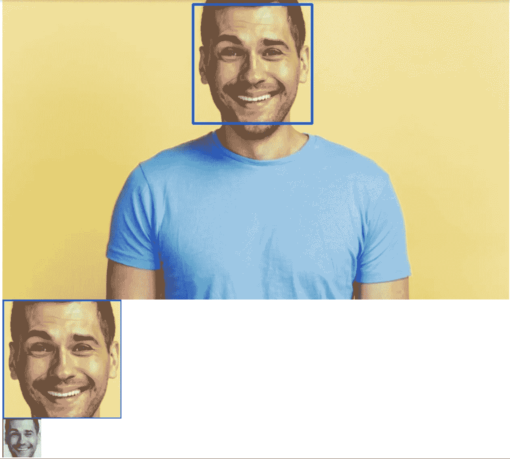
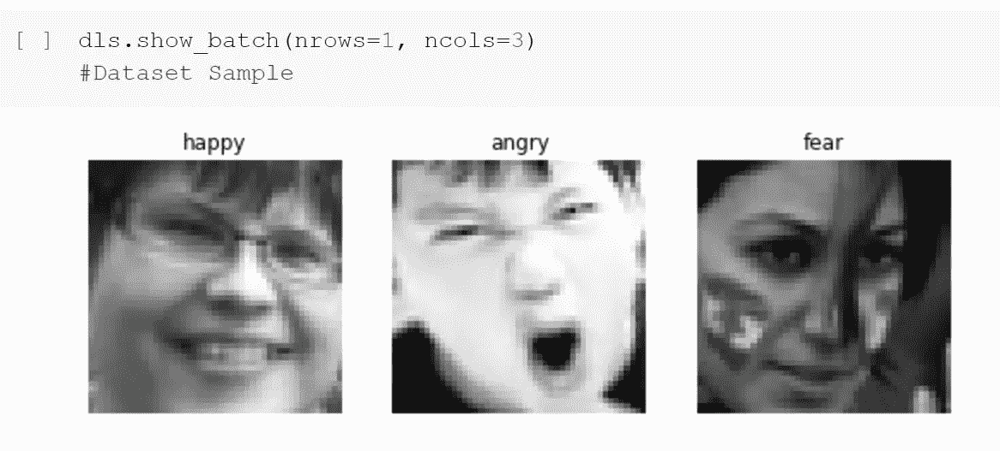
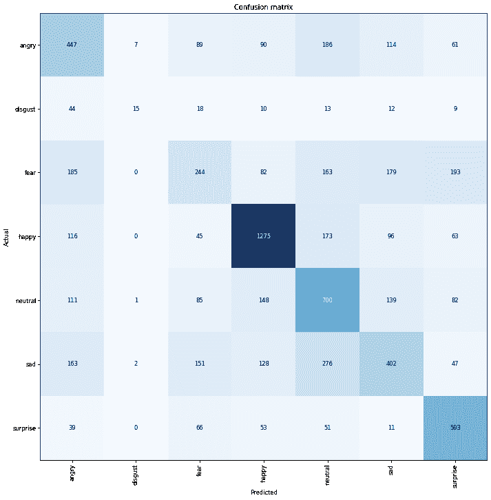
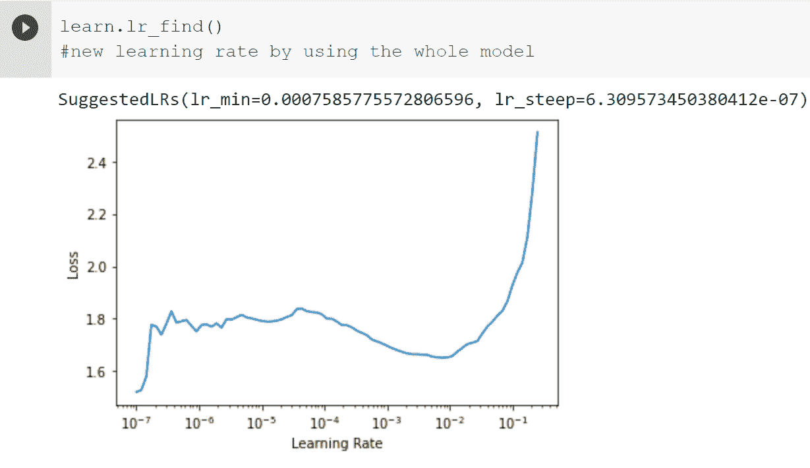
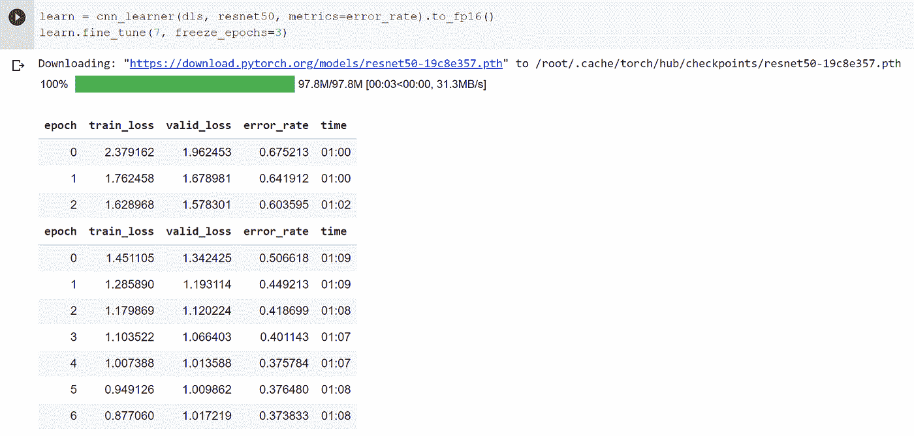
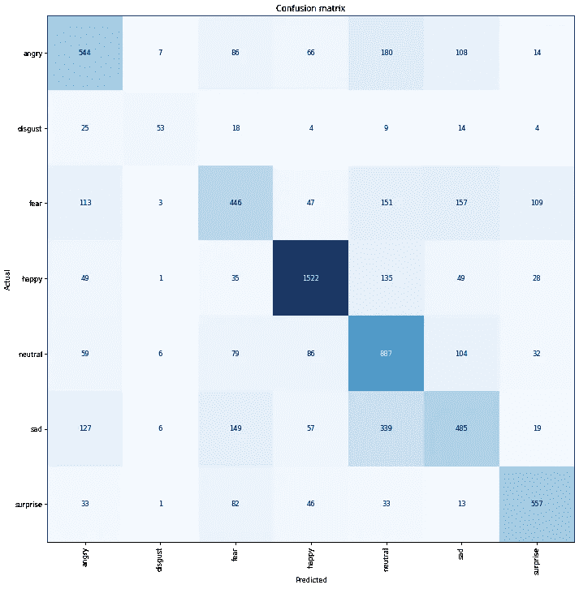
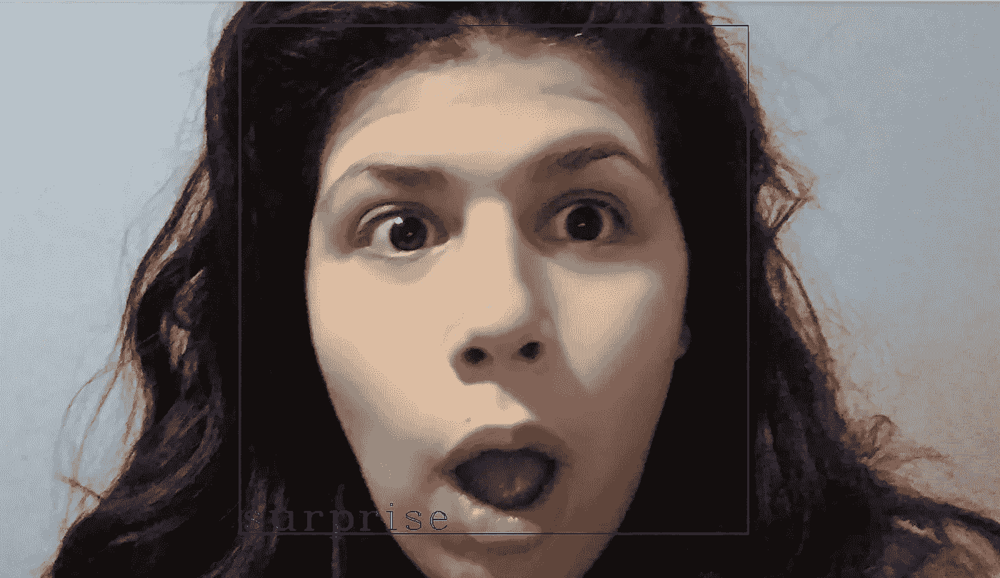

# 我的电脑知道我的感受——一个关于情绪检测的机器学习项目

> 原文：<https://medium.com/mlearning-ai/my-pc-knows-how-i-feel-a-machine-learning-project-on-emotion-detection-cbc60adad0d?source=collection_archive---------5----------------------->

# 介绍

因为我最近才开始学习 Python，所以我认为通过一个机器学习项目来发展我的技能对我非常有帮助。这个项目是关于情绪检测的。我想做的是，能够上传一张照片，然后拍摄情感表达的结果。我还希望结果是一个盒子上的文本，表明脸在哪里。

这不是驱使我这样做的唯一原因。我打算从事认知科学方面的职业，通过了解神经网络的工作方式，我可以探索人类大脑的一些重要功能。我还对人类行为和情绪反应感兴趣，这就是为什么我选择训练模型来预测情绪。我目前是一名人工智能数据注释员，帮助我管理我找到的数据集和标签。



笔记本:[https://colab . research . Google . com/drive/14T _ AnoYAKHaZKY-HV 6 r 0 gfxq-RH 9 q 2 NK？usp =共享](https://colab.research.google.com/drive/14T_AnoYAKHaZKY-hV6R0gfXQ-RH9q2NK?usp=sharing)

github:[https://github . com/aglina 95/emotion detection/blob/main/emotion detection 95 . ipynb](https://github.com/Aglina95/EmotionDetection/blob/main/EmotionDetection95.ipynb)

# 项目执行

**工具**

如果没有 Fast AI 和 Kaggle，这个项目是不可能实现的。我使用了来自 Kaggle 的 [FER-2013](https://www.kaggle.com/msambare/fer2013) 数据集和来自 Fast.ai 的 [05_pet_breeds.ipynb](https://colab.research.google.com/github/fastai/fastbook/blob/master/05_pet_breeds.ipynb#scrollTo=5gMFHay04lGa) 笔记本作为指南。我使用的神经网络是 Resnet50，它有 50 层，允许我创建另一个网络来训练它预测情绪。另一个让我免于许多麻烦的有用工具是 [OpenCV](https://opencv.org/) ，它可以识别人脸，允许你在人脸周围创建边界框，使图像变灰色，并将预测转换成边界框上的文本。

**数据集**

基于每个文件夹包含的情感，数据集被分成文件夹。有各种各样的情绪和面孔，但图像真的很小，而且是黑白的。

训练集包括 28，709 个示例，公共测试集包括 3，589 个示例。

你可以在下面看到一些例子:



## 训练模型

## **1)安装 Fast ai 的库并导入 cv2**

使用 Fast ai 的笔记本，我必须先安装它的库，然后导入 cv2，以便进行面部识别，将图像转换为黑白，并在训练后创建一个边界框和预测字体。

## 2)数据块 API

**a)** **数据块**是用于将数据加载到模型中的对象。您会注意到在**数据块**中有一个 *get_image_files* 函数，它获取数据集的路径并返回数据集中每个图像的路径。

**b) RandomSplitter** 是一个将数据拆分为训练和验证数据集的函数。

RegexLabeller 是一个允许你使用图片路径来创建标签的类。因为文件夹是以它们包含的情感命名的，所以我可以用文件夹名作为它们图像的标签。你会看到我创造了一个模式，适合我的标签需求。此模式指示标签文本根据文件夹名称的显示方式。

模式=。+/.+/(.+)/.+_\d+\。jpg 美元

文本/路径即:数据集/训练/(快乐)/训练 _3908.jpg

括号中的文本将成为标签。

模式是一个正则表达式。我们来看看什么“\d+”。jpg$ "是指。“$”符号表示文本到此结束。“\”jpg "指示文本应该如何结束，因为图像的名称以"结尾。jpg”因为这是他们的类型。“\d+”表示文本在这一点上应该有一个或多个数字。这就是你在上面看到的模式背后的逻辑。

更多关于正则表达式的内容可以参考此链接:[https://www . Google . com/amp/s/www . geeks forgeeks . org/write-regular-expressions/amp/](https://www.google.com/amp/s/www.geeksforgeeks.org/write-regular-expressions/amp/)

**d) aug_transforms** 通过对现有图像进行旋转、缩放等操作生成更多图像。我们需要这个的原因很简单。有一种可能性是，如果我们给网络一个旋转的图像，它不会预测它。当图像被旋转或缩放时，人类几乎每次都能认出以前看过的图像。这并不意味着神经网络能够做同样的事情。

## 3)总结

通过调用 *summary，*我们可以在开始训练模型之前看到过程的实际摘要。

首先，解释一下 *Pilbase.create* 是做什么的会很有帮助，因为它对我来说也不是那么明显。显然， *PILbase* 是一个表示图像对象的类。为了创建新图像，需要使用工厂函数 *create* 。所以， *PILbase.create* 所做的，就是实际选择路径，然后创建一个新的图像。

**b)** *Summary* 也调用 *RegexLabeller* ，它获取路径并给出一个标签，如我在 DataBlock 中所述。( ***数据块 API* *c**

**c)** 因为神经网络处理数字，所以也需要将文本标签转换成算术标签。因此，*摘要*调用分类函数，该函数获取文本标签并将其转换为算术标签，以满足神经网络的需求。

**d)***最终样本*包含将用于训练的所有图像。

## 7)培训

在我分享我的训练尝试之前，我应该先分析一下“训练模型”是什么意思。因为我不是世界上唯一的初学者，所以最好用一种简单的技术方式来描述，以便理解“训练模型”是什么意思。

所以，为了训练一个模型，你应该有一个数据集。显而易见，弄清楚数据集是什么很重要。数据集包含有助于模型识别与其相似的其他数据的数据。数据集还必须分成训练集和验证集。这是因为模型需要用数据来训练，但它也必须在单独的集合上进行验证，以便不仅记住数据和标签，而且实际上学会识别它们。数据集非常重要，因为预测可以和数据集一样精确。如果你打算实现这样一个概念，你可以像我一样在网上找到任何数据集。如果需要，您也可以创建自己的数据集。

因为此时您已经找到了数据集，所以您必须将它加载到模型中。(可以参考数据块部分)之后你开始训练它。本培训适用于纪元，一旦您完成本部分，您将会看到一些条块(根据您选择的纪元数量)正在加载。这是训练的时候，你可以亲眼看到。在每个时期，该模型从数据集中获取一批图像，并对它们进行处理，以便学习预测。在我的案例中，模型学会了预测情绪。

只训练一次模型并不总是这样。也许有时它不能概括数据，或者它的结果对于它将要做出的预测来说不是很有希望。在这一点上你需要使用一些优化。Fast ai 的指南提出了许多建议，以便使模型更好。为了找到最佳优化，有足够多的方法进行实验，所以如果第一个结果不是那么有希望，请随意尝试优化。

**a) Resnet34**

在我的第一次尝试中，我试图训练 resnet34 模型，你可以在下面看到结果。我们关心的是测量我们的模型有多精确。这可以通过测量错误率来实现。最好能提到准确性，以便说得更清楚。准确度等于正确预测的总量除以预测的总量。Fast ai 使用误差率来表明预测的准确性。误差率等于 1 减去准确度。


由于这些结果，许多情感与其他情感混淆了。例如，许多中性情绪被混淆为悲伤情绪，反之亦然。你可以在混淆矩阵中看到一些例子。为了更容易理解如何阅读困惑矩阵，让我们先看看下面的那些数字是什么，以及这些情绪意味着什么。

在图表的左边，我们看到了所有真实的情感。在它的底部，我们看到预测的情绪(模型如何预测实际的情绪)。正确的结果是那些我们看到的斜向底部的结果。例如，顶部的“愤怒”情绪有 447 个正确的预测。该数据集有超过 447 张带有愤怒面部表情的图像，这些图像被错误地预测为其他情绪。你可以看到预测的“愤怒”情绪的整列，许多预测与其他实际情绪混淆了。“厌恶”情绪也是如此。正如我之前提到的，为了看到正确的预测，你必须对角阅读。如果你注意到，当你走对角线时，每一种实际的情绪都对应着同一个预测的情绪。因此，“厌恶”情绪只有 15 个正确的预测，其余的都是错误的。它们中的一些被预测为“愤怒”情绪，另一些被预测为“悲伤”情绪等。你可以用同样的方式阅读剩下的部分，以便了解一些情绪与其他情绪的混淆程度，以及其中有多少情绪是最混乱的。



**b) Resnet50 和解冻方法**

在我的第二次尝试中，我决定使用 resnet50 模型而不是 resnet34，并使用 Fast ai 建议的 unfreeze 方法。

为了做到这一点，我必须先找到 resnet50 模型的学习率。所以，我按照向导的建议调用了 *lr_find* 函数。该函数用于查找整个模型的学习率。



因此，之后我准备使用学习率和 *lr_steep* 来运行新的纪元周期来训练模型。这种训练方式是先冻结模型，训练三个历元，然后解冻模型，训练十个历元。


正如你所看到的，结果似乎好了很多，但我仍然希望有一些更好的结果。

**c)具有最佳结果的最终优化**

为了获得更好的结果，Fast ai 建议使用的最后一种方法是使用这种架构:

```
learn = cnn_learner(dls, resnet50, metrics=error_rate).to_fp16()
learn.fine_tune(7, freeze_epochs=3)
```

在这背后，有很多事情正在发生:

```
def fine_tune(self:Learner, epochs, base_lr=2e-3, freeze_epochs=1, lr_mult=100,
              pct_start=0.3, div=5.0, **kwargs):
    "Fine tune with `freeze` for `freeze_epochs` then with `unfreeze` from `epochs` using discriminative LR"
    self.freeze()
    self.fit_one_cycle(freeze_epochs, slice(base_lr), pct_start=0.99, **kwargs)
    base_lr /= 2
    self.unfreeze()
    self.fit_one_cycle(epochs, slice(base_lr/lr_mult, base_lr), pct_start=pct_start, div=div, **kwargs)
```

这种训练方式将模型冻结并训练一些时期，然后在许多时期解冻模型。它还使用了一些由快速人工智能的创造者选择的默认参数，事实证明这些参数更有效。

我想从技术角度多关注一下*pct _ start**。**pct _ start*是做什么的？每当一个时期运行时，就有一定百分比的批次被获取，并且每当一个时期运行时，每个批次的学习率都增加。经过一些时期后，学习率下降。

用这种训练方式训练后，那些是新的结果:



与之前的尝试相比，错误率略有不同，不幸的是，之后的任何尝试都不太顺利。我尝试了多种训练组合，比如冻结和解冻 resnet34 模型更多的时期，或者简单地训练 resnet50 模型更多的时期，然后再次冻结和解冻它更多的时期。所以，我可以说这是这个模型能得到的最好的结果。

中性情绪再次与悲伤情绪有点混淆，但与第一次训练相比，所有其他情绪都没有那么混淆。



正如我之前所说的，数据集对于准确预测非常重要。我在这里使用的这种训练方式，给出了更好的结果，但由于每种情绪的图像数量不相等，所以有很多混乱，但幸运的是没有我第一次尝试时那么多。

## **4) OpenCV**

正如我之前提到的，如果没有 OpenCV，这个项目是不可能实现的。OpenCV 是一个计算机视觉库。它提供了另一种识别人脸的模型。因为这个项目与人脸有关，所以我在寻找某种可以找到人脸的工具，以便给出一些可视化的例子。

这是我用的指南的链接，你可以参考一下。我创建了一个更简单的版本:[https://www . mygreatlearning . com/blog/real-time-face-detection/](https://www.mygreatlearning.com/blog/real-time-face-detection/)

让我们来看看这个过程:

a)“image path”是图像的路径,“cascPath”是保存的训练模型的路径——它是 xml 文件形式的——它在面部周围创建边界框。

```
imagePath = base_path+'IMG_20210126_195043.jpg'cascPath = base_path+'haarcascade_frontalface_default.xml'
```

b)“人脸级联”是识别人脸的分类器。

```
faceCascade = cv2.CascadeClassifier(cascPath)
```

c)“cv2 _ imshow”，显示人脸，“image _ gray”将图像转换为灰度。我选择这样做的原因是因为数据集包含黑白图像，因此如果我不这样做，预测就不会准确。

```
from google.colab.patches import cv2_imshowimage = cv2.imread(imagePath)image_grayscale = cv2.cvtColor(image, cv2.COLOR_BGR2GRAY)
```

d)此时，我运行分类器来识别面部。之后，我给出了有人脸的图像，一些参数和人脸正方形的最小尺寸。

“面 _ 正方形”包含定义面边界框的列表。我使用只有一张脸的图像。在“cv2.rectangle”中，你可以放置定义你想要绘制边界框的点的坐标，你也可以放置你喜欢的边界框的颜色。我希望它是蓝色的，所以我选择了 255，0，0。

```
face_squares = faceCascade.detectMultiScale(image_grayscale,scaleFactor=1.2,minNeighbors=30,minSize=(100, 100))print(face_squares)# Draw rectangle around the faces(x,y,w,h) = face_squares[0]
cv2.rectangle(image, (x, y), (x+w, y+h), (255, 0, 0), 2)cv2_imshow(image)
```

e)裁剪后的图像(图像[y:y + h，x: x + w])现在保存在 new_image 中。“cv2_imshow(new_image)”显示裁剪后的图像，将其转换为灰度，然后调整其大小，以便进行准确的分类。

值得一提的是，由于数据集图像的大小和颜色，该模型起初并不是很好。数据集的图像是黑白的，很小，模型可以识别出与此完全一样的图像。现在我使用这个代码来调整图像的大小并将图像转换成灰度，预测更加准确了。

```
new_image = image[y:y + h, x: x + w]# Display the output
from google.colab.patches import cv2_imshowcv2_imshow(new_image)new_image_gray=cv2.cvtColor(new_image, cv2.COLOR_BGR2GRAY)resized = cv2.resize(new_image_gray, (48,48))cv2_imshow(resized)
```

f) "learn.predict "给出了我给出的图像的预测。

```
emotion=learn.predict(resized)[0]print (emotion)
```

g) cv2.putText 在框(x，y+h)底部的左上角创建表示预测的文本。

```
cv2.putText(image, emotion,(x,y+h-10),cv2.FONT_HERSHEY_COMPLEX_SMALL,0.8,(255, 0, 0),thickness=2)cv2_imshow(image)
```

# 收场白

这个项目是一次冒险。对我来说，没有什么是不言自明的，因此我学到了很多东西，我将在不久的将来在项目中使用。



A photo of myself