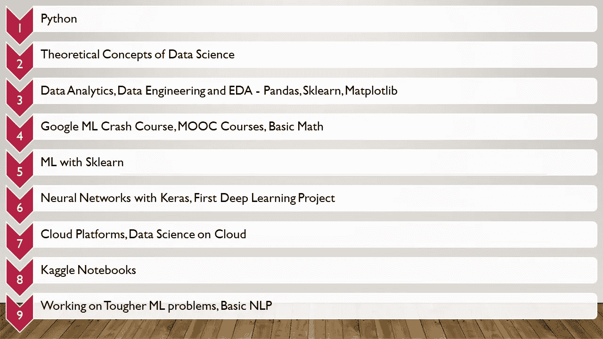

# 迄今为止我自学的数据科学之旅—从零到中级

> 原文：<https://medium.com/mlearning-ai/my-self-taught-data-science-journey-till-date-from-zero-to-intermediate-266a5a6f0086?source=collection_archive---------2----------------------->

从我学士学位的第二年到今天，数据科学一直是我最喜欢的科目。通过持续的自学和项目工作，我能够更深入地了解该领域，并更好地了解其在现实世界场景中的应用。在这篇文章中，我将分享我从大学时代到今天自学数据科学的旅程。

**Python**

Python 是我学习旅程的起点。我在本科二年级时开始接触 Python。除了语言之外，这里没有任何东西与数据科学相关，所以我主要关注于学习语言并流利地使用它。解决来自互联网的编码挑战和问题帮助我度过了难关。

**数据科学的理论概念**

数据科学在当时是一个全新的概念——我对此一无所知。因此，我想从数据科学的理论概念开始——什么是数据科学、分析、其目的和实际应用。像大数据这样的概念和理解机器学习的概念是我关注的主题。MOOC 课程和在线博客确实有助于人们习惯技术术语和概念。

**数据分析、数据工程和 EDA——Pandas、Sklearn、Matplotlib**

动手数据科学从 Python 和用于数据科学任务的库(如 Pandas、Sklearn 和 Matplotlib)开始。我关注的是像加载数据集(CSV 文件作为开始)、操作数据、浏览数据等基础知识。有趣的是，当我开始探索性数据分析(EDA)工作，学习如何生成有意义的可视化，从图中进行推理。当时，数据工程对我来说是一个很难理解的概念，因为我还没有开始从事任何严肃的项目或机器学习，但我确实理解理论并尝试了基本的数据转换。

**谷歌 ML 速成班，MOOC 课程，基础数学**

这对我来说是一个突破——我进入了机器学习的技术层面和实践层面。虽然动手的次数少了，但是很多新概念都在等着我。从回归开始直到使用神经网络分类，各种优化技术。我也从这里学到了更多关于数据工程及其需求的知识。MOOC 课程确实帮助了机器学习的概念及其在现实生活中的各种应用。我还更新了我的基础数学知识——线性代数、概率和一些统计概念，它们仍在继续(是的，即使是我也有数学不流利的通病)。本课程还包含如何根据训练和测试准确度、精确度、召回率和 F 分数等指标选择模型的教程。这门课是 ML 入门最好的。

**带 Sklearn 的 ML**

Sklearn 是一个流行的 ML 库，由各种 ML 算法组成，如线性和逻辑回归、决策树、集成和聚类算法。就像之前一样，MOOCs 在这里帮助很大，自学，理解各种算法。我从小数据集开始(这需要较少的特征工程来获得足够好的结果)，直到我习惯了这个概念，并慢慢转向更大的真实世界的数据集。

**CNN 第一个深度学习项目 Keras 神经网络**

我的另一个突破——开始研究具有深度学习的神经网络。这是我开始全面机器学习的起点——数据工程、可视化和建模。这是我关注使用度量来改变模型架构以改进结果的地方。这是我学到很多东西的地方，我不得不在数学上多下功夫——这对我的学习真的很有帮助。我还学习了 CNN 的概念，并研究了各种图像分类问题。

**云平台，云上的数据科学**

云经常与数据科学一起使用，是一个重要的领域。作为云的初学者，我主要侧重于理解云的概念，为什么它优于本地服务器和云上的各种服务—虚拟机、云笔记本、数据库和数据仓库、云上的 ML 服务—语音和图像 API 等。我一开始是从 GCP 开始的，后来转到了 AWS。我还参与了一些项目，在这些项目中，我在数据仓库上托管数据集，并使用云服务对它们进行查询和分析。

**Kaggle 笔记本**

这对我来说是另一个里程碑——ka ggle 是我获得更多关于数据科学任务的实用知识的地方——更好的数据工程、更好的建模、更深入的数据集分析以及从可视化中得出与业务相关的推论。在 Kaggle 上工作时，我专注于处理真实世界的数据集和解决真实世界的问题。除了数据的原始分类，这真的帮助我习惯了数据科学的实践方面。

**处理更难的 ML 问题，基本 NLP**

到今天为止，我正试图解决更难和更大的 ML 问题(尤其是不平衡的数据集)，并开始研究基本的自然语言处理。研究更难的问题会让你更好地解决现实世界中的问题，在这些问题中，数据集是不平衡的、不完美的，这些问题需要大量的特征工程、调整和优化才能获得好的结果。

感谢您的阅读！

## **有用链接:**

点击此处查找数据科学课程:

*   [https://www.coursera.org](https://www.coursera.org)
*   [https://www . cognitive class . ai](https://cognitiveclass.ai/)

谷歌 ML 速成班—[https://developers.google.com/machine-learning/crash-course](https://developers.google.com/machine-learning/crash-course)

查找数据集并解决数据科学问题—【www.kaggle.com 

在 LinkedIn 上找到我—【https://www.linkedin.com/in/vishnuu0399/ 

更了解我:[https://bit.ly/vishnu-u](https://bit.ly/vishnu-u)