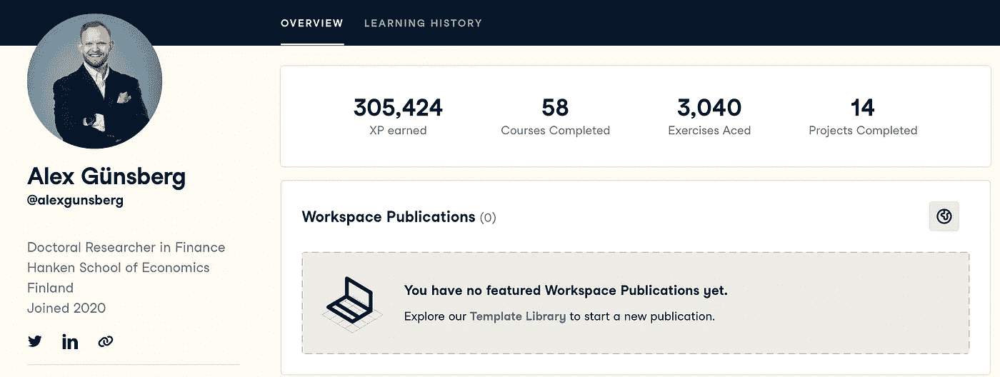

# 在 58 门课程和超过 305k 的 XPs 后，我对 DataCamp 的看法

> 原文：<https://medium.com/mlearning-ai/my-thoughts-on-datacamp-after-58-courses-and-more-than-305k-xps-bfc0d0d49b09?source=collection_archive---------2----------------------->

My DataCamp profile

2020 年，当我开始作为一名数据科学家的旅程时，我对编码和 Python 完全陌生。就像任何人一样，我也有很多疑问:我适合吗？一开始我总是很兴奋，但是在我足够好到可以实际使用这些技能之前，这种兴奋感会消失吗？学习的最佳方式是什么？需要多长时间才能足够好？