# 使用工作台设置 MySQL 数据库。

> 原文：<https://medium.com/mlearning-ai/mysql-database-setup-using-workbench-19a8eae5b3ca?source=collection_archive---------7----------------------->

> 使用结构化查询语言的数据科学基础。

> 今天，我们将讨论并致力于在维护数据和信息时理解 MySQL 和结构化查询语言。作为一个经常处理数据和信息，同时利用 SQL 脚本从数据库中提取数据和信息的人。我想写一些关于众所周知的数据库语言 SQL 的简单明了的文章。我将添加两个关于 SQL 入门的有价值的资源，以帮助指导您踏上这个令人难以置信的数据科学之旅。

# **今天文章中的概念**

*   **MySQL 数据库**
*   **MySQL 工作台设置**

# MySQL 数据库

数据是我们每天使用最重要东西之一。我们在社交媒体、网络应用和短信上所做的一切都被记录在数据库中。我们在互联网上所做的事情不断被跟踪并记录在数据库的表格和列中。MySQL 是一个常用的数据库，为用户保存信息和数据，必须持续维护。

今天，我们将讨论设置一个 MySQL 工作台，学习 Select 和 From 语句，并创建一个表和几个保存数据的列。数据科学家经常利用关系数据库来获取和维护数据库中的数据和信息，因此理解简单的查询和语句非常重要。

[https://unsplash.com/photos/cw-KdZv8SoE](https://unsplash.com/photos/cw-KdZv8SoE)

# 设置 MySQL 数据库

首先我们会下载社区 MySQL 数据库 arm64.dmg 下载，包括工作台。初始设置完成后，我们将在 MySQL 工作台中设计第一个表。在下面的文章中，我们将使用这个 MySQL 数据库来学习不同的 SQL 查询。

 [## 关系型数据库

### MySQL 数据库服务是一个完全托管的数据库服务，用于部署云原生应用。热浪，还有…

www.mysql.com](https://www.mysql.com) 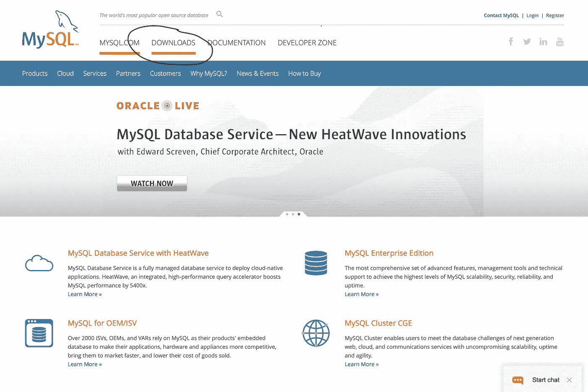

1) Go to the MySQL website and press the download tab.

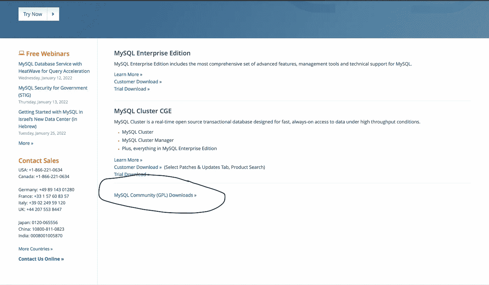

2) Press the MySQL Community (GPU) Downloads section on the bottom of the downloads page.

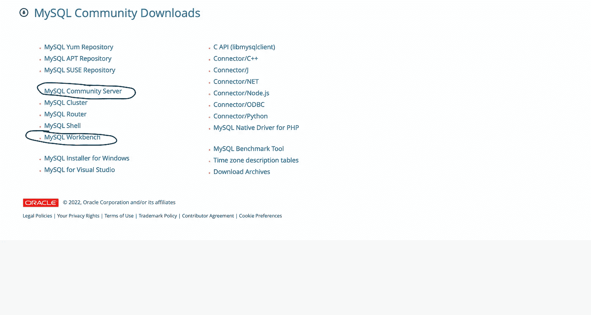

3) Download the MySQL Community Server and MySQL workbench.

> 完成这四个初始步骤后，您现在应该可以在您的操作系统上访问 MySQL 应用程序了。我们现在将打开我们的 MySQL 应用程序并构建我们的第一个 SQL 数据库。

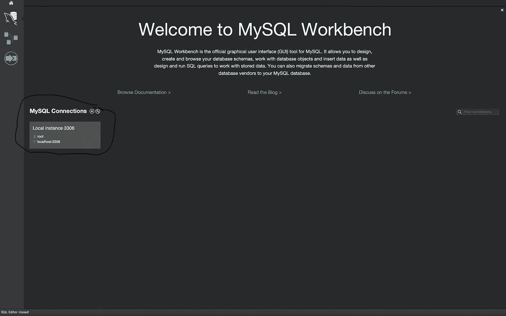

press local instance on your MySQL workbench. *you will be prompt to type in your MySQL password.

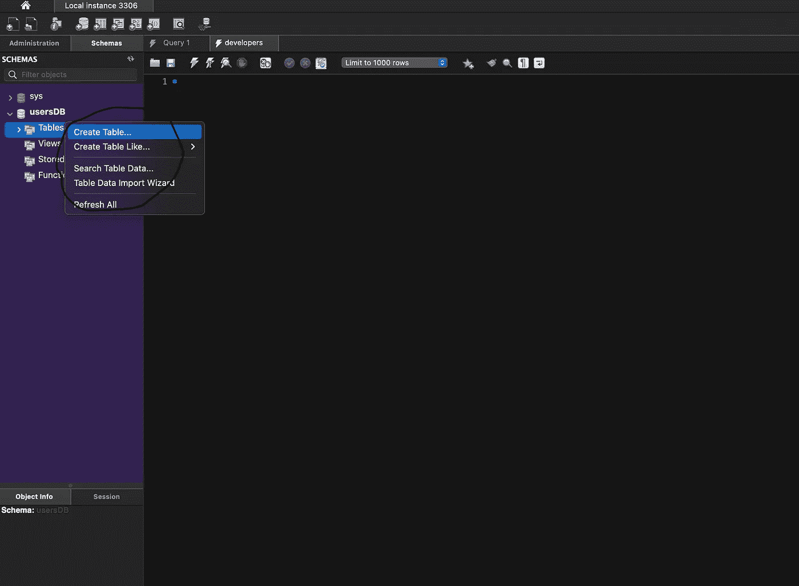

Right, Click your Tables directory and press “Create Table.”

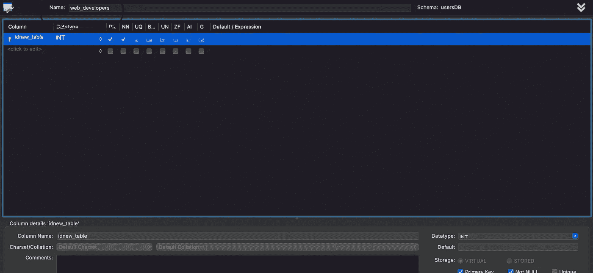

Give your table name and begin adding new columns to your table. ***Ensure that you check PK & NN, allowing you to add columns into your table.

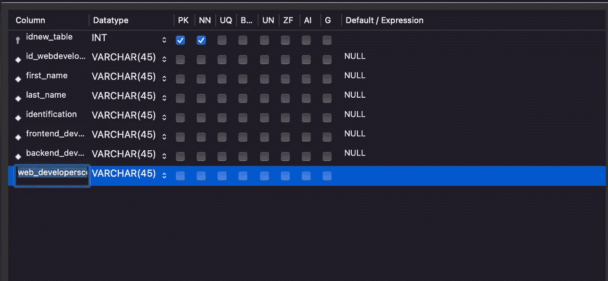

Start adding Columns into your Table. ***Pressing the top column or any column should add a new column template toward the bottom of the last column in your table in case you require more columns***

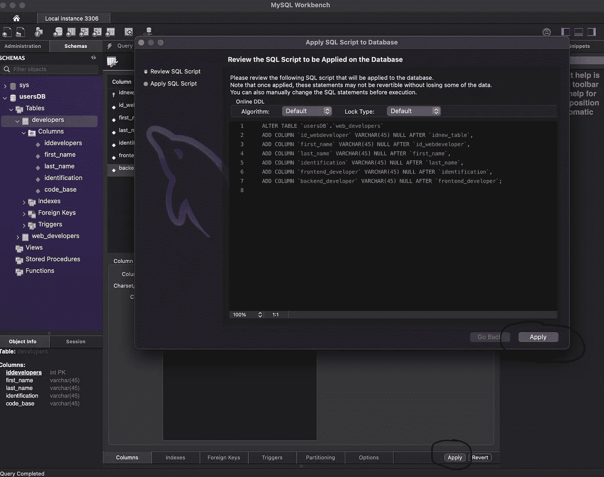

Click “Apply” at the bottom of the page. The following prompt will pop up on your screen. Press “Apply” to add changes to your table.

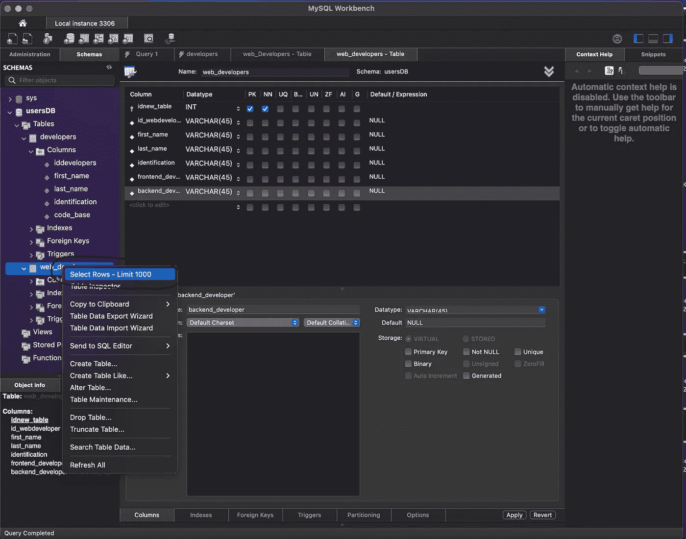

Select “Select Rows — Limit 1000” this will allow us to plug data & information into our columns.

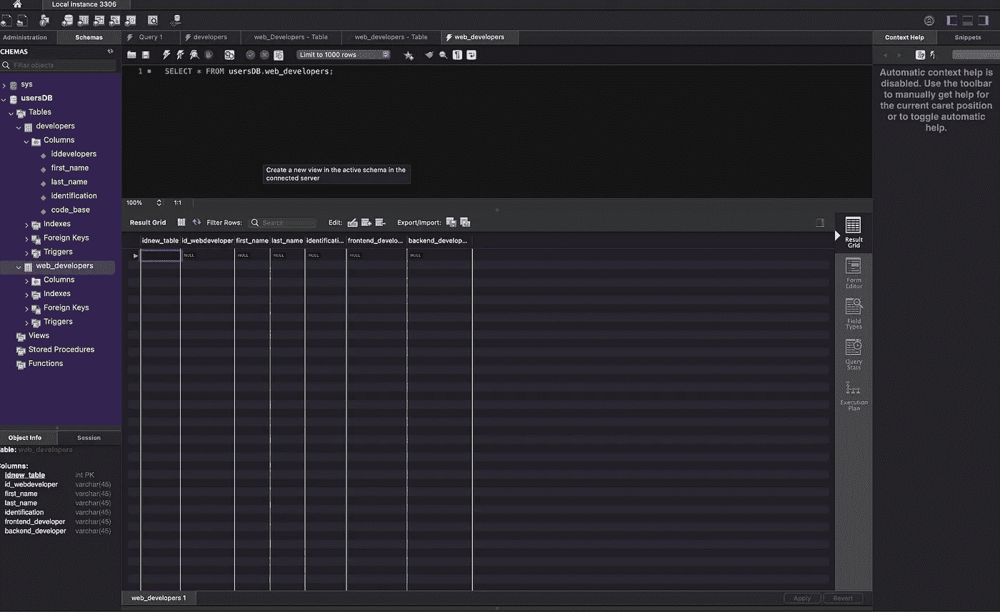

Begin plugging information & Data into our columns as shown.

“Apply” your changes into your column.

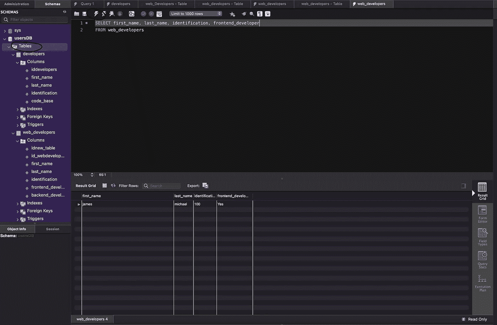

Ensure you pressed “Table directory” when beginning your SQL query. Next, type a simple SELECT and FROM statement into your console and press the “flash icon. The SQL query will display at the bottom of the page.

# 结论

我们刚刚在很短的时间内创建了我们的第一个 SQL 工作台和数据库。接下来，我们将在接下来的文章中学习更多关于 SQL 的知识，并享受数据科学基础知识的乐趣。我的目标不是成为社交媒体上最好的导师或拥有最优秀的内容，而是激励像你这样的人进入编程、数据科学、网络安全和信息技术领域。

我们的行业缺少专业人员，我们必须在明天设计和实施下一件大事。我将在每篇文章中列出好的免费在线参考资料，以及一个有用的 udemy 课程，开始您的 SQL 之旅。编码与数据快乐！

 [## 迈克尔巴尔萨-技术作家-开发天才| LinkedIn

### 经验丰富的数据专家，负责监督维护美国的飞机数据和信息管理…

www.linkedin.com](https://www.linkedin.com/in/michael-balsa-9474431b0/) 

# 免费资源

 [## SQL 教程

### SQL 是存储、操作和检索数据库的标准语言。我们的 SQL 教程将教你…

www.w3schools.com](https://www.w3schools.com/sql/default.asp)  [## MySQL -有用的资源

### MySQL -有用的资源，以下资源包含关于 MySQL 的附加信息。请使用它们获得更多…

www.tutorialspoint.com](https://www.tutorialspoint.com/mysql/mysql-useful-resources.htm) 

# 我的课程

[https://www.udemy.com/course/mysql-for-data-analysis/](https://www.udemy.com/course/mysql-for-data-analysis/)

 [## Mlearning.ai 提交建议

### 如何成为 Mlearning.ai 上的作家

medium.com](/mlearning-ai/mlearning-ai-submission-suggestions-b51e2b130bfb)